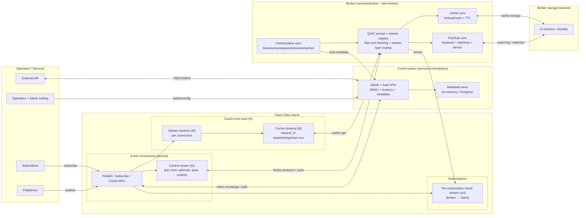

<p align="center">
  
</p>
<p align="center">
  <a href="https://github.com/gabloe/felix/actions/workflows/ci.yml">
    
  </a>
  <a href="https://github.com/gabloe/felix/actions/workflows/coverage.yml">
    
  </a>
  <a href="https://github.com/gabloe/felix/blob/main/LICENSE">
    
  </a>
  <a href="https://www.rust-lang.org/">
    
  </a>
  <a href="https://gabloe.github.io/felix">
    
  </a>
</p>

---

Felix is in **early active development**. This README is intentionally brief while the design and
implementation are still moving quickly.

## System Overview

Felix is a low-latency, QUIC-based pub/sub and cache system designed for high fanout,
high throughput, and predictable tail latency when properly tuned.

At its core, Felix uses a framed protocol (felix-wire) over QUIC streams to unify
event streaming (publish/subscribe) and request/response caching (put/get with TTL),
with explicit control over multiplexing, batching, and flow control.

Core components
- `felix-wire`: framed binary protocol for all clients and brokers.
- `felix-transport`: QUIC abstraction layer (client/server, pools, stream lifecycle).
- `felix-broker`: pub/sub logic, cache storage, stream registry, fanout.
- `felix-client`: publisher/subscriber/cache APIs over QUIC with connection/stream pooling.
- `felix-storage`: storage layer for broker.
- `services/broker`: runnable broker node.
- `services/controlplane`: runnable control plane node.

Pub/sub data flow (happy path)
- Client opens a bidirectional control stream to publish/subscribe and receive acks.
- Broker validates scope, enqueues publish jobs, and fans out to subscribers.
- Each subscription has a dedicated unidirectional event stream for delivery.
- Events are sent as single frames or binary batches with count/time-bounded batching.

Cache data flow (current architecture)
- Client maintains a cache connection pool with long-lived stream workers.
- Cache requests carry a `request_id` and are multiplexed over these streams.
- Broker processes request frames in a read loop and replies on the same stream.
- This avoids per-request stream setup costs and improves tail latency under concurrency.

Performance knobs
- Event delivery: `FELIX_EVENT_CONN_POOL`, `FELIX_EVENT_*_WINDOW`,
  `FELIX_EVENT_BATCH_MAX_DELAY_US`.
- Cache delivery: `FELIX_CACHE_CONN_POOL`, `FELIX_CACHE_STREAMS_PER_CONN`,
  `FELIX_CACHE_*_WINDOW`.
- Publishing: `FELIX_PUBLISH_CHUNK_BYTES`.
- Instrumentation: build with `--features telemetry` to enable per-stage
  timings and frame counters. Default builds compile telemetry out
  (`cfg(feature = "telemetry")`, no runtime branches when disabled) to avoid
  instrumentation overhead on hot paths.
- Telemetry overhead is workload-dependent. Example (`latency-demo`,
  localhost, payload=4096B, fanout=1, batch=64, 10 runs): medians were similar
  with and without telemetry, but tail latency showed higher variance. Text:
  p999 median 5.15ms (min/max 3.27/8.89) vs 4.82ms (3.24/12.47);
  throughput 160.6k (141.6k/167.2k) vs 160.1k (137.9k/166.0k). Binary:
  p999 median 3.65ms (2.34/5.69) vs 3.40ms (2.57/9.03);
  throughput 207.0k (188.6k/228.2k) vs 208.2k (171.9k/227.4).
  Validate on your workload; fanout/payload/batching can amplify tail effects.
  In other scenarios (e.g., high fanout + binary batching), telemetry can
  materially impact throughput/latency; see benchmarks/ for additional results.

Use cases
- Real-time streaming with high fanout and tunable latency/throughput trade-offs.
- Event pipelines with batch publishing and batch delivery for efficient fanout.
- Low-latency caching over QUIC with predictable tail latency under load.

The diagram below reflects the single-node in-process MVP.



## Current Focus

- Fanout, backpressure, and isolation as core product behavior
- Broker/data-plane foundations
- Control-plane metadata and sync (including locality-aware routing policies)
- Protocol and conformance

## Docs

- `docs/architecture.md`
- `docs/protocol.md`
- `docs/control-plane.md`
- `docs/semantics.md`
- `docs/todos.md`
- `services/broker/README.md` (performance profiles + tuning)
- Defining a stable wire envelope and internal data model
- Measuring latency/backpressure behavior early to keep p99/p999 predictable

The project is intentionally building depth before breadth.

---

## MVP Scope

The initial MVP targets:

- Single-node broker
- In-process pub/sub with fanout
- Ephemeral cache with TTL
- Stable wire envelope (v1)
- Basic observability (structured logs)
- Tests validating core invariants

Durability, clustering, and security are layered on incrementally after the MVP. Cross-region
locality/isolation is treated as a control-plane routing policy without forcing early consensus
complexity.

---

## Repository Layout (High-Level)

```
crates/
  felix-common      # shared IDs, config, errors
  felix-wire        # wire framing and protocol
  felix-transport   # QUIC-based transport
  felix-storage     # ephemeral + durable storage
  felix-broker      # broker core (fanout, isolation, cache)
  felix-metadata    # metadata abstractions
  felix-router      # region-aware routing
  felix-crypto      # encryption and key handling
  felix-authz       # authentication and authorization
  felix-client      # Rust client SDK
  felix-consensus   # consensus/coordination placeholders
  felix-conformance # shared wire protocol conformance runner

services/
  broker             # broker service binary
  controlplane       # control plane service
  agent              # node/infra agent (future)

demos/
  broker             # broker demo binaries
  rbac-live          # live RBAC mutation demo (control plane + broker)
  cross_tenant_isolation # cross-tenant isolation demo (Postgres + control plane + broker)

docs/
  architecture.md    # system architecture
  control-plane.md   # control plane + RAFT plan (DRAFT)
  protocol.md        # wire protocol specification
  design.md          # product + protocol design notes
  todos.md           # implementation checklist
  assets/            # documentation images (logo, diagrams)

docs-site/           # MkDocs site sources
docker/              # local Docker assets
scripts/             # developer tooling and utilities
charts/              # Helm charts
data/                # sample data and artifacts
.github/             # CI workflows and repo metadata
Taskfile.yml         # task runner shortcuts
Cargo.toml           # workspace manifest
mkdocs.yml           # MkDocs config
deny.toml            # cargo-deny policy
```

---

## Getting Started

Build the workspace:

```bash
cargo build --workspace
```

Run the broker service:

```bash
cargo run -p broker
```

Run the wire protocol conformance runner:

```bash
cargo run -p felix-conformance
```

The conformance runner validates that the wire framing and binary message encoding
match the shared test vectors. It exists to keep client implementations honest:
any client or server that passes the suite can interoperate without guessing at
edge cases or relying on Rust-specific behavior.

At this stage, Felix runs as a local, single-node process intended for development and testing.

---

## Design Discipline

Felix intentionally prioritizes:
- Fanout + backpressure + isolation over unified feature bundles
- Clear invariants over feature count
- Explicit boundaries over implicit behavior
- Measured performance over assumptions

If a feature cannot be enforced in code, it is considered incomplete.

---

## Roadmap (Condensed)

- Single-node broker MVP
- QUIC transport + backpressure
- Durable log and retention
- Metadata and control plane with locality-aware routing defaults
- Intra-region clustering
- Explicit cross-region bridges
- Security hardening (mTLS, RBAC, E2EE)
- Compliance features and auditing

Detailed plans live in `docs/`.

---

## License

Apache 2.0

Copyright (c) 2026 Felix Authors
