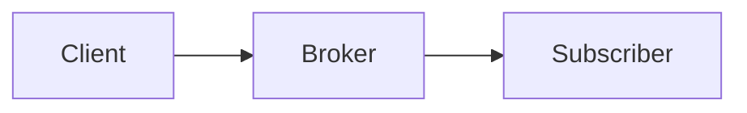

# Felix Documentation

This directory contains the source files for the Felix documentation website, built with [MkDocs](https://www.mkdocs.org/) and the [Material theme](https://squidfunk.github.io/mkdocs-material/).

## Local Development

### Prerequisites

- Python 3.8 or later
- pip

### Setup

Install dependencies:

```bash
pip install -r requirements.txt
```

### Build and Serve Locally

Start the development server:

```bash
mkdocs serve
```

The documentation will be available at http://localhost:8000 with live-reload enabled.

### Build Static Site

Generate the static HTML site:

```bash
mkdocs build
```

The built site will be in the `../site` directory.

## Structure

```
docs-site/
├── docs/                    # Markdown documentation files
│   ├── index.md             # Home page
│   ├── getting-started/     # Getting started guides
│   ├── architecture/        # Architecture documentation
│   ├── api/                 # API reference
│   ├── features/            # Feature documentation
│   ├── deployment/          # Deployment guides
│   ├── reference/           # Configuration and reference
│   ├── development/         # Contributing and development
│   └── assets/              # Images and other assets
├── requirements.txt         # Python dependencies
└── README.md                # This file

mkdocs.yml                   # MkDocs configuration (in root)
```

## Writing Documentation

### Markdown Extensions

The site uses several Markdown extensions:

- **Admonitions:** Use `!!! note`, `!!! warning`, `!!! tip` for callouts
- **Code blocks:** Syntax highlighting for Rust, YAML, bash, etc.
- **Mermaid diagrams:** Embed diagrams with ` ```mermaid ` blocks
- **Tabbed content:** Use `=== "Tab 1"` for tabbed sections
- **Tables:** Standard Markdown tables with sorting support

### Code Examples

Use fenced code blocks with language identifiers:

````markdown
```rust
use felix_client::FelixClient;

let client = FelixClient::connect(config).await?;
```
````

### Diagrams

Use Mermaid for diagrams:

````markdown

````

### Admonitions

```markdown
!!! note "Important Note"
    This is an important note that stands out.

!!! warning
    This is a warning about potential issues.

!!! tip
    This is a helpful tip for users.
```

## Deployment

Documentation is automatically deployed to GitHub Pages when changes are pushed to the `main` branch.

The deployment workflow is defined in `.github/workflows/pages.yml`.

### Manual Deployment

To manually trigger deployment:

1. Go to the Actions tab in GitHub
2. Select "Deploy Documentation to GitHub Pages"
3. Click "Run workflow"

## Contributing

When adding new documentation:

1. Create a new Markdown file in the appropriate directory
2. Add the page to the navigation in `mkdocs.yml`
3. Follow the existing style and structure
4. Test locally with `mkdocs serve`
5. Submit a pull request

See [Contributing Guide](docs/development/contributing.md) for more details.

## Links

- **Live Site:** https://gabloe.github.io/felix/
- **MkDocs:** https://www.mkdocs.org/
- **Material Theme:** https://squidfunk.github.io/mkdocs-material/
- **Repository:** https://github.com/gabloe/felix
