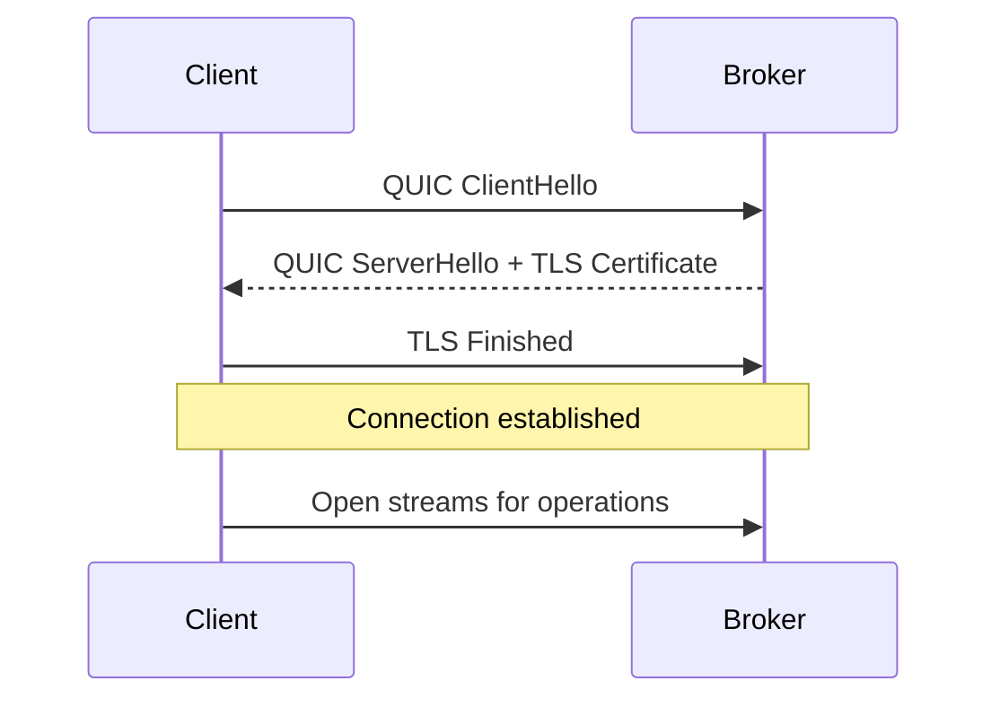
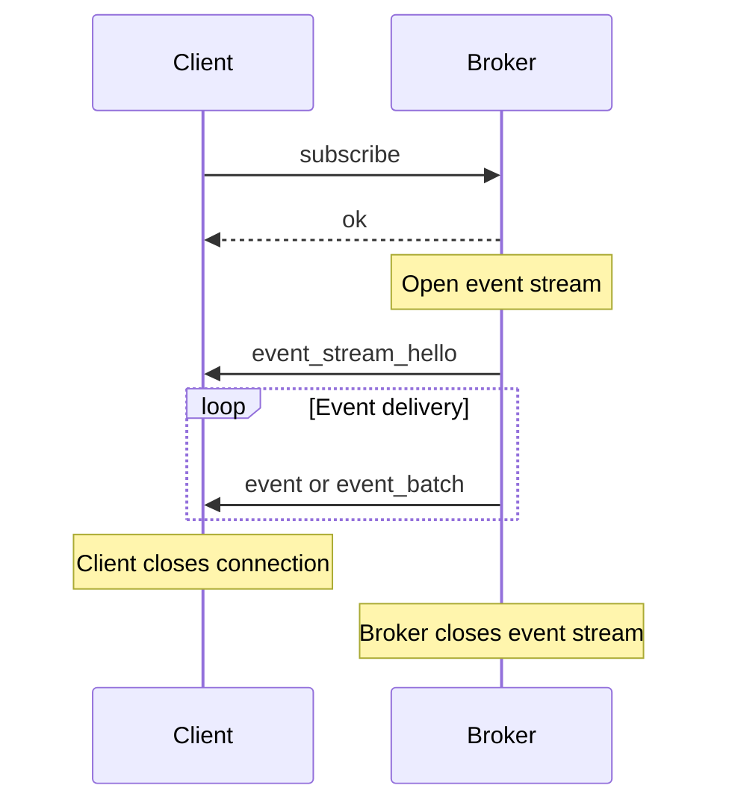

# Broker API Reference

The Felix broker exposes a QUIC-based data plane API for publish/subscribe and cache operations. This document provides a comprehensive reference for interacting with the broker, including operation semantics, parameters, error handling, and usage examples.

## Connection Model

### QUIC Connection Lifecycle

Clients establish QUIC connections to the broker over TLS 1.3:



**Default broker endpoint**: `0.0.0.0:5000` (configurable via `quic_bind`)

**TLS requirements**:
- TLS 1.3 minimum
- Certificate validation (can be disabled for development)
- SNI supported for virtual hosting (future)

### Connection Pooling

For optimal performance, clients should maintain connection pools:

```rust
// Rust client example
use felix_client::{Client, ClientConfig};
use std::net::SocketAddr;

let quinn = quinn::ClientConfig::with_platform_verifier();
let config = ClientConfig {
    event_conn_pool: 8,      // Pool for pub/sub operations
    cache_conn_pool: 8,      // Pool for cache operations
    ..ClientConfig::optimized_defaults(quinn)
};

let addr: SocketAddr = "127.0.0.1:5000".parse()?;
let client = Client::connect(addr, "localhost", config).await?;
```

**Pool sizing guidance**:
- **Event pool**: 4-8 connections for typical workloads
- **Cache pool**: 8-16 connections for high-concurrency cache access
- **Publish pool**: 2-4 connections for publisher applications

!!! tip "Connection Reuse"
    Establishing QUIC connections has significant overhead (TLS handshake, key exchange). Reuse connections aggressively by maintaining long-lived pools.

## Publish Operations

### Single Message Publish

Publish a single message to a stream.

**Request**:

```json
{
  "type": "publish",
  "tenant_id": "string",
  "namespace": "string",
  "stream": "string",
  "payload": "base64-encoded-bytes",
  "ack": "none" | "per_message"
}
```

**Parameters**:

| Parameter | Type | Required | Description |
|-----------|------|----------|-------------|
| `tenant_id` | string | Yes | Tenant identifier (must exist in broker) |
| `namespace` | string | Yes | Namespace within tenant |
| `stream` | string | Yes | Target stream name |
| `payload` | base64 | Yes | Message payload (base64-encoded binary) |
| `ack` | enum | No | Acknowledgement mode (default: `none`) |

**Acknowledgement modes**:

- `none`: Fire-and-forget, no broker acknowledgement
- `per_message`: Broker sends `ok` after enqueuing message

**Response** (if `ack` != `none`):

```json
{
  "type": "ok",
  "request_id": "string"
}
```

**Errors**:

```json
{
  "type": "error",
  "request_id": "string",
  "message": "Unknown tenant: acme-corp"
}
```

**Example usage**:

```rust
use felix_client::{Client, ClientConfig};
use felix_wire::AckMode;
use std::net::SocketAddr;

let quinn = quinn::ClientConfig::with_platform_verifier();
let config = ClientConfig::optimized_defaults(quinn);
let addr: SocketAddr = "127.0.0.1:5000".parse()?;
let client = Client::connect(addr, "localhost", config).await?;
let publisher = client.publisher().await?;

// Fire-and-forget publish
publisher
    .publish("acme", "prod", "events", b"Hello Felix".to_vec(), AckMode::None)
    .await?;

// With acknowledgement
publisher
    .publish(
        "acme",
        "prod",
        "events",
        b"Important message".to_vec(),
        AckMode::PerMessage,
    )
    .await?;
```

**Performance characteristics**:

- **Latency**: ~100-500 µs for ack mode (localhost)
- **Throughput**: ~50-100k messages/sec per connection (single message publishes)
- **Bottleneck**: JSON serialization and per-message framing overhead

!!! note "When to Use Single Publish"
    Use single publish for:
    - Low-rate event streams (< 1000 msg/sec)
    - Interactive request/response patterns
    - Simplicity over throughput
    
    For high-throughput workloads, use batch publish instead.

### Batch Publish

Publish multiple messages in a single operation.

**Request**:

```json
{
  "type": "publish_batch",
  "tenant_id": "string",
  "namespace": "string",
  "stream": "string",
  "payloads": ["base64-1", "base64-2", "base64-n"],
  "ack": "none" | "per_batch"
}
```

**Parameters**:

| Parameter | Type | Required | Description |
|-----------|------|----------|-------------|
| `tenant_id` | string | Yes | Tenant identifier |
| `namespace` | string | Yes | Namespace within tenant |
| `stream` | string | Yes | Target stream name |
| `payloads` | array | Yes | Array of base64-encoded payloads |
| `ack` | enum | No | Acknowledgement mode (default: `none`) |

**Response** (if `ack` == `per_batch`):

```json
{
  "type": "ok",
  "request_id": "string"
}
```

**Example usage**:

```rust
let messages = vec![
    b"Event 1".to_vec(),
    b"Event 2".to_vec(),
    b"Event 3".to_vec(),
];

use felix_wire::AckMode;
let publisher = client.publisher().await?;
publisher
    .publish_batch("acme", "prod", "events", messages, AckMode::PerBatch)
    .await?;
```

**Performance characteristics**:

- **Latency**: ~200-1000 µs for batch of 64 (includes fanout)
- **Throughput**: ~150-250k messages/sec per connection (batch=64)
- **Optimal batch size**: 32-128 messages

**Batch size tuning**:

```rust
use felix_wire::AckMode;
let publisher = client.publisher().await?;

// Small batches: lower latency, lower throughput
let small_batch = collect_messages(timeout_ms: 10, max_count: 8);
publisher
    .publish_batch("acme", "prod", "stream", small_batch, AckMode::PerBatch)
    .await?;

// Large batches: higher latency, higher throughput
let large_batch = collect_messages(timeout_ms: 100, max_count: 128);
publisher
    .publish_batch("acme", "prod", "stream", large_batch, AckMode::PerBatch)
    .await?;
```

### Binary Batch Publish

For maximum throughput, use binary encoding.

**Frame flags**: Set bit 0 (`flags | 0x0001`)

**Binary format**:

```
[tenant_len: u16][tenant_id: bytes]
[namespace_len: u16][namespace: bytes]
[stream_len: u16][stream: bytes]
[count: u32]
[payload_1_len: u32][payload_1: bytes]
[payload_2_len: u32][payload_2: bytes]
...
```

**Example** (Rust client handles encoding automatically):

```rust
// Encode a batch directly as binary
let messages = vec![large_payload_1, large_payload_2, /* ... */];
let publisher = client.publisher().await?;
publisher
    .publish_batch_binary("acme", "prod", "stream", &messages)
    .await?;
```

**Performance improvement**:

- **30-40% higher throughput** vs JSON for large batches
- **Lower CPU usage** (no JSON parsing)
- **Best for**: payload > 512 bytes, batch > 32 messages

### Publish Pipeline Configuration

Broker-side tuning for publish pipeline:

```yaml
# Broker config.yml
pub_workers_per_conn: 4        # Workers per connection
pub_queue_depth: 1024           # Publish queue bound
publish_queue_wait_timeout_ms: 2000  # Queue full timeout
publish_chunk_bytes: 16384      # Large payload chunking
```

**Worker sizing**:

```
pub_workers_per_conn ≤ active_publish_streams
```

Over-sizing workers creates contention without benefit.

## Subscribe Operations

### Creating a Subscription

Subscribe to a stream to receive events.

**Request**:

```json
{
  "type": "subscribe",
  "tenant_id": "string",
  "namespace": "string",
  "stream": "string"
}
```

**Response**:

```json
{
  "type": "ok",
  "request_id": "string"
}
```

**Broker behavior**:

1. Broker validates tenant/namespace/stream
2. Broker sends `ok` on control stream
3. Broker opens new unidirectional stream for events
4. Broker sends `event_stream_hello` as first frame on event stream
5. Broker begins streaming events

**Example usage**:

```rust
let mut subscription = client.subscribe("acme", "prod", "events").await?;

// Receive events
while let Some(event) = subscription.next_event().await? {
    println!("Received: {:?}", event.payload);
}
```

### Receiving Events

Events arrive on a dedicated unidirectional stream per subscription.

**Event frame**:

```json
{
  "type": "event",
  "tenant_id": "acme",
  "namespace": "prod",
  "stream": "events",
  "payload": "base64-encoded-bytes"
}
```

**Event batch frame**:

```json
{
  "type": "event_batch",
  "tenant_id": "acme",
  "namespace": "prod",
  "stream": "events",
  "payloads": ["base64-1", "base64-2", "base64-n"]
}
```

**Event stream lifecycle**:



### Subscription Configuration

Client-side configuration:

```rust
let quinn = quinn::ClientConfig::with_platform_verifier();
let config = ClientConfig {
    event_conn_pool: 8,              // Connection pool size
    event_router_max_pending: 1024,  // Max pending events in client router
    ..ClientConfig::optimized_defaults(quinn)
};
```

Broker-side configuration:

```yaml
event_queue_depth: 1024              # Per-subscription buffer
event_batch_max_events: 64           # Max events per batch
event_batch_max_bytes: 262144        # Max batch size (256 KB)
event_batch_max_delay_us: 250        # Max batching delay (250 µs)
```

**Batching trade-offs**:

| Parameter | Effect on Latency | Effect on Throughput |
|-----------|-------------------|---------------------|
| Increase `max_events` | Higher | Higher |
| Increase `max_delay_us` | Higher | Higher |
| Decrease `max_events` | Lower | Lower |
| Decrease `max_delay_us` | Lower | Lower |

### Multiple Subscriptions

Clients can maintain multiple concurrent subscriptions:

```rust
// Subscribe to multiple streams
let mut sub1 = client.subscribe("acme", "prod", "orders").await?;
let mut sub2 = client.subscribe("acme", "prod", "inventory").await?;
let mut sub3 = client.subscribe("acme", "staging", "logs").await?;

// Process events from all subscriptions concurrently
tokio::select! {
    Some(event) = sub1.next() => handle_order(event),
    Some(event) = sub2.next() => handle_inventory(event),
    Some(event) = sub3.next() => handle_log(event),
}
```

Each subscription gets:
- Independent event stream
- Independent buffer
- Independent flow control

### Subscription Isolation

Slow subscribers don't affect fast subscribers:

```rust
// Fast subscriber
let mut fast_sub = client.subscribe("acme", "prod", "stream").await?;
tokio::spawn(async move {
    while let Ok(Some(event)) = fast_sub.next_event().await {
        process_quickly(event).await;  // ~1ms processing
    }
});

// Slow subscriber
let mut slow_sub = client.subscribe("acme", "prod", "stream").await?;
tokio::spawn(async move {
    while let Ok(Some(event)) = slow_sub.next_event().await {
        process_slowly(event).await;  // ~100ms processing
    }
});

// Fast subscriber continues at full rate even if slow subscriber falls behind
```

## Cache Operations

### Cache Put

Store a key-value pair with optional TTL.

**Request**:

```json
{
  "type": "cache_put",
  "request_id": "unique-id",
  "key": "string",
  "value": "base64-encoded-bytes",
  "ttl_ms": number | null
}
```

**Parameters**:

| Parameter | Type | Required | Description |
|-----------|------|----------|-------------|
| `request_id` | string | Yes | Client-provided correlation ID |
| `key` | string | Yes | Cache key |
| `value` | base64 | Yes | Value to store (base64-encoded) |
| `ttl_ms` | number | No | Time-to-live in milliseconds (null = no expiration) |

**Response**:

```json
{
  "type": "ok",
  "request_id": "unique-id"
}
```

**Example usage**:

```rust
// Store session with 1-hour TTL
use bytes::Bytes;
client
    .cache_put(
        "acme",
        "prod",
        "sessions",
        session_id,
        Bytes::from(session_data),
        Some(3600_000),
    )
    .await?;

// Store config without expiration
client
    .cache_put(
        "acme",
        "prod",
        "config",
        "app-settings",
        Bytes::from(config_data),
        None,
    )
    .await?;
```

**Performance**:

- **p50 latency**: 160-260 µs (varies with payload size)
- **p99 latency**: 350-450 µs
- **Throughput**: 125-185k ops/sec (concurrency=32)

### Cache Get

Retrieve a value from the cache.

**Request**:

```json
{
  "type": "cache_get",
  "request_id": "unique-id",
  "key": "string"
}
```

**Response**:

```json
{
  "type": "cache_value",
  "request_id": "unique-id",
  "key": "string",
  "value": "base64-encoded-bytes" | null
}
```

**Value is null when**:
- Key doesn't exist
- Key has expired (TTL elapsed)
- Key was evicted under memory pressure

**Example usage**:

```rust
match client.cache_get("acme", "prod", "sessions", session_id).await? {
    Some(session_data) => {
        // Session found
        validate_session(session_data)?;
    }
    None => {
        // Session expired or doesn't exist
        return Err("Invalid session");
    }
}
```

### Cache Request Pipelining

Cache streams support pipelining multiple requests:

```rust
// Send multiple requests without waiting
let req1 = client.cache_get_async("config", "key1");
let req2 = client.cache_get_async("config", "key2");
let req3 = client.cache_get_async("config", "key3");

// Await responses
let (val1, val2, val3) = tokio::join!(req1, req2, req3);
```

**Benefits**:
- Amortize network round-trip latency
- Improve throughput under concurrency
- Reduce overall request completion time

**Request_id requirement**:

Each request must have a unique `request_id` within a stream. The broker may respond out of order; clients use `request_id` to correlate responses.

### Cache Stream Pooling

For high-concurrency cache workloads, use stream pooling:

```yaml
# Client config
cache_conn_pool: 8                # Number of connections
cache_streams_per_conn: 4         # Streams per connection
# Total concurrent cache operations: 8 × 4 = 32
```

**Performance impact**:

| Config | p50 (µs) | p99 (µs) | Throughput (k ops/s) |
|--------|----------|----------|---------------------|
| 1 conn, 1 stream | 175 | 850 | 45 |
| 4 conn, 2 streams | 168 | 420 | 125 |
| 8 conn, 4 streams | 165 | 360 | 180 |

### Cache Configuration

Broker-side cache tuning:

```yaml
cache_conn_recv_window: 268435456    # 256 MiB per connection
cache_stream_recv_window: 67108864   # 64 MiB per stream
cache_send_window: 268435456         # 256 MiB send window
```

## Error Handling

### Error Response Format

```json
{
  "type": "error",
  "request_id": "string",
  "message": "Descriptive error message"
}
```

### Common Errors

**Unknown tenant/namespace/stream**:

```json
{
  "type": "error",
  "message": "Unknown tenant: acme-corp"
}
```

**Resolution**: Ensure tenant/namespace exists in broker metadata.

**Malformed request**:

```json
{
  "type": "error",
  "message": "Invalid JSON payload"
}
```

**Resolution**: Validate request JSON schema.

**Timeout**:

```json
{
  "type": "error",
  "message": "Publish queue timeout after 2000ms"
}
```

**Resolution**: Broker is overloaded. Reduce publish rate or increase `pub_workers_per_conn`.

**Authorization failure** (future):

```json
{
  "type": "error",
  "message": "Unauthorized: insufficient permissions for stream 'events'"
}
```

### Connection Errors

QUIC connection errors are surfaced as connection-level failures:

- **Certificate validation failure**: TLS handshake error
- **Connection timeout**: No response within QUIC idle timeout
- **Connection reset**: Broker restart or network issue

**Retry logic**:

```rust
async fn publish_with_retry(client: &Client, retries: u32) -> Result<()> {
    use felix_wire::AckMode;
    let publisher = client.publisher().await?;
    for attempt in 0..retries {
        match publisher
            .publish("acme", "prod", "events", data.to_vec(), AckMode::PerMessage)
            .await
        {
            Ok(_) => return Ok(()),
            Err(e) if e.is_retriable() => {
                tokio::time::sleep(Duration::from_millis(100 * 2u64.pow(attempt))).await;
                continue;
            }
            Err(e) => return Err(e),
        }
    }
    Err("Max retries exceeded")
}
```

## Performance Tuning

### Publish Performance

**Maximize throughput**:

```yaml
# Broker config
pub_workers_per_conn: 8
pub_queue_depth: 4096
event_batch_max_events: 256
event_batch_max_delay_us: 2000
```

```rust
// Client: scale publish throughput via pools and sharding
use felix_client::PublishSharding;

let quinn = quinn::ClientConfig::with_platform_verifier();
let config = ClientConfig {
    publish_conn_pool: 8,
    publish_streams_per_conn: 4,
    publish_sharding: PublishSharding::HashStream,
    ..ClientConfig::optimized_defaults(quinn)
};
```

**Minimize latency**:

```yaml
# Broker config
pub_workers_per_conn: 2
event_batch_max_events: 8
event_batch_max_delay_us: 100
```

```rust
// Client: publish immediately
let publisher = client.publisher().await?;
publisher
    .publish("acme", "prod", "events", data.to_vec(), AckMode::PerMessage)
    .await?;
```

### Subscribe Performance

**High fanout tuning**:

```yaml
event_queue_depth: 4096           # Larger buffer for burst tolerance
fanout_batch_size: 128            # Batch fanout operations
event_batch_max_events: 128       # Larger event batches
```

**Low latency tuning**:

```yaml
event_queue_depth: 512
event_batch_max_events: 8
event_batch_max_delay_us: 100
```

### Cache Performance

**High concurrency**:

```yaml
cache_conn_pool: 16
cache_streams_per_conn: 8
# Total: 128 concurrent operations
```

**Low latency**:

```yaml
cache_conn_pool: 4
cache_streams_per_conn: 2
cache_conn_recv_window: 134217728  # Smaller windows for lower memory
```

## Best Practices

### Connection Management

1. **Pool connections**: Don't create per-request connections
2. **Reuse streams**: Keep streams alive for multiple operations
3. **Handle disconnections**: Implement automatic reconnection
4. **Monitor health**: Track connection failures and latency

### Publish Patterns

1. **Batch when possible**: 10-100x throughput improvement
2. **Use binary mode for large payloads**: 30-40% improvement
3. **Don't block on acks for high throughput**: Use `ack: none`
4. **Spread across connections**: Use connection pooling for parallelism

### Subscribe Patterns

1. **Process events quickly**: Avoid blocking subscription loop
2. **Use async processing**: Spawn tasks for slow operations
3. **Monitor lag**: Track processing delays
4. **Handle reconnection**: Re-subscribe on connection loss

### Cache Patterns

1. **Pipeline requests**: Send multiple requests concurrently
2. **Use appropriate TTLs**: Match data staleness tolerance
3. **Handle misses gracefully**: Cache is best-effort
4. **Don't cache huge values**: Keep values < 1 MB

!!! tip "Profile Your Workload"
    Use broker telemetry and client metrics to identify bottlenecks. Common issues:
    - Too few workers → high queue depth
    - Too many workers → contention
    - Small buffers → dropped events
    - Large buffers → high memory usage
