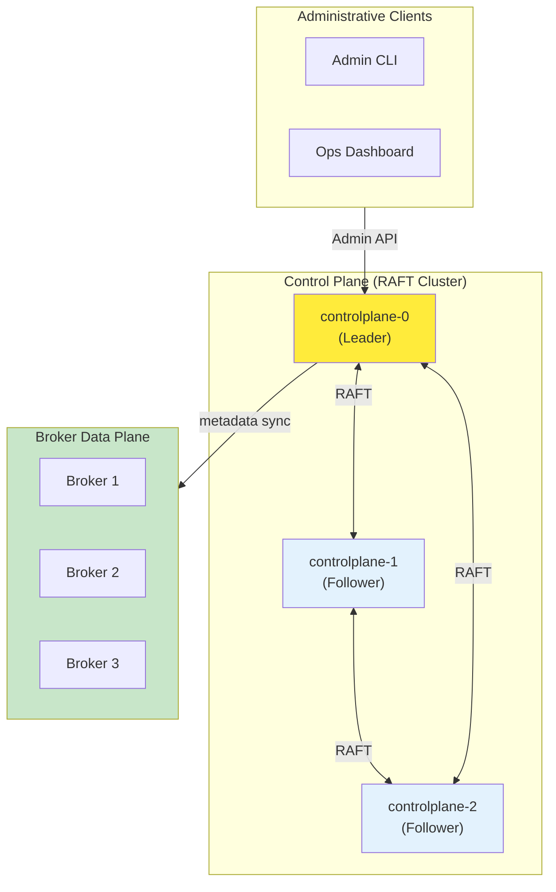
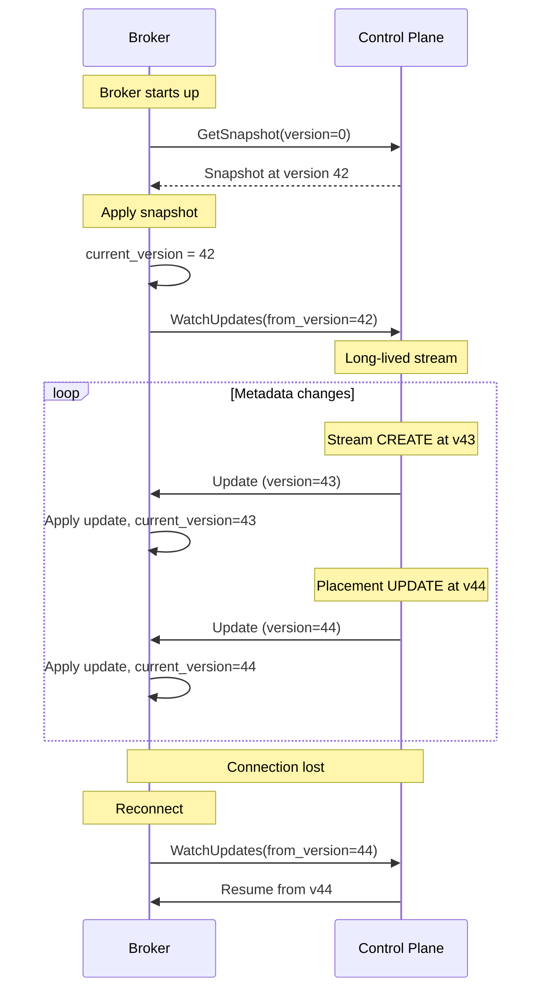
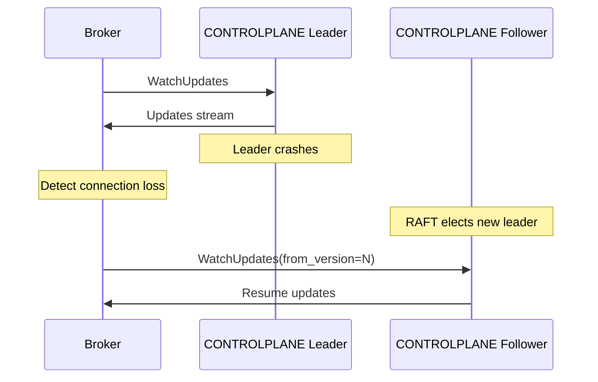

# Control Plane API

The Felix control plane manages cluster metadata, stream definitions, shard placement, and node membership. This document describes the control plane architecture, APIs, and operational patterns.

!!! note "Current Status"
    The control plane HTTP API is implemented for metadata and authentication (token exchange + JWKS). RAFT clustering and some advanced capabilities are planned. This document includes both current HTTP endpoints and future design details.

## Authentication and Token Exchange (HTTP)

Felix uses upstream OIDC JWTs for authentication and exchanges them for tenant-scoped Felix tokens. Brokers validate Felix tokens locally.

### POST /v1/tenants/{tenant_id}/token/exchange

Exchange an upstream OIDC token for a Felix token.

**Request**:

```http
POST /v1/tenants/{tenant_id}/token/exchange
Authorization: Bearer <oidc_jwt>
Content-Type: application/json

{
  "requested": ["stream.publish", "stream.subscribe", "cache.read"],
  "resources": ["ns:payments", "stream:payments/orders/*"]
}
```

**Response**:

```json
{
  "felix_token": "<jwt>",
  "expires_in": 900,
  "token_type": "Bearer"
}
```

**Notes**:
- `requested` and `resources` are optional hints to filter the issued permission set.
- If no permissions remain after evaluation, the exchange returns `403`.

### Configuring Allowed IdPs

IdP allowlists are stored per tenant in the control plane database (`idp_issuers` table) and can be managed via the admin HTTP endpoints below (or directly in the store for tests/dev).

Required fields:
- `issuer` (iss)
- `audiences` (allowed `aud` values)
- `subject_claim` (default `sub`)
- optional `groups_claim`
- either `discovery_url` or `jwks_url`

### Admin API: IdP Issuers

Admin endpoints require a Felix token with `tenant.admin` for the tenant.

Create or update an issuer for a tenant:

```http
POST /v1/tenants/{tenant_id}/idp-issuers
Content-Type: application/json

{
  "issuer": "https://login.microsoftonline.com/<tenant>/v2.0",
  "audiences": ["api://felix-controlplane"],
  "discovery_url": null,
  "jwks_url": null,
  "claim_mappings": {
    "subject_claim": "sub",
    "groups_claim": "groups"
  }
}
```

Delete an issuer:

```http
DELETE /v1/tenants/{tenant_id}/idp-issuers/{issuer}
```

### Internal Bootstrap API (Day-0)

Used once per tenant to seed auth before any admin tokens exist. Disabled by default and bound to a separate internal address when enabled.

```http
POST /internal/bootstrap/tenants/{tenant_id}/initialize
X-Felix-Bootstrap-Token: <secret>
Content-Type: application/json

{
  "display_name": "Tenant One",
  "idp_issuers": [...],
  "initial_admin_principals": ["p:alice"]
}
```

### GET /v1/tenants/{tenant_id}/.well-known/jwks.json

Fetch tenant signing keys (public JWKS) used by brokers to verify Felix tokens.

**Response**:

```json
{
  "keys": [
    {
      "kty": "OKP",
      "kid": "k1",
      "alg": "EdDSA",
      "use": "sig",
      "crv": "Ed25519",
      "x": "..."
    }
  ]
}
```

## Architecture Overview

The control plane is a separate service that provides strongly consistent metadata management using RAFT consensus.



### Design Goals

1. **Strong consistency**: Metadata changes are linearizable
2. **Off the hot path**: Data plane never waits for control plane
3. **Simple propagation**: Brokers consume metadata, don't participate in consensus
4. **Fast recovery**: Snapshot-based catch-up for new/restarted brokers
5. **Kubernetes-native**: Leverages K8s for node identity and discovery

### RAFT Scope

The RAFT log stores:
- **Node membership**: Broker registration and health status
- **Stream definitions**: Tenant, namespace, stream, retention policies
- **Shard placement**: Which broker owns which shards
- **Configuration**: Cluster-wide settings and feature flags
- **ACLs**: Authorization policies (future)
- **Quotas**: Rate limits and resource quotas (future)

The RAFT log **does not** store:
- Stream payloads (handled by data plane)
- Cache entries (ephemeral, local to brokers)
- Client connections (transient state)

## Core Data Model

### Tenant

```yaml
apiVersion: felix.io/v1
kind: Tenant
metadata:
  name: acme-corp
spec:
  description: "ACME Corporation production tenant"
  quotas:
    max_streams: 1000
    max_publish_rate: 100000  # msg/sec
    max_storage: 1TB
  encryption:
    key_id: "tenant-key-acme-v1"
    rotation_period: 90d
```

### Namespace

```yaml
apiVersion: felix.io/v1
kind: Namespace
metadata:
  name: production
  tenant: acme-corp
spec:
  description: "Production environment"
  quotas:
    max_streams: 500
    max_publish_rate: 50000
```

### Stream

```yaml
apiVersion: felix.io/v1
kind: Stream
metadata:
  name: orders
  namespace: production
  tenant: acme-corp
spec:
  shards: 4
  retention:
    time: 7d
    size: 100GB
  durability: durable  # or ephemeral
  replication_factor: 3
  ack_policy: quorum  # or leader_only
```

### Shard Placement

```yaml
apiVersion: felix.io/v1
kind: ShardPlacement
metadata:
  stream: orders
  namespace: production
  tenant: acme-corp
spec:
  placements:
    - shard_id: 0
      leader: broker-1
      replicas: [broker-2, broker-3]
    - shard_id: 1
      leader: broker-2
      replicas: [broker-3, broker-1]
    - shard_id: 2
      leader: broker-3
      replicas: [broker-1, broker-2]
    - shard_id: 3
      leader: broker-1
      replicas: [broker-2, broker-3]
```

### Broker Registration

```yaml
apiVersion: felix.io/v1
kind: Broker
metadata:
  name: broker-1
spec:
  address: "broker-1.felix.svc.cluster.local:5000"
  region: us-west-2
  availability_zone: us-west-2a
  capacity:
    max_shards: 100
    max_connections: 10000
  status: active  # active, draining, down
```

## Admin API

The control plane exposes a gRPC API for administrative operations.

### Stream Management

#### CreateStream

Create a new stream.

**Request**:

```protobuf
message CreateStreamRequest {
  string tenant_id = 1;
  string namespace = 2;
  string stream = 3;
  StreamSpec spec = 4;
}

message StreamSpec {
  uint32 shards = 1;
  RetentionPolicy retention = 2;
  Durability durability = 3;
  uint32 replication_factor = 4;
  AckPolicy ack_policy = 5;
}
```

**Response**:

```protobuf
message CreateStreamResponse {
  string stream_id = 1;
  StreamStatus status = 2;
}
```

**Example** (conceptual CLI):

```bash
felix-admin stream create \
  --tenant acme-corp \
  --namespace production \
  --stream orders \
  --shards 4 \
  --retention 7d \
  --durability durable \
  --replication 3
```

#### DeleteStream

Delete a stream and all its data.

**Request**:

```protobuf
message DeleteStreamRequest {
  string tenant_id = 1;
  string namespace = 2;
  string stream = 3;
  bool force = 4;  // Skip safety checks
}
```

**Safety checks**:
- Stream has no active subscribers (unless force=true)
- Confirm deletion of durable data
- Grace period for accidental deletions

#### ListStreams

List streams in a namespace.

**Request**:

```protobuf
message ListStreamsRequest {
  string tenant_id = 1;
  string namespace = 2;
  string filter = 3;  // Optional name filter
  uint32 page_size = 4;
  string page_token = 5;
}
```

**Response**:

```protobuf
message ListStreamsResponse {
  repeated StreamInfo streams = 1;
  string next_page_token = 2;
}

message StreamInfo {
  string name = 1;
  StreamSpec spec = 2;
  StreamMetrics metrics = 3;
}
```

### Shard Management

#### RebalanceShards

Trigger shard rebalancing across brokers.

**Request**:

```protobuf
message RebalanceShardsRequest {
  string tenant_id = 1;
  string namespace = 2;
  string stream = 3;
  RebalanceStrategy strategy = 4;
}

enum RebalanceStrategy {
  BALANCED = 0;      // Even distribution
  MINIMIZE_MOVEMENT = 1;  // Least disruption
  LOCALITY_AWARE = 2;     // Optimize for region/AZ
}
```

**Response**:

```protobuf
message RebalanceShardsResponse {
  repeated ShardMove moves = 1;
  RebalanceStatus status = 2;
}

message ShardMove {
  uint32 shard_id = 1;
  string from_broker = 2;
  string to_broker = 3;
  MoveStatus status = 4;
}
```

#### TransferShardLeadership

Move shard leadership to another broker.

**Request**:

```protobuf
message TransferShardLeadershipRequest {
  string stream_id = 1;
  uint32 shard_id = 2;
  string target_broker = 3;
}
```

**Use cases**:
- Planned maintenance (drain broker)
- Load balancing
- Failure recovery

### Broker Management

#### RegisterBroker

Register a new broker node.

**Request**:

```protobuf
message RegisterBrokerRequest {
  string broker_id = 1;
  string address = 2;
  BrokerCapacity capacity = 3;
  map<string, string> metadata = 4;
}
```

**Automatic registration**:

Brokers can auto-register on startup:

```yaml
# Broker startup config
broker_id: "auto"  # Generate from pod name
controlplane_url: "https://controlplane.felix.svc.cluster.local:9000"
controlplane_register_on_startup: true
```

#### ReportHealth

Brokers periodically report health to control plane.

**Request**:

```protobuf
message ReportHealthRequest {
  string broker_id = 1;
  HealthStatus status = 2;
  BrokerMetrics metrics = 3;
  repeated ShardStatus shard_status = 4;
}

message HealthStatus {
  bool healthy = 1;
  string message = 2;
  int64 uptime_seconds = 3;
}
```

**Heartbeat interval**: 5 seconds (configurable)

**Failure detection**: Broker marked down after 3 missed heartbeats

## Metadata Synchronization API

Brokers consume metadata via watch streams.

### GetSnapshot

Get full metadata snapshot at a specific version.

**Request**:

```protobuf
message GetSnapshotRequest {
  uint64 version = 1;  // 0 = latest
}
```

**Response**:

```protobuf
message GetSnapshotResponse {
  uint64 version = 1;
  Metadata metadata = 2;
}

message Metadata {
  repeated Tenant tenants = 1;
  repeated Namespace namespaces = 2;
  repeated Stream streams = 3;
  repeated ShardPlacement placements = 4;
  repeated Broker brokers = 5;
}
```

**Usage**:

```rust
// Broker startup: load full metadata snapshot
let snapshot = controlplane.get_snapshot(0).await?;
broker.apply_metadata(snapshot.metadata).await?;
```

### WatchUpdates

Stream incremental metadata updates.

**Request**:

```protobuf
message WatchUpdatesRequest {
  uint64 from_version = 1;
}
```

**Response stream**:

```protobuf
message MetadataUpdate {
  uint64 version = 1;
  UpdateType type = 2;
  oneof payload {
    Tenant tenant = 3;
    Namespace namespace = 4;
    Stream stream = 5;
    ShardPlacement placement = 6;
    Broker broker = 7;
  }
}

enum UpdateType {
  CREATE = 0;
  UPDATE = 1;
  DELETE = 2;
}
```

**Usage**:

```rust
// Broker: watch for metadata changes
let mut watch = controlplane.watch_updates(current_version).await?;

while let Some(update) = watch.next().await {
    match update.type {
        UpdateType::CREATE => broker.apply_create(update).await?,
        UpdateType::UPDATE => broker.apply_update(update).await?,
        UpdateType::DELETE => broker.apply_delete(update).await?,
    }
    broker.set_metadata_version(update.version);
}
```

### Broker Watch Lifecycle



## Consistency Guarantees

### Linearizable Reads and Writes

All control plane operations are linearizable:

- **Writes**: Only the RAFT leader accepts writes
- **Reads**: Leader reads are linearizable
- **Follower reads**: Stale by up to heartbeat interval (optional)

### Broker Metadata Consistency

Brokers operate with **eventually consistent** metadata:

- Brokers cache metadata locally
- Updates arrive via watch stream
- Lag is typically < 100ms
- New streams may not be immediately available

**Staleness handling**:

```rust
// Broker rejects operations for unknown streams
match broker.lookup_stream(tenant, namespace, stream) {
    Some(stream_info) => {
        // Process operation
    }
    None => {
        // Return error: "Unknown stream"
        // Client should retry after brief delay
    }
}
```

## Failure Scenarios

### Control Plane Leader Failure



**Recovery time**: < 5 seconds (RAFT election + reconnect)

**Impact**: No data plane disruption, admin API briefly unavailable

### Broker Disconnection from Control Plane

Broker continues operating with cached metadata:

- Existing streams continue serving
- New stream creation fails
- Shard placement updates delayed
- Broker reconciles on reconnection

**Acceptable downtime**: Hours (for stable environments)

### Control Plane Quorum Loss

If RAFT loses quorum (majority of nodes down):

- **Read operations**: Fail (no leader)
- **Write operations**: Fail (no quorum)
- **Broker data plane**: Continues operating normally
- **Admin operations**: Unavailable until quorum restored

**Prevention**: Deploy 3 or 5 control plane nodes across availability zones

## Planned Features

### ACL Management

```protobuf
message ACL {
  string tenant_id = 1;
  string namespace = 2;
  string resource = 3;  // stream name or "*"
  string principal = 4;  // service account or user
  repeated Permission permissions = 5;
}

enum Permission {
  PUBLISH = 0;
  SUBSCRIBE = 1;
  CACHE_READ = 2;
  CACHE_WRITE = 3;
  ADMIN = 4;
}
```

### Quota Enforcement

```protobuf
message Quota {
  string tenant_id = 1;
  string namespace = 2;
  QuotaLimits limits = 3;
}

message QuotaLimits {
  uint64 max_publish_rate = 1;  // msg/sec
  uint64 max_subscribe_connections = 2;
  uint64 max_storage_bytes = 3;
  uint64 max_cache_memory = 4;
}
```

### Audit Logging

All control plane operations are logged:

```json
{
  "timestamp": "2026-01-15T10:30:00Z",
  "operation": "DeleteStream",
  "principal": "admin@acme.com",
  "tenant": "acme-corp",
  "namespace": "production",
  "stream": "old-events",
  "result": "success"
}
```

### Region and Bridge Management

```yaml
apiVersion: felix.io/v1
kind: Bridge
metadata:
  name: us-to-eu
spec:
  source_region: us-west-2
  target_region: eu-central-1
  streams:
    - tenant: acme-corp
      namespace: production
      stream: replicated-events
  encryption:
    key_id: "bridge-key-us-eu-v1"
```

## Deployment Considerations

### Kubernetes StatefulSet

```yaml
apiVersion: apps/v1
kind: StatefulSet
metadata:
  name: felix-controlplane
spec:
  replicas: 3
  serviceName: felix-controlplane
  template:
    spec:
      containers:
      - name: controlplane
        image: felix/controlplane:latest
        volumeMounts:
        - name: data
          mountPath: /var/lib/felix/raft
  volumeClaimTemplates:
  - metadata:
      name: data
    spec:
      accessModes: ["ReadWriteOnce"]
      resources:
        requests:
          storage: 10Gi
```

### Anti-Affinity

Spread control plane pods across nodes/AZs:

```yaml
affinity:
  podAntiAffinity:
    requiredDuringSchedulingIgnoredDuringExecution:
    - labelSelector:
        matchLabels:
          app: felix-controlplane
      topologyKey: kubernetes.io/hostname
```

### Resource Requirements

**Minimum**:
- CPU: 1 core
- Memory: 2 GB
- Disk: 10 GB SSD

**Recommended production**:
- CPU: 2-4 cores
- Memory: 4-8 GB
- Disk: 50 GB SSD with high IOPS

### Monitoring

Key metrics to monitor:

- RAFT leadership changes
- Commit latency
- Snapshot size and frequency
- Broker metadata sync lag
- Admin API request rate and latency

## Best Practices

1. **Run 3 or 5 replicas**: Odd numbers for quorum
2. **Use persistent volumes**: Avoid data loss on pod restart
3. **Enable pod disruption budgets**: Maintain quorum during upgrades
4. **Monitor RAFT health**: Alert on leadership instability
5. **Automate backups**: Snapshot RAFT state periodically
6. **Test failover**: Practice control plane recovery procedures
7. **Separate from data plane**: Don't co-locate with broker pods
8. **Use dedicated networking**: Avoid noisy neighbors affecting consensus

!!! tip "Control Plane Sizing"
    Control plane workload is metadata-only. A 3-node cluster can manage 10,000+ streams and 100+ brokers without issue. Scale vertically (larger nodes) before scaling horizontally.
