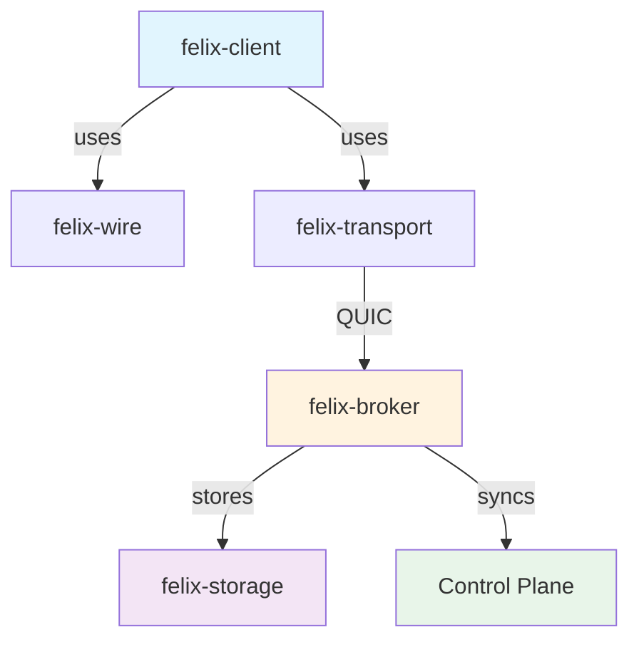
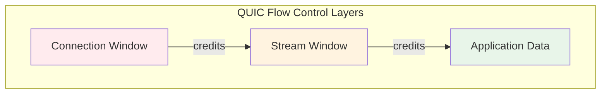
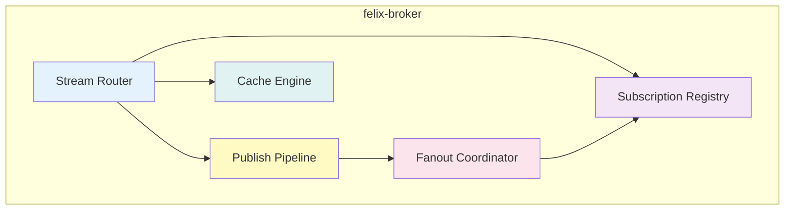
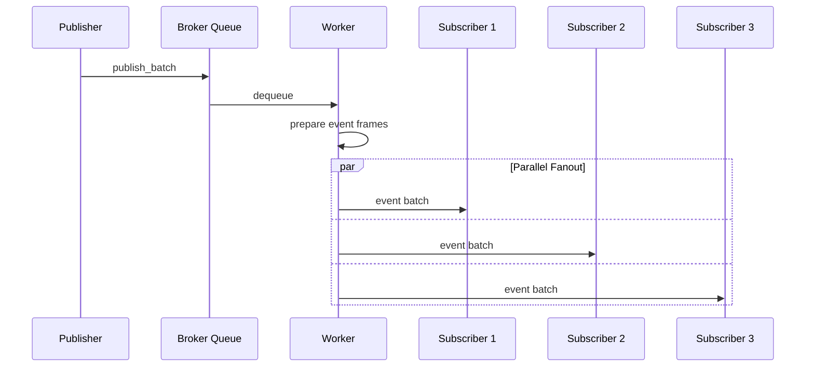
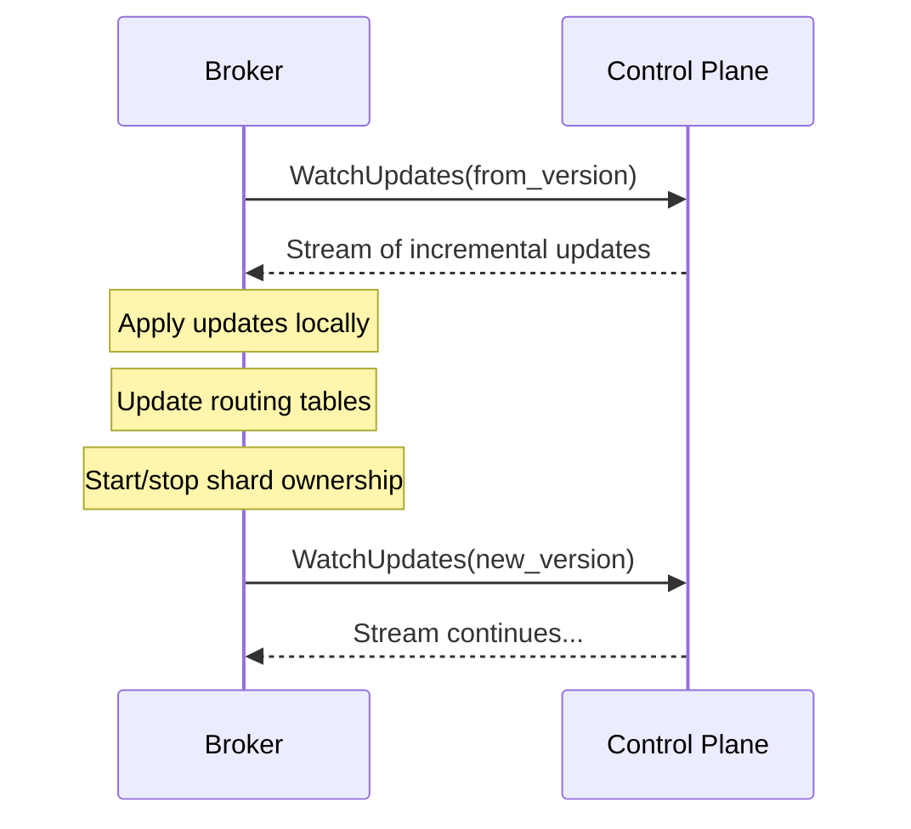
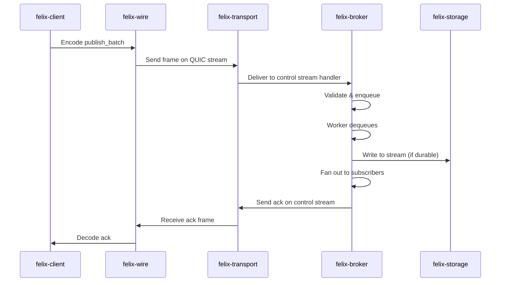
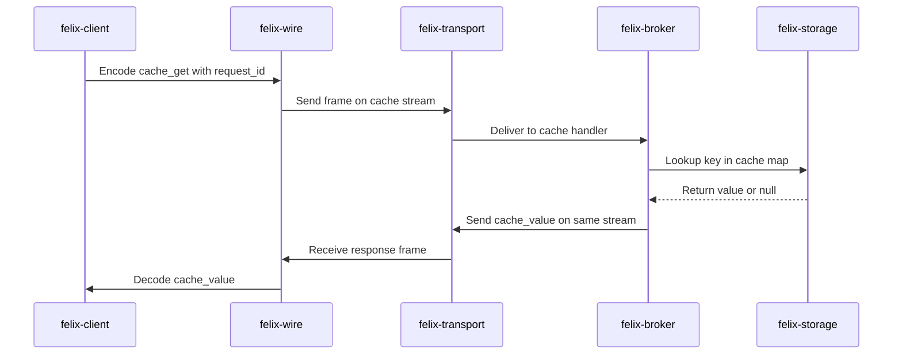

# Component Architecture

Felix is built as a modular, composable system with clear separation of concerns. Each component is designed to be independently testable, observable, and evolvable. This document provides a deep dive into each major component of the Felix architecture.

## Overview

The Felix system is composed of six core components that work together to deliver low-latency pub/sub and caching capabilities:



## felix-wire: Protocol Layer

The `felix-wire` crate defines the language-neutral wire protocol that all Felix clients and brokers must implement. It provides the foundation for interoperability and forward compatibility.

### Responsibilities

- **Frame encoding/decoding**: Fixed header format with magic number, version, flags, and length
- **Message serialization**: JSON-based message payload with type discriminators
- **Binary optimizations**: Binary batch encoding for high-throughput publish operations
- **Protocol versioning**: Version negotiation and forward compatibility
- **Conformance testing**: Test vectors for validating implementations

### Frame Structure

Every Felix message is wrapped in a fixed 12-byte header:

```
 0                   1                   2                   3
 0 1 2 3 4 5 6 7 8 9 0 1 2 3 4 5 6 7 8 9 0 1 2 3 4 5 6 7 8 9 0 1
┌───────────────────────────────┬───────────────┬───────────────┐
│            magic              │    version    │     flags     │
├───────────────────────────────┴───────────────┴───────────────┤
│                           length                              │
└───────────────────────────────────────────────────────────────┘
```

- **Magic**: `0x464C5831` ("FLX1") for protocol identification
- **Version**: Protocol version (currently 1)
- **Flags**: Feature flags for compression, encryption, binary encoding
- **Length**: Payload size in bytes (up to 4 GB)

### Design Decisions

The wire protocol deliberately uses JSON for v1 messages to prioritize:

1. **Debuggability**: Human-readable messages during development
2. **Ecosystem compatibility**: Easy to implement in any language
3. **Schema evolution**: Flexible field additions without breaking changes
4. **Binary escape hatch**: Binary batch mode available when throughput matters

!!! note "Binary Mode Performance"
    Binary publish batches eliminate JSON parsing overhead and can achieve 30-40% higher throughput for large batches. They're automatically used for high-throughput workloads when `event_single_binary_enabled` is configured.

## felix-transport: QUIC Abstraction

The transport layer provides a clean abstraction over QUIC, hiding the complexity of connection management, stream lifecycle, and flow control while exposing Felix-specific semantics.

### Core Abstractions

#### Connection Pooling

Felix maintains pools of QUIC connections to achieve parallelism without contention:

```rust
// Simplified conceptual API
pub struct ConnectionPool {
    endpoints: Vec<Endpoint>,
    next_index: AtomicUsize,
}

impl ConnectionPool {
    pub async fn acquire(&self) -> Connection;
    pub fn round_robin_next(&self) -> &Endpoint;
}
```

Connection pools are configured separately for different workload types:
- **Event connections**: For pub/sub control streams and subscriptions
- **Cache connections**: For cache request/response operations
- **Publish connections**: For publishing operations

#### Stream Management

QUIC supports two stream types, each serving specific purposes in Felix:

**Bidirectional Streams**:
- Control plane operations (publish, subscribe, cache requests)
- Request/response patterns
- Multiplexed cache operations over pooled streams

**Unidirectional Streams**:
- Event delivery (broker → subscriber)
- One stream per subscription for isolation
- Enables independent flow control per subscriber

### Flow Control Architecture

Felix leverages QUIC's built-in flow control at multiple levels:



**Configuration Parameters**:

- `FELIX_EVENT_CONN_RECV_WINDOW`: Per-connection receive window (default: 256 MiB)
- `FELIX_EVENT_STREAM_RECV_WINDOW`: Per-stream receive window (default: 64 MiB)
- `FELIX_EVENT_SEND_WINDOW`: Per-connection send window (default: 256 MiB)

!!! warning "Memory Implications"
    Window sizes multiply with pool sizes. An event connection pool of 8 with 256 MiB windows can commit up to 2 GiB of receive buffers under burst load. Tune carefully for your workload.

### TLS and Security

The transport layer enforces encryption by default:

- **TLS 1.3** for all connections
- **mTLS** for broker-to-broker communication (future)
- **Certificate validation** with configurable policies
- **Cipher suite configuration** for compliance requirements

## felix-broker: Core Logic

The broker is the heart of Felix, implementing pub/sub fanout, cache operations, stream routing, and backpressure management.

### Architecture Layers



### Stream Routing

When a client opens a stream to the broker, the first message determines stream behavior:

1. **Control stream** (bidirectional): Publish, subscribe setup, acknowledgements
2. **Event stream** (unidirectional): Server-opened for event delivery
3. **Cache stream** (bidirectional): Cache request/response multiplexing

### Publish Pipeline

The publish pipeline is optimized for both latency and throughput:

**Stages**:

1. **Ingestion**: Receive publish frame from client stream
2. **Validation**: Check tenant/namespace/stream authorization
3. **Queueing**: Enqueue to bounded publish queue
4. **Worker processing**: Parallel workers dequeue and prepare for fanout
5. **Fanout**: Distribute to all active subscribers

**Configuration**:

```yaml
pub_workers_per_conn: 4      # Worker parallelism per connection
pub_queue_depth: 1024         # Bounded queue size
publish_chunk_bytes: 16384    # Chunking for large payloads
```

!!! tip "Worker Sizing"
    Set `pub_workers_per_conn` to match your active publish stream count. Excess workers increase contention without improving throughput. For single-stream publishers, use 1-2 workers.

### Subscription Management

Each subscription maintains isolated state:

```rust
pub struct Subscription {
    subscription_id: String,
    tenant_id: String,
    namespace: String,
    stream: String,
    event_stream: UnidirectionalStream,
    buffer: BoundedQueue<Event>,
}
```

**Isolation guarantees**:

- Slow subscribers never block fast subscribers
- Per-subscription buffering with configurable depth
- Independent flow control per subscription stream
- Lag detection and optional subscriber backpressure

### Fanout Architecture

When a message is published, the broker fans it out to all subscribers:



**Batching behavior**:

- Events are accumulated up to `event_batch_max_events` (default: 64)
- Or until `event_batch_max_delay_us` elapses (default: 250 µs)
- Or until `event_batch_max_bytes` is reached (default: 256 KB)

### Cache Engine

The cache provides low-latency key-value operations with TTL:

**Operations**:
- `cache_put(tenant, namespace, cache, key, value, ttl_ms)`: Store with optional expiration
- `cache_get(tenant, namespace, cache, key)`: Retrieve value or null if missing/expired
- `cache_delete(key)`: Explicit deletion (future)

**Implementation characteristics**:

- In-memory hash map with TTL tracking
- Lazy expiration on access
- Scoped to `(tenant_id, namespace, cache_name, key)`
- No persistence in MVP (ephemeral)
- Best-effort eviction under memory pressure

**Performance profile** (localhost, concurrency=32):

| Payload Size | put p50 | get_hit p50 | get_miss p50 |
|--------------|---------|-------------|--------------|
| 0 B          | 158 µs  | 164 µs      | 162 µs       |
| 256 B        | 179 µs  | 177 µs      | 165 µs       |
| 4096 B       | 260 µs  | 238 µs      | 165 µs       |

## felix-storage: Storage Abstraction

The storage layer provides pluggable backends for different durability and performance requirements.

### Storage Modes

#### Ephemeral Storage (Current)

Fully in-memory storage optimized for latency:

- **Ring buffers** for stream data
- **Hash maps** for cache entries
- **TTL indexes** for expiration
- **No disk I/O** on hot path
- **At-most-once** delivery semantics

Use cases: real-time signals, transient caching, development

#### Durable Storage (Planned)

Persistent storage with configurable durability:

- **Write-ahead log (WAL)** for crash recovery
- **Segmented log files** for efficient compaction
- **Sparse indexes** for offset lookups
- **Configurable fsync** policies
- **At-least-once** delivery semantics

### Retention Policies

Retention is enforced per stream:

```yaml
streams:
  - name: metrics
    retention:
      time: 24h
      size: 100GB
      
  - name: events
    retention:
      time: 7d
      size: 1TB
```

## Control Plane: Metadata Management

The control plane is a separate service (planned) that manages cluster metadata and configuration.

### Metadata Scope

The control plane stores authoritative information about:

- **Stream definitions**: Tenant, namespace, stream names, retention policies
- **Shard placement**: Which brokers own which shards
- **Node membership**: Broker health and availability
- **Configuration**: Cluster-wide settings and feature flags
- **Bridges**: Cross-region replication configuration

### Consistency Model

Metadata uses **strong consistency** via RAFT:

- Single leader accepts all metadata writes
- Quorum replication for durability
- Linearizable reads from leader
- Follower reads for stale-ok queries

### Broker Synchronization

Brokers are not part of the RAFT cluster. They consume metadata via:



**API operations**:

- `GetSnapshot()`: Full metadata snapshot with version
- `WatchUpdates(from_version)`: Long-poll stream of changes
- `ReportHealth(node_id, status)`: Liveness signaling

### Failure Handling

When the control plane leader fails:

1. RAFT elects a new leader (typically < 1 second)
2. Brokers detect disconnection and reconnect
3. Brokers resume watching from last known version
4. No data-plane disruption during control plane failover

!!! note "Data Plane Independence"
    Brokers cache all necessary metadata to continue serving reads and writes during control plane unavailability. Only administrative operations and new stream creation are affected.

## Component Interactions

### End-to-End Publish Flow



### End-to-End Cache Flow



## Component Configuration

Each component exposes its own configuration surface:

| Component | Configuration Scope |
|-----------|---------------------|
| **felix-wire** | Protocol version, frame limits, binary mode thresholds |
| **felix-transport** | Connection pools, window sizes, TLS settings |
| **felix-broker** | Queue depths, worker counts, batching parameters |
| **felix-storage** | Retention policies, cache sizes, durability modes |
| **Control Plane** | RAFT tuning, snapshot intervals, health check periods |

See the [Performance Tuning](../features/performance.md) guide for detailed configuration examples.

## Design Principles

The component architecture embodies several key principles:

1. **Clear boundaries**: Each component has a well-defined responsibility
2. **Testability**: Components can be tested in isolation with mock implementations
3. **Composability**: Components can be combined in different ways (in-process, networked, clustered)
4. **Observability**: Each component exposes metrics and structured logs
5. **Performance**: Hot paths avoid unnecessary allocations and copies
6. **Explicitness**: Configuration is explicit, not hidden behind auto-tuning

!!! tip "Understanding Performance"
    When debugging performance issues, think in terms of component boundaries. Is the bottleneck in wire encoding? Transport flow control? Broker queueing? Storage I/O? Each component has different tuning knobs and scaling characteristics.
