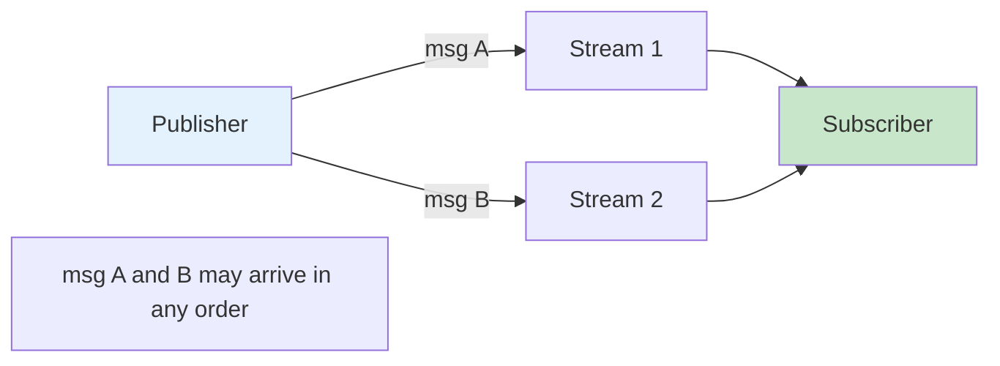
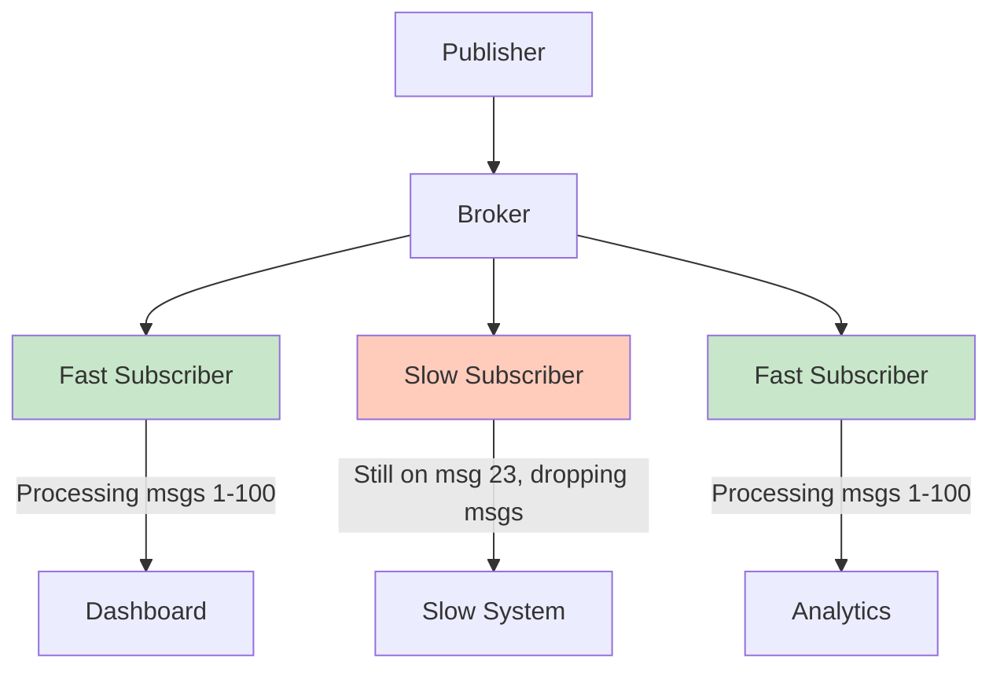
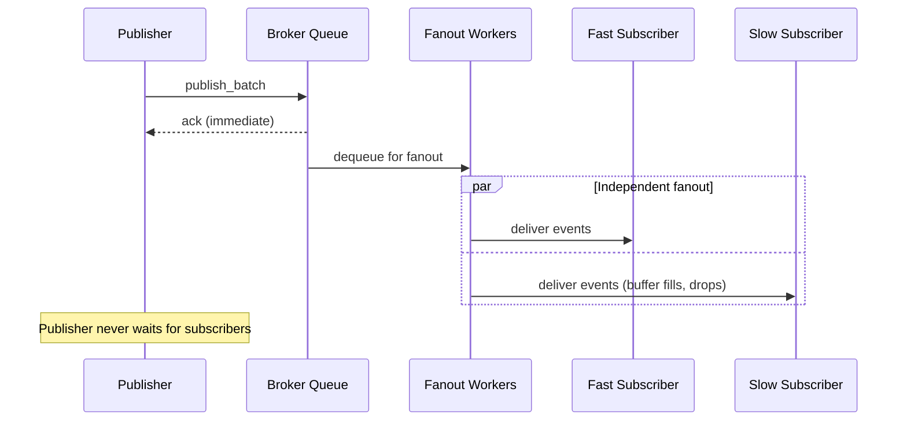
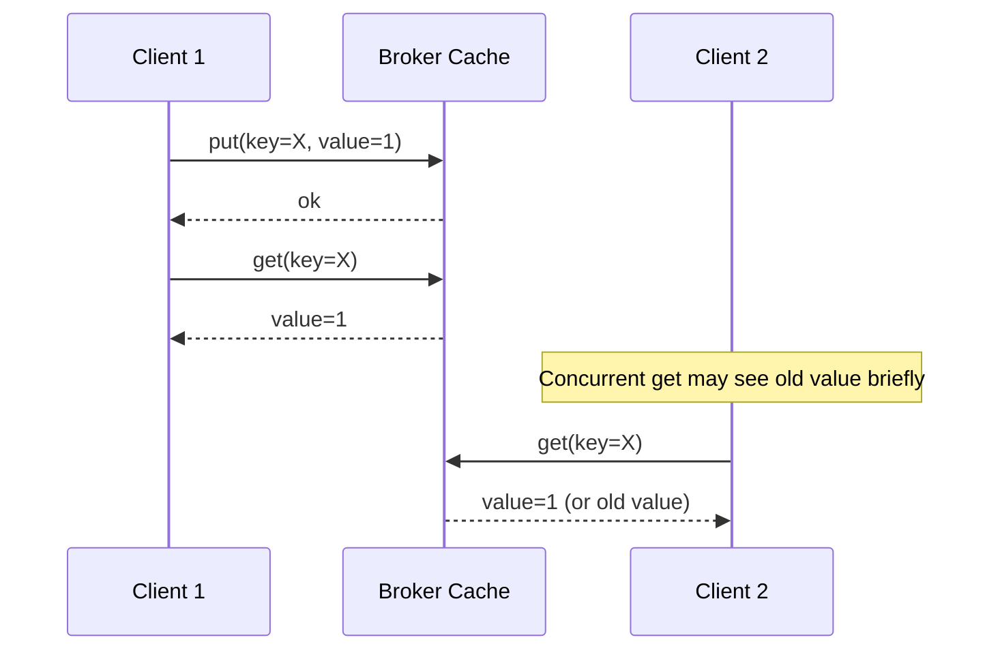
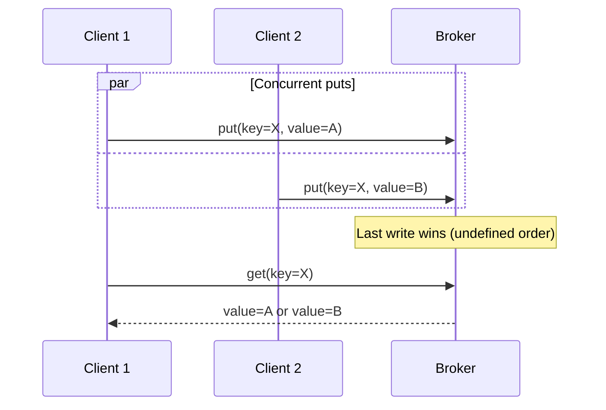
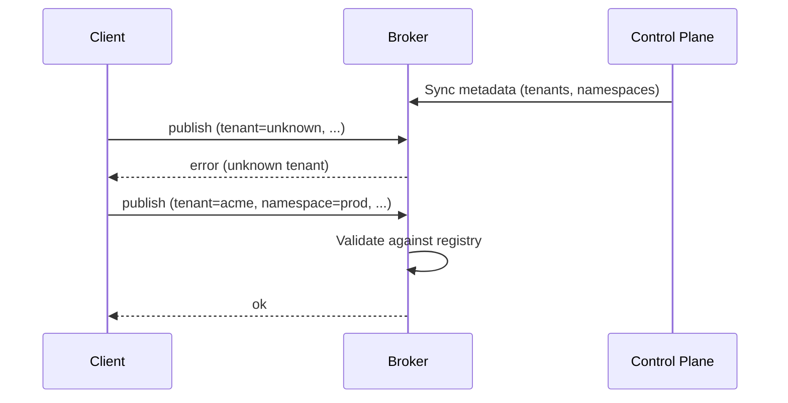

# Delivery Semantics and Consistency Model

Felix provides explicit, tunable delivery guarantees and consistency semantics. This document defines the behavioral contract that applications can rely on when building systems with Felix.

## Philosophy: Explicit Over Implicit

Felix makes trade-offs explicit rather than hiding them behind ambiguous guarantees. Every semantic choice has observable behavior that can be tested and reasoned about.

!!! note "MVP Scope"
    This document describes both current MVP semantics and planned future semantics. MVP limitations are clearly marked.

## Pub/Sub Delivery Semantics

### Delivery Guarantees (MVP)

**Current guarantee: At-most-once**

In the MVP, Felix provides **at-most-once** delivery semantics for pub/sub:

- Messages are delivered to subscribers zero or one time
- No retries or redelivery
- No acknowledgements from subscribers
- Slow subscribers may drop messages without notification

This semantic is appropriate for:
- Real-time signals where latest value matters most
- High-frequency metrics and telemetry
- Workloads where occasional loss is acceptable
- Applications that implement their own deduplication

!!! warning "Message Loss Scenarios"
    Messages can be lost when:
    - Subscriber falls behind buffer capacity
    - Network partition between broker and subscriber
    - Subscriber disconnects without draining buffer
    - Broker restarts (no durability in MVP)

**Example at-most-once workload**:

```rust
// Real-time sensor data where latest reading matters most
let mut subscription = client.subscribe("acme", "sensors", "temperature").await?;

while let Some(event) = subscription.next_event().await? {
    // Process latest temperature reading
    // If we miss a reading, the next one will arrive soon
    update_dashboard(event.payload);
}
```

### Planned Delivery Guarantees (Future)

**At-least-once delivery** (planned):

- Messages delivered one or more times
- Subscriber acknowledgements required
- Broker retries unacknowledged messages
- Requires durable storage
- Applications must handle duplicates

**Exactly-once semantics** (future):

- Messages delivered exactly one time (from application perspective)
- Idempotent producers with sequence numbers
- Transactional coordination
- Deduplication on receive side

Configuration example (future):

```yaml
streams:
  - name: orders
    delivery: at_least_once
    retention: 7d
    
  - name: transactions
    delivery: exactly_once
    retention: 30d
```

### Message Ordering

**Within a stream**: Ordering is preserved per publisher-broker-subscriber path.


**Guarantees**:
- Messages from a single publisher to a stream arrive in send order
- A single subscriber sees messages in the order they were enqueued
- Order is preserved through batching and fanout

**Across streams**: No ordering guarantees.



**Example**:

```rust
// Publish to two streams
use felix_wire::AckMode;
let publisher = client.publisher().await?;
publisher
    .publish("acme", "prod", "user-login", login_event, AckMode::None)
    .await?;
publisher
    .publish("acme", "prod", "audit-log", audit_event, AckMode::None)
    .await?;

// Subscribers to user-login and audit-log may see events in any relative order
```

**Ordering within batches**:

```rust
// Batch publish preserves order within the batch
use felix_wire::AckMode;
let publisher = client.publisher().await?;
let messages = vec![msg1, msg2, msg3];
publisher
    .publish_batch("acme", "prod", "orders", messages, AckMode::PerBatch)
    .await?;

// Subscribers will see msg1, msg2, msg3 in that order
```

### Fanout Fairness

Felix enforces **subscriber isolation**: slow subscribers never block fast subscribers.



**Isolation mechanism**:

Each subscription maintains an independent buffer:

```rust
pub struct Subscription {
    buffer: BoundedQueue<Event>,  // Per-subscription buffer
    event_stream: UnidirectionalStream,  // Independent QUIC stream
}
```

**Buffer behavior**:

- Each subscriber has `event_queue_depth` buffer slots (default: 1024)
- When buffer fills, new events are **dropped for that subscriber only**
- Other subscribers continue receiving events normally
- No explicit notification of drops in MVP (future: lag metrics)

**Configuration**:

```yaml
# Broker config
event_queue_depth: 1024  # Per-subscriber buffer size

# Larger buffer tolerates more bursty subscribers
event_queue_depth: 4096  # Trade memory for burst tolerance
```

!!! tip "Sizing Buffer Depth"
    Choose `event_queue_depth` based on:
    - Expected subscriber processing latency variance
    - Memory budget (depth × average event size × subscriber count)
    - Tolerance for temporary slowdowns
    
    For latency-sensitive workloads with consistent throughput: 512-1024
    For bursty workloads with high fanout: 2048-4096

### Publisher Backpressure

**Publisher behavior**: Publishing never blocks on subscriber speed.



**Publisher queue**:

Publishers write to a bounded queue with configurable depth:

```yaml
pub_queue_depth: 1024  # Bounded publish queue
publish_queue_wait_timeout_ms: 2000  # Timeout if queue full
```

When the publish queue is full:
- New publishes block up to `publish_queue_wait_timeout_ms`
- After timeout, publish fails with error
- This indicates broker overload (too many publishes, insufficient workers)

**Tuning publish pipeline**:

```yaml
# Increase parallelism
pub_workers_per_conn: 4

# Increase buffer (trades latency for burst tolerance)
pub_queue_depth: 2048

# Faster timeout for fail-fast behavior
publish_queue_wait_timeout_ms: 1000
```

### Disconnection Behavior

**Subscriber disconnects**:

- Subscription is immediately removed from registry
- Buffered events for that subscriber are discarded
- No redelivery when subscriber reconnects
- Subscriber must re-subscribe (starts from tail)

**Publisher disconnects**:

- In-flight publishes may be lost if not acknowledged
- No automatic retry or persistence of unacked publishes
- Application must handle reconnection and retry logic

**Broker restarts**:

- All in-memory state is lost (ephemeral storage in MVP)
- Active subscriptions are terminated
- Clients detect connection loss and must reconnect
- No historical replay available

## Cache Semantics

### Consistency Model

Felix cache provides **eventual consistency** with **read-your-writes** for single clients:



**Guarantees**:

1. **Read-your-writes**: Client sees its own writes immediately
2. **Monotonic reads**: Client never sees older values after newer ones (single session)
3. **Eventual consistency**: All clients eventually see the latest value
4. **No dirty reads**: Clients never see partial or uncommitted writes

**Not guaranteed**:

- Linearizability across clients
- Causal consistency across keys
- Multi-key transactions

### TTL and Expiration

**TTL semantics**:

```rust
// Store with 60-second TTL
use bytes::Bytes;
client
    .cache_put(
        "acme",
        "prod",
        "session",
        session_id,
        Bytes::from(session_data),
        Some(60_000),
    )
    .await?;

// Store without expiration
client
    .cache_put("acme", "prod", "config", config_key, Bytes::from(config_value), None)
    .await?;
```

**Expiration behavior**:

- TTL countdown starts when `cache_put` returns `ok`
- Expiration is **lazy**: checked on access, not proactively
- Expired entries return `null` on `cache_get`
- Expired entries may occupy memory until accessed or evicted

!!! warning "TTL Precision"
    TTL enforcement is best-effort. Under high load, expired entries might be accessible for short periods after TTL expires. This is typically < 100ms but not guaranteed.

### Cache Scoping

Cache entries are scoped to `(tenant_id, namespace, cache_name, key)`:

```rust
// These are independent cache entries:
client.cache_put_scoped("tenant1", "prod", "sessions", "user123", data).await?;
client.cache_put_scoped("tenant1", "staging", "sessions", "user123", data).await?;
client.cache_put_scoped("tenant2", "prod", "sessions", "user123", data).await?;
```

**Isolation guarantees**:

- Different tenants cannot access each other's cache entries
- Different namespaces within a tenant are isolated
- Keys are unique only within their (tenant, namespace, cache) scope

### Eviction Policy

**MVP policy**: Best-effort eviction when memory pressure occurs.

- No guaranteed LRU or LFU policy
- Eviction is opportunistic
- Applications should not rely on specific eviction order

**Capacity configuration** (future):

```yaml
caches:
  - tenant: tenant1
    namespace: prod
    cache: sessions
    max_entries: 100000
    max_bytes: 1GB
    eviction_policy: lru
```

### Concurrency and Race Conditions

**Concurrent writes to same key**:



**Behavior**: Last write wins, but order is undefined for concurrent writes.

**No atomic operations in MVP**:

- No compare-and-swap
- No atomic increment
- No multi-key transactions

**Planned features**:

- Conditional put (if-not-exists, if-match)
- Atomic increment/decrement
- Watch/notify on key changes

### Cache vs. Pub/Sub Integration (Future)

Planned feature: Pub/sub invalidation for cache consistency.

```rust
// Publish invalidates cache entry
client.publish_with_invalidation("events", "user-updated", event, 
    vec!["cache:sessions:user123"]).await?;

// Subscribers and cache both receive update
```

## Tenant and Namespace Model

### Existence Enforcement

**Wire protocol requirement**: All data-plane operations must specify tenant and namespace.

```json
{
  "type": "publish",
  "tenant_id": "acme-corp",
  "namespace": "production",
  "stream": "orders",
  "payload": "..."
}
```

**Broker validation**:

The broker enforces tenant/namespace existence:

1. Broker syncs metadata from control plane
2. Broker maintains local registry of valid tenant/namespace pairs
3. Operations for unknown tenant/namespace are rejected with `error` response



### Authorization (Planned)

Future: ACL-based authorization per tenant/namespace/stream.

```yaml
acls:
  - tenant: acme-corp
    namespace: production
    resource: orders
    principal: service-account-1
    permissions: [publish, subscribe]
    
  - tenant: acme-corp
    namespace: production
    resource: analytics
    principal: service-account-2
    permissions: [subscribe]
```

**Enforcement points**:
- Publish operations
- Subscribe operations
- Cache operations
- Control plane operations

### Quota Enforcement (Planned)

Future: Per-tenant and per-namespace quotas.

```yaml
quotas:
  - tenant: acme-corp
    namespace: production
    publish_rate_limit: 10000/s
    subscribe_connections: 100
    cache_memory: 10GB
    stream_retention: 7d
```

## Consistency Across Components

### Broker Internal Consistency

Within a single broker:

- **Publish-fanout ordering**: Messages fan out in publish order
- **Cache consistency**: Single-writer per key (no torn writes)
- **Subscription isolation**: Independent queues prevent crosstalk

### Multi-Broker Consistency (Future)

In a clustered deployment:

- **Shard leadership**: Only one leader per shard
- **Metadata consistency**: Strongly consistent via RAFT control plane
- **Cross-shard ordering**: Not guaranteed
- **Cache consistency**: Eventually consistent across brokers

## Failure Scenarios and Behavior

### Network Partition

**Publisher-Broker partition**:

- Publisher detects connection loss (QUIC idle timeout)
- Unacknowledged publishes are lost
- Publisher must reconnect and retry

**Subscriber-Broker partition**:

- Subscriber detects connection loss
- Buffered events are lost
- Subscriber must reconnect and re-subscribe (starts from tail)

**Broker-Control Plane partition**:

- Broker continues serving with cached metadata
- New stream creation fails
- Existing streams continue operating
- Broker reconciles when connection restored

### Broker Failure

**Process crash**:

- All in-memory state lost (ephemeral storage in MVP)
- Clients detect connection loss
- Clients must reconnect to recovered broker
- Subscriptions must be re-established

**Planned behavior with durability**:

- Durable streams can replay from last checkpoint
- Subscribers can resume from last acknowledged offset
- Cache state can be rebuilt from log

### Slow Subscriber Behavior

**Scenario**: Subscriber processing slows down.

**Stages**:

1. **Buffer absorbs slowdown**: Events accumulate in subscriber buffer
2. **Buffer fills**: New events start getting dropped for that subscriber
3. **Other subscribers unaffected**: Fast subscribers continue normally

**Detection** (future):

- Lag metrics exposed per subscription
- Configurable alerts for subscribers falling behind
- Optional disconnect of chronically slow subscribers

```rust
// Future API
let lag = subscription.lag_metric().await?;
if lag.messages_behind > 1000 {
    warn!("Subscription falling behind: {} messages", lag.messages_behind);
}
```

## Testing Semantics

### Conformance Testing

Applications can test semantic guarantees:

**Ordering test**:

```rust
// Publish ordered batch
let messages = vec!["msg1", "msg2", "msg3"];
use felix_wire::AckMode;
let publisher = client.publisher().await?;
publisher
    .publish_batch("test", "default", "orders", messages, AckMode::PerBatch)
    .await?;

// Verify subscriber receives in order
let events = collect_events(&mut subscription, 3).await?;
assert_eq!(events, vec!["msg1", "msg2", "msg3"]);
```

**Isolation test**:

```rust
// Start fast and slow subscribers
let mut fast_sub = client.subscribe("test", "default", "stream").await?;
let mut slow_sub = client.subscribe("test", "default", "stream").await?;

// Slow subscriber delays processing
simulate_slow_processing(&mut slow_sub);

// Verify fast subscriber still receives all messages
let fast_count = count_events(&mut fast_sub, timeout).await?;
assert!(fast_count >= expected_count);
```

## Summary: Semantic Guarantees Matrix

| Property | MVP Guarantee | Future Guarantee |
|----------|---------------|------------------|
| **Pub/Sub delivery** | At-most-once | At-least-once, Exactly-once |
| **Message ordering** | Per-stream | Configurable cross-stream |
| **Subscriber isolation** | Yes | Yes |
| **Cache consistency** | Read-your-writes | Tunable (linearizable option) |
| **TTL precision** | Best-effort (~100ms) | Guaranteed |
| **Durability** | None (ephemeral) | Configurable per stream |
| **Authorization** | None | RBAC per resource |
| **Quotas** | None | Per-tenant, per-namespace |
| **Multi-key operations** | None | Transactions |

## Recommendations

### Choosing Delivery Semantics

**Use at-most-once (current MVP) when**:
- Latest value is more important than history (sensor data, metrics)
- Occasional loss is acceptable (telemetry, monitoring)
- Throughput and latency matter more than guarantees
- Application implements own deduplication

**Use at-least-once (future) when**:
- Every message matters (financial transactions, orders)
- Application can handle duplicates (idempotent processing)
- Durability matters more than latency

**Use exactly-once (future) when**:
- Duplicates are unacceptable (billing, accounting)
- Application cannot easily deduplicate
- Willing to pay latency cost for guarantees

### Cache Usage Patterns

**Good cache use cases**:
- Session data with TTL
- Configuration with infrequent updates
- Rate limiting counters (with planned atomic increment)
- Recently published message lookup

**Poor cache use cases**:
- Strongly consistent shared state requiring transactions
- Large values (> 1 MB) better served by object storage
- Frequently updated counters (better as pub/sub)

!!! tip "Design for Semantics"
    Design your application for the semantics Felix provides, not the semantics you wish it had. If you need stronger guarantees than MVP provides, layer them in your application or wait for planned features.
