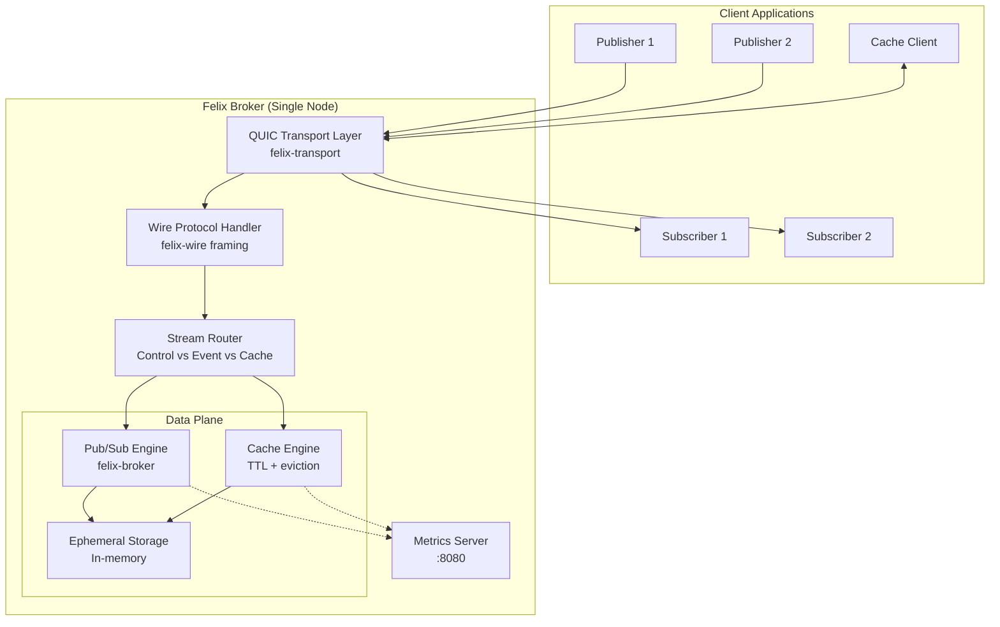
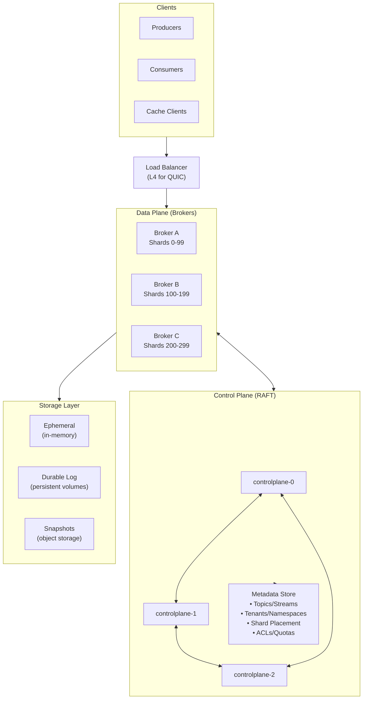
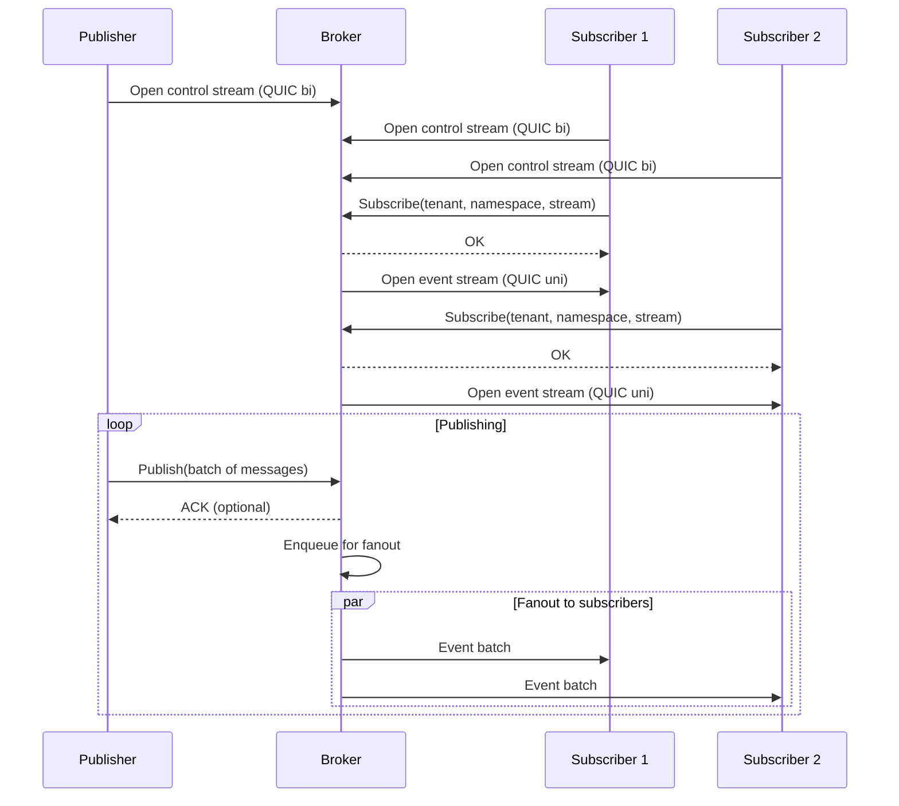
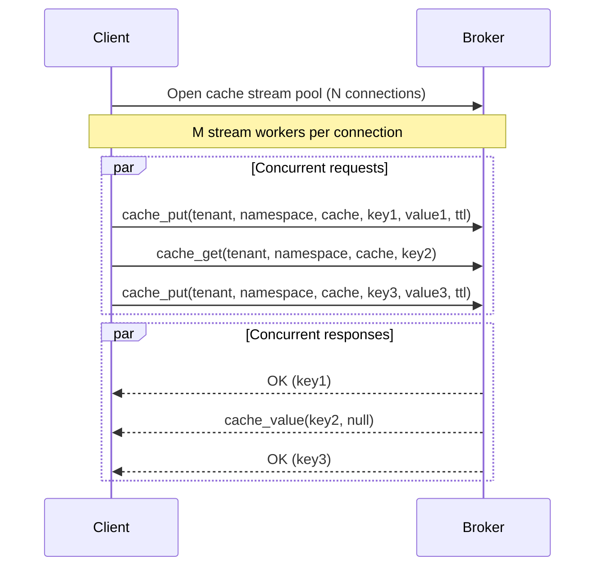
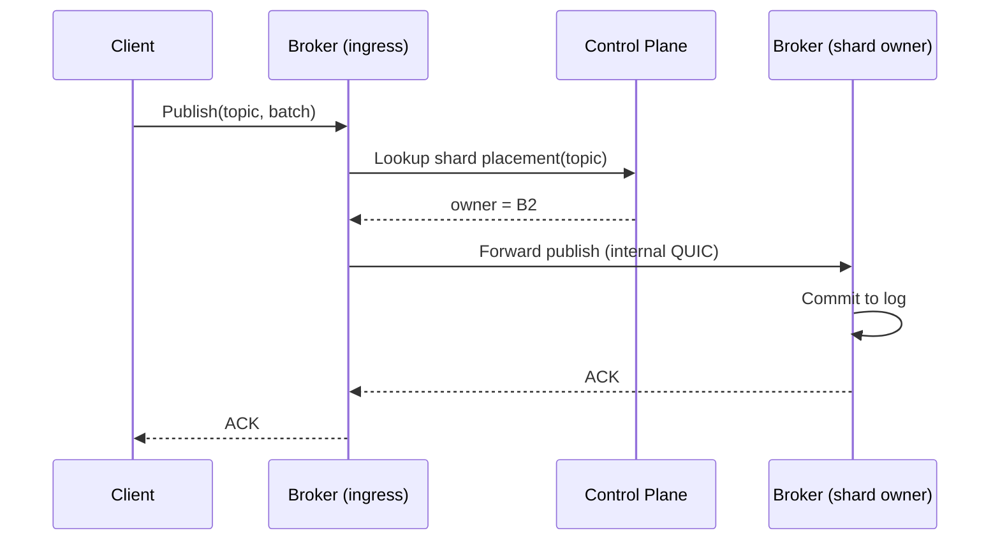
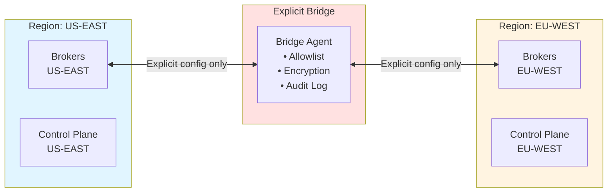

# System Design

Felix is a sovereign-first, low-latency distributed data backend that unifies event streaming, message queueing, and distributed caching over a single QUIC-based transport layer.

## Design Principles

### 1. Sovereignty by Default

Each Felix cluster represents a **single sovereign region**. Data is isolated by default and cannot leave the region unless an explicit, configured bridge exists. This is enforced in routing, metadata, and encryption boundaries—not left to deployment discipline.

**Why this matters:**

- **Regulatory Compliance:** GDPR, CCPA, HIPAA require data residency
- **Data Sovereignty:** Government and enterprise data governance
- **Security:** Reduced attack surface with explicit data movement
- **Auditability:** Complete visibility into cross-region data flow

### 2. One Core Log, Many Semantics

Internally, Felix is built around a single append-only log abstraction. Different external semantics are projections over this core:

- **Streams (Pub/Sub):** Fanout cursors per subscription
- **Queues:** Shared consumer-group cursors with acknowledgements
- **Cache:** Key → latest value with TTL, backed by the same log for invalidation and replay

This drastically reduces operational complexity and consistency bugs compared to running Kafka, Redis, and a queueing system side-by-side.

### 3. Low-Latency First

Felix prioritizes predictable low latency over maximum batch throughput:

- **QUIC transport:** Multiplexed, encrypted, congestion-aware
- **Optional ephemeral streams:** No disk on hot path
- **Aggressive backpressure:** Bounded memory everywhere
- **Leader-based writes:** Tunable acknowledgement policies

### 4. Kubernetes-Native

Felix assumes Kubernetes for process lifecycle, identity (ServiceAccounts), networking and service discovery, and failure detection. Felix does **not** attempt to reimplement scheduling or node membership logic that Kubernetes already provides.

## System Architecture (Current MVP)

The current implementation is a single-node broker for development and testing:

**Key Components:**

- **Transport Layer:** Accepts QUIC connections, manages stream lifecycle
- **Wire Protocol:** Frames messages, validates envelopes, routes by type
- **Pub/Sub Engine:** Enqueues publishes, manages subscriptions, fans out events
- **Cache Engine:** Handles put/get operations with TTL and lazy expiration
- **Storage:** In-memory ring buffers and hash maps (ephemeral)
- **Metrics Server:** Prometheus-compatible endpoint for monitoring

## Planned Multi-Node Architecture

The intended multi-node design adds explicit control-plane coordination and data-plane scalability:

### Control Plane Responsibilities

- **Metadata Management:** Topics, tenants, namespaces, ACLs
- **Shard Placement:** Assign shards to broker nodes
- **Health Monitoring:** Track broker liveness and readiness
- **Configuration:** Cluster-wide retention, limits, feature flags
- **Rebalancing:** Migrate shards on node failures or scaling events

### Data Plane Responsibilities

- **Client Connections:** Accept and route QUIC streams
- **Data Operations:** Publish, subscribe, cache operations
- **Shard Ownership:** Host assigned shards (leaders and followers)
- **Replication:** (Future) Replicate log entries to followers
- **Backpressure:** Enforce flow control and isolation

## Data Flow Patterns

### Publish/Subscribe Flow

**Key characteristics:**

- Publishers use bidirectional control streams for publish requests
- Subscribers get dedicated unidirectional event streams
- Fanout happens independently per subscriber (isolation)
- Batching is time and count-bounded for throughput optimization

### Cache Flow

**Key characteristics:**

- Connection pooling reduces handshake overhead
- Request multiplexing over long-lived streams
- Request IDs for request/response matching
- Sub-millisecond latency at moderate concurrency

### Cross-Broker Routing (Planned)

When a client connects to a broker that doesn't own the target shard:

## Storage Architecture

### Ephemeral (Current MVP)

- **In-memory only:** No disk writes on hot path
- **Bounded buffers:** Ring buffers with fixed capacity
- **TTL support:** Lazy expiration on access
- **No persistence:** Data lost on restart

**Use cases:**

- Ultra-low latency workloads
- Development and testing
- Temporary caching
- Non-critical event streams

### Durable (Planned)

- **Write-Ahead Log (WAL):** Append-only log segments
- **Segmented storage:** Rotate segments based on time/size
- **Retention policies:** Time-based and size-based limits
- **Snapshots:** Periodic state snapshots for faster recovery

**Use cases:**

- Production event streaming
- Critical message delivery
- Long-term event retention
- Replay and audit trails

## Consistency Model

### Single-Node (MVP)

- **Delivery:** At-most-once (best-effort)
- **Ordering:** Per-stream ordering preserved per subscriber
- **Durability:** None (ephemeral only)

### Multi-Node (Planned)

**Tunable per stream:**

- **Leader-only acknowledgements:** Lowest latency, leader commits before replicating
- **Quorum acknowledgements:** Higher durability, waits for majority replica confirmation
- **Asynchronous replication:** Background replication after ACK
- **Synchronous replication:** Blocks on replication before ACK

**Delivery guarantees:**

- **At-least-once:** With durable storage and replay on failure
- **At-most-once:** Best-effort with no retries
- **Exactly-once:** (Future roadmap) via idempotent producers and transactions

## Multi-Region Architecture (Planned)

Felix enforces regional isolation with explicit bridges:

**Bridge characteristics:**

- **Explicit Configuration:** No implicit data movement
- **Stream Allowlist:** Only specified streams replicate
- **Independent Encryption:** Per-region key contexts
- **Audit Trail:** Complete log of cross-region data movement
- **Compliance:** Satisfies strict data sovereignty requirements

## Scalability Considerations

### Vertical Scaling (Single-Node)

- **CPU:** More cores for parallel stream processing
- **Memory:** Larger buffers and cache capacity
- **Network:** Higher bandwidth for fanout
- **Typical:** 10k-50k msg/s on modern hardware

### Horizontal Scaling (Multi-Node)

- **Sharding:** Partition streams across brokers
- **Connection pooling:** Reuse connections across shards
- **Control plane:** RAFT quorum for metadata (3-5 nodes)
- **Data plane:** Many broker nodes for capacity
- **Target:** 100k-1M+ msg/s per cluster

## Next Steps

- [Components Deep Dive](components.md) - Detailed component architecture
- [Wire Protocol](wire-protocol.md) - Protocol specification
- [Semantics](semantics.md) - Delivery and consistency guarantees
- [Performance Tuning](../features/performance.md) - Optimize for your workload
