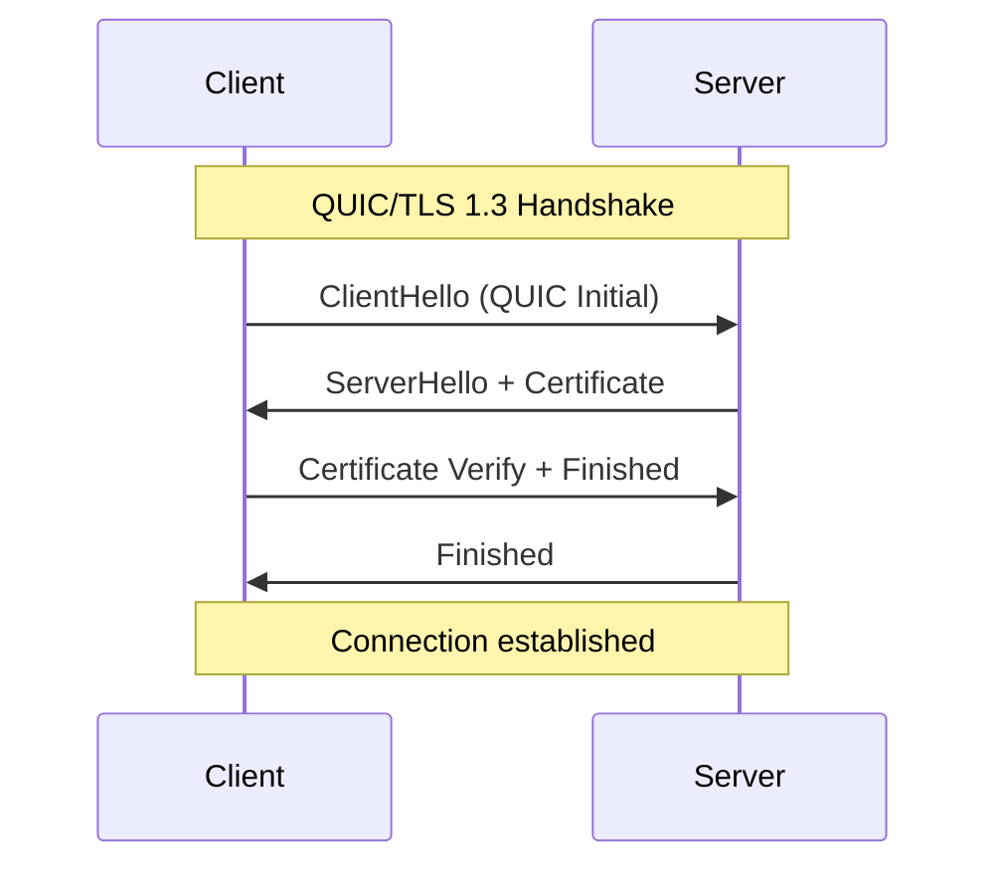
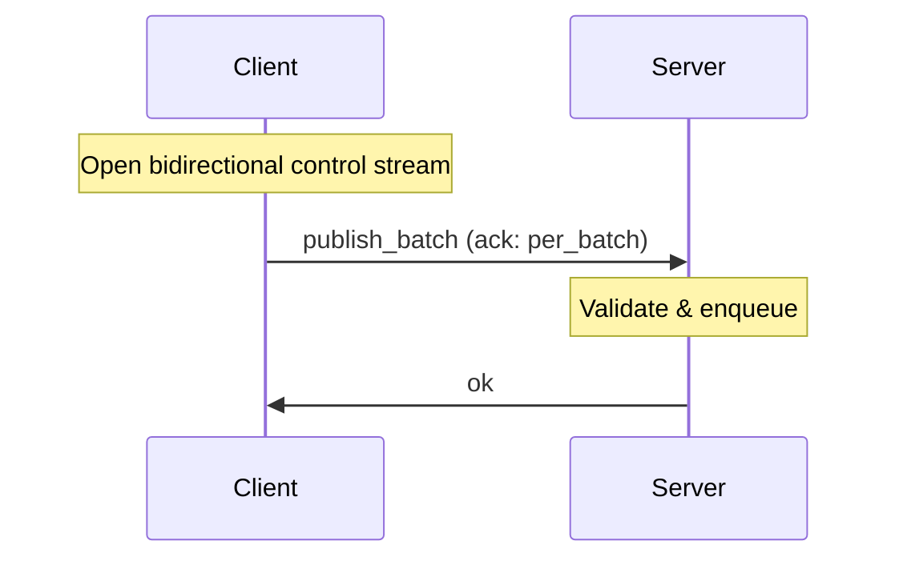
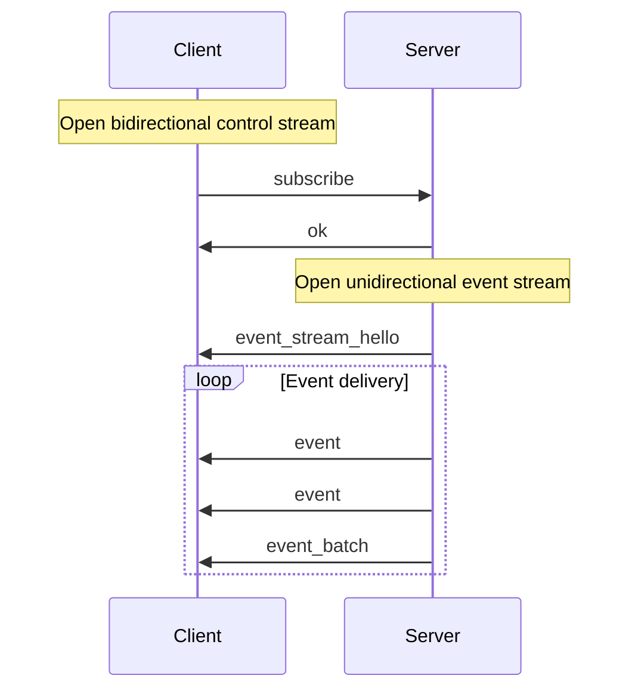
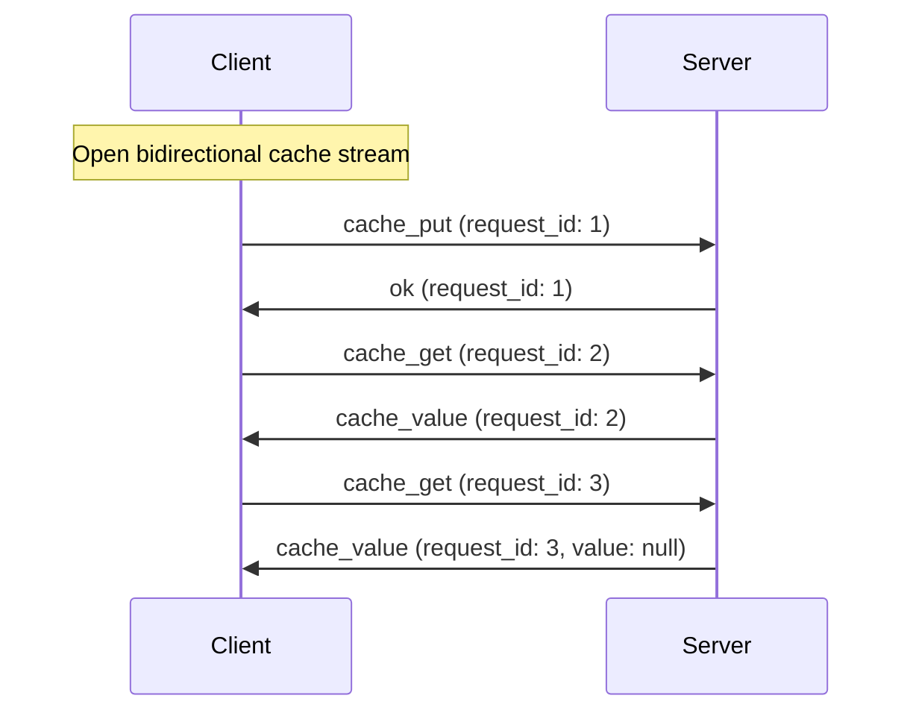

# Wire Protocol Specification

The Felix wire protocol is the language-neutral specification that defines how clients and brokers communicate over the network. This document provides a comprehensive reference for implementing Felix-compatible clients and servers.

## Design Goals

The wire protocol is designed with the following priorities:

1. **Language neutrality**: No Rust-specific types or semantics
2. **Forward compatibility**: Version negotiation and feature flags
3. **Debuggability**: Human-readable messages in v1 with binary fast paths
4. **Explicit framing**: Clear message boundaries over stream transport
5. **Performance escape hatches**: Binary encodings for high-throughput workloads

!!! note "Stability Guarantee"
    The wire protocol v1 is considered stable. All future changes will maintain backward compatibility through version negotiation or optional feature flags.

## Transport Layer

Felix uses **QUIC over TLS 1.3** (IETF QUIC) as its exclusive transport:

- **Encrypted by default**: TLS 1.3 handshake integrated into connection setup
- **Multiplexed streams**: Multiple independent streams per connection
- **Flow control**: Built-in backpressure at connection and stream levels
- **No head-of-line blocking**: Stream independence prevents HOL blocking
- **0-RTT support**: Future optimization for repeat connections

The protocol is transport-agnostic in design and could theoretically run over TCP+TLS, but QUIC is the only supported transport in the initial implementation.

## Frame Structure

Every Felix message is transmitted as a **frame** consisting of a fixed-size header followed by a variable-length payload.

### Frame Header (12 bytes)

```
 0                   1                   2                   3
 0 1 2 3 4 5 6 7 8 9 0 1 2 3 4 5 6 7 8 9 0 1 2 3 4 5 6 7 8 9 0 1
┌───────────────────────────────┬───────────────┬───────────────┐
│            magic              │    version    │     flags     │
│         (4 bytes)             │   (2 bytes)   │   (2 bytes)   │
├───────────────────────────────┴───────────────┴───────────────┤
│                           length                              │
│                         (4 bytes)                             │
└───────────────────────────────────────────────────────────────┘

All multi-byte integers are big-endian (network byte order)
```

#### Field Definitions

**magic (u32, big-endian)**

Fixed value: `0x464C5831` (ASCII "FLX1")

Purpose: Protocol identification and frame synchronization. Decoders should reject frames with incorrect magic numbers.

**version (u16, big-endian)**

Protocol version: `1` for current specification

Future versions will use different version numbers to enable negotiation and backward compatibility.

**flags (u16, big-endian)**

Bit field for optional features:

| Bit | Mask   | Meaning |
|-----|--------|---------|
| 0   | 0x0001 | Binary publish batch encoding |
| 1-15| -      | Reserved (must be 0 in v1) |

Receivers must ignore unknown flag bits to allow forward compatibility.

**length (u32, big-endian)**

Payload length in bytes: `0` to `2^32 - 1`

This is the byte count of the payload following the header. The maximum practical frame size is typically much smaller (16 MB default limit).

### Frame Payload

The payload encoding depends on the flags:

**Standard JSON Encoding (flags = 0x0000)**:
- Payload is a UTF-8 encoded JSON object
- Must be valid JSON per RFC 8259
- No trailing whitespace required

**Binary Batch Encoding (flags & 0x0001)**:
- Payload is a binary-encoded publish batch (see Binary Encoding section)
- Used for high-throughput publish workloads

## Message Types

All JSON payloads are objects with a `type` discriminator field. The type determines the message schema and semantics.

### Client → Server Messages

#### Publish

Single-message publish operation.

```json
{
  "type": "publish",
  "tenant_id": "string",
  "namespace": "string",
  "stream": "string",
  "payload": "base64-encoded-bytes",
  "ack": "none" | "per_message"
}
```

**Fields**:
- `tenant_id`: Tenant identifier (must exist in broker registry)
- `namespace`: Namespace identifier within tenant
- `stream`: Stream name to publish to
- `payload`: Message payload encoded as base64
- `ack`: Acknowledgement mode
  - `none`: Fire-and-forget, no ack sent
  - `per_message`: Broker sends `ok` after accepting message

**Semantics**:
- Message is enqueued to the broker's publish pipeline
- If `ack` is `per_message`, broker responds with `ok` after enqueuing
- No ordering guarantees across different publish operations

#### PublishBatch

Batch publish operation for improved throughput.

```json
{
  "type": "publish_batch",
  "tenant_id": "string",
  "namespace": "string",
  "stream": "string",
  "payloads": ["base64-1", "base64-2", "base64-n"],
  "ack": "none" | "per_batch"
}
```

**Fields**:
- `tenant_id`, `namespace`, `stream`: Same as Publish
- `payloads`: Array of base64-encoded message payloads
- `ack`: Acknowledgement mode
  - `none`: Fire-and-forget
  - `per_batch`: Single `ok` after entire batch is accepted

**Semantics**:
- All messages in batch are enqueued atomically
- Ordering is preserved within the batch
- More efficient than individual publishes for high-throughput workloads

#### Subscribe

Initiate a subscription to a stream.

```json
{
  "type": "subscribe",
  "tenant_id": "string",
  "namespace": "string",
  "stream": "string"
}
```

**Semantics**:
- Subscription starts at **tail** (current offset)
- No historical replay in MVP
- Broker responds with `ok` on the control stream
- Broker opens a new **unidirectional stream** for event delivery
- First frame on event stream is `EventStreamHello` (see below)

#### CachePut

Store a key-value pair in the cache with optional TTL.

```json
{
  "type": "cache_put",
  "request_id": "string",
  "key": "string",
  "value": "base64-encoded-bytes",
  "ttl_ms": number | null
}
```

**Fields**:
- `request_id`: Client-provided identifier for request/response matching
- `key`: Cache key (arbitrary string)
- `value`: Value encoded as base64
- `ttl_ms`: Time-to-live in milliseconds (null = no expiration)

**Semantics**:
- Value is stored and expires after TTL if specified
- Broker responds with `ok` containing the same `request_id`
- Expiration is lazy (checked on access)

#### CacheGet

Retrieve a value from the cache.

```json
{
  "type": "cache_get",
  "request_id": "string",
  "key": "string"
}
```

**Semantics**:
- Broker responds with `cache_value` containing the same `request_id`
- Value is `null` if key is missing or expired

### Server → Client Messages

#### Event

Event delivery on a subscription stream.

```json
{
  "type": "event",
  "tenant_id": "string",
  "namespace": "string",
  "stream": "string",
  "payload": "base64-encoded-bytes"
}
```

**Semantics**:
- Sent on unidirectional event streams
- One event per frame (unless batched)
- No acknowledgement from client in MVP

#### EventBatch

Batched event delivery (optimization).

```json
{
  "type": "event_batch",
  "tenant_id": "string",
  "namespace": "string",
  "stream": "string",
  "payloads": ["base64-1", "base64-2", "base64-n"]
}
```

**Semantics**:
- Multiple events delivered in single frame
- Reduces framing overhead for high-throughput streams
- Configurable via broker batching parameters

#### EventStreamHello

First frame on a subscription event stream.

```json
{
  "type": "event_stream_hello",
  "subscription_id": "string"
}
```

**Semantics**:
- Allows client to correlate stream with subscription request
- Must be first frame on event stream
- Subsequent frames are events

#### CacheValue

Cache lookup response.

```json
{
  "type": "cache_value",
  "request_id": "string",
  "key": "string",
  "value": "base64-encoded-bytes" | null
}
```

**Fields**:
- `request_id`: Matches the request
- `key`: Requested key
- `value`: Retrieved value or `null` if missing/expired

#### Ok

Generic success acknowledgement.

```json
{
  "type": "ok",
  "request_id": "string"
}
```

**Semantics**:
- Sent in response to publish (if acked), subscribe, cache_put
- `request_id` matches the request when applicable

#### Error

Error response.

```json
{
  "type": "error",
  "request_id": "string",
  "message": "human-readable-error-description"
}
```

**Common error conditions**:
- Unknown tenant/namespace/stream
- Malformed frame
- Authorization failure (future)
- Resource exhaustion

## Binary Publish Batch Encoding

For high-throughput publish workloads, Felix supports a binary encoding that eliminates JSON parsing overhead.

### When to Use Binary Mode

Binary mode is enabled by setting flag bit 0 (`flags | 0x0001`). Use when:

- Publishing large batches (64+ messages)
- Payload sizes exceed 512 bytes
- Throughput is more important than debuggability
- You've validated the binary encoding implementation

!!! tip "Performance Impact"
    Binary batches can achieve 30-40% higher throughput than JSON batches, especially with large payloads and high fanout. Enable with `event_single_binary_enabled: true` in broker config.

### Binary Format Specification

```
 0               2               4
 0 1 2 3 4 5 6 7 8 9 0 1 2 3 4 5 6 7 8 9 0 ...
┌───────────────┬───────────────┬─────────────────────────────┐
│  tenant_len   │  tenant_id    │ ...                         │
│   (u16 BE)    │  (bytes)      │                             │
├───────────────┼───────────────┼─────────────────────────────┤
│ namespace_len │  namespace    │ ...                         │
│   (u16 BE)    │  (bytes)      │                             │
├───────────────┼───────────────┼─────────────────────────────┤
│  stream_len   │  stream       │ ...                         │
│   (u16 BE)    │  (bytes)      │                             │
├───────────────┴───────────────┴─────────────────────────────┤
│                     count (u32 BE)                          │
├─────────────────────────────────────────────────────────────┤
│  payload_1_len (u32 BE)                                     │
├─────────────────────────────────────────────────────────────┤
│  payload_1 (bytes)                                          │
│  ...                                                        │
├─────────────────────────────────────────────────────────────┤
│  payload_2_len (u32 BE)                                     │
├─────────────────────────────────────────────────────────────┤
│  payload_2 (bytes)                                          │
│  ...                                                        │
└─────────────────────────────────────────────────────────────┘
```

**Encoding steps**:

1. Write `tenant_len` as u16 big-endian
2. Write `tenant_id` bytes (UTF-8)
3. Write `namespace_len` as u16 big-endian
4. Write `namespace` bytes (UTF-8)
5. Write `stream_len` as u16 big-endian
6. Write `stream` bytes (UTF-8)
7. Write `count` as u32 big-endian (number of payloads)
8. For each payload:
   - Write `payload_len` as u32 big-endian
   - Write `payload` bytes (raw binary)

**Constraints**:
- tenant_id, namespace, stream limited to 65535 bytes each
- count limited to 2^32 - 1 payloads per batch
- Each payload limited to 2^32 - 1 bytes

## Protocol Flows

### Connection Establishment



### Publish with Acknowledgement



### Subscribe and Receive Events



### Cache Operations



!!! note "Request Multiplexing"
    Cache streams support request pipelining. Clients can send multiple requests without waiting for responses. The broker may respond out of order; use `request_id` to correlate requests and responses.

## Stream Types and Lifecycle

Felix uses different QUIC stream patterns for different workload characteristics:

### Control Streams (Bidirectional)

**Purpose**: Request/response control plane operations

**Lifecycle**:
1. Client opens bidirectional stream
2. Client sends publish, subscribe, or cache requests
3. Server sends acknowledgements and responses
4. Either side can close when done

**Characteristics**:
- Long-lived or short-lived depending on usage
- Multiplexed on single connection
- Flow control prevents backpressure

### Event Streams (Unidirectional, Server-opened)

**Purpose**: Push events from server to client

**Lifecycle**:
1. Server opens unidirectional stream after subscribe
2. Server sends `event_stream_hello`
3. Server sends stream of events
4. Server closes stream when subscription ends

**Characteristics**:
- One stream per subscription
- Independent flow control
- Isolation between subscriptions

### Cache Streams (Bidirectional, Pooled)

**Purpose**: High-concurrency cache operations

**Lifecycle**:
1. Client opens bidirectional stream
2. Client sends multiple cache requests with unique request_ids
3. Server responds with matching request_ids
4. Stream lives for duration of cache operations

**Characteristics**:
- Pooled for concurrency (multiple streams per connection)
- Request/response multiplexing via request_id
- Reduces stream setup overhead

## Error Handling

### Protocol Errors

**Malformed frame header**:
- Close connection with QUIC error code
- Log protocol violation

**Invalid JSON payload**:
- Send `error` message on same stream
- Close stream if error is unrecoverable

**Unknown message type**:
- Send `error` message
- Future versions may handle gracefully

### Application Errors

**Unknown tenant/namespace/stream**:
- Send `error` with descriptive message
- Client should not retry without fixing configuration

**Authorization failure**:
- Send `error` with "unauthorized" message
- Client should refresh credentials or permissions

**Backpressure / resource exhaustion**:
- Apply QUIC flow control (stop granting credits)
- Slow subscribers may drop events in MVP

## Conformance Testing

All Felix client and server implementations must pass the shared conformance test suite.

### Test Vectors

Test vectors are located in `crates/felix-wire/tests/vectors/`:

- `frame_valid.json`: Valid frame encodings
- `frame_invalid.json`: Invalid frames that must be rejected
- `message_valid.json`: Valid message payloads
- `message_invalid.json`: Invalid messages
- `binary_batch_valid.bin`: Binary batch test cases

### Conformance Runner

Run the conformance suite:

```bash
cargo run -p felix-conformance
```

**What it tests**:
- Frame header encoding/decoding
- JSON message serialization/deserialization
- Binary batch encoding/decoding
- Error handling for malformed inputs
- Round-trip serialization stability

!!! warning "Implementation Requirement"
    Any client or server claiming Felix protocol compatibility must pass the full conformance suite. This ensures interoperability and prevents subtle edge case bugs.

## Backward Compatibility

### Version Negotiation (Future)

Future protocol versions will negotiate using the `version` field:

1. Client sends supported version list in connection metadata
2. Server selects highest mutually supported version
3. All subsequent frames use negotiated version

### Feature Flag Negotiation (Future)

Optional features (compression, alternative encodings) will be negotiated via the `flags` field:

1. Client advertises supported flag bits
2. Server responds with enabled flags
3. Both sides enable only mutually supported features

### Deprecation Policy

Deprecated protocol features will:

1. Be marked deprecated for at least 2 major versions
2. Generate warnings when used
3. Eventually be removed with major version bump

## Implementation Guidance

### Client Implementation Checklist

- [ ] Implement frame header encoding/decoding
- [ ] Implement JSON message serialization
- [ ] Implement binary batch encoding (optional but recommended)
- [ ] Handle all standard message types
- [ ] Implement proper error handling
- [ ] Pass conformance test suite
- [ ] Support connection pooling
- [ ] Implement proper QUIC stream lifecycle
- [ ] Handle backpressure gracefully

### Server Implementation Checklist

- [ ] Implement frame header decoding/encoding
- [ ] Implement JSON message deserialization
- [ ] Implement binary batch decoding
- [ ] Route messages to appropriate handlers
- [ ] Implement proper error responses
- [ ] Pass conformance test suite
- [ ] Enforce stream type invariants
- [ ] Apply backpressure when needed
- [ ] Log protocol violations

### Performance Optimization Tips

1. **Avoid per-message allocation**: Pre-allocate buffers for frame headers
2. **Use binary batches**: 30-40% throughput improvement for large batches
3. **Pool connections**: Amortize connection setup costs
4. **Pipeline cache requests**: Don't wait for responses before sending next request
5. **Batch events**: Reduce framing overhead by batching event deliveries
6. **Monitor flow control**: Don't send faster than receiver can consume

## Future Protocol Extensions

Planned protocol enhancements (not in v1):

- **Compression**: Optional zstd or lz4 compression (negotiated via flags)
- **Encryption metadata**: End-to-end encryption with key IDs in envelope
- **Message ordering**: Sequence numbers for exactly-once semantics
- **Acknowledgements**: Consumer acks for at-least-once delivery
- **Stream filtering**: Server-side filtering to reduce client bandwidth
- **Historical replay**: Subscribe from offset or timestamp
- **Multi-tenancy**: Tenant isolation and quotas

These extensions will be added in backward-compatible ways through version negotiation or optional feature flags.
