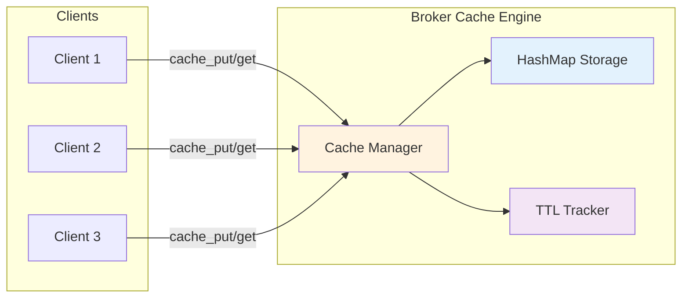
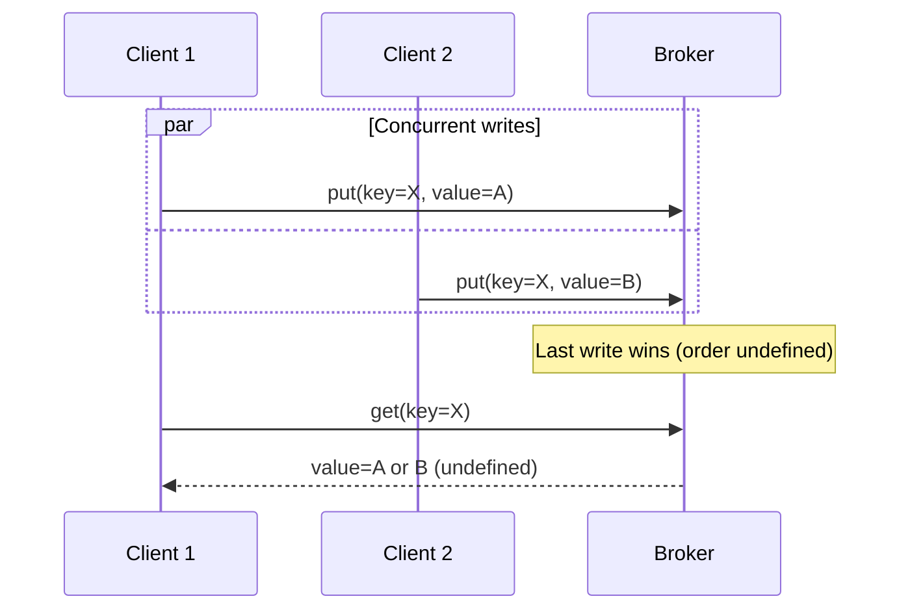

# Cache Features

Felix provides a low-latency distributed cache built on top of the same QUIC transport and wire protocol used for pub/sub. The cache is designed for session management, configuration storage, and high-concurrency read/write workloads where sub-millisecond latency matters.

## Overview

The Felix cache is:

- **Key-value store** with optional TTL (time-to-live)
- **Scoped** to `(tenant_id, namespace, cache_name, key)`
- **In-memory** for lowest latency (ephemeral in MVP)
- **Multiplexed** over pooled QUIC streams
- **Highly concurrent** with request pipelining



## Core Features

### 1. Low-Latency Operations

Felix cache is optimized for microsecond-level latency:

**Localhost performance** (concurrency=32):

| Operation | Payload | p50 Latency | p99 Latency | Throughput |
|-----------|---------|-------------|-------------|------------|
| put | 0 B | 158 µs | 350 µs | 184k ops/sec |
| put | 256 B | 179 µs | 380 µs | 155k ops/sec |
| put | 4 KB | 260 µs | 480 µs | 78k ops/sec |
| get (hit) | 256 B | 177 µs | 360 µs | 166k ops/sec |
| get (miss) | - | 165 µs | 340 µs | 179k ops/sec |

**Comparison with other systems** (approximate, localhost):

| System | get p50 | put p50 | Notes |
|--------|---------|---------|-------|
| Felix | 165 µs | 165 µs | QUIC, in-memory |
| Redis | 100 µs | 110 µs | TCP, in-memory |
| Memcached | 90 µs | 95 µs | TCP, in-memory |
| etcd | 2-5 ms | 3-8 ms | RAFT consistency |

Felix trades ~50-70 µs for QUIC's benefits (encryption, multiplexing, flow control).

### 2. Time-to-Live (TTL)

Store entries with automatic expiration:

```rust
// Store session with 1-hour TTL
client.cache_put(
    "acme",
    "prod",
    "sessions",
    "user-abc",
    session_data,
    Some(3600_000)  // 60 minutes in milliseconds
).await?;

// After 1 hour, entry automatically expires
tokio::time::sleep(Duration::from_secs(3601)).await;

// Returns None (expired)
assert_eq!(
    client.cache_get("acme", "prod", "sessions", "user-abc").await?,
    None
);
```

**TTL semantics**:

- **Countdown starts**: When `cache_put` completes
- **Expiration checking**: Lazy (on access)
- **Precision**: Best-effort, typically < 100 ms variance
- **Updates**: Each `cache_put` resets TTL

**Common TTL patterns**:

```rust
// Short-lived session (5 minutes)
client
    .cache_put("acme", "prod", "sessions", key, data, Some(300_000))
    .await?;

// Medium-lived cache (1 hour)
client
    .cache_put("acme", "prod", "user-profiles", key, data, Some(3600_000))
    .await?;

// Long-lived config (24 hours)
client
    .cache_put("acme", "prod", "config", key, data, Some(86400_000))
    .await?;

// Permanent (until restart or eviction)
client
    .cache_put("acme", "prod", "static-data", key, data, None)
    .await?;
```

### 3. Namespace Scoping

Cache entries are scoped to prevent collisions:

**Scope hierarchy**:

```
(tenant_id, namespace, cache_name, key)
```

**Example**:

```rust
// These are completely independent entries
client.cache_put_scoped("acme", "prod", "sessions", "user-123", data1, ttl).await?;
client.cache_put_scoped("acme", "staging", "sessions", "user-123", data2, ttl).await?;
client.cache_put_scoped("acme", "prod", "profiles", "user-123", data3, ttl).await?;
client.cache_put_scoped("other-tenant", "prod", "sessions", "user-123", data4, ttl).await?;
```

**Benefits**:

1. **Isolation**: Tenants can't access each other's data
2. **Organization**: Group related entries by cache name
3. **Flexibility**: Different TTLs/eviction per cache
4. **Multi-tenancy**: Safe shared infrastructure

### 4. Request Pipelining

Send multiple cache requests without waiting for responses:

```rust
use futures::future::join_all;

// Issue 10 concurrent gets
let futures = (0..10).map(|i| {
    let key = format!("key-{}", i);
    client.cache_get("acme", "prod", "config", &key)
});

// Await all responses
let results: Vec<Option<Vec<u8>>> = join_all(futures).await
    .into_iter()
    .collect::<Result<Vec<_>>>()?;
```

**Performance benefit**:

| Pattern | Latency (10 ops) | Throughput |
|---------|------------------|------------|
| Sequential | 1.7 ms | 5.9k ops/sec |
| Pipelined | 350 µs | 28.6k ops/sec |

**Pipelining works because**:

- Each request has unique `request_id`
- Broker may respond out of order
- Client correlates responses using `request_id`
- QUIC multiplexing eliminates HOL blocking

### 5. Stream Pooling

Felix uses stream pooling for high-concurrency cache workloads:

```yaml
# Client configuration
cache_conn_pool: 8              # QUIC connections
cache_streams_per_conn: 4       # Streams per connection
# Total concurrent operations: 8 × 4 = 32
```

**Why pooling matters**:

Without pooling (single stream):
- All requests serialize on one stream
- HOL blocking if any request is slow
- Limited throughput

With pooling:
- Requests distributed across streams
- Independent flow control per stream
- 10-20x throughput improvement

**Performance comparison**:

| Config | Concurrency | p50 | p99 | Throughput |
|--------|-------------|-----|-----|------------|
| 1 conn, 1 stream | 1 | 165 µs | 320 µs | 6k ops/sec |
| 4 conn, 2 streams | 8 | 170 µs | 380 µs | 45k ops/sec |
| 8 conn, 4 streams | 32 | 175 µs | 400 µs | 180k ops/sec |
| 16 conn, 8 streams | 128 | 190 µs | 480 µs | 650k ops/sec |

### 6. Consistency Model

Felix cache provides **read-your-writes** consistency:

```rust
// Put value
use bytes::Bytes;
client
    .cache_put("acme", "prod", "data", "key", Bytes::from_static(b"value-1"), None)
    .await?;

// Immediately read (same client)
assert_eq!(
    client.cache_get("acme", "prod", "data", "key").await?,
    Some(b"value-1".to_vec())
);
```

**Consistency guarantees**:

1. **Read-your-writes**: Client sees its own writes immediately
2. **Monotonic reads**: Never see older value after newer one (same session)
3. **Eventual consistency**: All clients eventually see latest value
4. **No torn writes**: Writes are atomic

**No linearizability**: Concurrent writes from different clients may see inconsistent ordering.



### 7. Eviction (MVP: Best-Effort)

**Current eviction policy**: Best-effort under memory pressure.

- No guaranteed LRU or LFU
- Eviction is opportunistic
- Applications should not rely on specific eviction order

**Planned eviction policies** (future):

```yaml
caches:
  - tenant: acme
    namespace: prod
    cache: sessions
    max_entries: 100000
    max_bytes: 1GB
    eviction_policy: lru  # or lfu, random, ttl_only
```

**Eviction strategies**:

- **LRU** (Least Recently Used): Evict oldest accessed entry
- **LFU** (Least Frequently Used): Evict least accessed entry
- **TTL-only**: Never evict, rely on expiration
- **Random**: Random eviction (fastest, good for large caches)

## API Reference

### cache_put

Store a key-value pair with optional TTL.

**Signature**:

```rust
async fn cache_put(
    &self,
    tenant_id: &str,
    namespace: &str,
    cache: &str,
    key: &str,
    value: Bytes,
    ttl_ms: Option<u64>
) -> Result<()>
```

**Parameters**:

- `tenant_id`: Tenant identifier
- `namespace`: Namespace within the tenant
- `cache`: Cache name (e.g., "sessions", "config")
- `key`: Cache key (arbitrary string)
- `value`: Value to store (binary data)
- `ttl_ms`: Optional TTL in milliseconds (None = no expiration)

**Returns**: `Ok(())` on success, error on failure

**Example**:

```rust
use bytes::Bytes;

// Store with 30-minute TTL
client.cache_put(
    "acme",
    "prod",
    "sessions",
    "session-xyz",
    Bytes::from(session_data),
    Some(1800_000)
).await?;
```

### cache_get

Retrieve a value from the cache.

**Signature**:

```rust
async fn cache_get(
    &self,
    tenant_id: &str,
    namespace: &str,
    cache: &str,
    key: &str
) -> Result<Option<Vec<u8>>>
```

**Parameters**:

- `tenant_id`: Tenant identifier
- `namespace`: Namespace within the tenant
- `cache`: Cache name
- `key`: Cache key to retrieve

**Returns**:

- `Ok(Some(value))`: Key found, value returned
- `Ok(None)`: Key not found or expired
- `Err(e)`: Operation failed

**Example**:

```rust
match client.cache_get("acme", "prod", "sessions", "session-xyz").await? {
    Some(data) => {
        let session: Session = deserialize(&data)?;
        // Use session
    }
    None => {
        return Err("Session expired or not found");
    }
}
```

## Use Cases

### 1. Session Management

Store user sessions with automatic expiration:

```rust
struct SessionStore {
    client: Arc<Client>,
}

impl SessionStore {
    async fn create_session(&self, user_id: &str) -> Result<String> {
        let session_id = generate_session_id();
        let session = Session {
            user_id: user_id.to_string(),
            created_at: Utc::now(),
            expires_at: Utc::now() + Duration::minutes(30),
        };
        
        // Store with 30-minute TTL
        use bytes::Bytes;
        self.client
            .cache_put(
                "acme",
                "prod",
                "sessions",
                &session_id,
                Bytes::from(serialize(&session)?),
                Some(1800_000),
            )
            .await?;
        
        Ok(session_id)
    }
    
    async fn get_session(&self, session_id: &str) -> Result<Option<Session>> {
        match self
            .client
            .cache_get("acme", "prod", "sessions", session_id)
            .await?
        {
            Some(data) => Ok(Some(deserialize(&data)?)),
            None => Ok(None),
        }
    }
    
    async fn extend_session(&self, session_id: &str) -> Result<()> {
        if let Some(mut session) = self.get_session(session_id).await? {
            session.expires_at = Utc::now() + Duration::minutes(30);
            use bytes::Bytes;
            self.client
                .cache_put(
                    "acme",
                    "prod",
                    "sessions",
                    session_id,
                    Bytes::from(serialize(&session)?),
                    Some(1800_000),
                )
                .await?;
        }
        Ok(())
    }
}
```

### 2. Configuration Cache

Cache application configuration with refresh:

```rust
struct ConfigCache {
    client: Arc<Client>,
}

impl ConfigCache {
    async fn get_config(&self, key: &str) -> Result<Config> {
        // Try cache first
        if let Some(data) = self
            .client
            .cache_get("acme", "prod", "config", key)
            .await?
        {
            return Ok(deserialize(&data)?);
        }
        
        // Cache miss: load from database
        let config = self.load_from_db(key).await?;
        
        // Store in cache with 1-hour TTL
        use bytes::Bytes;
        self.client
            .cache_put(
                "acme",
                "prod",
                "config",
                key,
                Bytes::from(serialize(&config)?),
                Some(3600_000),
            )
            .await?;
        
        Ok(config)
    }
    
    async fn update_config(&self, key: &str, config: &Config) -> Result<()> {
        // Update database
        self.save_to_db(key, config).await?;
        
        // Invalidate cache (put with 0 TTL or delete when available)
        use bytes::Bytes;
        self.client
            .cache_put(
                "acme",
                "prod",
                "config",
                key,
                Bytes::from(serialize(config)?),
                Some(0), // Immediate expiration
            )
            .await?;
        
        Ok(())
    }
}
```

### 3. Rate Limiting

Simple rate limiting with TTL:

```rust
struct RateLimiter {
    client: Arc<Client>,
    limit: u32,
    window_ms: u64,
}

impl RateLimiter {
    async fn check_rate_limit(&self, user_id: &str) -> Result<bool> {
        let key = format!("rate-limit:{}", user_id);
        
        // Try to get current count
        let count = match self
            .client
            .cache_get("acme", "prod", "rate-limits", &key)
            .await?
        {
            Some(data) => u32::from_be_bytes(data.try_into().unwrap()),
            None => 0,
        };
        
        if count >= self.limit {
            return Ok(false);  // Rate limit exceeded
        }
        
        // Increment count
        let new_count = count + 1;
        use bytes::Bytes;
        self.client
            .cache_put(
                "acme",
                "prod",
                "rate-limits",
                &key,
                Bytes::from(new_count.to_be_bytes()),
                Some(self.window_ms),
            )
            .await?;
        
        Ok(true)  // Allow request
    }
}
```

!!! note "Better Rate Limiting"
    For production rate limiting, atomic increment operations (planned) will avoid race conditions. Current approach is best-effort.

### 4. Temporary Data Storage

Store temporary computation results:

```rust
async fn expensive_computation(
    client: &Client,
    input: &str
) -> Result<String> {
    let cache_key = format!("computation:{}", hash(input));
    
    // Check cache
    if let Some(cached) = client
        .cache_get("acme", "prod", "temp", &cache_key)
        .await?
    {
        return Ok(String::from_utf8(cached)?);
    }
    
    // Perform computation
    let result = perform_expensive_work(input)?;
    
    // Cache for 5 minutes
    use bytes::Bytes;
    client
        .cache_put(
            "acme",
            "prod",
            "temp",
            &cache_key,
            Bytes::from(result.as_bytes().to_vec()),
            Some(300_000),
        )
        .await?;
    
    Ok(result)
}
```

## Performance Tuning

### Client Configuration

**Latency-optimized** (low concurrency):

```rust
let quinn = quinn::ClientConfig::with_platform_verifier();
let config = ClientConfig {
    cache_conn_pool: 2,
    cache_streams_per_conn: 2,
    ..ClientConfig::optimized_defaults(quinn)
};
```

**Throughput-optimized** (high concurrency):

```rust
let quinn = quinn::ClientConfig::with_platform_verifier();
let config = ClientConfig {
    cache_conn_pool: 16,
    cache_streams_per_conn: 8,
    ..ClientConfig::optimized_defaults(quinn)
};
```

### Broker Configuration

```yaml
# QUIC flow control
cache_conn_recv_window: 268435456    # 256 MiB per connection
cache_stream_recv_window: 67108864   # 64 MiB per stream
cache_send_window: 268435456         # Send window

# Capacity (future)
cache_max_entries: 10000000          # 10M entries
cache_max_bytes: 10737418240         # 10 GB
```

## Limitations and Planned Features

### Current Limitations (MVP)

1. **No persistence**: Cache is ephemeral, lost on broker restart
2. **No atomic operations**: No compare-and-swap, increment
3. **No multi-key operations**: No transactions
4. **No explicit delete**: Use TTL=0 as workaround
5. **Best-effort eviction**: No guaranteed LRU/LFU
6. **No cache invalidation broadcast**: Manual coordination needed

### Planned Features

**Atomic operations**:

```rust
// Increment counter
client.cache_increment("counters", "page-views", 1).await?;

// Compare-and-swap
client.cache_cas(
    "locks",
    "resource-a",
    expected_value,
    new_value
).await?;
```

**Watch and notify**:

```rust
// Watch for changes
let mut watch = client.cache_watch("config", "app-settings").await?;
while let Some(update) = watch.next().await {
    reload_config(update.value);
}
```

**Multi-key operations**:

```rust
// Batch get
let keys = vec!["key1", "key2", "key3"];
let values = client.cache_get_batch("data", &keys).await?;

// Transaction
client.cache_transaction()
    .put("accounts", "alice", decrease(100))
    .put("accounts", "bob", increase(100))
    .commit()
    .await?;
```

**Explicit delete**:

```rust
client.cache_delete("sessions", "expired-session").await?;
```

## Best Practices

1. **Choose appropriate TTLs**: Match data staleness tolerance
2. **Use namespaces**: Organize by data type and lifetime
3. **Handle misses gracefully**: Cache is best-effort, not guaranteed
4. **Don't cache huge values**: Keep values < 1 MB for best performance
5. **Pipeline requests**: Send multiple requests concurrently
6. **Monitor hit rates**: Track effectiveness of caching strategy
7. **Design for cache failures**: Always have fallback to source of truth

## Monitoring

**Key metrics to track**:

- Hit rate (gets that return data / total gets)
- Miss rate (gets that return None / total gets)
- Put rate (puts per second)
- Get rate (gets per second)
- Average latency (p50, p99, p999)
- Cache size (entries, bytes)
- Eviction rate

**Example monitoring** (future API):

```rust
let stats = client.cache_stats("sessions").await?;
println!("Hit rate: {:.2}%", stats.hit_rate * 100.0);
println!("Size: {} entries, {} MB", stats.entry_count, stats.size_bytes / 1_000_000);
println!("p99 get latency: {:?}", stats.get_p99);
```

!!! tip "Cache as Acceleration, Not Truth"
    Design systems to work without the cache (loading from database). Use cache purely for performance improvement. This makes failures and evictions non-critical.
