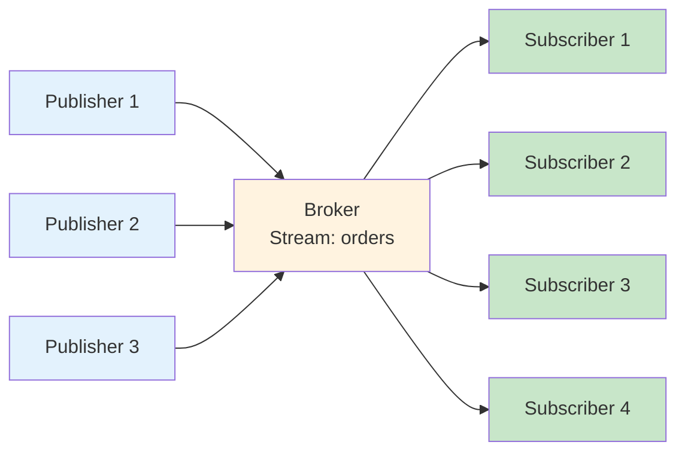
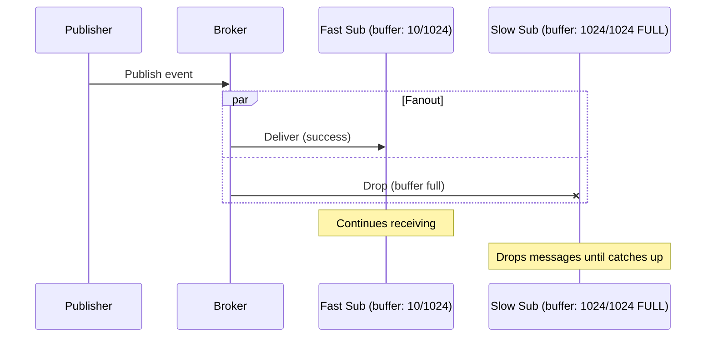
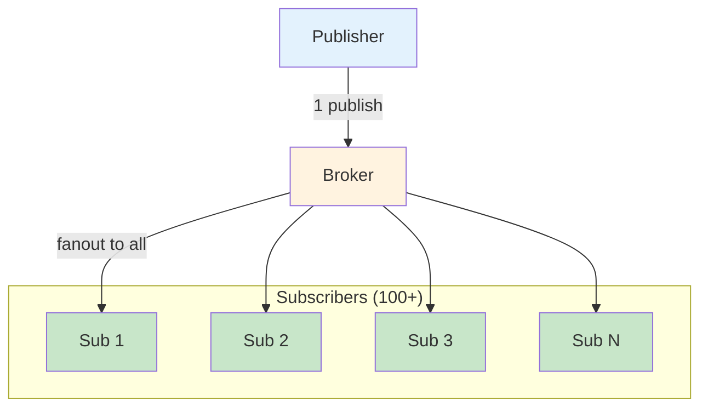

# Publish/Subscribe Features

Felix provides a high-performance publish/subscribe system designed for real-time event distribution with predictable latency, high fanout, and strong isolation guarantees. This document covers the pub/sub features, delivery semantics, batching strategies, and performance characteristics.

## Overview

Felix pub/sub is built around a simple model:

- **Publishers** send messages to **streams**
- **Subscribers** receive all messages from streams they subscribe to
- **Streams** are scoped to `(tenant_id, namespace, stream_name)`
- **Fanout** is handled efficiently by the broker



## Core Features

### 1. High Fanout

Felix excels at high-fanout workloads where one message must be delivered to many subscribers.

**Fanout efficiency**:

| Fanout | Throughput (msg/sec) | p99 Latency |
|--------|---------------------|-------------|
| 1 | 200k | 2.5 ms |
| 10 | 180k | 3.8 ms |
| 100 | 140k | 6.2 ms |
| 1000 | 85k | 12.5 ms |

**Fanout isolation**: Slow subscribers never block fast subscribers.

```rust
// Even with 1000 subscribers, adding a slow one doesn't impact others
let mut fast_sub = client.subscribe("tenant", "ns", "stream").await?;
let mut slow_sub = client.subscribe("tenant", "ns", "stream").await?;

// Fast subscriber continues at full rate
tokio::spawn(async move {
    while let Ok(Some(event)) = fast_sub.next_event().await {
        process_fast(event).await;  // ~1ms
    }
});

// Slow subscriber falls behind, drops messages (at-most-once semantics)
tokio::spawn(async move {
    while let Ok(Some(event)) = slow_sub.next_event().await {
        process_slow(event).await;  // ~100ms
    }
});
```

### 2. Message Batching

Felix supports batching at multiple levels for improved throughput.

#### Publisher-Side Batching

Batch multiple messages into a single publish operation:

```rust
// Collect messages
let mut batch = Vec::new();
for i in 0..64 {
    batch.push(format!("Event {}", i).into_bytes());
}

// Publish as batch
use felix_wire::AckMode;
let publisher = client.publisher().await?;
publisher
    .publish_batch("tenant", "ns", "stream", batch, AckMode::PerBatch)
    .await?;
```

**Throughput improvement**:

| Batch Size | Throughput vs Single | Latency |
|------------|---------------------|---------|
| 1 (single) | 1x | 150 µs |
| 8 | 4x | 180 µs |
| 32 | 12x | 250 µs |
| 64 | 18x | 350 µs |
| 128 | 22x | 600 µs |

#### Broker-Side Batching

The broker automatically batches events for delivery to subscribers:

```yaml
# Broker configuration
event_batch_max_events: 64         # Max events per batch
event_batch_max_bytes: 262144      # Max batch size (256 KB)
event_batch_max_delay_us: 250      # Max batching delay (250 µs)
```

**Batching triggers**:

Events are sent when **any** condition is met:
1. `event_batch_max_events` accumulated
2. `event_batch_max_bytes` reached
3. `event_batch_max_delay_us` elapsed since first event

**Example**:

```mermaid
gantt
    title Event Batching Timeline
    dateFormat SSS
    axisFormat %L ms
    
    section Publisher
    Publish events       :active, 000, 050
    
    section Broker
    Accumulate (250µs)   :active, 050, 300
    Flush batch          :milestone, 300, 0ms
    Deliver to subs      :active, 300, 400
```



#### Binary Batching

For maximum throughput, use binary batch encoding:

```yaml
# Broker configuration
event_single_binary_enabled: true
event_single_binary_min_bytes: 512
```

When enabled, events exceeding `event_single_binary_min_bytes` are encoded with the binary batch format, even for single events.

**Performance gain**: 30-40% throughput improvement for large payloads.

### 3. Stream Ordering

Felix guarantees ordering within a stream:

**Within-stream ordering**:

```rust
// Publisher sends in order
use felix_wire::AckMode;
let publisher = client.publisher().await?;
publisher
    .publish_batch(
        "tenant",
        "ns",
        "orders",
        vec![b"order-1".to_vec(), b"order-2".to_vec(), b"order-3".to_vec()],
        AckMode::PerBatch,
    )
    .await?;

// Subscriber receives in order
let mut sub = client.subscribe("tenant", "ns", "orders").await?;
assert_eq!(
    sub.next_event().await.unwrap().unwrap().payload,
    b"order-1"
);
assert_eq!(
    sub.next_event().await.unwrap().unwrap().payload,
    b"order-2"
);
assert_eq!(
    sub.next_event().await.unwrap().unwrap().payload,
    b"order-3"
);
```

**Across-stream ordering**: No guarantees.

```rust
// These may arrive in any relative order
use felix_wire::AckMode;
let publisher = client.publisher().await?;
publisher
    .publish("tenant", "ns", "stream-a", b"msg-a".to_vec(), AckMode::None)
    .await?;
publisher
    .publish("tenant", "ns", "stream-b", b"msg-b".to_vec(), AckMode::None)
    .await?;
```

### 4. Subscriber Isolation

Each subscription maintains independent state:

**Per-subscription buffers**:

```rust
pub struct Subscription {
    buffer: BoundedQueue<Event>,  // Isolated buffer
    event_stream: UnidirectionalStream,  // Dedicated QUIC stream
}
```

**Buffer configuration**:

```yaml
# Broker: per-subscription buffer
event_queue_depth: 1024  # Default

# Client: additional client-side buffer
event_router_max_pending: 1024  # Default
```

**Isolation behavior**:



### 5. Backpressure

Felix applies backpressure at multiple levels:

#### QUIC Flow Control

**Connection-level**:

```yaml
event_conn_recv_window: 268435456  # 256 MiB
```

When connection window exhausted:
- Broker stops sending on that connection
- Other subscriptions on other connections unaffected

**Stream-level**:

```yaml
event_stream_recv_window: 67108864  # 64 MiB
```

When stream window exhausted:
- Broker stops sending on that stream only
- Other streams continue

#### Application-Level Buffering

**Publisher queue**:

```yaml
pub_queue_depth: 1024
publish_queue_wait_timeout_ms: 2000
```

When publish queue full:
- New publishes block up to timeout
- After timeout, publish fails with error
- Indicates broker overload

**Subscriber queue**:

```yaml
event_queue_depth: 1024
```

When subscriber queue full:
- New events are dropped for that subscriber
- Other subscribers unaffected

!!! warning "At-Most-Once Semantics"
    In MVP, dropped events are not recovered. Subscribers may miss messages if they fall behind. Future: at-least-once delivery with acknowledgements.

## Delivery Semantics

### At-Most-Once (Current MVP)

Messages are delivered **zero or one time**:

**Characteristics**:
- No acknowledgements from subscribers
- No retries or redelivery
- Lowest latency
- Suitable for real-time signals, metrics, telemetry

**Message loss scenarios**:
- Subscriber falls behind buffer capacity
- Network partition
- Broker restart (ephemeral storage)

**Example use case**:

```rust
// Real-time dashboard updates where latest value matters
let mut sub = client.subscribe("tenant", "ns", "sensor-data").await?;

while let Some(event) = sub.next_event().await? {
    let reading: SensorReading = parse(event.payload)?;
    update_dashboard(reading);  // Latest value is what matters
}
```

### At-Least-Once (Planned)

Messages delivered **one or more times**:

**Planned features**:
- Subscriber acknowledgements
- Broker retries unacknowledged messages
- Requires durable storage
- Higher latency than at-most-once

**Example** (future API):

```rust
let mut sub = client.subscribe_with_acks("tenant", "ns", "orders").await?;

while let Some(event) = sub.next_event().await? {
    process_order(event.payload)?;
    event.ack().await?;  // Acknowledge processing
}
```

### Exactly-Once (Future)

Messages delivered **exactly one time** (from application perspective):

**Planned approach**:
- Idempotent producers with sequence numbers
- Broker deduplication
- Transactional coordination
- Highest latency

## Performance Tuning

### Latency-Optimized Configuration

Minimize end-to-end latency:

**Broker config**:

```yaml
# Small batches, low delays
event_batch_max_events: 8
event_batch_max_delay_us: 100
fanout_batch_size: 8

# Fast acknowledgements
ack_on_commit: true

# Minimal buffering
pub_queue_depth: 512
event_queue_depth: 512
```

**Client config**:

```rust
let quinn = quinn::ClientConfig::with_platform_verifier();
let config = ClientConfig {
    event_conn_pool: 4,
    event_router_max_pending: 256,
    ..ClientConfig::optimized_defaults(quinn)
};
```

**Expected performance**:
- p50 latency: 200-400 µs
- p99 latency: 800-1200 µs
- Throughput: 50-80k msg/sec per connection

### Throughput-Optimized Configuration

Maximize message throughput:

**Broker config**:

```yaml
# Large batches, higher delays
event_batch_max_events: 256
event_batch_max_delay_us: 2000
fanout_batch_size: 256

# Async acknowledgements
ack_on_commit: false

# Deep buffering
pub_queue_depth: 4096
event_queue_depth: 4096

# Binary mode
event_single_binary_enabled: true
event_single_binary_min_bytes: 256
```

**Client config**:

```rust
let quinn = quinn::ClientConfig::with_platform_verifier();
let config = ClientConfig {
    event_conn_pool: 16,
    publish_conn_pool: 8,
    publish_streams_per_conn: 4,
    event_router_max_pending: 4096,
    ..ClientConfig::optimized_defaults(quinn)
};
```

**Expected performance**:
- p50 latency: 1-3 ms
- p99 latency: 5-10 ms
- Throughput: 200-300k msg/sec per connection

### Balanced Configuration (Default)

General-purpose settings:

**Broker config**:

```yaml
event_batch_max_events: 64
event_batch_max_delay_us: 250
fanout_batch_size: 64
pub_queue_depth: 1024
event_queue_depth: 1024
```

**Client config**:

```rust
let quinn = quinn::ClientConfig::with_platform_verifier();
let config = ClientConfig::optimized_defaults(quinn);  // Uses balanced defaults
```

**Expected performance**:
- p50 latency: 400-800 µs
- p99 latency: 2-4 ms
- Throughput: 150-200k msg/sec per connection

## Advanced Patterns

### Fan-In (Multiple Publishers)

Multiple publishers to one stream:

```rust
use felix_wire::AckMode;
use std::net::SocketAddr;

let broker_addr: SocketAddr = "127.0.0.1:5000".parse()?;
let server_name = "localhost";

// Publisher 1
tokio::spawn(async move {
    let client = Client::connect(broker_addr, server_name, config).await?;
    let publisher = client.publisher().await?;
    loop {
        publisher
            .publish("tenant", "ns", "logs", generate_log(), AckMode::None)
            .await?;
    }
});

// Publisher 2
tokio::spawn(async move {
    let client = Client::connect(broker_addr, server_name, config).await?;
    let publisher = client.publisher().await?;
    loop {
        publisher
            .publish("tenant", "ns", "logs", generate_log(), AckMode::None)
            .await?;
    }
});

// Subscriber receives from both
let mut sub = client.subscribe("tenant", "ns", "logs").await?;
while let Some(event) = sub.next_event().await? {
    process_log(event);
}
```

**Ordering**: No cross-publisher ordering guarantees.

### Fan-Out (Multiple Subscribers)

One publisher, many subscribers:

```rust
// Single publisher
let publisher = client.publisher().await?;
for event in events {
    publisher
        .publish("tenant", "ns", "events", event, AckMode::None)
        .await?;
}

// Many subscribers
for i in 0..100 {
    let mut sub = client.subscribe("tenant", "ns", "events").await?;
    tokio::spawn(async move {
        while let Some(event) = sub.next_event().await.unwrap() {
            process(event);
        }
    });
}
```

**Isolation**: Each subscriber progresses independently.

### Broadcast Pattern

Efficiently broadcast to all subscribers:



Felix handles fanout efficiently at the broker, so one publish reaches all subscribers.

### Work Queue Pattern (Future)

Consumer groups for load distribution:

```rust
// Future API
let mut consumer = client.consume_group(
    "tenant",
    "ns",
    "jobs",
    "worker-group",  // Consumer group name
).await?;

// Messages distributed across group members
while let Some(job) = consumer.next().await {
    process_job(job).await?;
    job.ack().await?;
}
```

**Characteristics**:
- Shared cursor across group
- Each message delivered to one consumer
- Load balancing across consumers

## Monitoring and Observability

### Key Metrics

**Publish metrics**:
- Publish rate (msg/sec)
- Publish latency (p50, p99, p999)
- Publish queue depth
- Publish failures

**Subscribe metrics**:
- Subscriber count per stream
- Event delivery rate per subscriber
- Subscriber lag (events behind)
- Dropped events per subscriber

**Broker metrics**:
- Active streams
- Fanout operations per second
- Queue depths (publish, event)
- Memory usage

### Example Monitoring

```rust
// Future API (not yet implemented)
let stats = client.stream_stats("tenant", "ns", "stream").await?;
println!("Publishers: {}", stats.publisher_count);
println!("Subscribers: {}", stats.subscriber_count);
println!("Publish rate: {} msg/sec", stats.publish_rate);
println!("Total delivered: {}", stats.total_delivered);
```

## Best Practices

### Publishing

1. **Batch when possible**: 10-100x throughput improvement
2. **Use binary mode**: For payloads > 512 bytes
3. **Monitor queue depth**: High depth indicates overload
4. **Handle errors**: Implement retry logic for important messages
5. **Spread across connections**: Use connection pooling

### Subscribing

1. **Process async**: Don't block subscription loop
2. **Handle reconnection**: Auto-reconnect on connection loss
3. **Monitor lag**: Track how far behind subscriber is
4. **Size buffers appropriately**: Match processing variance
5. **Use multiple connections**: For isolation and parallelism

### Stream Design

1. **Scope appropriately**: Tenant → Namespace → Stream
2. **Partition by use case**: Separate streams for different semantics
3. **Consider fanout**: High fanout benefits from batching
4. **Plan for growth**: Monitor stream count and subscriber count

!!! tip "Start Simple"
    Begin with default configuration and measure. Tune only when you have profiling data showing a specific bottleneck.

## Comparison with Other Systems

| Feature | Felix | Kafka | Redis Pub/Sub | NATS |
|---------|-------|-------|---------------|------|
| Delivery | At-most-once (MVP) | At-least-once | At-most-once | At-most-once |
| Ordering | Per-stream | Per-partition | No | No |
| Persistence | Ephemeral (MVP) | Durable | Ephemeral | Optional |
| Fanout | Excellent | Good | Excellent | Excellent |
| Latency | 200-800 µs | 2-10 ms | 100-500 µs | 100-400 µs |
| Throughput | 150-250k/conn | 100k-1M/broker | 100-500k/conn | 100-300k/conn |
| Backpressure | Built-in (QUIC) | Client-side | None | Optional |

Felix occupies a middle ground: lower latency than Kafka, more features than Redis Pub/Sub, with QUIC's modern networking benefits.
