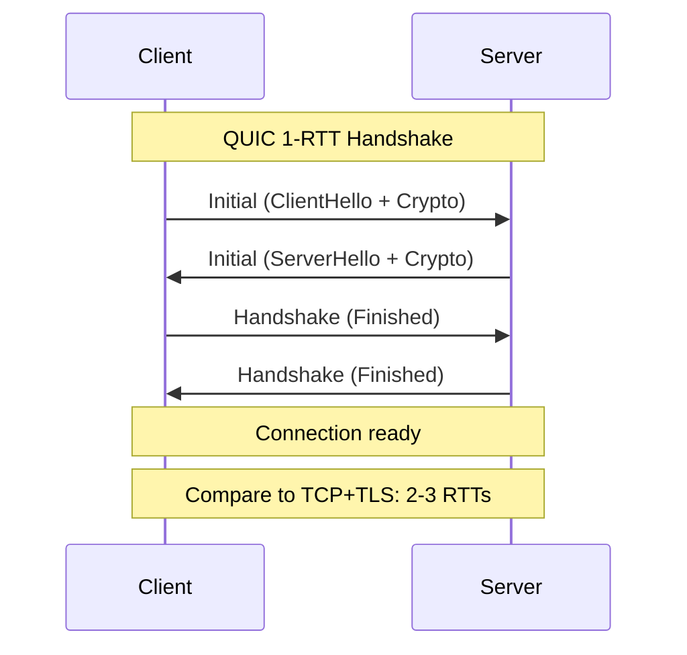
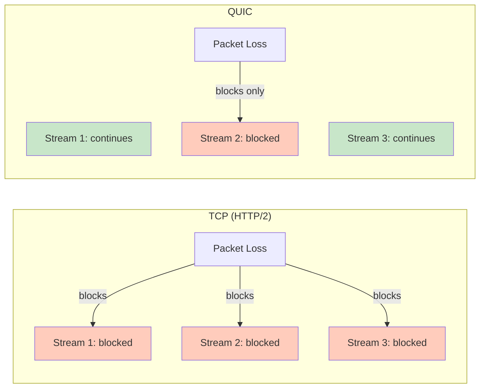
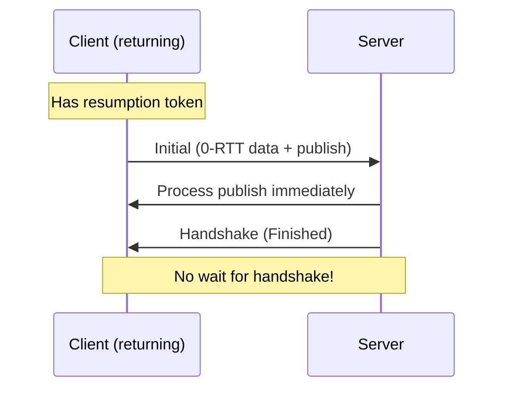
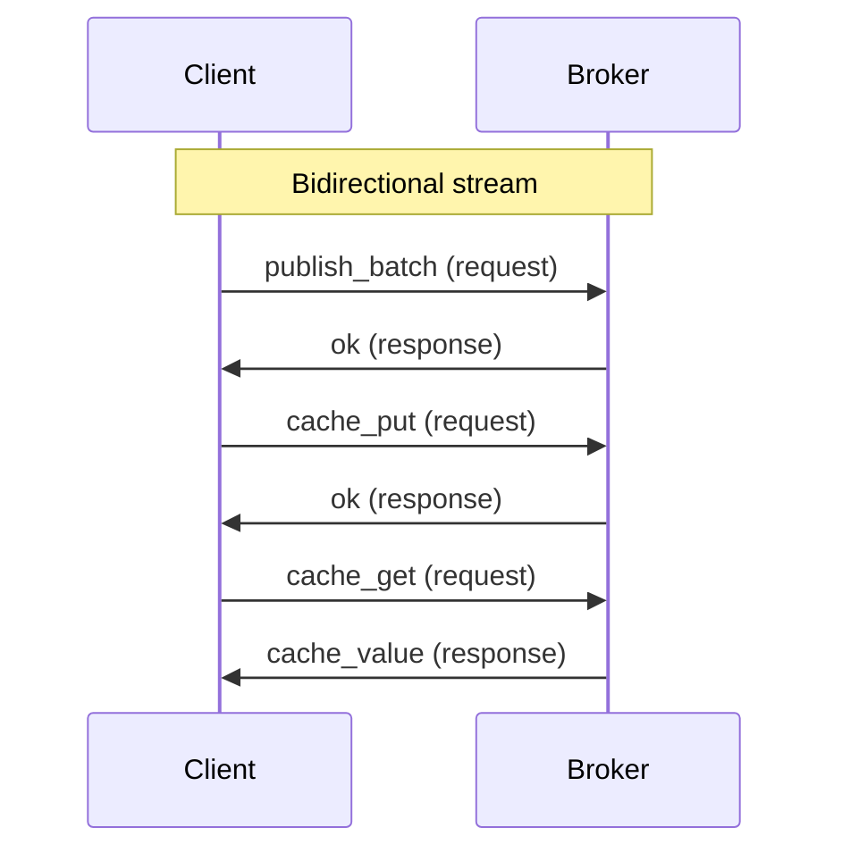
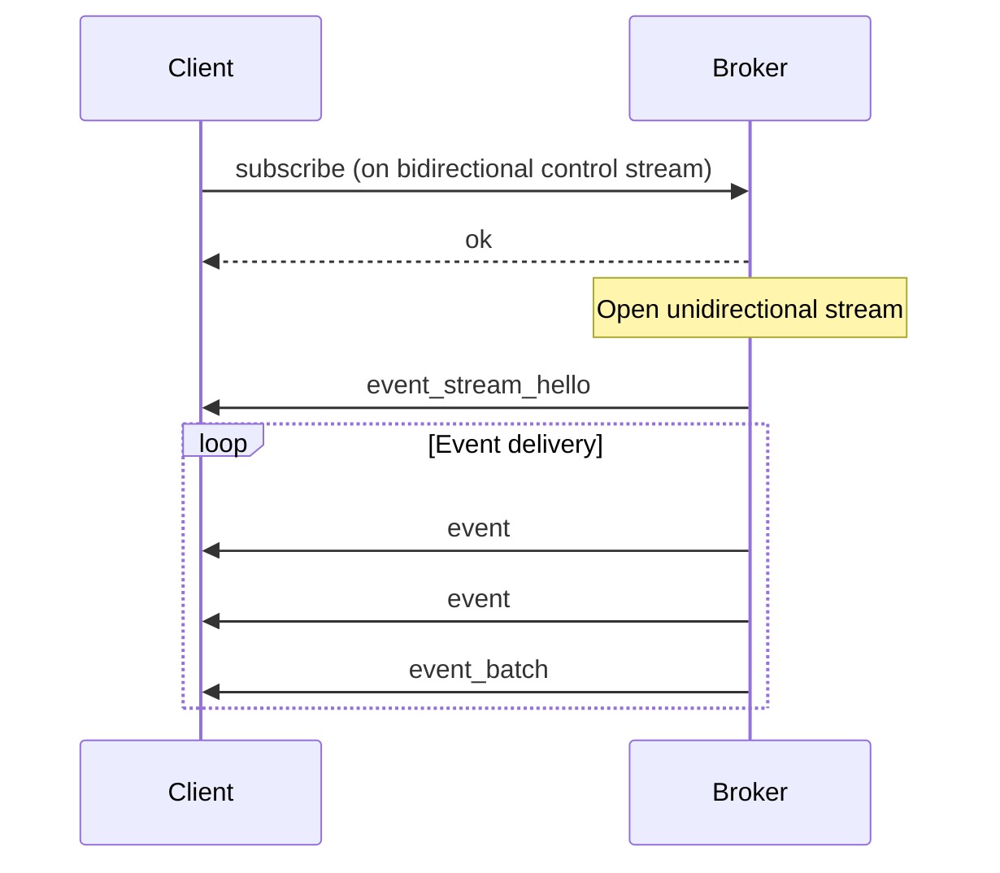

# QUIC Transport

Felix uses QUIC as its exclusive transport protocol, providing modern networking features that enable low-latency, secure, and reliable communication between clients and brokers. This document explores QUIC's features, benefits, and how Felix leverages them for optimal performance.

## Why QUIC?

QUIC (Quick UDP Internet Connections) is a modern transport protocol designed by Google and standardized as IETF RFC 9000. Felix chose QUIC over traditional TCP+TLS for several compelling reasons:

### 1. Encryption by Default

QUIC integrates TLS 1.3 directly into the protocol:

- **No unencrypted mode**: All QUIC connections are encrypted
- **Faster handshake**: 0-RTT or 1-RTT connection establishment
- **Modern cipher suites**: ChaCha20-Poly1305, AES-GCM
- **Forward secrecy**: Perfect forward secrecy built-in



### 2. Multiplexing Without Head-of-Line Blocking

Traditional TCP suffers from head-of-line (HOL) blocking: packet loss on one stream blocks all streams. QUIC eliminates this:



**Felix benefit**: Slow subscribers on one stream don't impact other subscribers' event delivery.

### 3. Connection Migration

QUIC connections survive network changes:

- IP address changes (mobile networks, VPN switches)
- Network interface changes (WiFi → cellular)
- Load balancer re-routing

**Connection ID**: Each QUIC connection has a unique identifier independent of IP/port tuple.

```rust
use felix_client::{Client, ClientConfig};
use felix_wire::AckMode;
use std::net::SocketAddr;

// QUIC connection survives IP change
let quinn = quinn::ClientConfig::with_platform_verifier();
let config = ClientConfig::optimized_defaults(quinn);
let addr: SocketAddr = "127.0.0.1:5000".parse()?;
let client = Client::connect(addr, "localhost", config).await?;
let publisher = client.publisher().await?;

// Network switches from WiFi to cellular
// Connection automatically migrates to new IP

// Publish continues without interruption
publisher
    .publish("tenant", "ns", "stream", data.to_vec(), AckMode::None)
    .await?;
```

!!! note "Future Enhancement"
    Felix will leverage connection migration for seamless client mobility and zero-downtime broker migrations.

### 4. Built-in Flow Control

QUIC provides multi-level flow control:

**Connection-level flow control**:
- Prevents receiver buffer overflow at connection level
- Configurable receive window per connection

**Stream-level flow control**:
- Independent flow control per stream
- Prevents one stream from consuming all connection capacity

**Felix configuration**:

```yaml
# Broker config
event_conn_recv_window: 268435456    # 256 MiB per connection
event_stream_recv_window: 67108864   # 64 MiB per stream
event_send_window: 268435456         # 256 MiB send window
```

### 5. Reduced Latency

**0-RTT resumption**:

For returning clients, QUIC can send application data in the first packet:



**Faster connection establishment**:

| Protocol | Handshake RTTs | TLS Version |
|----------|----------------|-------------|
| TCP + TLS 1.2 | 3 RTTs | 1.2 |
| TCP + TLS 1.3 | 2 RTTs | 1.3 |
| QUIC | 1 RTT | 1.3 (integrated) |
| QUIC (0-RTT) | 0 RTTs | 1.3 (resumption) |

## QUIC Streams in Felix

Felix leverages QUIC's stream model for different traffic patterns:

### Bidirectional Streams

Used for request/response patterns:

**Control streams**:
- Client initiates publish, subscribe, cache operations
- Server responds with acknowledgements
- Long-lived or short-lived depending on usage

**Cache streams**:
- Client sends cache_get/cache_put with request_id
- Server responds on same stream
- Multiple requests multiplexed per stream



### Unidirectional Streams

Used for one-way data flow:

**Event streams** (server → client):
- Broker opens stream after successful subscribe
- Streams events continuously
- One stream per subscription for isolation
- Client cannot send data on these streams



**Benefits of unidirectional streams**:

1. **Performance**: No reverse path overhead
2. **Isolation**: Each subscription has dedicated stream
3. **Flow control**: Independent per-subscription backpressure
4. **Simplicity**: Clear data flow direction

## Performance Characteristics

### Latency

**Connection establishment** (localhost, cold start):

| Scenario | Latency |
|----------|---------|
| First connection | 1-2 ms |
| TLS resumption | 500-800 µs |
| 0-RTT (future) | 0 µs (data in first packet) |

**Single message round-trip** (publish + ack):

| Workload | p50 | p99 |
|----------|-----|-----|
| Small payload (100B) | 150 µs | 300 µs |
| Medium payload (1KB) | 200 µs | 400 µs |
| Large payload (4KB) | 300 µs | 600 µs |

### Throughput

**Single connection throughput**:

- **Publish**: 50-100k msg/sec (single publishes)
- **Publish batch**: 150-250k msg/sec (batch=64)
- **Event delivery**: 200-300k msg/sec per subscriber
- **Cache operations**: 125-185k ops/sec

**Scaling with connection pools**:

Throughput scales nearly linearly with connection count (up to CPU/network limits):

| Connections | Publish Throughput | Event Delivery |
|-------------|-------------------|----------------|
| 1 | 150k msg/sec | 250k msg/sec |
| 4 | 580k msg/sec | 950k msg/sec |
| 8 | 1.1M msg/sec | 1.8M msg/sec |
| 16 | 2.0M msg/sec | 3.2M msg/sec |

### Packet Loss Resilience

QUIC handles packet loss better than TCP:

**TCP behavior**:
- Packet loss triggers retransmission
- All streams blocked until retransmission completes (HOL blocking)
- RTT spike affects all traffic

**QUIC behavior**:
- Packet loss only affects streams with data in lost packet
- Other streams continue normally
- Faster recovery via improved congestion control

**Measured impact** (1% packet loss, fanout=10):

| Metric | TCP + TLS | QUIC |
|--------|-----------|------|
| p50 latency | +15% | +5% |
| p99 latency | +120% | +25% |
| Throughput | -40% | -8% |

## Security Features

### Transport Layer Security

QUIC provides comprehensive transport security:

**Encryption**:
- All packets encrypted (header + payload)
- Only connection ID visible to network observers
- No plaintext data ever transmitted

**Authentication**:
- Server certificate validation (X.509)
- Optional client certificates (mTLS)
- Certificate pinning supported

**Cipher suites**:
```
TLS_AES_128_GCM_SHA256
TLS_AES_256_GCM_SHA384
TLS_CHACHA20_POLY1305_SHA256
```

### Connection Security

**Amplification attack prevention**:
- QUIC requires address validation before sending large responses
- Prevents using Felix as DDoS amplification vector

**Connection ID obfuscation**:
- Connection IDs are opaque, random identifiers
- No correlation possible from network observation

**Retry mechanism**:
- Stateless retry tokens prevent resource exhaustion
- Broker can validate clients before allocating resources

### Future Security Features

**End-to-end encryption** (planned):

```yaml
stream:
  name: sensitive-data
  encryption: end_to_end
  key_id: stream-key-v1
```

Data encrypted by publisher, broker routes ciphertext only, decrypted by subscriber.

**mTLS for broker-to-broker**:

```yaml
broker:
  mtls_enabled: true
  client_cert_path: /certs/broker.crt
  client_key_path: /certs/broker.key
```

## Configuration and Tuning

### Connection Pooling

Configure pools based on workload:

**Client configuration**:

```rust
let quinn = quinn::ClientConfig::with_platform_verifier();
let config = ClientConfig {
    event_conn_pool: 8,        // For pub/sub
    cache_conn_pool: 8,        // For cache
    publish_conn_pool: 4,      // For publishing
    ..ClientConfig::optimized_defaults(quinn)
};
```

**Tuning guidance**:

- **Light workload**: 2-4 connections per type
- **Medium workload**: 4-8 connections per type
- **Heavy workload**: 8-16 connections per type
- **Very heavy workload**: 16-32 connections per type

!!! warning "Connection Limits"
    Each connection consumes memory (buffers, state). Monitor broker memory usage when scaling connection pools. A broker can typically handle 10,000+ concurrent connections with 16 GB RAM.

### Flow Control Windows

Tune window sizes for workload characteristics:

**Latency-optimized** (minimize buffering):

```yaml
event_conn_recv_window: 67108864     # 64 MiB
event_stream_recv_window: 16777216   # 16 MiB
event_send_window: 67108864          # 64 MiB
```

**Throughput-optimized** (maximize buffers):

```yaml
event_conn_recv_window: 536870912    # 512 MiB
event_stream_recv_window: 134217728  # 128 MiB
event_send_window: 536870912         # 512 MiB
```

**Memory impact**:

```
Total memory ≈ (conn_window × conn_pool) + (stream_window × streams × conn_pool)
```

For `conn_pool=8`, `stream_window=64MB`, `streams_per_conn=10`:

```
Memory ≈ (256MB × 8) + (64MB × 10 × 8) = 2GB + 5.1GB = 7.1GB
```

### Congestion Control

QUIC uses modern congestion control algorithms:

**BBR** (Bottleneck Bandwidth and RTT):
- Default in quinn QUIC implementation
- Optimizes for throughput and latency
- Adapts to network conditions

**CUBIC**:
- Alternative congestion control
- More conservative than BBR
- Better for shared networks

!!! tip "Tuning Congestion Control"
    For dedicated networks (data center, cloud VPC), BBR provides better performance. For shared networks, CUBIC may be more friendly to competing traffic.

## Monitoring and Observability

### QUIC Metrics

Key metrics to monitor:

**Connection metrics**:
- Active connections
- Connection establishment rate
- Connection errors
- TLS handshake failures

**Stream metrics**:
- Active streams per connection
- Stream creation rate
- Stream close rate
- Stream errors

**Flow control metrics**:
- Blocked time per stream
- Window updates frequency
- Credit exhaustion events

**Packet loss metrics**:
- Loss rate
- Retransmission rate
- RTT variance

### Example Metrics Collection

```rust
// Hypothetical metrics API (not yet implemented)
let metrics = client.quic_metrics().await?;
println!("Active connections: {}", metrics.active_connections);
println!("Packet loss rate: {:.2}%", metrics.loss_rate * 100.0);
println!("Average RTT: {:?}", metrics.avg_rtt);
```

## Troubleshooting

### Common Issues

**Connection timeout**:

```
Error: Connection timeout after 5000ms
```

**Causes**:
- Network firewall blocking UDP
- Broker not listening on expected port
- Incorrect server address

**Resolution**:
- Verify UDP port 5000 is open
- Check broker is running and bound to correct interface
- Test connectivity with `netcat -u broker-ip 5000`

**TLS certificate validation failure**:

```
Error: Certificate validation failed: UnknownIssuer
```

**Causes**:
- Self-signed certificate without CA trust
- Certificate expired
- Hostname mismatch

**Resolution**:

```rust
// Production: validate certificates using the platform verifier
let quinn = quinn::ClientConfig::with_platform_verifier();
let config = ClientConfig::optimized_defaults(quinn);

// Development: configure Quinn with a test CA or custom verifier if needed
```

**Flow control deadlock**:

```
Warning: Stream blocked on flow control for >1s
```

**Causes**:
- Receiver not consuming data fast enough
- Window sizes too small for workload
- Application not reading from stream

**Resolution**:
- Increase `stream_recv_window`
- Ensure subscription loop is not blocked
- Check for application-level backpressure

## Best Practices

### Connection Management

1. **Reuse connections**: Connection establishment is expensive
2. **Pool appropriately**: Balance memory vs parallelism
3. **Monitor health**: Track connection failures and latency
4. **Handle disconnections**: Implement automatic reconnection

### Stream Management

1. **Close unused streams**: Free resources when done
2. **Avoid stream exhaustion**: QUIC has stream limits (configurable)
3. **Use unidirectional streams**: When only one-way data flow needed
4. **Multiplex on same stream**: For cache operations, reuse streams

### Security

1. **Always validate certificates**: Never skip verification in production
2. **Use strong cipher suites**: AES-256-GCM or ChaCha20-Poly1305
3. **Rotate certificates**: Before expiration
4. **Monitor for TLS errors**: May indicate security issues

### Performance

1. **Tune flow control windows**: Match your workload burst characteristics
2. **Enable 0-RTT**: For latency-sensitive resumption (when available)
3. **Use connection pooling**: Scale parallelism with multiple connections
4. **Monitor packet loss**: High loss indicates network issues

## Comparison with Other Transports

| Feature | QUIC | TCP + TLS | gRPC (HTTP/2) |
|---------|------|-----------|---------------|
| Encryption | Built-in | Separate TLS | Separate TLS |
| Multiplexing | Yes, no HOL blocking | No | Yes, but with HOL blocking |
| Connection migration | Yes | No | No |
| 0-RTT resumption | Yes | Partial (TLS 1.3) | Partial (TLS 1.3) |
| Flow control | Connection + Stream | Connection only | Connection + Stream |
| Congestion control | Modern (BBR) | CUBIC | CUBIC |
| Handshake RTTs | 1 (0 with resumption) | 2-3 | 2-3 |
| UDP firewall issues | Possible | No | No |

## Future Enhancements

### Planned QUIC Features

**Unreliable datagram extension** (RFC 9221):
- Send unreliable messages over QUIC
- Use case: Real-time gaming, video streaming
- Lower latency than reliable streams

**Multipath QUIC**:
- Use multiple network paths simultaneously
- Aggregate bandwidth
- Improve reliability

**Connection migration enhancements**:
- Seamless broker failover
- Zero-downtime client mobility

### Felix-Specific Improvements

**Adaptive flow control**:
- Automatically tune windows based on measured RTT and throughput
- Reduce configuration burden

**Quality of Service (QoS)**:
- Priority streams for critical messages
- Bandwidth allocation per tenant

**Connection affinity**:
- Route specific tenants/streams to dedicated connections
- Better isolation and resource management

!!! tip "QUIC is the Future"
    Major platforms (Google, Facebook, Cloudflare) have moved to QUIC. HTTP/3 is built on QUIC. Felix is positioned to benefit from continued QUIC ecosystem improvements.
