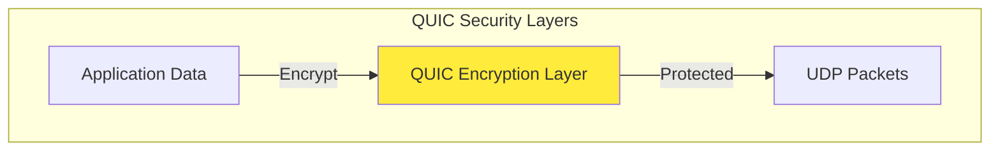
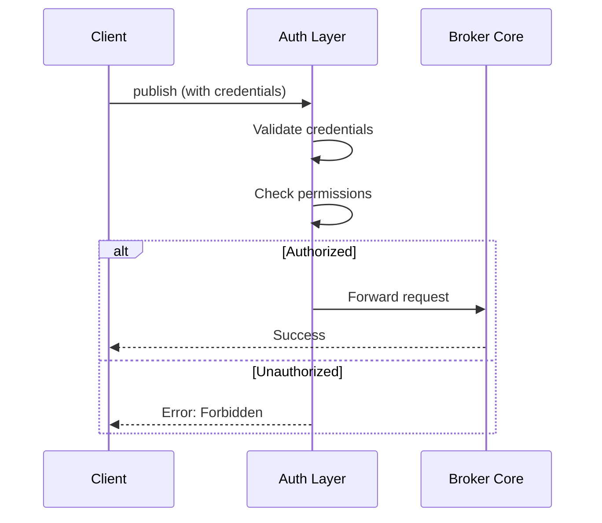
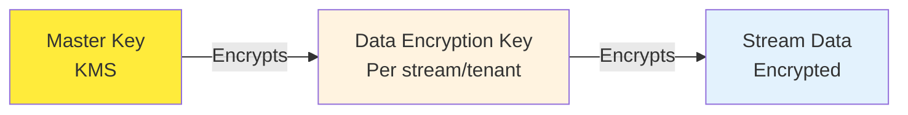
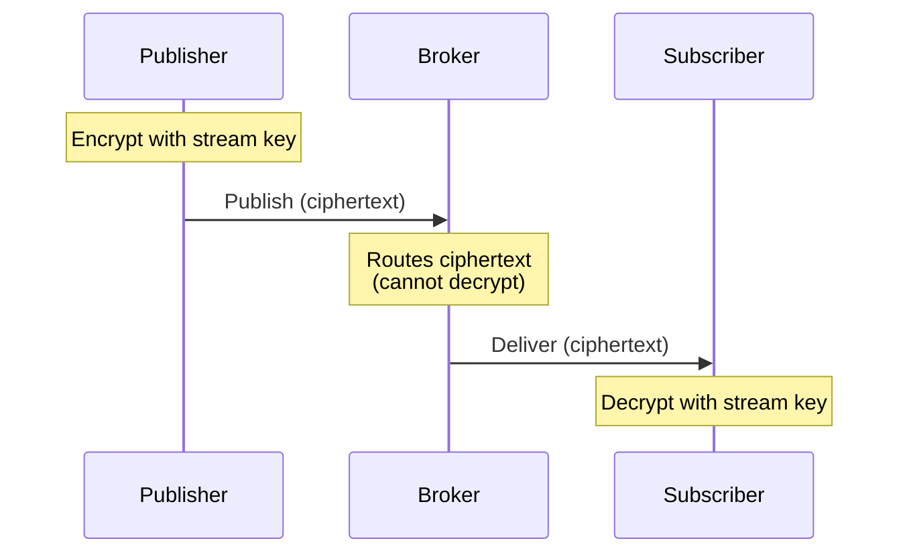

# Security Features

Felix is designed with security as a foundational principle, not an afterthought. This document covers current security features, planned enhancements, and best practices for secure deployments.

## Security Philosophy

Felix's security model is built on three pillars:

1. **Encryption by default**: All network communication is encrypted via QUIC/TLS
2. **Explicit boundaries**: Tenant isolation, namespace scoping, region boundaries
3. **Auditable operations**: All actions logged and traceable

!!! note "Security Maturity"
    Felix is in early development. Core transport security is implemented. Authorization, encryption-at-rest, and advanced features are planned. This document describes both current and planned security features.

## Transport Security

### QUIC and TLS 1.3

Felix uses QUIC, which integrates TLS 1.3 natively:

**Current implementation**:

- **TLS 1.3 mandatory**: No fallback to older TLS versions
- **Encrypted by default**: All connections are encrypted
- **Modern cipher suites**: ChaCha20-Poly1305, AES-128-GCM, AES-256-GCM
- **Perfect forward secrecy**: Ephemeral key exchange (ECDHE)
- **Certificate validation**: X.509 certificates validated by default

**Protocol security**:



### TLS Configuration

**Server-side** (broker):

```yaml
# Broker TLS config
quic_bind: "0.0.0.0:5000"
tls_cert_path: "/etc/felix/tls/server.crt"
tls_key_path: "/etc/felix/tls/server.key"
tls_ca_cert_path: "/etc/felix/tls/ca.crt"      # For mTLS (future)
```

**Client-side**:

```rust
use felix_client::ClientConfig;

// Production: validate certificates
let config = ClientConfig {
    tls_skip_verify: false,
    tls_ca_cert_path: Some("/path/to/ca.crt"),
    ..Default::default()
};

// Development only: skip validation
let config = ClientConfig {
    tls_skip_verify: true,                      // NEVER in production!
    ..Default::default()
};
```

### Certificate Management

**Generating self-signed certificates** (development):

```bash
# Generate CA
openssl req -x509 -newkey rsa:4096 -keyout ca.key -out ca.crt -days 365 -nodes \
  -subj "/CN=Felix Test CA"

# Generate server certificate
openssl req -newkey rsa:4096 -keyout server.key -out server.csr -nodes \
  -subj "/CN=broker.example.com"

openssl x509 -req -in server.csr -CA ca.crt -CAkey ca.key -CAcreateserial \
  -out server.crt -days 365

# Client trusts ca.crt
```

**Production certificates**:

Use certificates from trusted CA (Let's Encrypt, corporate PKI):

```bash
# Let's Encrypt with certbot
certbot certonly --standalone -d broker.example.com

# Felix broker config
tls_cert_path: "/etc/letsencrypt/live/broker.example.com/fullchain.pem"
tls_key_path: "/etc/letsencrypt/live/broker.example.com/privkey.pem"
```

**Certificate rotation**:

```bash
# Broker monitors certificate changes and reloads automatically (future)
# For now, restart broker after certificate renewal

# Kubernetes secret for automatic rotation
kubectl create secret tls felix-tls \
  --cert=server.crt \
  --key=server.key
```

### Mutual TLS (mTLS)

**Planned for broker-to-broker communication**:

```yaml
# Broker config
mtls_enabled: true
mtls_client_cert_path: /certs/broker-client.crt
mtls_client_key_path: /certs/broker-client.key
mtls_ca_cert_path: /certs/broker-ca.crt

# Verify peer certificates
mtls_verify_peer: true
mtls_allowed_common_names:
  - broker-1.internal
  - broker-2.internal
  - broker-3.internal
```

**Use cases**:
- Broker-to-broker replication
- Control plane to broker communication
- Cross-region bridges

## Data Isolation

### Multi-Tenancy Model

Felix enforces tenant isolation at the protocol level:

```
Scope hierarchy:
  tenant_id → namespace → stream/cache → key

Example:
  acme-corp → production → orders → order-123
```

**Isolation guarantees** (current):

1. **Wire protocol enforcement**: All operations require tenant_id
2. **Broker validation**: Unknown tenants rejected
3. **Namespace scoping**: Namespaces independent per tenant
4. **Stream isolation**: Streams cannot cross tenant boundaries
5. **Cache isolation**: Cache entries scoped to tenant

**Isolation guarantees** (planned):

1. **Resource quotas**: Per-tenant CPU, memory, bandwidth limits
2. **Rate limiting**: Per-tenant publish/subscribe rate limits
3. **Authorization**: RBAC per tenant/namespace/stream
4. **Audit logging**: All tenant operations logged

### Namespace Isolation

Within a tenant, namespaces provide further isolation:

```rust
// These are completely independent
client.publish("acme", "production", "orders", data).await?;
client.publish("acme", "staging", "orders", data).await?;
client.publish("acme", "development", "orders", data).await?;
```

**Use cases**:

- **Environment isolation**: production, staging, development
- **Team isolation**: team-a, team-b, team-c
- **Application isolation**: app-1, app-2, app-3

## Authorization (Planned)

!!! warning "Not Yet Implemented"
    Authorization is planned but not implemented in the MVP. Currently, any client with network access can perform any operation.

### Role-Based Access Control (RBAC)

**Planned authorization model**:

```yaml
apiVersion: felix.io/v1
kind: ACL
metadata:
  tenant: acme-corp
  namespace: production
spec:
  rules:
    - principal: "service-account-publisher"
      resource: "stream:orders"
      permissions:
        - publish
        
    - principal: "service-account-consumer"
      resource: "stream:orders"
      permissions:
        - subscribe
        
    - principal: "service-account-admin"
      resource: "*"
      permissions:
        - publish
        - subscribe
        - cache_read
        - cache_write
        - admin
```

### Authentication Methods

**Planned authentication mechanisms**:

1. **API keys**: Simple token-based authentication
2. **mTLS**: Certificate-based authentication
3. **JWT tokens**: OAuth2/OIDC integration
4. **Kubernetes ServiceAccounts**: Native K8s identity

**Example with API keys** (future):

```rust
let config = ClientConfig {
    api_key: Some("felix_api_key_abc123xyz".to_string()),
    ..Default::default()
};

let client = Client::connect("https://broker:5000", config).await?;
```

### Permission Model

**Resource types**:

- `stream:{name}`: Specific stream
- `stream:*`: All streams in namespace
- `cache:{name}`: Specific cache
- `cache:*`: All caches in namespace

**Permissions**:

- `publish`: Publish messages to stream
- `subscribe`: Subscribe to stream
- `cache_read`: Read from cache
- `cache_write`: Write to cache
- `admin`: Administrative operations (create/delete streams, etc.)

**Enforcement points**:



## Encryption at Rest (Planned)

**Planned encryption for durable storage**:

### Envelope Encryption

```yaml
encryption:
  enabled: true
  provider: kms                         # or local
  master_key_id: "arn:aws:kms:us-west-2:123456789012:key/abc-123"
  key_rotation_days: 90
```

**Architecture**:



**Benefits**:

- Master key never leaves KMS
- Data encryption keys rotatable
- Per-tenant or per-stream encryption
- Key audit trail in KMS

### End-to-End Encryption (Planned)

**Optional E2EE for sensitive data**:

```yaml
stream:
  name: sensitive-data
  encryption: end_to_end
  key_id: stream-key-v1
```

**E2EE flow**:



**Properties**:

- Publisher encrypts before sending
- Broker routes ciphertext (zero-knowledge)
- Subscriber decrypts after receiving
- Key management separate from broker

## Network Security

### Firewall Configuration

**Inbound rules**:

```bash
# Broker QUIC port
allow UDP 5000 from clients

# Metrics endpoint
allow TCP 8080 from monitoring

# Control plane (future)
allow TCP 9000 from control-plane

# Deny all other inbound
deny all
```

**Outbound rules**:

```bash
# Control plane sync (future)
allow TCP 9000 to control-plane

# External dependencies (KMS, etc.)
allow TCP 443 to kms.amazonaws.com

# Deny all other outbound
deny all
```

### DDoS Protection

**QUIC amplification prevention**:

QUIC includes built-in protections:

1. **Address validation**: Clients must prove IP ownership
2. **Stateless retry**: Challenge-response before resource allocation
3. **Rate limiting**: Per-source-IP connection limits

**Application-level protection**:

```yaml
# Planned DoS protection config
protection:
  max_connections_per_ip: 100
  connection_rate_limit: 10/sec
  publish_rate_limit: 1000/sec
  burst_tolerance: 2x
```

### Network Segmentation

**Kubernetes network policies**:

```yaml
apiVersion: networking.k8s.io/v1
kind: NetworkPolicy
metadata:
  name: felix-broker
spec:
  podSelector:
    matchLabels:
      app: felix-broker
  policyTypes:
    - Ingress
    - Egress
  ingress:
    - from:
        - namespaceSelector:
            matchLabels:
              name: application-namespace
      ports:
        - protocol: UDP
          port: 5000
  egress:
    - to:
        - namespaceSelector:
            matchLabels:
              name: control-plane-namespace
      ports:
        - protocol: TCP
          port: 9000
```

## Audit Logging (Planned)

**Comprehensive audit trail**:

```json
{
  "timestamp": "2026-01-15T10:30:45.123Z",
  "event_type": "stream.create",
  "principal": "admin@acme.com",
  "principal_type": "user",
  "tenant_id": "acme-corp",
  "namespace": "production",
  "resource": "stream:orders",
  "action": "create",
  "result": "success",
  "metadata": {
    "shards": 4,
    "retention": "7d"
  },
  "source_ip": "10.0.1.45",
  "user_agent": "felix-cli/0.1.0"
}
```

**Audited events**:

- Authentication attempts (success/failure)
- Authorization decisions (allow/deny)
- Resource creation/deletion
- Configuration changes
- Administrative operations
- Data access (optional, performance impact)

**Audit log storage**:

- Write-ahead append-only log
- Immutable after write
- Cryptographically signed (future)
- Long-term retention (years)
- Compliance-ready format

## Compliance Features (Planned)

### Data Residency

**Regional constraints**:

```yaml
cluster:
  region: eu-central-1
  data_residency:
    allow_cross_region: false
    allowed_regions:
      - eu-central-1
      - eu-west-1
```

**Enforcement**:

- Data never leaves configured region
- Cross-region bridges require explicit configuration
- Audit trail for any cross-region data movement

### GDPR Compliance

**Right to erasure**:

```rust
// Future API for GDPR right to erasure
client.delete_user_data("tenant", "user-id").await?;
```

**Data processing agreement**:

- Tenant controls where data is processed
- Explicit consent for cross-region bridges
- Data retention policies enforced
- Audit trail for data access

### HIPAA Compliance

**Requirements** (planned):

- ✓ Encryption in transit (TLS 1.3)
- [ ] Encryption at rest (planned)
- [ ] Access controls (RBAC planned)
- [ ] Audit logging (planned)
- [ ] Business associate agreement
- [ ] Physical security (infrastructure-dependent)

## Security Best Practices

### Deployment Security

1. **Use TLS certificates from trusted CA**: Don't use self-signed in production
2. **Enable certificate verification**: Never set `tls_skip_verify: true` in production
3. **Rotate certificates regularly**: Before expiration, ideally every 90 days
4. **Use network policies**: Restrict network access to broker
5. **Isolate broker pods**: Dedicated node pool or namespace
6. **Enable audit logging**: Track all administrative operations
7. **Monitor for anomalies**: Unusual access patterns, failed auth attempts
8. **Principle of least privilege**: Grant minimal necessary permissions
9. **Secure credential storage**: Use secrets management (Vault, K8s secrets)
10. **Regular security updates**: Keep Felix and dependencies up-to-date

### Operational Security

**Secure configuration**:

```yaml
# Good: explicit configuration
tls_cert_path: "/etc/felix/tls/server.crt"
tls_key_path: "/etc/felix/tls/server.key"
api_key_hash: "$2b$12$..."                     # Bcrypt hash, not plaintext

# Bad: insecure configuration
tls_skip_verify: true                          # NEVER
debug_mode: true                               # Not in production
log_payloads: true                             # Exposes sensitive data
```

**Secrets management**:

```bash
# Kubernetes secrets
kubectl create secret tls felix-tls \
  --cert=server.crt \
  --key=server.key

kubectl create secret generic felix-api-keys \
  --from-literal=admin-key=felix_admin_key_xxx
```

**Access control**:

```yaml
# Restrict who can deploy Felix
apiVersion: rbac.authorization.k8s.io/v1
kind: RoleBinding
metadata:
  name: felix-deployers
subjects:
  - kind: User
    name: ops-team@acme.com
roleRef:
  kind: Role
  name: felix-deployer
  apiGroup: rbac.authorization.k8s.io
```

### Application Security

**Client-side security**:

```rust
// 1. Validate broker certificate
let config = ClientConfig {
    tls_ca_cert_path: Some("/etc/ca-bundle.crt"),
    ..Default::default()
};

// 2. Use credentials
let config = ClientConfig {
    api_key: Some(env::var("FELIX_API_KEY")?),
    ..Default::default()
};

// 3. Handle errors securely
match client.publish("tenant", "ns", "stream", data).await {
    Ok(()) => {},
    Err(e) => {
        // Don't log sensitive data in errors
        error!("Publish failed: {}", e);
        // Sanitize error before returning to user
        return Err("Publish failed");
    }
}

// 4. Don't log credentials or sensitive payloads
// Bad:
info!("Publishing: api_key={}, payload={:?}", api_key, data);

// Good:
info!("Publishing to stream={}", stream_name);
```

## Vulnerability Disclosure

**Security issues**: Report to `security@felix.example.com` (update with actual contact)

**PGP key**: [Link to PGP key for encrypted communication]

**Response timeline**:

- Acknowledgement: Within 24 hours
- Initial assessment: Within 72 hours
- Resolution target: Within 30 days for critical issues

**CVE process**: Security vulnerabilities will be assigned CVE identifiers and published after fixes are available.

## Security Roadmap

**Short-term** (next 6 months):

- [ ] Authorization framework (RBAC)
- [ ] API key authentication
- [ ] Audit logging
- [ ] Per-tenant rate limiting

**Medium-term** (6-12 months):

- [ ] Encryption at rest
- [ ] JWT/OIDC integration
- [ ] mTLS for broker-to-broker
- [ ] Advanced audit features

**Long-term** (12+ months):

- [ ] End-to-end encryption
- [ ] Hardware security module (HSM) integration
- [ ] FIPS 140-2 compliance
- [ ] Security certification (SOC 2, ISO 27001)

## Threat Model

**Threats Felix protects against**:

- ✓ **Eavesdropping**: TLS 1.3 encryption
- ✓ **Man-in-the-middle**: Certificate validation
- ✓ **Connection hijacking**: QUIC connection IDs
- ✓ **Replay attacks**: TLS 1.3 anti-replay
- [ ] **Unauthorized access**: Authorization (planned)
- [ ] **Data tampering**: Integrity checks (planned)
- [ ] **Denial of service**: Rate limiting (planned)

**Threats outside Felix's scope**:

- Physical security (infrastructure responsibility)
- Client-side malware
- Social engineering
- DNS hijacking (use DNSSEC)
- BGP hijacking (infrastructure)

## Security Contacts and Resources

**Security team**: `security@felix.example.com`  
**Bug bounty**: (Planned)  
**Security advisories**: [GitHub Security Advisories](https://github.com/gabloe/felix/security/advisories)  
**Security policy**: [SECURITY.md](https://github.com/gabloe/felix/blob/main/SECURITY.md)

!!! tip "Security is Shared Responsibility"
    Felix provides security features, but secure deployments require proper configuration, network security, access controls, and operational practices. Review this guide regularly and apply defense-in-depth principles.
