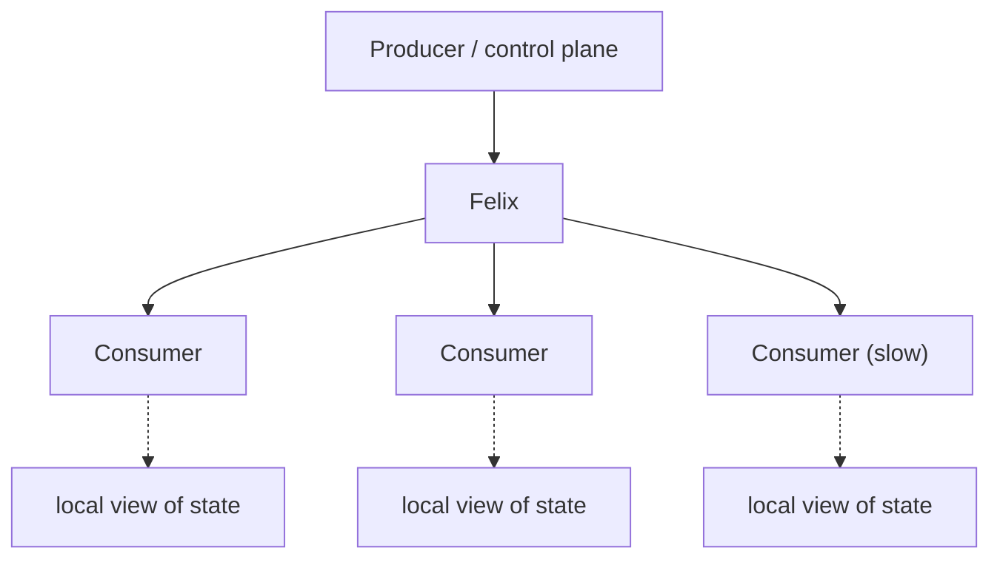

# What Felix Is For

!!! warning "Read this as two documents"
    Felix is in early active development. This page separates **what Felix does
    today** from **what Felix is being built to become**. Every capability below
    carries a status marker. Nothing marked *Target* should be relied on, planned
    around as if it exists, or claimed externally.

    - ✅ **Today** — implemented, tested, and measurable in the current build.
    - 🚧 **Partial** — a real implementation exists but is incomplete or not wired end to end.
    - 🎯 **Target** — intended design. Not implemented. May change.

!!! note "Maintenance"
    **Status markers last verified against the code on 2026-08-09.** This page
    goes stale the moment a 🎯 row lands, and stale status markers are worse than
    no status markers — a reader who catches one wrong row stops trusting the
    other twenty. Treat updating it as part of shipping any capability listed
    here. There is precedent for drift: `docs/semantics.md` claimed authorization
    was unimplemented well after it was enforced on the control stream.

    ✅ and 🚧 rows were confirmed by reading the implementation. "Not started"
    on 🎯 rows means no implementation was found, which is a weaker check.

## The one-sentence answer

**Today:** Felix is a single-node, QUIC-based pub/sub and cache system optimized
for high-fanout delivery with predictable tail latency and strict slow-consumer
isolation.

The slow-consumer isolation half of that sentence is runnable:
[`task demo:slow-consumer`](../demos/slow-consumer-isolation.md) stalls one
consumer and measures what happens to the others, under both queue policies.

**Target:** Felix is a distributed data plane offering coordination-store watch
semantics — read the current value, then receive every subsequent change with no
gap — at messaging-system fanout and throughput. The point of that combination is
keeping large populations of services, agents, and edge nodes synchronized with
rapidly changing state.

The gap between those two sentences is the roadmap. The rest of this page makes
that gap explicit.

---

## 1. The problem Felix is aimed at

Many distributed systems need a large number of independent processes to agree on
the same continuously changing state — configuration, policy, routing tables,
task assignments, cluster membership, device state.

The common implementation stitches together several systems: a database for the
authoritative value, Redis for fast reads, Kafka or RabbitMQ for change events,
WebSockets or polling to reach the consumers. Each one solves part of the problem
with different semantics, different failure modes, and no shared consistency
story between them.

Felix's thesis is that this class of workload deserves a single coherent
abstraction: **current state, the stream of changes to it, and the transport that
distributes both.**

Concretely, the traffic looks like a namespace of small, frequently-changing
values with a change feed beside each one:

```text
config/current              # the authoritative value
config/changes              # the deltas since
routing/table
policy/authz
cluster/membership
device/{id}/state
agent/{id}/tasks
agent/{id}/events
```

carrying events like `certificate rotated`, `node joined`, `route changed`,
`policy updated`, `feature enabled`, `task assigned`, `run cancelled`. The
defining property is that each consumer needs to end up holding an accurate local
copy — not merely to observe that something happened.



That is the target. What exists today is the transport and fanout layer
underneath it.

### Why not etcd, Consul, or ZooKeeper?

This is the first question the thesis has to survive, because "current value plus
every subsequent change, gap-free" is not a new idea. etcd's watch does exactly
this — read at a revision, watch from that revision — and Kubernetes is built on
it. Consul and ZooKeeper have watches. NATS JetStream's KV store has watch.
Kafka's stream-table duality is the same concept applied to a log. Anyone
evaluating Felix will reach for one of these first, and for many workloads they
should.

The gap Felix is aimed at is not the semantics. It is the scale those semantics
are available at. Coordination stores are consistency-first: they run a
consensus quorum over a comparatively small dataset, and they trade write
throughput and watch fanout to get correctness. etcd is a well-known example —
the Kubernetes apiserver maintains its own watch cache in front of etcd in large
part because etcd cannot serve that many watchers directly. When people need
watch semantics at high fanout, they build a fanout tier in front of the
coordination store.

Felix's bet is that this tier should be a system rather than a bespoke component
rebuilt per deployment: **watch semantics as a first-class primitive on
infrastructure designed for fanout and throughput from the start, rather than
bolted in front of a quorum store.**

That bet is unproven, and it is the load-bearing claim of this entire document.
It fails if coordination stores turn out to be fast enough for most real
workloads, or if the consistency Felix gives up to get fanout turns out to be the
part that mattered. Both are live possibilities.

---

## 2. What Felix does today

These are shipped and measured. If you need one of these, Felix is usable now.

| Capability | Status | Notes |
|---|---|---|
| QUIC transport, TLS 1.3 always on | ✅ Today | Multiplexed streams, no head-of-line blocking, tuned path-MTU/cwnd/socket buffers |
| Publish / subscribe with high fanout | ✅ Today | Shared-frame fanout encodes a publish batch once regardless of subscriber count |
| Batched publish and batched delivery | ✅ Today | Count- and time-bounded, JSON or binary framing |
| Bounded per-subscriber queues | ✅ Today | Explicit depth limits at every stage |
| Slow-consumer isolation | ✅ Today | `Block`, `DropNew` (default), `DropOld` — see [`SubQueuePolicy`](../reference/configuration.md) |
| Key/value cache with TTL | ✅ Today | Scoped `(tenant, namespace, cache, key)`, lazy expiry, best-effort eviction |
| Multi-tenant scoping | ✅ Today | Tenant and namespace required on all data-plane operations |
| Token-based authorization | ✅ Today | OIDC token exchange, tenant-scoped JWTs, broker-side permission checks on publish/subscribe/cache |
| Control plane metadata service | ✅ Today | REST + OpenAPI, tenant/namespace/stream/cache CRUD, snapshot and changes feeds, in-memory or Postgres backing |
| Prometheus metrics, health endpoints | ✅ Today | Plus opt-in `telemetry` feature for per-stage timings |
| Graceful shutdown | 🚧 Partial | Readiness flip, bounded drain, and accept-loop cancellation done; per-subsystem cancellation still open |
| Sharding | 🚧 Partial | Streams carry a shard count; ops are not yet directed to a shard leader |

### Measured performance

Single host, loopback, release build, TLS 1.3 on, defaults, zero delivery drops:

- **Latency (batch = 1, per-message ack):** p50 82–128 µs, p999 175–329 µs at
  fanout 1 across 0 B–1 KiB payloads.
- **Throughput (batch = 64, lossless):** up to 2.92 M deliveries/s for 0 B at
  fanout 10; ~1.57 M/s at 1 KiB × fanout 10; ~2.3 GB/s of payload at 4 KiB ×
  fanout 10 on Linux.

Full methodology and per-platform tables are in [Benchmarks](../features/benchmarks.md).
These are **single-node loopback numbers at fanout ≤ 10**. They are not evidence
for behavior at thousands of subscribers or across a network.

### Delivery semantics today

- **At-most-once.** No redelivery, no publisher-visible confirmation that a
  subscriber received anything.
- **Per-stream ordering** preserved for a given subscriber. No ordering across streams.
- **Tail-only subscriptions.** A subscriber receives events published after it
  subscribes. There is no offset, cursor, or replay parameter on `Subscribe`.
- **Slow subscribers drop** under the default policy, and lag is surfaced to the
  subscriber. Publishers never block on subscriber speed.
- **In-memory only.** Nothing survives broker restart.

---

## 3. What Felix is being built to become

None of the following exists today. It is listed so the intent is legible, not so
it can be planned around.

| Capability | Status | Current state of the code |
|---|---|---|
| Log-backed cache (one core log, many semantics) | 🎯 Target | Cache is a separate storage handle, not a projection over the stream log |
| Gap-free "current state + subsequent changes" subscribe | 🎯 Target | `Subscribe` has no snapshot or offset parameter |
| Queue semantics (consumer groups, acks, redelivery) | 🎯 Target | Explicitly post-MVP; not started |
| Durable streams and replay | 🎯 Target | Storage traits and a durable-log sketch exist; no durable data-plane backend |
| Tiered / cold storage | 🎯 Target | `TieredStore` trait declared, no implementation |
| Multi-node clustering and replication | 🎯 Target | Not started |
| Raft consensus for cluster metadata | 🎯 Target | `felix-consensus` is a configuration struct with no protocol implementation |
| Cross-region routing and data sovereignty enforcement | 🎯 Target | `felix-router` is a directional region-pair allowlist, not wired into enforcement |
| Resumable subscriptions after disconnect | 🎯 Target | Not started |
| At-least-once / quorum acks | 🎯 Target | Not started |
| Non-Rust client SDKs | 🎯 Target | Rust client only |

**Target scale**, stated as ambition and nothing more: a single update fanning out
to tens of thousands of subscribers across a multi-node cluster. Measured fanout
today is 10, on loopback, single-node. There is no benchmark, model, or
napkin-math projection behind the target figure yet — treat the gap between 10
and "tens of thousands" as unexplored engineering, not as a scaling curve someone
has already validated.

The target architecture is described in full in
[Design](https://github.com/gabloe/felix/blob/main/docs/design.md) and
[System Design](../architecture/system-design.md).

---

## 4. Workload fit

Two separate questions, deliberately kept apart. "Fits the architecture" is about
whether the workload matches where Felix is going. "Usable today" is about
whether you could build it on the current release.

| Workload | Fits the architecture | Usable today | Why |
|---|---|---|---|
| High-fanout real-time event distribution | Strong | **Yes** | Fanout, isolation, and tail latency are the shipped strengths |
| Live operational dashboards, telemetry feeds | Strong | **Yes** | Tolerant of at-most-once and of loss under lag |
| Ephemeral coordination between services | Strong | **Yes** | Low-latency, no durability needed |
| Internal service event bus | Moderate | Mostly | Works, but NATS and RabbitMQ serve this well already — weak differentiation |
| Distributed live-state synchronization | Strong | **No** | Needs gap-free snapshot + change stream; drops corrupt local state |
| Infrastructure / control-plane state distribution | Strong | **No** | Same gap, plus needs multi-node |
| AI-agent coordination and shared state | Strong | Partly | Ephemeral coordination works now; durable task state does not |
| Edge and disconnected operation | Strong | **No** | Needs durability, resumable subscriptions, and replication — none exist |
| Durable event log, replay, event sourcing | Weak | No | Use Kafka |
| Primary datastore | Weak | No | Use a database |
| General-purpose key-value store | Weak | No | Use Redis or Valkey |
| Complex broker routing, workflow messaging | Weak | No | Use RabbitMQ |
| Strongly-consistent coordination, leader election, locks | Weak | No | Use etcd, Consul, or ZooKeeper |

Read the two columns together and the current position is uncomfortable but
worth stating plainly: **the workloads Felix is differentiated for are the ones
it cannot serve yet, and the workloads it serves today are ones several mature
systems already serve well.** That is a normal place for an early project to be.
It is not a place to make strong adoption claims from.

### What the target workloads actually carry

The four "Strong fit, not usable today" rows are the ones the architecture is
being aimed at. What each moves:

- **Infrastructure and control planes** — distributed configuration, feature
  flags, service discovery, routing tables, authorization policy, deployment
  state, cluster membership, certificate rotation. Kubernetes control planes,
  service meshes, fleet management, private and hybrid cloud. The traffic is
  live infrastructure state, not durable business events.
- **Agent fleets** — task assignments and status, tool results, model
  configuration, resource availability, cancellation signals, intermediate
  results, shared scratch state. Attractive because agent systems naturally
  produce many concurrent producers and consumers, high event rates, fanout,
  ephemeral data, and wildly heterogeneous consumer speeds — close to Felix's
  intended operating point.
- **Edge and device fleets** — site- and device-level state pushed outward
  rather than polled inward, under intermittent connectivity, constrained
  bandwidth, and high latency. The model is that the edge holds a local copy and
  reconciles when a link returns. This is the furthest from what exists today.
- **High-fanout real-time data** — dashboards, telemetry, IoT, multiplayer and
  collaborative applications, live-event and market-data-style feeds. This one
  is largely usable now, because it tolerates loss.

### The open design question

The state-synchronization thesis and the current delivery semantics are in real
tension, and it has not been resolved.

For an event feed, a dropped message means a consumer missed one update. For a
consumer maintaining a local copy of state, a dropped message means its local
copy is **permanently wrong** with no signal that would let it recover on its
own. At-most-once delivery plus `DropNew` is a correct design for the first case
and an incorrect one for the second.

Closing this requires at least one of: gap-free snapshot-plus-stream subscribe,
resumable subscriptions with a durable log behind them, or an explicit
resynchronization protocol triggered by the lag signal subscribers already
receive. Until one of those lands, "distributed live-state synchronization" is a
direction, not a supported use case.

---

## 5. What Felix is deliberately not

Felix should not be positioned against any of these, now or later.

- **Not a Kafka replacement.** Kafka is excellent at durable event history,
  long-term retention, replay, and data integration. Felix's eventual durability
  is meant to serve live distribution, not to compete on retention.
- **Not a Redis replacement.** Cache semantics in Felix exist as part of a
  state-distribution model, not as a general-purpose data-structure server.
- **Not a RabbitMQ replacement.** Elaborate routing topologies and traditional
  enterprise queueing are not the differentiator.
- **Not a database.** Felix is not the system of record.
- **Not a NATS competitor on general-purpose messaging.** NATS is fast, mature,
  broadly deployed, and already covers general high-performance pub/sub — with
  JetStream and its KV store overlapping parts of Felix's target surface. This
  is the closest neighbor, and "we are like NATS but faster" is not a position.
- **Not "a faster message broker."** That is a crowded category and the claim
  would rest on single-node loopback numbers.

Likewise, "Rust" and "QUIC" are implementation choices, not the value
proposition — though QUIC is load-bearing for the eventual edge story
(connection migration, 0-RTT resumption, no head-of-line blocking).

### Where that leaves Felix

Stated positively, rather than as a list of things Felix is not:

| System | Owns |
|---|---|
| Databases | Storing authoritative state |
| Kafka | Durable event history and replay |
| Redis / Valkey | Fast data structures and caching |
| RabbitMQ | Traditional broker routing and workflow queueing |
| NATS | General-purpose high-performance messaging |
| etcd / Consul / ZooKeeper | Strongly-consistent coordination and watch, at modest scale |
| **Felix (target)** | **Watch semantics at fanout and throughput coordination stores don't reach** |

The nearest neighbour is the coordination-store row, not the messaging rows —
see [Why not etcd, Consul, or ZooKeeper?](#why-not-etcd-consul-or-zookeeper) for
the argument and its failure modes. Felix becomes credible against it only once
the snapshot-plus-stream primitive exists, the multi-node story is real, and
fanout has been measured somewhere well past 10.

---

## 6. How to decide whether Felix fits you

Felix is a strong fit today if your workload has most of these:

- one producer or few producers, many consumers;
- updates that matter in milliseconds, not seconds;
- consumers that run at genuinely different speeds, where one slow consumer must
  not affect the others;
- data that is fine to lose on restart;
- tolerance for at-most-once delivery.

Felix is a strong fit for the **target** architecture, but not yet usable, if you
additionally need durability, replay, multi-node operation, or consumers that
must reconstruct state after a disconnect.

Felix is the wrong tool if you need durable history, transactional guarantees,
exactly-once processing, or a mature multi-language ecosystem.

---

## 7. Why this framing, and not a broader one

One reason to organize the project around this specific question — *how do you
keep a large distributed population synchronized with rapidly changing state?* —
is that the requirements it generates are the ones Felix has been building
anyway, on both sides of the today/target line:

- shipped because the thesis demands them: high-performance transport, persistent
  connections, efficient serialization, encode-once fanout, bounded subscriber
  queues, slow-consumer isolation;
- targeted because the thesis demands them: snapshot-plus-change subscriptions,
  durability, replication, resumable subscriptions, edge operation.

A generic message broker would not obviously need the first group and would not
prioritize the second in that order. The framing is worth adopting because it
explains and constrains the roadmap — not merely because it sounds more specific
than "message broker."

---

## See also

- [Overview](overview.md) — component-level tour
- [Semantics](../architecture/semantics.md) — the precise behavioral contract
- [Benchmarks](../features/benchmarks.md) — methodology and current numbers
- [Design](https://github.com/gabloe/felix/blob/main/docs/design.md) — full target architecture
