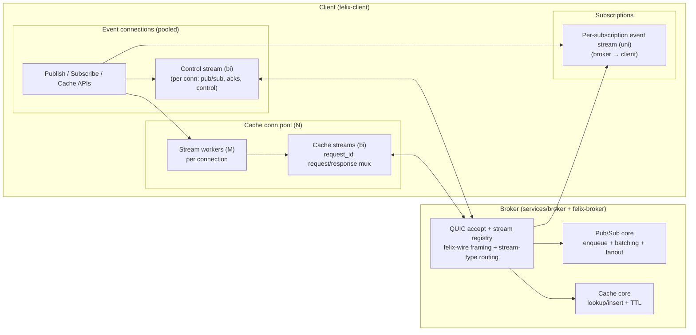

# Felix

<p align="center">
  
</p>

<p align="center">
  <a href="https://github.com/gabloe/felix/actions/workflows/ci.yml">
    
  </a>
  <a href="https://github.com/gabloe/felix/actions/workflows/coverage.yml">
    
  </a>
  <a href="https://github.com/gabloe/felix/blob/main/LICENSE">
    
  </a>
  <a href="https://www.rust-lang.org/">
    
  </a>
</p>

---

## Low-Latency QUIC-Based Pub/Sub and Distributed Cache

Felix is a **sovereign-first**, **low-latency** distributed data backend that unifies event streaming, message-oriented middleware, and distributed caching over a single QUIC-based transport layer.

!!! warning "Early Development"
    Felix is in **early active development**. The design and implementation are evolving quickly. This documentation reflects the current state and planned architecture.

## Why Felix?

### 🚀 Low Tail Latency
Designed for predictable p99/p999 latency under load, not just aggregate throughput. QUIC transport provides multiplexed streams without head-of-line blocking, and explicit backpressure prevents cascade failures.

### 🔒 Sovereignty by Default
Each Felix cluster represents a single sovereign region. Data is isolated by default and cannot leave the region unless an explicit bridge is configured—enforced in routing, metadata, and encryption boundaries.

### 🎯 Unified Primitives
A single core log abstraction supports multiple semantics:

- **Streams (Pub/Sub):** fanout cursors per subscription
- **Queues:** shared consumer-group cursors with acknowledgements  
- **Cache:** key → value with TTL, backed by the same log

This drastically reduces operational complexity compared to running Kafka, Redis, and a queueing system side-by-side.

### ⚡ QUIC Transport
Built on QUIC from the ground up:

- Encrypted by default (TLS 1.3)
- Multiplexed streams per connection
- Built-in flow control and congestion awareness
- Resistant to head-of-line blocking

### 🎛️ Tunable Performance
Extensive configuration knobs for latency/throughput trade-offs:

- Connection pooling and stream multiplexing
- Configurable batching with time and count bounds
- Flow control window sizing
- Optional telemetry for detailed performance insights

## How It Works

Felix uses a framed protocol (`felix-wire`) over QUIC streams to unify event streaming and request/response caching, with explicit control over multiplexing, batching, and flow control.



### Pub/Sub Data Flow

1. Client opens a bidirectional control stream to publish/subscribe and receive acknowledgements
2. Broker validates scope, enqueues publish jobs, and fans out to subscribers
3. Each subscription has a dedicated unidirectional event stream for delivery
4. Events are sent as single frames or binary batches with configurable batching

### Cache Data Flow

1. Client maintains a cache connection pool with long-lived stream workers
2. Cache requests carry a `request_id` and are multiplexed over these streams
3. Broker processes request frames in a read loop and replies on the same stream
4. This avoids per-request stream setup costs and improves tail latency under concurrency

## Key Features

- **QUIC Transport:** Modern, multiplexed, encrypted transport layer
- **High Fanout:** Efficient event delivery to many subscribers with isolation
- **Connection Pooling:** Reusable connections and streams for optimal performance
- **Batch Processing:** Time and count-bounded batching for throughput optimization
- **TTL Support:** Time-to-live for cache entries with lazy expiration
- **Backpressure:** Explicit flow control to prevent cascade failures
- **Metrics:** Prometheus-compatible metrics endpoint (planned)
- **Observability:** Structured logging with optional per-stage telemetry

## Use Cases

✅ **Real-time streaming** with high fanout and tunable latency/throughput trade-offs  
✅ **Event pipelines** with batch publishing and batch delivery for efficient fanout  
✅ **Low-latency caching** over QUIC with predictable tail latency under load  
✅ **Microservice communication** with unified pub/sub and cache semantics  
✅ **Edge-to-cloud data pipelines** with explicit regional isolation  

## Current Status

The current implementation provides a **single-node MVP** with:

- ✅ Single-node broker
- ✅ In-process pub/sub with fanout
- ✅ Ephemeral cache with TTL
- ✅ Stable wire envelope (v1)
- ✅ Basic observability (structured logs)
- ✅ Comprehensive test coverage

### Roadmap

- 🚧 Durable log and retention policies
- 🚧 Metadata and control plane with RAFT consensus
- 🚧 Multi-node clustering with shard placement
- 🚧 Cross-region bridges with explicit data movement
- 🚧 Security hardening (mTLS, RBAC, end-to-end encryption)
- 🚧 Additional language clients (Python, Go)

## Quick Start

Get started with Felix in minutes:

```bash
# Clone the repository
git clone https://github.com/gabloe/felix.git
cd felix

# Build the workspace
cargo build --workspace --release

# Run the broker (optional for demos)
cargo run --release -p broker

# Run a demo (self-contained)
cargo run --release -p broker --bin pubsub-demo-simple
cargo run --release -p broker --bin cache-demo
cargo run --release -p broker --bin latency-demo
cargo run --release -p broker --bin pubsub-demo-notifications
cargo run --release -p broker --bin pubsub-demo-orders
```

See the [Demos Overview](demos/overview.md) or the [Quickstart Guide](getting-started/quickstart.md) for detailed instructions.

## Community & Support

- **GitHub:** [gabloe/felix](https://github.com/gabloe/felix)
- **Issues:** [Report bugs or request features](https://github.com/gabloe/felix/issues)
- **License:** [Apache 2.0](https://github.com/gabloe/felix/blob/main/LICENSE)

---

**Ready to dive in?** Start with the [Overview](getting-started/overview.md) or jump straight to the [Quickstart Guide](getting-started/quickstart.md).
