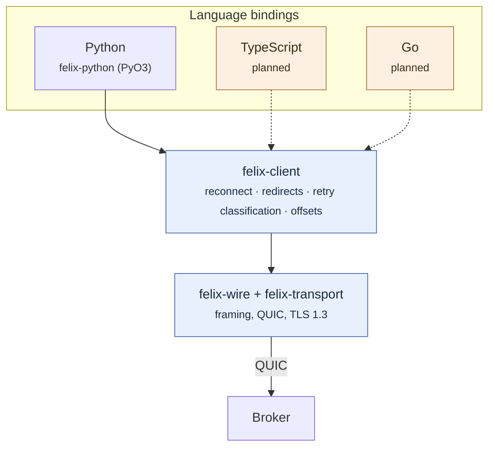

Felix has two clients today: Rust, and Python. More are planned. This page is
about how they relate to each other — which is the part that usually goes
wrong, and the part worth understanding before you depend on one.

## One implementation, several bindings

A Felix client does more than encode frames. It reconnects when the broker it
was using disappears, follows redirects to whichever broker owns the shard it
wants, decides which failures are worth retrying and which are not, and keeps
track of offsets precisely enough that a resuming subscriber neither skips a
record nor sees one twice.

None of that is easy, and all of it is easy to get *nearly* right. So Felix
does not write it more than once. The Rust client (`felix-client`) holds the
behaviour; every other language binds to it through a thin wrapper:



The alternative — a native client per language, each speaking the wire protocol
directly — is what most systems do, and it is why most systems have clients
that behave subtly differently from one another. The differences never show up
in a demo. They show up when a broker dies at an inconvenient moment and one
language's client loses records the other would have kept.

**What this costs:** a binding needs a Rust toolchain to build (though not to
*install* — wheels and their equivalents ship compiled), and a language whose
FFI story is poor is harder to serve. **What it buys:** when reconnection is
improved, every language gets the improvement, and no language can drift.

## The conformance suite

Sharing an implementation removes most divergence. It does not remove all of
it, because a binding still decides how to expose things: what an error looks
like, whether a timeout is an exception or a return value, whether closing
twice is safe.

So there is a catalogue of the semantics a client must implement, and a runner
that checks a client against it:

```bash
task conformance:scenarios     # what a client must implement, and why
task conformance:fixture       # a cluster to run a suite against
task conformance:verify -- results.json
```

The catalogue (`crates/felix-conformance/scenarios.toml`) is deliberately
weighted toward the semantics a second client approximates rather than
implements. A few, so the flavour is clear:

| Scenario | What goes wrong without it |
|---|---|
| `redirect.carries_the_start_offset_through_every_hop` | A client that rebuilds the subscribe request when redirected drops the start offset and begins at the live tail. The call succeeds. Every record between the requested offset and now is simply absent, and nothing anywhere reports an error. |
| `reconnect.subscription_resumes_at_the_next_offset` | Off by one in one direction loses records silently; off by one in the other duplicates them. |
| `retry.ambiguous_outcomes_are_not_silently_retried` | Re-sending a publish that may already have been applied duplicates it, and nothing downstream can tell the copies apart — the delivery guarantee changes without anyone choosing it. |
| `error.unauthorized_is_typed` | An application that cannot tell "not permitted" from "unreachable" retries the one that will never succeed. |

Each scenario has a stable id. A client's test suite tags its tests with those
ids, emits a results document, and `verify` reports any **required** scenario
without a passing result — by name. A skip does not satisfy a requirement, and
a result naming a scenario that does not exist is reported rather than ignored,
because a misspelled tag would otherwise look like coverage.

Optional scenarios may go unclaimed — a binding is allowed not to wrap a
surface yet — but may not *fail*. Claiming a semantic and getting it wrong is
worse than not claiming it.

**New languages are gated on this rather than on review.** "Looks correct" is
exactly the standard that produces divergence.

### Why the kit is Apache-2.0

Most of Felix's server-side code is AGPL-3.0. The conformance catalogue and
verifier are **Apache-2.0** on purpose: someone writing a Felix client for a
language nobody here has considered should be able to vendor the specification
and check their work without taking a copyleft dependency. The fixture *server*
needs a broker, so it stays AGPL — but running a broker to test against was
always going to require a broker.

## Python

The Python client wraps `felix-client` through PyO3. It passes every required
scenario in the catalogue.

### Installing

Wheels are attached to each GitHub release, built for Linux (x86-64 and
aarch64), macOS (Apple silicon and Intel), and Windows x86-64. They target
`abi3` for Python 3.9 and up, so one wheel per platform covers every supported
interpreter and there is nothing to rebuild when you upgrade Python.

```bash
pip install https://github.com/gabloe/felix/releases/download/<tag>/<wheel>
```

Felix is not on PyPI yet. `pip install felix-client` is a public commitment —
the name is claimed, versions are permanent, anyone can depend on it — and that
waits until Felix is ready to be depended on.

To build from a checkout:

```bash
pip install maturin
task python:develop     # editable install into the active virtualenv
```

### Two surfaces

Most Python services that would use Felix are asyncio services, so the async
surface is the one to reach for:

```python
import felix

client = await felix.AsyncClient.connect(
    "broker-1:5000",
    tenant_id="acme",
    token=token,
)

async with client:
    await client.publish("acme", "prod", "orders", b'{"id": 1}')

    async with await client.subscribe("acme", "prod", "orders") as events:
        async for event in events:
            handle(event.payload)
            checkpoint(event.offset + 1)
```

There is also a synchronous surface, for threads and for code that is not
async at all:

```python
with felix.Client("broker-1:5000", tenant_id="acme", token=token) as client:
    client.publish("acme", "prod", "orders", b'{"id": 1}')

    with client.subscribe("acme", "prod", "orders") as events:
        for event in events:
            handle(event.payload)
```

Both wrap the same client and fail over identically. The synchronous one
releases the GIL while it blocks, so it does not stall other threads and works
under `asyncio.to_thread`.

### Errors you can act on

Exceptions are typed, so an application can branch on *why* a call failed
instead of matching on message text — which breaks the first time a message is
reworded:

```python
try:
    client.publish("acme", "prod", "orders", payload)
except felix.AuthError:
    raise                      # a permission is not granted by retrying
except felix.NotFoundError:
    create_stream_then_retry()
except felix.ConnectionError:
    backoff_and_retry()        # this one is worth another go
```

`FelixError` is the base class. Classification is deliberately conservative:
anything the binding cannot confidently place stays the base class, because a
wrong category tells an application to retry something that cannot succeed, or
to abandon something that would have worked.

### Resuming a subscription

Every event on a durable stream carries its offset. Record `offset + 1` — the
first record you have *not* handled — and pass it back to resume exactly there:

```python
async with await client.subscribe("acme", "prod", "orders", start=next_offset) as events:
    async for event in events:
        handle(event.payload)
        next_offset = event.offset + 1
```

Offsets are contiguous, so a jump between consecutive events means the
subscriber queue dropped records. That is the only way to notice, which is why
the offset is exposed rather than hidden.

### TLS

QUIC has no unencrypted mode, so there is always a trust decision — and
deliberately no switch to skip verification, because that is the setting that
quietly turns a secure deployment insecure. Either the platform trust store
(the default) or a specific CA:

```python
felix.Client(addrs, tenant_id=..., token=..., ca_file="/etc/felix/ca.pem")
```

A development broker generates a self-signed certificate at startup. Set
`FELIX_TLS_CERT_EXPORT=/path/ca.pem` on the broker and point `ca_file` at the
result — that exists precisely so non-Rust clients have something real to
trust.

### Not wrapped yet

Consumer groups, cache watches, and multi-shard subscription are not exposed in
Python. The catalogue marks the corresponding scenarios optional, so the
binding reports them as *not claimed* rather than passing over them in silence.
Use the Rust client for those today.

## Rust

The reference client, and the one the others are built from. See the
[Client SDK](/felix/api/client-sdk/) page.

## Planned

TypeScript, then Go, then C# — in that order, because it follows where Felix's
intended workloads actually live. Each is gated on passing the conformance
suite.

If you want to write one sooner, the things you need are all public: the
[wire protocol](/felix/architecture/wire-protocol/) if you are implementing
natively, the conformance catalogue either way, and `crates/felix-python` as a
worked example of the binding approach — roughly 700 lines of Rust over a
client that already works.
