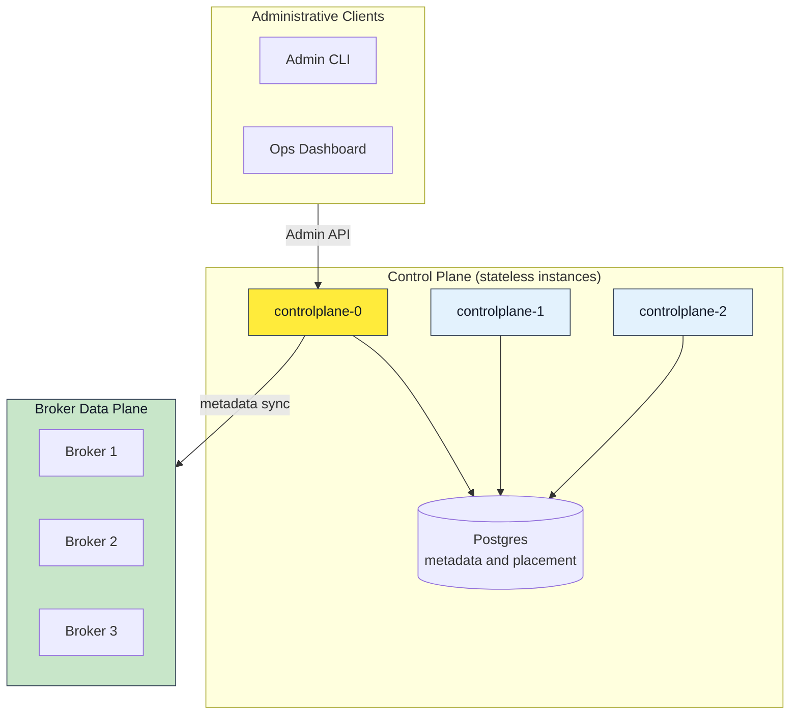
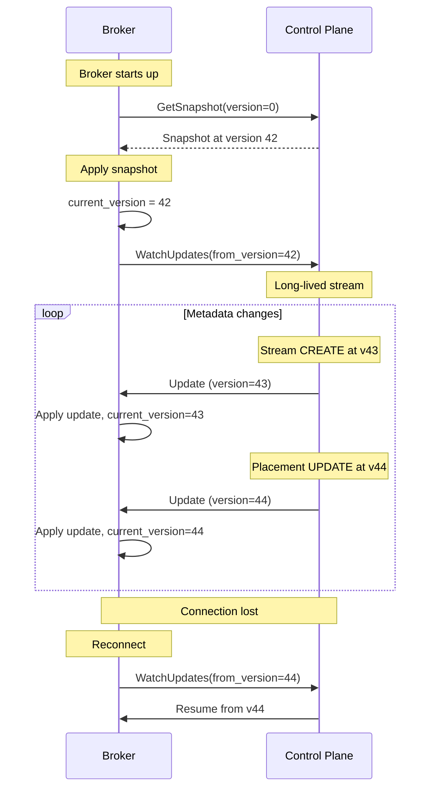
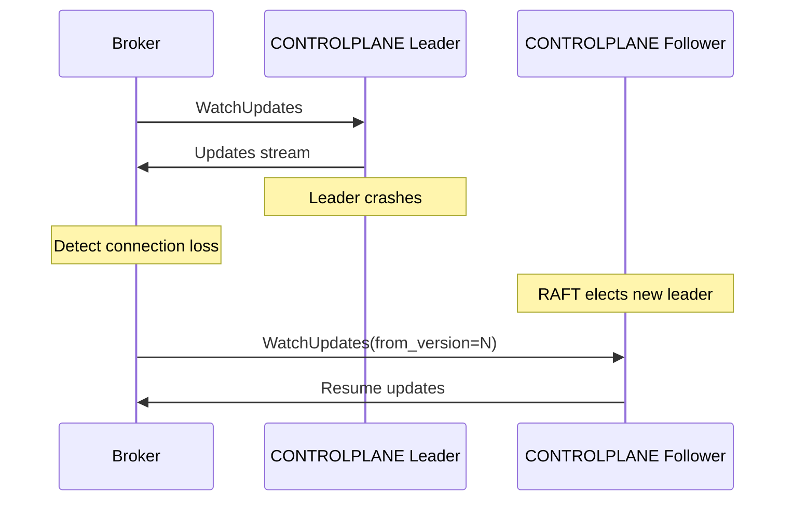

The control plane holds the cluster's metadata — tenants, namespaces,
streams, caches, nodes — behind a REST API, decides shard placement, and
publishes the assignment feed brokers follow. It is never on the data path.
This page documents its endpoints and how brokers and operators use them.

:::note[Current Status]
The control plane HTTP API is implemented for metadata, placement, and authentication (token exchange and JWKS). Raft clustering has shipped and is selectable as a storage backend. This document covers the current endpoints; where it describes something unbuilt it says so.
:::
## Authentication and Token Exchange (HTTP)

Felix uses upstream OIDC JWTs for authentication and exchanges them for tenant-scoped Felix tokens. Brokers validate Felix tokens locally.

### POST /v1/tenants/{tenant_id}/token/exchange

Exchange an upstream OIDC token for a Felix token.

**Request**:

```http
POST /v1/tenants/{tenant_id}/token/exchange
Authorization: Bearer <oidc_jwt>
Content-Type: application/json

{
  "requested": ["stream.publish", "stream.subscribe", "cache.read"],
  "resources": ["namespace:t1/payments", "stream:t1/payments/orders/*"]
}
```

**Response**:

```json
{
  "felix_token": "<jwt>",
  "expires_in": 900,
  "token_type": "Bearer"
}
```

**Notes**:
- `requested` and `resources` are optional hints to filter the issued permission set.
- If no permissions remain after evaluation, the exchange returns `403`.

### Configuring Allowed IdPs

IdP allowlists are stored per tenant in the control plane database (`idp_issuers` table) and can be managed via the admin HTTP endpoints below (or directly in the store for tests/dev).

Required fields:
- `issuer` (iss)
- `audiences` (allowed `aud` values)
- `subject_claim` (default `sub`)
- optional `groups_claim`
- either `discovery_url` or `jwks_url`

### Admin API: IdP Issuers

IdP issuer admin endpoints require `tenant.manage` on `tenant:{tenant_id}`.

Create or update an issuer for a tenant:

```http
POST /v1/tenants/{tenant_id}/idp-issuers
Content-Type: application/json

{
  "issuer": "https://login.microsoftonline.com/<tenant>/v2.0",
  "audiences": ["api://felix-controlplane"],
  "discovery_url": null,
  "jwks_url": null,
  "claim_mappings": {
    "subject_claim": "sub",
    "groups_claim": "groups"
  }
}
```

Delete an issuer:

```http
DELETE /v1/tenants/{tenant_id}/idp-issuers/{issuer}
```

### Admin API: RBAC

RBAC endpoints are split by capability:

- `GET /v1/tenants/{tenant_id}/rbac/policies` -> requires `rbac.view`
- `GET /v1/tenants/{tenant_id}/rbac/groupings` -> requires `rbac.view`
- `POST /v1/tenants/{tenant_id}/rbac/policies` -> requires `rbac.policy.manage`
- `POST /v1/tenants/{tenant_id}/rbac/groupings` -> requires `rbac.assignment.manage`

Scope is enforced server-side. Callers can only mutate rules/assignments within
their own RBAC scope (tenant/namespace/stream/cache).

Canonical object grammar for RBAC policy payloads:
- `tenant:{tenant_id}`
- `namespace:{tenant_id}/{namespace}` or `namespace:{tenant_id}/*`
- `stream:{tenant_id}/{namespace}/{stream}` or `stream:{tenant_id}/{namespace}/*`
- `cache:{tenant_id}/{namespace}/{cache}` or `cache:{tenant_id}/{namespace}/*`
- `cluster:*` — the cluster itself; see [Cluster membership](#cluster-membership)

Rejected on write:
- `tenant:*`
- non-tenant-scoped wildcards such as `stream:*/*`
- `cluster:*` from any tenant-scoped caller, since no tenant scope contains it

### Cluster membership

`GET /v1/nodes` lists registered brokers; `GET /v1/nodes/{node_id}` fetches one.
Both require `node.view:cluster:*`.

```http
GET /v1/nodes?lifecycle=live&region=us-west-2&label=rack%3Da1
Authorization: Bearer <felix-token>
```

Filters intersect, and repeating `label` requires all of them. Each entry pairs
the node record with why it is or is not a placement candidate. `routable`
says whether brokers may still send it requests for the shards it leads: true
for a live or draining node whose heartbeat is inside the window.

```json
{ "items": [ { "node": { "node_id": "broker-1", "spec": { "advertise_addr": "10.0.0.4:7000", "region": "us-west-2" },
                         "status": { "lifecycle": "live", "incarnation": 3 } },
               "placement": { "eligible": false, "routable": false, "heartbeat_age_ms": 41200,
                              "reasons": ["last heartbeat was 41200ms ago, past the 15000ms timeout; expiry has not run yet"] } } ] }
```

A node's `spec` may also carry `client_addr`, the `host:port` Felix clients
connect to, and `kafka_addr`, the `host:port` Kafka clients are told to connect
to (present only on a broker running the Kafka listener; a hostname is
allowed, an IPv6 host must be bracketed). Both are omitted when unset.

`cluster:*` sits outside the tenant hierarchy and no tenant scope contains it,
so a tenant admin cannot grant themselves cluster access. The tenant comes from
the token's own `tid` claim rather than a path segment, and only selects which
signing keys to verify against.

`POST /v1/nodes/{node_id}/drain` marks a broker as leaving: it keeps serving,
and placement moves every shard it leads to brokers that are staying, one
handoff at a time. A shard being moved shows its destination as `successor`
and, once the leader has been told to stop, `"state": "draining"`.

`PATCH /v1/nodes/{node_id}` changes `region`, `labels` or `capacity`, and moves
`lifecycle` between `live` and `draining` — `{"lifecycle": "live"}` cancels a
drain. Nothing observed is patchable: a `down` or `left` broker is revived only
by registering, so a patch cannot claim a silent broker is alive.

`DELETE /v1/nodes/{node_id}` removes a broker's record. It needs `node.manage`
on `cluster:*`, and is refused (409) while the broker is `live` or `draining`
or while any shard names it as leader or replica. See
[Adding, draining and removing brokers](/felix/deployment/scaling/).

The registration, heartbeat, drain, deregister and patch endpoints require
`node.manage` over the node being changed. A broker's credential is scoped to
`node:{its own id}`, so it cannot act for another broker; an operator holding
`cluster:*` can manage the whole fleet. Registration authorises the identity in
the request body, so a broker cannot claim a name its credential does not
cover.

### Shard moves and placement

What an operator uses to steer shard moves; the walk-through is
[Moving shards by hand](/felix/deployment/moving-shards/), and
`felix-controlplane admin` is a command-line client of these endpoints. Reads
take `node.view:cluster:*`; the rest take `node.manage:cluster:*`.

| Endpoint | What it does |
| --- | --- |
| `GET /v1/shard-moves` | moves and follower replacements in progress, and whether placement is paused |
| `GET /v1/placement/plan` | what the next placement pass would write, without writing it |
| `POST /v1/shard-moves` | start moving a shard's leadership to a node |
| `DELETE /v1/shard-moves/{tenant_id}/{namespace}/{name}/{shard}` | cancel a shard's move; `?kind=cache` for a cache shard |
| `POST /v1/placement/pause`, `POST /v1/placement/resume` | stop and restart placement's own moves |

```http
POST /v1/shard-moves
Authorization: Bearer <felix-token>
Content-Type: application/json

{ "tenant_id": "t1", "namespace": "ns", "stream": "orders", "shard": 0, "destination": "broker-3" }
```

```json
{ "step": "stage",
  "assignment": { "tenant_id": "t1", "namespace": "ns", "stream": "orders", "shard": 0, "kind": "stream",
                  "leader": "broker-1", "replicas": ["broker-3"], "generation": 12, "state": "active",
                  "successor": "broker-3", "move_started_at_millis": 1790000000000, "move_reason": "operator" } }
```

A start is refused where placement would not make the move: 404
`unknown_shard` or `unknown_node`, or 409 `destination_not_live`,
`already_leader`, `at_capacity`, `already_moving`, `leader_unavailable` or
`move_limit`. A cancel answers `cancel` before the fence and `retake` after
it, when the leader that stopped serves again at a new generation; with no
move in progress it is 409 `not_moving`.

`GET /v1/shard-moves` lists each move's `step` (`staged`, `fenced`,
`replacing`), `reason` (`drain`, `balance`, `operator`, `replace`), start
time, and from the leader's latest report `lag_records`, `caught_up` and
`drained`. `GET /v1/placement/plan` lists each shard the next pass would act
on with its `action` (`place`, a move step, `waiting` or `unplaceable`) and
the assignment it would write or the reason it cannot.

### Tenants, namespaces, streams and caches

Every resource endpoint takes a Felix bearer token, checked before anything
else — a tenant that does not exist has no signing keys, so a request against
it answers `401` whatever the token says, rather than a `404` that would say
whether it exists.

| Endpoint | Requires |
| --- | --- |
| `GET`/`POST /v1/tenants`, `DELETE /v1/tenants/{id}` | `tenant.manage:cluster:*` |
| `/v1/tenants/{t}/namespaces[/{ns}]` | `ns.manage` over `namespace:{t}/{ns}`, from a `t` token |
| `/v1/tenants/{t}/namespaces/{ns}/streams[/{s}]` | `stream.manage` over `stream:{t}/{ns}/{s}`, from a `t` token |
| `/v1/tenants/{t}/namespaces/{ns}/caches[/{c}]` | `cache.manage` over `cache:{t}/{ns}/{c}`, from a `t` token |
| `/v1/{tenants,namespaces,streams,caches}/{snapshot,changes}` | `node.view:cluster:*` |

```http
POST /v1/tenants/t1/namespaces/payments/streams
Authorization: Bearer <felix-token with stream.manage over stream:t1/payments/orders>
Content-Type: application/json

{ "stream": "orders", "kind": "Stream", "shards": 1, "replication_factor": 1,
  "retention": { "max_age_seconds": null, "max_size_bytes": null },
  "consistency": "Leader", "delivery": "AtLeastOnce", "durable": true }
```

A stream may also name a `region`, such as `"region": "eu-west-1"`, and is
then placed only on brokers in that region or in one the control plane's
`FELIX_REGION_BRIDGES` bridges it to. The region is fixed at creation, an empty
one is refused with `400`, and omitting it places the stream anywhere. An
operator move to a broker outside the allowed regions is refused with `409`
and code `region_not_allowed`.

A cache takes `consistency` the same way, `"Leader"` when omitted. Under
`"Quorum"` a put or delete is acknowledged only once a majority of the shard's
replicas hold it; counter updates are acknowledged by the leader either way.

```http
POST /v1/tenants/t1/namespaces/payments/caches
Content-Type: application/json

{ "cache": "sessions", "display_name": "Sessions", "shards": 4,
  "replication_factor": 3, "consistency": "Quorum" }
```

A tenant admin's token already carries the manage actions: exchange expands
`tenant.manage:tenant:t1` to `ns.manage:namespace:t1/*`,
`stream.manage:stream:t1/*/*` and `cache.manage:cache:t1/*/*`. Listings return
only what the caller could manage.

The tenant catalog — which tenants exist — is cluster metadata, so creating,
listing and deleting tenants takes the same kind of operator credential as
managing the fleet, and deleting is operator-only even for the tenant's own
admin. The feeds are what brokers seed from, and take the broker's own
credential (`FELIX_NODE_TOKEN`), the same one that reads the shard-assignment
watch. An operator credential comes out of bootstrap the same way a broker's
does: a policy granting the cluster actions to a role, and an exchange.

### Internal Bootstrap API (Day-0)

Used once per tenant to seed auth before any admin tokens exist. Disabled by default and bound to a separate internal address when enabled; the listener can additionally require mTLS (see [Security](/felix/features/security/#bootstrap-mode-day-0)).

```http
POST /internal/bootstrap/tenants/{tenant_id}/initialize
X-Felix-Bootstrap-Token: <secret>
Content-Type: application/json

{
  "display_name": "Tenant One",
  "idp_issuers": [...],
  "initial_admin_principals": ["p:alice"]
}
```

Initialization is atomic and exactly-once per tenant, across every
control-plane instance: exactly one concurrent call wins and returns `200`
with the tenant's signing-key id; every other returns
`409 already_initialized`. A failed call leaves the tenant retryable — the
bootstrapped flag only commits together with a complete seed.

| Status | Meaning |
| --- | --- |
| `200` | This call performed the initialization; the response carries `kid` and the tenant JWKS URL |
| `400` | Validation failed (empty display name, no admin principals, blank issuer) |
| `401` | Missing or wrong `X-Felix-Bootstrap-Token` |
| `404` | Bootstrap is not enabled on this control plane |
| `409` | The tenant is already initialized — by an earlier call, or by a concurrent one that won |

### GET /v1/tenants/{tenant_id}/.well-known/jwks.json

Fetch tenant signing keys (public JWKS) used by brokers to verify Felix tokens.

**Response**:

```json
{
  "keys": [
    {
      "kty": "OKP",
      "kid": "k1",
      "alg": "EdDSA",
      "use": "sig",
      "crv": "Ed25519",
      "x": "..."
    }
  ]
}
```

## Architecture Overview

The control plane is a separate service holding the metadata brokers read:
tenants, namespaces, streams, caches, the node catalog, and shard assignments.

It is a **REST service**, and where its consistency comes from depends on the
backend. On Postgres the instances are stateless and do not know about each
other: consistency comes from the shared database, and you run several against
one highly available one — each answering `/v1/system/ready` only when it can
reach a database whose schema matches its build. On the Raft backend the
instances hold the metadata themselves and consistency comes from the consensus
between them. The API below is identical either way.

A Raft backend makes this metadata highly available without depending on
Postgres for it: the instances replicate it between themselves and survive
losing one without losing an acknowledged write. Both backends serve the same
API, so nothing below changes with the choice.

The Postgres shape, with the database holding what the Raft group otherwise does:



### Design Goals

1. **Strong consistency**: Metadata changes are linearizable
2. **Off the hot path**: Data plane never waits for control plane
3. **Simple propagation**: Brokers consume metadata, don't participate in consensus
4. **Fast recovery**: Snapshot-based catch-up for new/restarted brokers
5. **Kubernetes-native**: Leverages K8s for node identity and discovery

### RAFT Scope

The RAFT log stores:
- **Node membership**: Broker registration and health status
- **Stream definitions**: Tenant, namespace, stream, retention policies
- **Shard placement**: Which broker owns which shards
- **Configuration**: Cluster-wide settings and feature flags
- **Quotas**: Rate limits and resource quotas (future; RBAC policies live in
  the auth store today)

The RAFT log **does not** store:
- Stream payloads (handled by data plane)
- Cache entries (ephemeral, local to brokers)
- Client connections (transient state)

## Core Data Model

### Tenant

```yaml
apiVersion: felix.io/v1
kind: Tenant
metadata:
  name: acme-corp
spec:
  description: "ACME Corporation production tenant"
  quotas:
    max_streams: 1000
    max_publish_rate: 100000  # msg/sec
    max_storage: 1TB
  encryption:
    key_id: "tenant-key-acme-v1"
    rotation_period: 90d
```

### Namespace

```yaml
apiVersion: felix.io/v1
kind: Namespace
metadata:
  name: production
  tenant: acme-corp
spec:
  description: "Production environment"
  quotas:
    max_streams: 500
    max_publish_rate: 50000
```

### Stream

```yaml
apiVersion: felix.io/v1
kind: Stream
metadata:
  name: orders
  namespace: production
  tenant: acme-corp
spec:
  shards: 4
  retention:
    time: 7d
    size: 100GB
  durability: durable  # or ephemeral
  replication_factor: 3
  ack_policy: quorum  # or leader_only
```

### Shard Placement

```yaml
apiVersion: felix.io/v1
kind: ShardPlacement
metadata:
  stream: orders
  namespace: production
  tenant: acme-corp
spec:
  placements:
    - shard_id: 0
      leader: broker-1
      replicas: [broker-2, broker-3]
    - shard_id: 1
      leader: broker-2
      replicas: [broker-3, broker-1]
    - shard_id: 2
      leader: broker-3
      replicas: [broker-1, broker-2]
    - shard_id: 3
      leader: broker-1
      replicas: [broker-2, broker-3]
```

### Broker Registration

```yaml
apiVersion: felix.io/v1
kind: Broker
metadata:
  name: broker-1
spec:
  address: "broker-1.felix.svc.cluster.local:5000"
  region: us-west-2
  availability_zone: us-west-2a
  capacity:
    max_shards: 100
    max_connections: 10000
  status: active  # active, draining, down
```

## Admin API

The control plane exposes a gRPC API for administrative operations.

### Stream Management

#### CreateStream

Create a new stream.

**Request**:

```protobuf
message CreateStreamRequest {
  string tenant_id = 1;
  string namespace = 2;
  string stream = 3;
  StreamSpec spec = 4;
}

message StreamSpec {
  uint32 shards = 1;
  RetentionPolicy retention = 2;
  Durability durability = 3;
  uint32 replication_factor = 4;
  AckPolicy ack_policy = 5;
}
```

**Response**:

```protobuf
message CreateStreamResponse {
  string stream_id = 1;
  StreamStatus status = 2;
}
```

**Example** (conceptual CLI):

```bash
felix-admin stream create \
  --tenant acme-corp \
  --namespace production \
  --stream orders \
  --shards 4 \
  --retention 7d \
  --durability durable \
  --replication 3
```

#### DeleteStream

Delete a stream and all its data.

**Request**:

```protobuf
message DeleteStreamRequest {
  string tenant_id = 1;
  string namespace = 2;
  string stream = 3;
  bool force = 4;  // Skip safety checks
}
```

**Safety checks**:
- Stream has no active subscribers (unless force=true)
- Confirm deletion of durable data
- Grace period for accidental deletions

#### ListStreams

List streams in a namespace.

**Request**:

```protobuf
message ListStreamsRequest {
  string tenant_id = 1;
  string namespace = 2;
  string filter = 3;  // Optional name filter
  uint32 page_size = 4;
  string page_token = 5;
}
```

**Response**:

```protobuf
message ListStreamsResponse {
  repeated StreamInfo streams = 1;
  string next_page_token = 2;
}

message StreamInfo {
  string name = 1;
  StreamSpec spec = 2;
  StreamMetrics metrics = 3;
}
```

### Shard Management

Shard moves are not part of a gRPC API: they are the HTTP endpoints in
[Shard moves and placement](#shard-moves-and-placement).

### Broker Management

#### RegisterBroker

Register a new broker node.

**Request**:

```protobuf
message RegisterBrokerRequest {
  string broker_id = 1;
  string address = 2;
  BrokerCapacity capacity = 3;
  map<string, string> metadata = 4;
}
```

**Automatic registration**:

Brokers can auto-register on startup:

```yaml
# Broker startup config
broker_id: "auto"  # Generate from pod name
controlplane_url: "https://controlplane.felix.svc.cluster.local:9000"
controlplane_register_on_startup: true
```

#### ReportHealth

Brokers periodically report health to control plane.

**Request**:

```protobuf
message ReportHealthRequest {
  string broker_id = 1;
  HealthStatus status = 2;
  BrokerMetrics metrics = 3;
  repeated ShardStatus shard_status = 4;
}

message HealthStatus {
  bool healthy = 1;
  string message = 2;
  int64 uptime_seconds = 3;
}
```

**Heartbeat interval**: 5 seconds (configurable)

**Failure detection**: Broker marked down after 3 missed heartbeats

## Metadata Synchronization API

Brokers consume metadata via watch streams. Today that is the HTTP
`/v1/{tenants,namespaces,streams,caches}/snapshot` and `/changes?since=` feeds
above, read with the broker's credential; the gRPC shape below is the design
sketch.

### GetSnapshot

Get full metadata snapshot at a specific version.

**Request**:

```protobuf
message GetSnapshotRequest {
  uint64 version = 1;  // 0 = latest
}
```

**Response**:

```protobuf
message GetSnapshotResponse {
  uint64 version = 1;
  Metadata metadata = 2;
}

message Metadata {
  repeated Tenant tenants = 1;
  repeated Namespace namespaces = 2;
  repeated Stream streams = 3;
  repeated ShardPlacement placements = 4;
  repeated Broker brokers = 5;
}
```

**Usage**:

```rust
// Broker startup: load full metadata snapshot
let snapshot = controlplane.get_snapshot(0).await?;
broker.apply_metadata(snapshot.metadata).await?;
```

### WatchUpdates

Stream incremental metadata updates.

**Request**:

```protobuf
message WatchUpdatesRequest {
  uint64 from_version = 1;
}
```

**Response stream**:

```protobuf
message MetadataUpdate {
  uint64 version = 1;
  UpdateType type = 2;
  oneof payload {
    Tenant tenant = 3;
    Namespace namespace = 4;
    Stream stream = 5;
    ShardPlacement placement = 6;
    Broker broker = 7;
  }
}

enum UpdateType {
  CREATE = 0;
  UPDATE = 1;
  DELETE = 2;
}
```

**Usage**:

```rust
// Broker: watch for metadata changes
let mut watch = controlplane.watch_updates(current_version).await?;

while let Some(update) = watch.next().await {
    match update.type {
        UpdateType::CREATE => broker.apply_create(update).await?,
        UpdateType::UPDATE => broker.apply_update(update).await?,
        UpdateType::DELETE => broker.apply_delete(update).await?,
    }
    broker.set_metadata_version(update.version);
}
```

### Broker Watch Lifecycle



## Consistency Guarantees

### Linearizable Reads and Writes

All control plane operations are linearizable:

- **Writes**: Only the RAFT leader accepts writes
- **Reads**: Leader reads are linearizable
- **Follower reads**: Stale by up to heartbeat interval (optional)

### Broker Metadata Consistency

Brokers operate with **eventually consistent** metadata:

- Brokers cache metadata locally
- Updates arrive via watch stream
- Lag is typically < 100ms
- New streams may not be immediately available

**Staleness handling**:

```rust
// Broker rejects operations for unknown streams
match broker.lookup_stream(tenant, namespace, stream) {
    Some(stream_info) => {
        // Process operation
    }
    None => {
        // Return error: "Unknown stream"
        // Client should retry after brief delay
    }
}
```

## Failure Scenarios

### Control Plane Leader Failure



**Recovery time**: < 5 seconds (RAFT election + reconnect)

**Impact**: No data plane disruption, admin API briefly unavailable

### Broker Disconnection from Control Plane

Broker continues operating with cached metadata:

- Existing streams continue serving
- New stream creation fails
- Shard placement updates delayed
- Broker reconciles on reconnection

**Acceptable downtime**: Hours (for stable environments)

### Control Plane Quorum Loss

If RAFT loses quorum (majority of nodes down):

- **Read operations**: Fail (no leader)
- **Write operations**: Fail (no quorum)
- **Broker data plane**: Continues operating normally
- **Admin operations**: Unavailable until quorum restored

**Prevention**: Deploy 3 or 5 control plane nodes across availability zones

## Planned Features

### ACL Management

```protobuf
message ACL {
  string tenant_id = 1;
  string namespace = 2;
  string resource = 3;  // stream name or "*"
  string principal = 4;  // service account or user
  repeated Permission permissions = 5;
}

enum Permission {
  PUBLISH = 0;
  SUBSCRIBE = 1;
  CACHE_READ = 2;
  CACHE_WRITE = 3;
  ADMIN = 4;
}
```

### Quota Enforcement

```protobuf
message Quota {
  string tenant_id = 1;
  string namespace = 2;
  QuotaLimits limits = 3;
}

message QuotaLimits {
  uint64 max_publish_rate = 1;  // msg/sec
  uint64 max_subscribe_connections = 2;
  uint64 max_storage_bytes = 3;
  uint64 max_cache_memory = 4;
}
```

### Audit Logging

All control plane operations are logged:

```json
{
  "timestamp": "2026-01-15T10:30:00Z",
  "operation": "DeleteStream",
  "principal": "admin@acme.com",
  "tenant": "acme-corp",
  "namespace": "production",
  "stream": "old-events",
  "result": "success"
}
```

### Region and Bridge Management

```yaml
apiVersion: felix.io/v1
kind: Bridge
metadata:
  name: us-to-eu
spec:
  source_region: us-west-2
  target_region: eu-central-1
  streams:
    - tenant: acme-corp
      namespace: production
      stream: replicated-events
  encryption:
    key_id: "bridge-key-us-eu-v1"
```

## Deployment Considerations

### Kubernetes StatefulSet

```yaml
apiVersion: apps/v1
kind: StatefulSet
metadata:
  name: felix-controlplane
spec:
  replicas: 3
  serviceName: felix-controlplane
  template:
    spec:
      containers:
      - name: controlplane
        image: felix/controlplane:latest
        volumeMounts:
        - name: data
          mountPath: /var/lib/felix/raft
  volumeClaimTemplates:
  - metadata:
      name: data
    spec:
      accessModes: ["ReadWriteOnce"]
      resources:
        requests:
          storage: 10Gi
```

### Anti-Affinity

Spread control plane pods across nodes/AZs:

```yaml
affinity:
  podAntiAffinity:
    requiredDuringSchedulingIgnoredDuringExecution:
    - labelSelector:
        matchLabels:
          app: felix-controlplane
      topologyKey: kubernetes.io/hostname
```

### Resource Requirements

**Minimum**:
- CPU: 1 core
- Memory: 2 GB
- Disk: 10 GB SSD

**Recommended production**:
- CPU: 2-4 cores
- Memory: 4-8 GB
- Disk: 50 GB SSD with high IOPS

### Monitoring

Key metrics to monitor:

- RAFT leadership changes
- Commit latency
- Snapshot size and frequency
- Broker metadata sync lag
- Admin API request rate and latency

## Running it well

The short version: run an odd number of instances (3 or 5) so Raft has a
quorum, give them persistent volumes, and keep them off the broker nodes so
data-plane load can't starve consensus. The full operational guidance —
disruption budgets, failover drills, the Postgres-to-Raft migration — is in
[Control-plane HA](/felix/deployment/control-plane-ha/). The workload itself
is metadata-only and light; it is not on the data path.
