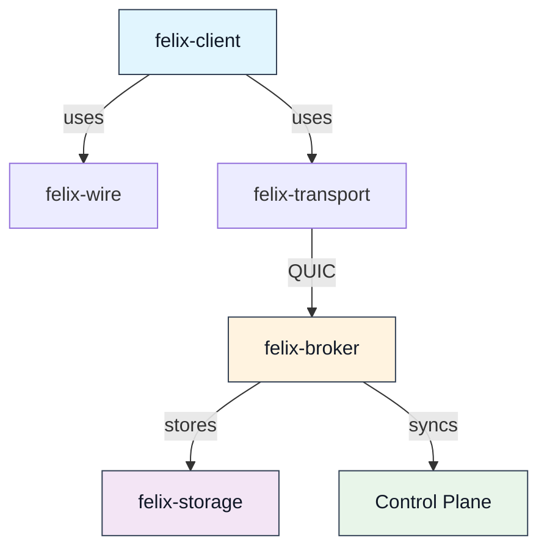
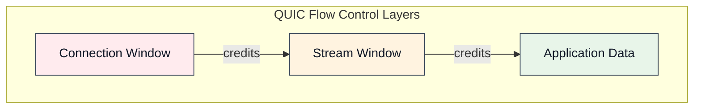
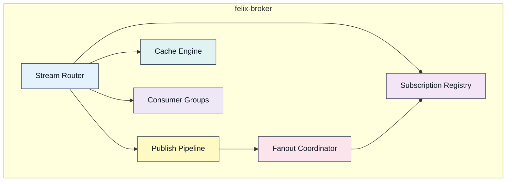
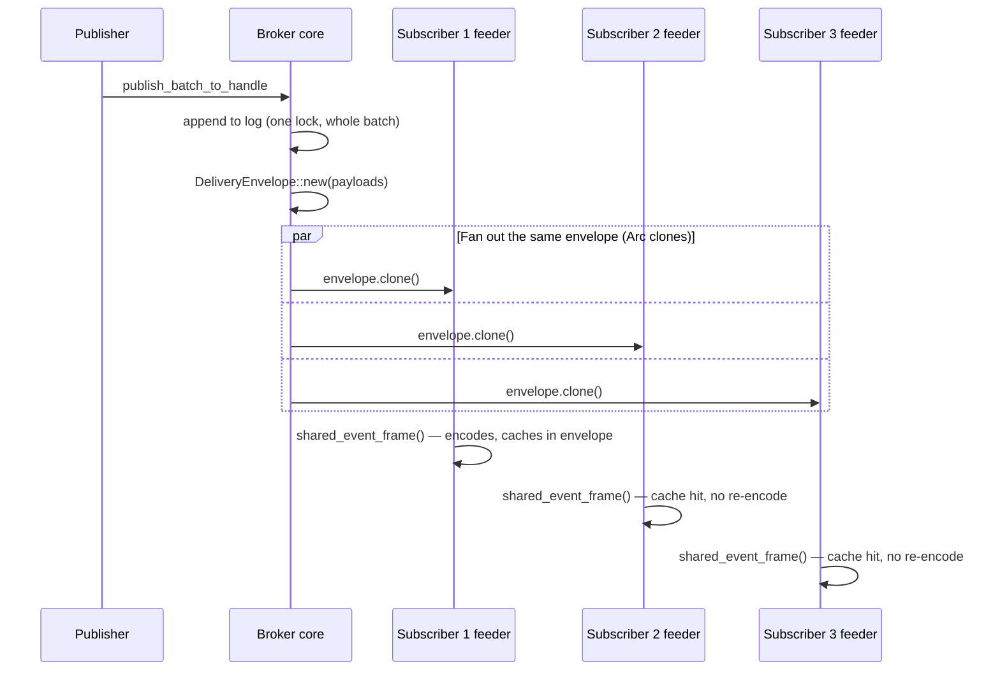
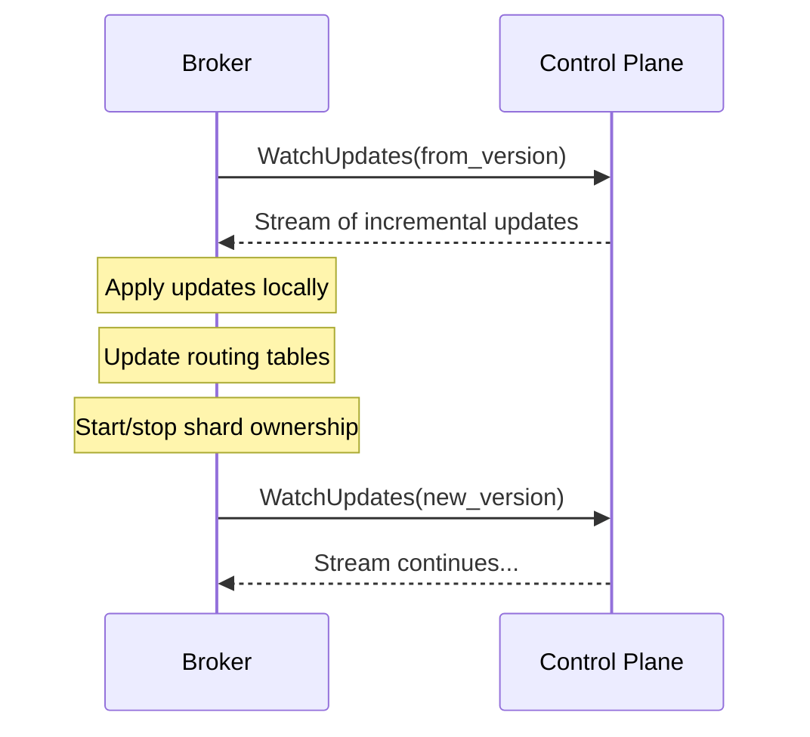
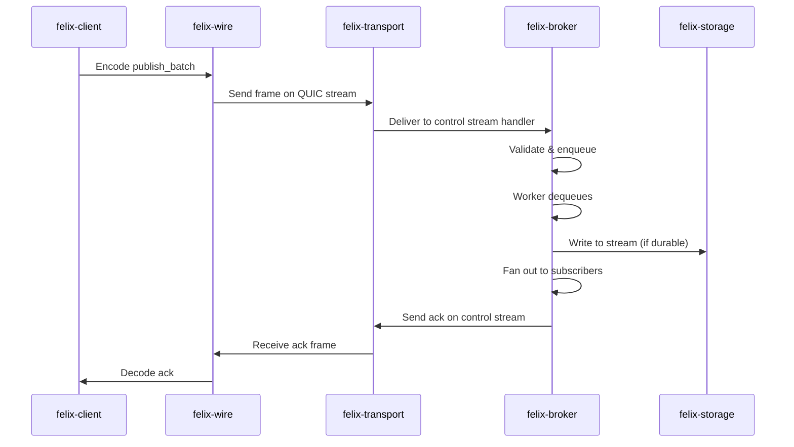
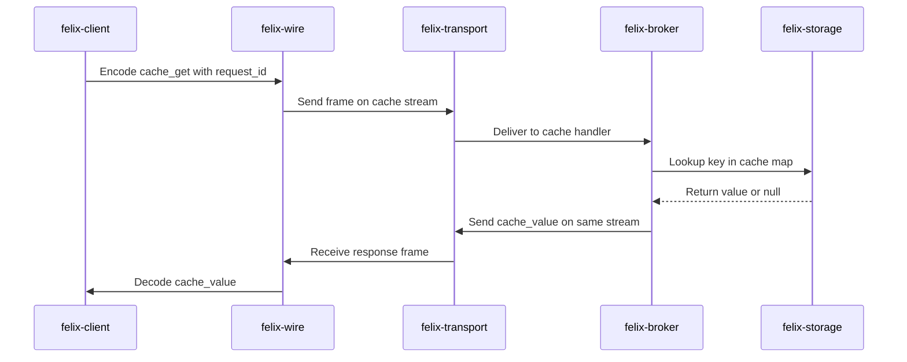
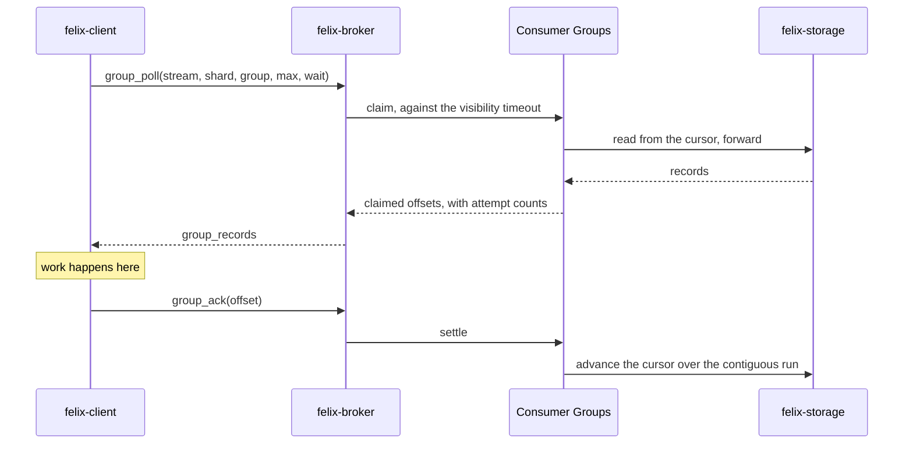

Six components, and the boundaries between them are the design: the broker
core has no networking in it, the protocol has no transport in it, and the
storage layer knows nothing about either. This page walks each component and
what it owns.

## Overview

The Felix system is composed of six core components that work together to serve
**streams, caches and queues** — three readings of one append-only log rather
than three subsystems, as [Projections](/felix/architecture/projections/)
explains.



## felix-wire: Protocol Layer

The `felix-wire` crate defines the language-neutral wire protocol that all Felix clients and brokers must implement. It provides the foundation for interoperability and forward compatibility.

### Responsibilities

- **Frame encoding/decoding**: Fixed header format with magic number, version, flags, and length
- **Message serialization**: Binary message payloads with typed variants
- **Binary optimizations**: Binary batch encoding for high-throughput publish operations
- **Protocol versioning**: Version negotiation and forward compatibility
- **Conformance testing**: Test vectors for validating implementations

### Frame Structure

Every Felix message is wrapped in a fixed 12-byte header:

<svg viewBox="0 0 660 196" role="img" aria-labelledby="ch-title ch-desc" style="max-width:100%;height:auto;color:var(--sl-color-text)">
 <title id="ch-title">Felix v1 frame header layout</title>
 <desc id="ch-desc">Twelve bytes in three 32-bit rows: bytes 0 to 3 are magic, bytes 4 and 5 are version, bytes 6 and 7 are flags, bytes 8 to 11 are length.</desc>
 <g font-family="ui-monospace, SFMono-Regular, Menlo, monospace" font-size="13" fill="currentColor">
  <g opacity="0.65" text-anchor="middle">
   <text x="52" y="16">0</text>
   <text x="200" y="16">8</text>
   <text x="348" y="16">16</text>
   <text x="496" y="16">24</text>
   <text x="644" y="16">31</text>
  </g>
  <g stroke="currentColor" opacity="0.35"><path d="M52 22v6M200 22v6M348 22v6M496 22v6M644 22v6" /></g>
  <g opacity="0.65" text-anchor="end" font-size="12">
   <text x="42" y="63">0</text>
   <text x="42" y="115">4</text>
   <text x="42" y="167">8</text>
  </g>
  <g fill="none" stroke="currentColor" stroke-width="1.5">
   <rect x="52" y="34" width="592" height="44" rx="3" />
   <rect x="52" y="86" width="296" height="44" rx="3" />
   <rect x="348" y="86" width="296" height="44" rx="3" />
   <rect x="52" y="138" width="592" height="44" rx="3" />
  </g>
  <g text-anchor="middle">
   <text x="348" y="52">magic</text>
   <text x="348" y="70" opacity="0.7" font-size="12">u32 &#183; 0x464C5831 &#8220;FLX1&#8221;</text>
   <text x="200" y="104">version</text>
   <text x="200" y="122" opacity="0.7" font-size="12">u16 &#183; 1</text>
   <text x="496" y="104">flags</text>
   <text x="496" y="122" opacity="0.7" font-size="12">u16 &#183; bit field</text>
   <text x="348" y="156">length</text>
   <text x="348" y="174" opacity="0.7" font-size="12">u32 &#183; payload bytes</text>
  </g>
 </g>
</svg>

- **Magic**: `0x464C5831` ("FLX1") for protocol identification
- **Version**: Protocol version (currently 1)
- **Flags**: Selects the payload layout — binary publish batch, binary event batch,
  acked publish, publish ack. See
  [Wire Protocol](/felix/architecture/wire-protocol/) for the full table.
- **Length**: Payload size in bytes (up to 4 GiB)

### Design Decisions

The wire protocol uses binary framing for performance and consistency across publish and subscribe paths.

:::note[Binary Mode Performance]
Binary publish batches reduce parsing overhead and can achieve 30-40% higher throughput for large batches.
:::
## felix-transport: QUIC Abstraction

The transport layer provides a clean abstraction over QUIC, hiding the complexity of connection management, stream lifecycle, and flow control while exposing Felix-specific semantics.

### Core Abstractions

#### Connection Pooling

Felix maintains pools of QUIC connections to achieve parallelism without contention:

```rust
// Simplified conceptual API
pub struct ConnectionPool {
    endpoints: Vec<Endpoint>,
    next_index: AtomicUsize,
}

impl ConnectionPool {
    pub async fn acquire(&self) -> Connection;
    pub fn round_robin_next(&self) -> &Endpoint;
}
```

Connection pools are configured separately for different workload types:
- **Event connections**: For pub/sub control streams and subscriptions
- **Cache connections**: For cache request/response operations
- **Publish connections**: For publishing operations

#### Stream Management

QUIC supports two stream types, each serving specific purposes in Felix:

**Bidirectional Streams**:
- Control plane operations (publish, subscribe, cache requests)
- Request/response patterns
- Multiplexed cache operations over pooled streams

**Unidirectional Streams**:
- Event delivery (broker → subscriber)
- One stream per subscription for isolation
- Enables independent flow control per subscriber

### Flow Control Architecture

Felix uses QUIC's built-in flow control at multiple levels:



**Configuration Parameters**:

- `FELIX_EVENT_CONN_RECV_WINDOW`: Per-connection receive window (default: 256 MiB)
- `FELIX_EVENT_STREAM_RECV_WINDOW`: Per-stream receive window (default: 64 MiB)
- `FELIX_EVENT_SEND_WINDOW`: Per-connection send window (default: 256 MiB)

:::caution[Memory Implications]
Window sizes multiply with pool sizes. An event connection pool of 8 with 256 MiB windows can commit up to 2 GiB of receive buffers under burst load. Tune carefully for your workload.
:::
### TLS and Security

The transport layer enforces encryption by default:

- **TLS 1.3** for all connections
- **mTLS** for broker-to-broker communication (future)
- **Certificate validation** with configurable policies
- **Cipher suite configuration** for compliance requirements

## felix-broker: Core Logic

The broker is the heart of Felix, implementing pub/sub fanout, cache operations, consumer groups, stream routing, and backpressure management.

### Architecture Layers



### Stream Routing

When a client opens a stream to the broker, the first message determines stream behavior:

1. **Control stream** (bidirectional): Publish, subscribe setup, acknowledgements
2. **Event stream** (unidirectional): Server-opened for event delivery
3. **Cache stream** (bidirectional): Cache request/response multiplexing

Consumer-group requests share the control stream rather than having one of their
own: a poll is a request/response exchange, and it has to be ordered against the
acknowledgements that settle what it handed out.

### Publish Pipeline

The publish pipeline is optimized for both latency and throughput:

**Stages**:

1. **Ingestion**: Receive publish frame from client stream
2. **Stream resolution**: Resolve `(tenant, namespace, stream)` to a dense `StreamHandle` (cached)
3. **Admission**: Byte-budget and queue-depth backpressure before the job is committed to a worker
4. **Worker processing**: A global, stream-sharded worker pool dequeues and appends to the stream's log
5. **Fanout**: One shared, `Arc`-wrapped envelope handed to every active subscriber

**Configuration**:

```yaml
pub_workers_per_conn: 4      # Worker parallelism (ignored when core_shards > 0)
pub_queue_depth: 64           # Bounded queue size (items)
pub_inflight_bytes: 67108864  # Bounded queue size (bytes, independent budget)
publish_chunk_bytes: 16384    # Chunking for large payloads
```

:::tip[Worker Sizing]
Set `pub_workers_per_conn` to match your active publish stream count. Excess workers increase contention without improving throughput. For single-stream publishers, use 1-2 workers.
:::
:::note[Want the real code path?]
This section is a conceptual overview. For an accurate, function-by-function
walkthrough with file references — including exactly how admission,
stream resolution, and fanout work — see
[Internals: The Publish Path](/felix/development/internals-publish/).
:::
### Subscription Management

Each subscription's broker-core state is a channel slot in its stream's
subscriber registry, plus a dedicated feeder task and QUIC event stream —
see [Internals: Subscribe & Fanout](/felix/development/internals-subscribe/)
for the exact types (`SubscriptionReceiver`, `WriterLaneManager`,
`run_lane_feeder`) and handshake sequence.

**Isolation guarantees**:

- Slow subscribers never block fast subscribers *by default* (`drop_new` queue policy — see [backpressure internals](/felix/development/internals-concurrency/) for the opt-in `block` mode and why it inverts this guarantee)
- Per-subscription buffering with configurable depth (`subscriber_queue_capacity`)
- Independent flow control per subscription stream
- Overload is counted (`felix_subscribe_dropped_total`), not silently absorbed

### Fanout Architecture

When a message is published, the broker fans it out to all subscribers. The
key property: the event frame is encoded **once per publish batch**, not
once per subscriber — every subscriber's feeder gets a clone of the same
`Arc`-wrapped, lazily-encoded frame.



**Batching behavior**:

- Events are accumulated up to `event_batch_max_events` (default: 64)
- Or until `event_batch_max_delay_us` elapses (default: 250 µs)
- Or until `event_batch_max_bytes` is reached (default: 64 KB)

:::note[Want the real code path?]
See [Internals: Subscribe & Fanout](/felix/development/internals-subscribe/)
for the exact mechanics of `DeliveryEnvelope`, `shared_event_frame()`,
writer lanes, and the connection-writer pipelining that schedules the
actual QUIC writes.
:::
### Cache Engine

The cache provides low-latency key-value operations with TTL:

**Operations**:
- `cache_put(tenant, namespace, cache, key, value, ttl_ms)`: Store with optional expiration
- `cache_get(tenant, namespace, cache, key)`: Retrieve value or null if missing/expired
- `cache_delete(tenant, namespace, cache, key)`: Explicit deletion, answering
  with the value it removed — or `null` if the key was not there, so a caller
  can tell a delete that did something from one that did not

**Implementation characteristics**:

- Scoped to `(tenant_id, namespace, cache_name, key)`
- Lazy expiration on access, against an absolute expiry that survives a restart
- Two backends. Without durable storage: an in-memory hash map, lost on restart,
  evicted best-effort under pressure. With it: a log, read through an index of
  key to latest offset that is rebuilt from the log rather than trusted from
  disk, and compacted rather than evicted
- Sharded and routed, so exactly one broker owns each key, and replicated with
  the machinery that replicates a stream

**Performance profile** (localhost, concurrency=32):

| Payload Size | put p50 | get_hit p50 | get_miss p50 |
|--------------|---------|-------------|--------------|
| 0 B          | 158 µs  | 164 µs      | 162 µs       |
| 256 B        | 179 µs  | 177 µs      | 165 µs       |
| 4096 B       | 260 µs  | 238 µs      | 165 µs       |

### Consumer Groups

A queue is the same log read through a cursor a group of consumers shares.
Records are **pulled** rather than pushed, because only a consumer knows when it
has capacity for more work.

**Operations**:

- `group_poll(tenant, namespace, stream, shard, group, max_records, wait_ms)`:
  claim up to `max_records`, optionally waiting for work rather than spinning on
  empty polls
- `group_ack(…, offset)`: finish a record
- `group_nack(…, offset)`: hand one back for immediate redelivery, rather than
  waiting out the visibility timeout
- `group_dead_letters(…)` / `group_discard(…, offset)` / `group_redrive(…, offset)`:
  list what the group gave up on, drop one, or put one back in play

They travel on the **control stream**, like publish and subscribe setup.

**Implementation characteristics**:

- **Durable storage is required.** A group's position lives in a log, so a
  broker started without `FELIX_DURABLE_STORAGE_DIR` serves no groups and does
  not advertise `FEATURE_CONSUMER_GROUP` — a group that forgot its position on
  restart would redeliver everything it had already finished
- The cursor is a key → latest-value projection over its own log under
  `<root>/groups`, monotonic, so a late acknowledgement cannot rewind it
- It advances only over a **contiguous run** of acknowledgements: offset 4 being
  finished while 3 is still in flight leaves the cursor at 3, which is what
  makes it safe to restart from
- In-flight claims are held in memory with a visibility timeout
  (`FELIX_GROUP_VISIBILITY_TIMEOUT_MS`, 30s). A consumer that stops answering
  does not hold a record for ever
- Past `FELIX_GROUP_MAX_ATTEMPTS` (5) a record is **dead-lettered** to a log
  under `<root>/dead-letters`, so one poison record cannot stall the queue
  behind it. A dead letter is a **pointer** — the record stays in the stream's
  log at that offset, readable by an ordinary replay
- **Only the shard's leader serves its group**, and a poll is refused rather
  than forwarded. Relaying would put the claim and the acknowledgement on
  different brokers, and a queue's whole promise is that one consumer holds a
  record at a time
- The cursor is replicated with its shard, so a promoted replica resumes where
  the group had reached. The dead-letter list is **not** replicated yet

See [Queues](/felix/features/queues/) for the API and
[the demo](/felix/demos/queue-semantics/) for it running.

## felix-storage: Storage Abstraction

The storage layer provides pluggable backends for different durability and performance requirements.

### Storage Modes

#### Ephemeral Storage (the default)

Fully in-memory storage optimized for latency:

- **Ring buffers** for stream data
- **Hash maps** for cache entries
- **TTL indexes** for expiration
- **No disk I/O** on hot path
- **At-most-once** delivery semantics

Use cases: real-time signals, transient caching, development

#### Durable Storage

Persistent storage with configurable durability:

- **Log-structured segment store**, not a write-ahead log: the log *is* the
  data, and a record is never rewritten. That is what lets recovery trust
  "valid bytes end at EOF"
- **Torn-tail repair** on startup; interior corruption fails startup loudly
  rather than discarding acknowledged records
- **Sparse indexes** for offset lookups, rebuilt from the segment they describe
  whenever they are missing, short, or stale — they are derived, never trusted
- **Configurable fsync** policies, with group commit so one flush serves many
  waiters
- **At-least-once** delivery when replayed from a checkpointed offset

### Retention Policies

Retention is enforced **per broker, not per stream**, and is off unless it is
configured:

```bash
export FELIX_DURABLE_RETENTION_BYTES=107374182400   # 100 GiB per log
export FELIX_DURABLE_RETENTION_SECONDS=86400        # 24 hours
export FELIX_DURABLE_RETENTION_INTERVAL_SECONDS=60  # how often it is checked
```

Unset, nothing deletes segments and a durable log grows without bound. Once set,
the oldest segments are discarded, and a subscription resuming below the oldest
retained offset is answered with a typed error naming that offset rather than
silently restarting at the tail.

:::caution[A stream's `retention` field is not enforced]
The control plane accepts a per-stream `RetentionPolicy` (`max_age_seconds`,
`max_size_bytes`) and stores it, but no broker code reads it. What a durable log
actually obeys is the broker-wide configuration above, whatever a stream
declares. This is the same shape as `DeliveryGuarantee`: declared in metadata,
not wired to behaviour. Do not rely on it.
:::

## Control Plane: Metadata Management

The control plane is a separate service that manages cluster metadata, placement, and configuration.

### Metadata Scope

The control plane stores authoritative information about:

- **Stream definitions**: Tenant, namespace, stream names, retention policies
- **Shard placement**: Which brokers own which shards
- **Node membership**: Broker health and availability
- **Configuration**: Cluster-wide settings and feature flags
- **Bridges**: Cross-region replication configuration

### Consistency Model

Metadata is **strongly consistent because it is in one Postgres**, not because
the control plane runs a consensus protocol. Instances are stateless and do not
know about each other; every write and every read goes to the database.

- Writes are transactions, so a shard has one current assignment
- Change feeds are sequenced from a locked row rather than a sequence, because a
  sequence hands out numbers in request order and not commit order — a snapshot
  taken between two commits would resume past a change it never saw
- Placement is a pure function of a metadata snapshot, so two instances planning
  the same cluster reach the same answer without agreeing on one

A Raft backend moves this off Postgres entirely, with the instances holding
the metadata between them — see [Metadata Raft](/felix/architecture/metadata-raft/).
Postgres remains supported; the properties above hold either way, because
placement stays a pure function of a snapshot.

### Broker Synchronization

Brokers do not participate in control-plane state at all. They consume metadata
via:



**API operations**:

- `GetSnapshot()`: Full metadata snapshot with version
- `WatchUpdates(from_version)`: Long-poll stream of changes
- `ReportHealth(node_id, status)`: Liveness signaling

### Failure Handling

When the control plane leader fails:

1. A load balancer removes the instance, because `/v1/system/ready` stops
   answering for it
2. Brokers reconnect and reach a different instance
3. Brokers resume watching from the last sequence number they saw
4. No data-plane disruption: an owner is resolved from a routing snapshot each
   broker already holds, so publishes and reads continue while the control plane
   is entirely unreachable

What *does* stop is anything needing a decision: no shard is placed and no
failover happens until an instance is reachable again.

:::note[Data Plane Independence]
Brokers cache all necessary metadata to continue serving reads and writes during control plane unavailability. Only administrative operations and new stream creation are affected.
:::
## Component Interactions

### End-to-End Publish Flow



### End-to-End Cache Flow



### End-to-End Queue Flow



A record neither acknowledged nor handed back is claimed again once its
visibility timeout lapses, by whichever consumer polls next.

## Component Configuration

Each component exposes its own configuration surface:

| Component | Configuration Scope |
|-----------|---------------------|
| **felix-wire** | Protocol version and frame limits |
| **felix-transport** | Connection pools, window sizes, TLS settings |
| **felix-broker** | Queue depths, worker counts, batching parameters |
| **felix-storage** | Retention policies, cache sizes, durability modes |
| **Control Plane** | Postgres pool sizing, readiness probe timings, reconcile interval |

See the [Performance Tuning](/felix/features/performance/) guide for detailed configuration examples.

## Design Principles

The component architecture embodies several key principles:

1. **Clear boundaries**: Each component has a well-defined responsibility
2. **Testability**: Components can be tested in isolation with mock implementations
3. **Composability**: Components can be combined in different ways (in-process, networked, clustered)
4. **Observability**: Each component exposes metrics and structured logs
5. **Performance**: Hot paths avoid unnecessary allocations and copies
6. **Explicitness**: Configuration is explicit, not hidden behind auto-tuning

:::tip[Understanding Performance]
When debugging performance issues, think in terms of component boundaries. Is the bottleneck in wire encoding? Transport flow control? Broker queueing? Storage I/O? Each component has different tuning knobs and scaling characteristics.
:::
