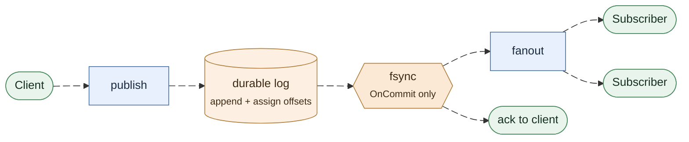
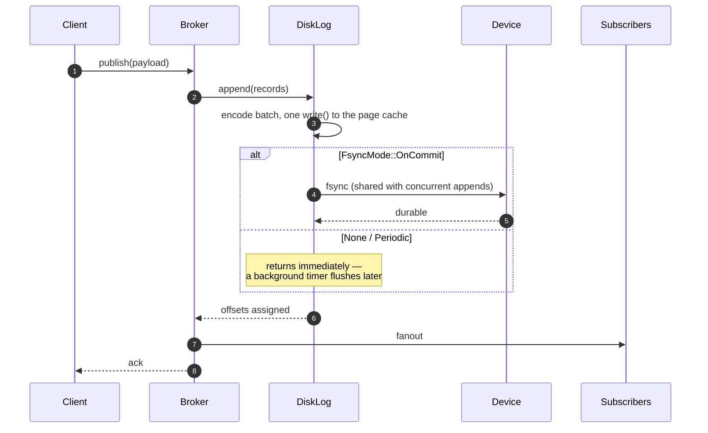
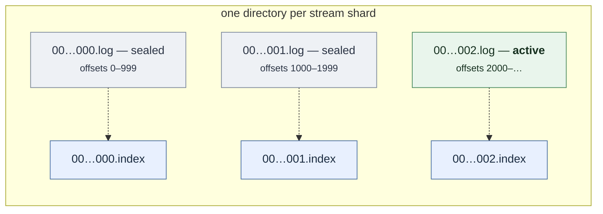
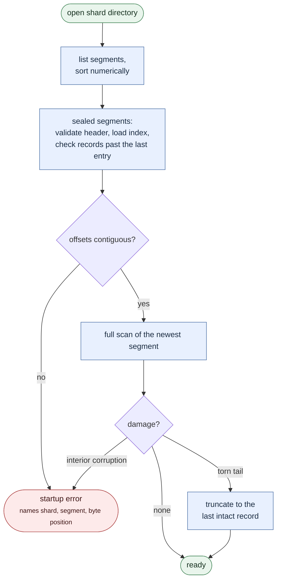
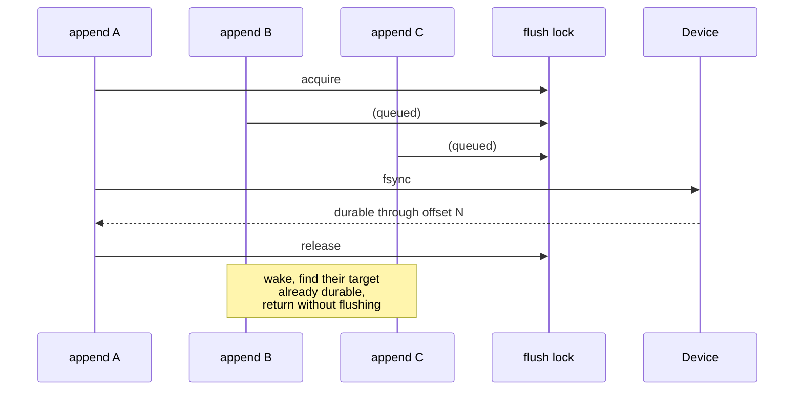

A stream registered with `durable: true` writes every publish to a segmented,
checksummed, crash-safe log before the publish is fanned out or acknowledged.
This page covers what that guarantees, how it is built, and what it costs.

## The guarantee

> A record that a durable publish acknowledged is readable after a restart,
> within the window the configured fsync policy allows.

The window is **zero** for `OnCommit`, **one interval** for `Periodic`, and
**undefined** for `None`.

Durability is opt-in. A broker started without `FELIX_DURABLE_STORAGE_DIR` is
in-memory only, and a stream the control plane marks durable is *rejected at
registration* rather than silently downgraded to a guarantee the broker cannot
keep.

Durability is immutable while a stream is registered. Remove and recreate a
stream to change it between ephemeral and durable; this explicitly invalidates
old handles and prevents durable offsets from diverging from existing in-memory
cursors.

## Ordering: append, then fanout, then ack



Nothing downstream of the log observes a record before it is durable: fanout
and the acknowledgement both hang off the flush, not off the append. Ordering
is the whole design, so the same path is worth spelling out step by step:



The append comes **first**, on purpose. A record delivered to subscribers and
acknowledged to the publisher but lost in a crash is a silent hole in a log that
consumers believe they have read. Writing first turns a storage failure into a
failed publish, which the publisher can retry — and it means a storage error can
never produce a success acknowledgement.

## Durability policies

| Mode | Flush trigger | Acknowledged when | Loss window |
| --- | --- | --- | --- |
| `none` | seal, shutdown | bytes reach the page cache | unbounded |
| `periodic { interval }` | background timer | bytes reach the page cache | one interval |
| `on_commit` | the append itself | bytes reach the device | none |

`none` is not "no durability": data survives a *process* crash, because the page
cache belongs to the kernel. It does not survive a machine crash or power loss.

`periodic` is the default. It is the only policy whose cost is invisible on the
append path while still bounding loss.

## On-disk layout



Each record carries its own length, logical offset, timestamp and a CRC-32 over
its header and payload. The length comes first and is covered by the checksum, so
a reader can step to the next record without decoding the current one's payload —
which is what makes index rebuilds and recovery scans cheap.

Index files are pure accelerators. They carry no checksums, are never trusted on
their own, and any index that fails to load is rebuilt from its segment.

The full byte layout, versioning rules, and corruption verdicts are in the
[Durable Segment Format specification](/felix/architecture/storage-format/).

## Recovery



Four properties hold:

1. **A torn tail is repaired.** A crash mid-append leaves a partial record at the
   end of the newest segment. It was never acknowledged under any policy, so it
   is truncated away.
2. **Committed data is never silently discarded.** Corruption anywhere else is a
   startup error naming the shard, segment and byte position. Refusing to start
   beats losing acknowledged records quietly.
3. **Recovery is idempotent.** Reopening an already recovered log changes
   nothing, so a crash *during* recovery is safe.
4. **Indexes are derived.** A missing or stale index is rebuilt, and the rebuilt
   index is byte-identical to one written during append.

Startup cost is bounded: the active segment is always scanned in full, sealed
segments only past their last index entry. Every read verifies the checksum of
every record it returns, so bit rot in cold data is still caught — when it is
read rather than at boot. Set `FELIX_DURABLE_VERIFY_ALL_ON_OPEN=true` to trade
startup time for eager detection.

## What durability costs

Measured on an Apple Mac Studio (M4 Max, 16 CPUs), APFS on internal NVMe,
128-byte payloads. Latencies are per `append` call.

| Policy | Batch | Concurrency | Records/s | p50 | p999 |
| --- | ---: | ---: | ---: | ---: | ---: |
| `none` | 1 | 1 | 571,898 | 1µs | 5µs |
| `periodic` | 1 | 1 | 492,106 | 1µs | 7µs |
| `periodic` | 16 | 1 | 2,671,267 | 3µs | 8µs |
| `on_commit` | 1 | 1 | 253 | 3.99ms | 10.7ms |
| `on_commit` | 1 | 64 | 14,387 | 4.07ms | 9.2ms |
| `on_commit` | 16 | 64 | 185,905 | 4.96ms | 9.2ms |

Two things to read out of this:

**`on_commit` latency is a hardware constant.** p50 is ~4ms in every row — one
APFS device flush. No software makes a single durable commit faster than the
device.

**Throughput scales with concurrency anyway, because of group commit.** An
`fsync` flushes the whole file, so one flush can satisfy every append waiting on
it. 253 → 14,387 records/second from concurrency 1 → 64 is a 57× gain from the
same code path, and batching on top reaches 185,905.


The lock protocol behind that picture — who flushes, and what the others find
when they wake:



The full matrix, the regression budget, and the reasoning behind each
optimisation are in
[the performance document](https://github.com/gabloe/felix/blob/main/docs/storage-performance.md).

## Configuration

| Variable | Default | Meaning |
| --- | --- | --- |
| `FELIX_DURABLE_STORAGE_DIR` | unset | Root directory; setting it enables durable streams |
| `FELIX_DURABLE_FSYNC_MODE` | `periodic` | `none` \| `periodic` \| `on_commit` |
| `FELIX_DURABLE_FSYNC_INTERVAL_MS` | `250` | Interval for `periodic` |
| `FELIX_DURABLE_SEGMENT_BYTES` | `268435456` | Rollover size |
| `FELIX_DURABLE_INDEX_SPACING_BYTES` | `4096` | Sparse index interval |
| `FELIX_DURABLE_MAX_RECORDS_PER_READ` | `10000` | Record cap on one range read |
| `FELIX_DURABLE_PREALLOCATE` | `true` | Reserve segment blocks at creation |
| `FELIX_DURABLE_VERIFY_ALL_ON_OPEN` | `false` | Checksum every segment at startup |
| `FELIX_DURABLE_REPAIR_CHECKSUM_TAIL` | `false` | Truncate a complete trailing record that fails its checksum (see below) |

Invalid combinations fail at startup, not at the first publish.

```sh
FELIX_DURABLE_STORAGE_DIR=/var/lib/felix/streams \
FELIX_DURABLE_FSYNC_MODE=on_commit \
  cargo run --release -p broker --bin felix-broker
```

## Observability

| Metric | Answers |
| --- | --- |
| `felix_storage_append_duration_seconds` | how long a durable publish takes end to end |
| `felix_storage_sync_duration_seconds` | how much of that is the device |
| `felix_storage_sync_batch_appends` | group-commit fan-in; near 1 under load means no batching |
| `felix_storage_unsynced_bytes` | data a crash would lose right now |
| `felix_storage_sync_failures_total` | non-zero means acknowledged durability is in doubt |
| `felix_storage_recovery_truncated_bytes` | bytes discarded from a torn tail |

The first two together answer the question that actually comes up: *is durability
the bottleneck?* If sync dominates append, the fsync policy is the cost.

## See it work

```sh
cargo run --release -p broker --bin durable-restart-demo
```

Publishes to one durable and one non-durable stream, drops the broker with no
graceful shutdown, boots a second broker over the same directory, and reads both
back. It verifies its own claims rather than narrating them, so a regression
makes it fail rather than print the wrong numbers.

## Limits today

- **One log per stream.** `shards` is carried through to the shard key but the
  data path is not yet sharded.
- **No retention.** `truncate` exists for replication's benefit; nothing deletes
  segments on age or size yet.
- **No tiered storage.** `TieredStore` and its companions are declared traits
  with no implementation. There is no hot/cold split and no cold-tier read path;
  every read comes from local segments. Sealed segments are immutable and carry
  a whole-file checksum, and reads already route per segment — so a cold tier
  slots in at that seam when it is built.
- **Single node.** Replication is M5; `seal`'s checksum and `read_range`'s
  bounded paging exist to serve it.
