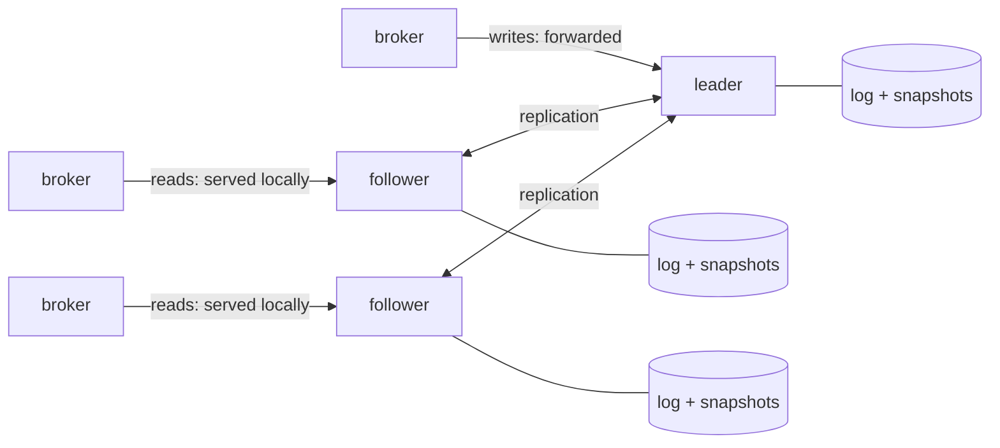

:::note[Status: M13 complete — the milestone signal is met]
All six slices are in ([#333](https://github.com/gabloe/felix/issues/333)):
the consensus core with its crash-safe store passing openraft's own storage
suite (#337), the deterministic metadata state machine (#338), the store
backend serving the whole HTTP API with no external database (#339), the
Postgres migration and DR path (#340), Raft-aware probes and configuration
(#341), and the chaos pass (#342): three real binaries under continuous
broker traffic survive rolling restarts, a SIGKILLed leader, a frozen
(SIGSTOP) leader thawed past several elections, and a wiped volume — with
**zero failed calls and every acknowledged write present on every member**.
The fault set is what a single machine can produce, the same honest scope
as the broker leader-failover suite. Postgres remains a fully supported
backend; pick per deployment ([Control-plane
HA](/felix/deployment/control-plane-ha/) covers that trade). The
authoritative design record, with every alternative, finding, and argument,
is
[`docs/metadata-raft-design.md`](https://github.com/gabloe/felix/blob/main/docs/metadata-raft-design.md).
:::

## What it is

Every control-plane instance embeds a Raft node; three instances form a
group. Metadata — tenants, streams, shard assignments, membership, auth
configuration — becomes a Raft-replicated state machine, persisted as a log
and snapshots on each instance's own volume. The external database
disappears; Postgres remains a supported backend for deployments that prefer
it.



## The load-bearing choices

- **The broker contract is frozen.** Snapshots, change feeds, heartbeats,
  leases — none change shape. The design lives entirely behind the store
  traits where the Postgres/memory split already lives, and the same
  contract test suites run against all three backends.
- **The state machine is the in-memory store.** `InMemoryStore` already
  implements every store trait; Raft puts a command log in front of it.
  Commands are API-shaped (`CreateStream`, `RegisterNode`,
  `BootstrapTenantAuth`), so every check-then-act race the Postgres backend
  closes with row locks, the log closes with total ordering.
- **Apply is deterministic.** Timestamps are stamped at propose time,
  generated values are carried in the command — three instances applying
  the same log reach byte-identical state, and a test asserts exactly that.
- **Reads stay local; writes go through the leader.** Broker watches are
  pull-based and eventually consistent by contract, so followers serve them.
  The expiry sweep and shard placement run only on the leader — one sweep
  because there is one leader.
- **Leases keep their arithmetic.** The Raft leader is the lease grantor; a
  new leader learns every outstanding grant from the log and waits out the
  same safety margin before granting again. Data-plane fencing gains a
  second epoch (the Raft term) under the one it already has (assignment
  generation).
- **Why the per-shard-Raft rejection doesn't apply here**: the
  [replication design](https://github.com/gabloe/felix/blob/main/docs/replication-design.md)
  rejected Raft for stream payloads because Raft truncates divergent log
  suffixes and the segment store never rewrites. The metadata Raft log is a
  separate, kilobyte-scale log that never touches `felix-storage` — the
  invariant conflict simply doesn't arise.

## What operators would see

| Event | Behaviour |
| --- | --- |
| One instance of three dies | Writes pause for one election timeout; reads keep serving; the M7 zero-failed-calls signal holds |
| An instance loses its volume | Rejoins empty, is caught up by snapshot install; no data surgery |
| Quorum lost | Survivors fail readiness rather than serve writes that cannot commit; brokers keep serving on their catalogs and leases, as during any control-plane outage |
| Migration from Postgres | A minutes-long metadata write freeze: import a consistent snapshot as the group's first state, repoint, verify, retire the database. Brokers tolerate the freeze by design |

Library: [openraft](https://github.com/databendlabs/openraft), pinned to the
stable 0.9 line, wrapped behind a seam so its pre-1.0 API churn stays
contained.

## Trying it (experimental)

Three environment variables select the backend, the same way a Postgres URL
selects Postgres:

```
FELIX_RAFT_NODE_ID=1
FELIX_RAFT_DATA_DIR=/var/lib/felix/raft
FELIX_RAFT_PEERS=1=cp-0:8443,2=cp-1:8443,3=cp-2:8443
```

Every member must carry the **same** peers map (initializing two disjoint
member sets is how split brain is manufactured), and the data directory
must survive restarts — it is what makes a restart a rejoin. Writes reaching
a follower forward to the leader invisibly; the expiry sweep and shard
placement run only on the leader, confirmed by a linearizable check each
tick. A proposal that cannot commit — no leader, quorum lost — fails with an
error after a bounded deadline (default 10s) rather than hanging.

Timings are tunable when the defaults (150ms heartbeat, 600–1200ms election
window, snapshot every 500 entries) don't fit: `FELIX_RAFT_HEARTBEAT_MS`,
`FELIX_RAFT_ELECTION_TIMEOUT_MIN_MS` / `_MAX_MS`,
`FELIX_RAFT_SNAPSHOT_LOGS_SINCE_LAST`, `FELIX_RAFT_LOGS_KEPT_BEHIND_SNAPSHOT`,
`FELIX_RAFT_WRITE_TIMEOUT_MS`. An election window at or below the heartbeat
is refused at startup — it would elect against healthy leaders.

### Probes under raft

`/v1/system/ready` answers from consensus state, all read locally (a probe
never costs a consensus round trip): the member knows a leader, its applied
state trails its own log by no more than a bound, and — when it *is* the
leader — a quorum has acknowledged it within the last 5s. That last clause
is what takes a partitioned, quorumless leader out of rotation before it
serves stale reads, and it is proven by test. `/v1/system/live` stays
process-local, exactly as before: losing quorum is not fixed by a restart.
The M7 probe settings (intervals, thresholds) carry over unchanged.

Consensus position ships as metrics: `felix_meta_raft_term`,
`_is_leader`, `_leader_known`, `_last_log_index`, `_last_applied_index`,
`_snapshot_index` (gauges), plus `felix_meta_raft_forwarded_proposals_total`
(informational — the LB is handing writes to followers) and
`felix_meta_raft_write_timeouts_total` — the counter to alert on, because it
means no leader or no quorum.

### Known fact: leader deploys pause writes for one election (pre-0.10 openraft)

openraft 0.9 has no leadership-transfer API, so a rolling deploy that
restarts the current **leader** pauses metadata writes for one election
timeout (~1.2s at defaults) while a successor elects itself. Reads keep
serving, followers restart with no pause, and brokers are unaffected by
construction — they retry heartbeats and keep their catalogs through far
longer outages than this. `transfer_leader` arrives with openraft 0.10, and
the seam owns the shutdown path, so adopting it is a contained change. Until
then: a bounded, documented fact, not a bug.

### Deploying on Kubernetes

The shape the design assumed from the start — a StatefulSet with one PVC
per member and a headless service for stable peer names:

```yaml
apiVersion: apps/v1
kind: StatefulSet
metadata:
  name: felix-controlplane
spec:
  serviceName: felix-controlplane      # headless: stable per-pod DNS
  replicas: 3
  template:
    spec:
      containers:
        - name: controlplane
          env:
            - name: POD_NAME
              valueFrom: { fieldRef: { fieldPath: metadata.name } }
            # Ordinal → node id (an initContainer or entrypoint derives
            # FELIX_RAFT_NODE_ID = ordinal + 1 from POD_NAME).
            - name: FELIX_RAFT_DATA_DIR
              value: /var/lib/felix/raft
            - name: FELIX_RAFT_PEERS
              value: "1=felix-controlplane-0.felix-controlplane:8443,2=felix-controlplane-1.felix-controlplane:8443,3=felix-controlplane-2.felix-controlplane:8443"
          volumeMounts:
            - name: raft
              mountPath: /var/lib/felix/raft
          readinessProbe:
            httpGet: { path: /v1/system/ready, port: 8443 }
            periodSeconds: 2
          livenessProbe:
            httpGet: { path: /v1/system/live, port: 8443 }
            periodSeconds: 10
  volumeClaimTemplates:
    - metadata: { name: raft }
      spec:
        accessModes: ["ReadWriteOnce"]
        resources: { requests: { storage: 1Gi } }
```

The PVC is what makes a pod restart a rejoin; a member whose volume is lost
rejoins empty and is rebuilt by snapshot install. Packaged charts are M9's
job (#131) — this is the reference shape they will encode.

## Migrating from Postgres

An offline cutover measured in minutes, which brokers tolerate by design
(they keep serving on their catalogs and leases, as during any
control-plane blip):

```
# 1. Stand up the fresh Raft group (its import guard refuses a used one).
# 2. Freeze writes: take the Postgres-backed instances out of rotation.
# 3. Export through the store traits — exactly what the API serves:
FELIX_CONTROLPLANE_POSTGRES_URL=postgres://... \
  felix-controlplane migrate export-postgres state.json

# 4. One atomic command, proposed to any member (it forwards to the leader):
felix-controlplane migrate import state.json http://cp-0:8443

# 5. Compare the printed summaries, spot-check, repoint, retire Postgres.
```

Each step before the repoint has a clean abort: nothing is half-migrated,
because the import is a single log entry applied atomically everywhere.
Change feeds carry their sequence high-water marks, so a broker at the head
continues without noticing and one behind the head resnapshots exactly once
— the ordinary signal it already honours.

**Disaster recovery** is the same mechanism: the export file is the DR
artifact, and `migrate import … --overwrite` onto a fresh group is the
restore. `--overwrite` discards whatever the target holds — checkpoints
included — so it belongs in a runbook, run deliberately, and nowhere else.

## What exists today (#337–#339)

The state machine is real: `MetadataStateMachine` wraps the same in-memory
store the control plane has always had, fed by a versioned command set with
one API-shaped command per mutation — heartbeat and expiry carry their
timestamps, bootstrap carries its candidate signing keys, so nothing inside
apply reads a clock or generates a value. The determinism harness applies a
full-coverage command script to two machines and requires **byte-identical
snapshots** — which promptly caught two real leaks (multi-node expiry and
cascade deletes publishing change events in HashMap order) before any
replica could disagree in production. On a real three-node group, eight
concurrent tenant bootstraps come out with exactly one winner and three
byte-identical replicas, settled by nothing but the order the log assigned.

### The consensus core underneath (#337)

`services/controlplane/src/raft/` is the whole openraft surface — no
consensus type escapes it. Outside the seam there are exactly two things: a
`RaftHandle` (start, initialize, write, add-learner, promote, snapshot,
status, shutdown) and an `AppStateMachine` trait whose contract is the
determinism rule above. Consensus state — log, vote, current snapshot —
lives in one crash-safe [redb](https://github.com/cberner/redb) file per
instance: an embedded ACID store was chosen over hand-rolled files because
votes and entries that get acknowledged and then lost are how one term
elects two leaders, and that plumbing is the last place to be inventive.
The store passes **openraft's own storage conformance suite** on every test
run, the same discipline as running the node/shard contract suites against
every metadata backend.

## The SWIM question, answered

Evaluated alongside this design and **rejected for now**: replacing
heartbeat-to-control-plane liveness with SWIM-style gossip membership. The
short version — the heartbeat is also the lease renewal, so liveness and
serving authority deliberately travel one channel to one authority; failover
speed is lease-bound (~1s), not liveness-bound (15s), so faster detection
buys nothing safety uses; and SWIM's constant-load advantage pays off at
hundreds of nodes, not tens. The full decision, including the asymmetric
reachability gap that peer-reachability reports would cover more cheaply and
the triggers for reopening, is in
[`docs/control-plane.md`](https://github.com/gabloe/felix/blob/main/docs/control-plane.md#why-liveness-stays-centralized-swim-considered).
