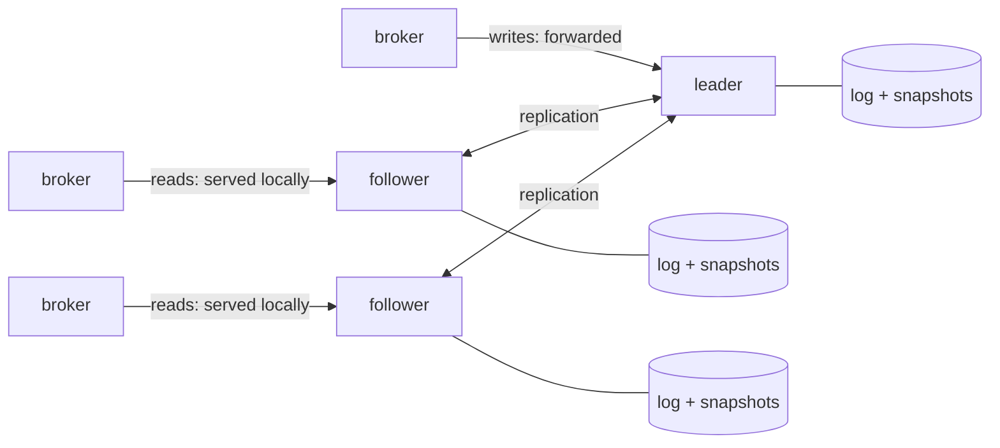

:::caution[Status: under construction — the backend serves end to end and the Postgres migration is in; probes/packaging and chaos validation remain]
Tracked as milestone M13 under
[#333](https://github.com/gabloe/felix/issues/333). What exists today: the
consensus core from [#337](https://github.com/gabloe/felix/issues/337) (the
openraft seam, a crash-safe log/vote/snapshot store that passes openraft's
own storage conformance suite, HTTP transport, group lifecycle), and the
metadata state machine from [#338](https://github.com/gabloe/felix/issues/338)
(the versioned API-shaped command set over the in-memory store, held to
byte-identical determinism by a harness), and the store backend from
[#339](https://github.com/gabloe/felix/issues/339): `backend = raft` serves
the whole HTTP API with **no external database**, proven by a binary-level
test that creates metadata, restarts the process, and reads it back from
the Raft log and snapshot alone. Not yet the recommended production path:
Raft-aware probes and packaging (#341) and the chaos pass (#342) are still
open — until they land, production deployments stay on N stateless
instances over one HA Postgres — see
[Control-plane HA](/felix/deployment/control-plane-ha/). The migration
path from Postgres (#340) is in: see below.
The authoritative design record, with every alternative and the arguments, is
[`docs/metadata-raft-design.md`](https://github.com/gabloe/felix/blob/main/docs/metadata-raft-design.md).
:::

## What it is

Every control-plane instance embeds a Raft node; three instances form a
group. Metadata — tenants, streams, shard assignments, membership, auth
configuration — becomes a Raft-replicated state machine, persisted as a log
and snapshots on each instance's own volume. The external database
disappears; Postgres remains a supported backend for deployments that prefer
it.



## The load-bearing choices

- **The broker contract is frozen.** Snapshots, change feeds, heartbeats,
  leases — none change shape. The design lives entirely behind the store
  traits where the Postgres/memory split already lives, and the same
  contract test suites run against all three backends.
- **The state machine is the in-memory store.** `InMemoryStore` already
  implements every store trait; Raft puts a command log in front of it.
  Commands are API-shaped (`CreateStream`, `RegisterNode`,
  `BootstrapTenantAuth`), so every check-then-act race the Postgres backend
  closes with row locks, the log closes with total ordering.
- **Apply is deterministic.** Timestamps are stamped at propose time,
  generated values are carried in the command — three instances applying
  the same log reach byte-identical state, and a test asserts exactly that.
- **Reads stay local; writes go through the leader.** Broker watches are
  pull-based and eventually consistent by contract, so followers serve them.
  The expiry sweep and shard placement run only on the leader — one sweep
  because there is one leader.
- **Leases keep their arithmetic.** The Raft leader is the lease grantor; a
  new leader learns every outstanding grant from the log and waits out the
  same safety margin before granting again. Data-plane fencing gains a
  second epoch (the Raft term) under the one it already has (assignment
  generation).
- **Why the per-shard-Raft rejection doesn't apply here**: the
  [replication design](https://github.com/gabloe/felix/blob/main/docs/replication-design.md)
  rejected Raft for stream payloads because Raft truncates divergent log
  suffixes and the segment store never rewrites. The metadata Raft log is a
  separate, kilobyte-scale log that never touches `felix-storage` — the
  invariant conflict simply doesn't arise.

## What operators would see

| Event | Behaviour |
| --- | --- |
| One instance of three dies | Writes pause for one election timeout; reads keep serving; the M7 zero-failed-calls signal holds |
| An instance loses its volume | Rejoins empty, is caught up by snapshot install; no data surgery |
| Quorum lost | Survivors fail readiness rather than serve writes that cannot commit; brokers keep serving on their catalogs and leases, as during any control-plane outage |
| Migration from Postgres | A minutes-long metadata write freeze: import a consistent snapshot as the group's first state, repoint, verify, retire the database. Brokers tolerate the freeze by design |

Library: [openraft](https://github.com/databendlabs/openraft), pinned to the
stable 0.9 line, wrapped behind a seam so its pre-1.0 API churn stays
contained.

## Trying it (experimental)

Three environment variables select the backend, the same way a Postgres URL
selects Postgres:

```
FELIX_RAFT_NODE_ID=1
FELIX_RAFT_DATA_DIR=/var/lib/felix/raft
FELIX_RAFT_PEERS=1=cp-0:8443,2=cp-1:8443,3=cp-2:8443
```

Every member must carry the **same** peers map (initializing two disjoint
member sets is how split brain is manufactured), and the data directory
must survive restarts — it is what makes a restart a rejoin. Writes reaching
a follower forward to the leader invisibly; the expiry sweep and shard
placement run only on the leader, confirmed by a linearizable check each
tick. A proposal that cannot commit — no leader, quorum lost — fails with an
error after a bounded deadline (10s) rather than hanging, and readiness
reports an instance that knows no leader as unready.

## Migrating from Postgres

An offline cutover measured in minutes, which brokers tolerate by design
(they keep serving on their catalogs and leases, as during any
control-plane blip):

```
# 1. Stand up the fresh Raft group (its import guard refuses a used one).
# 2. Freeze writes: take the Postgres-backed instances out of rotation.
# 3. Export through the store traits — exactly what the API serves:
FELIX_CONTROLPLANE_POSTGRES_URL=postgres://... \
  felix-controlplane migrate export-postgres state.json

# 4. One atomic command, proposed to any member (it forwards to the leader):
felix-controlplane migrate import state.json http://cp-0:8443

# 5. Compare the printed summaries, spot-check, repoint, retire Postgres.
```

Each step before the repoint has a clean abort: nothing is half-migrated,
because the import is a single log entry applied atomically everywhere.
Change feeds carry their sequence high-water marks, so a broker at the head
continues without noticing and one behind the head resnapshots exactly once
— the ordinary signal it already honours.

**Disaster recovery** is the same mechanism: the export file is the DR
artifact, and `migrate import … --overwrite` onto a fresh group is the
restore. `--overwrite` discards whatever the target holds — checkpoints
included — so it belongs in a runbook, run deliberately, and nowhere else.

## What exists today (#337–#339)

The state machine is real: `MetadataStateMachine` wraps the same in-memory
store the control plane has always had, fed by a versioned command set with
one API-shaped command per mutation — heartbeat and expiry carry their
timestamps, bootstrap carries its candidate signing keys, so nothing inside
apply reads a clock or generates a value. The determinism harness applies a
full-coverage command script to two machines and requires **byte-identical
snapshots** — which promptly caught two real leaks (multi-node expiry and
cascade deletes publishing change events in HashMap order) before any
replica could disagree in production. On a real three-node group, eight
concurrent tenant bootstraps come out with exactly one winner and three
byte-identical replicas, settled by nothing but the order the log assigned.

### The consensus core underneath (#337)

`services/controlplane/src/raft/` is the whole openraft surface — no
consensus type escapes it. Outside the seam there are exactly two things: a
`RaftHandle` (start, initialize, write, add-learner, promote, snapshot,
status, shutdown) and an `AppStateMachine` trait whose contract is the
determinism rule above. Consensus state — log, vote, current snapshot —
lives in one crash-safe [redb](https://github.com/cberner/redb) file per
instance: an embedded ACID store was chosen over hand-rolled files because
votes and entries that get acknowledged and then lost are how one term
elects two leaders, and that plumbing is the last place to be inventive.
The store passes **openraft's own storage conformance suite** on every test
run, the same discipline as running the node/shard contract suites against
every metadata backend.

## The SWIM question, answered

Evaluated alongside this design and **rejected for now**: replacing
heartbeat-to-control-plane liveness with SWIM-style gossip membership. The
short version — the heartbeat is also the lease renewal, so liveness and
serving authority deliberately travel one channel to one authority; failover
speed is lease-bound (~1s), not liveness-bound (15s), so faster detection
buys nothing safety uses; and SWIM's constant-load advantage pays off at
hundreds of nodes, not tens. The full decision, including the asymmetric
reachability gap that peer-reachability reports would cover more cheaply and
the triggers for reopening, is in
[`docs/control-plane.md`](https://github.com/gabloe/felix/blob/main/docs/control-plane.md#why-liveness-stays-centralized-swim-considered).
