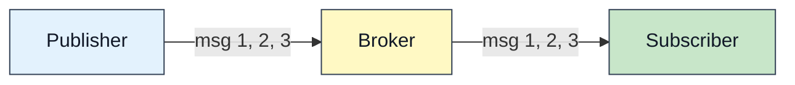
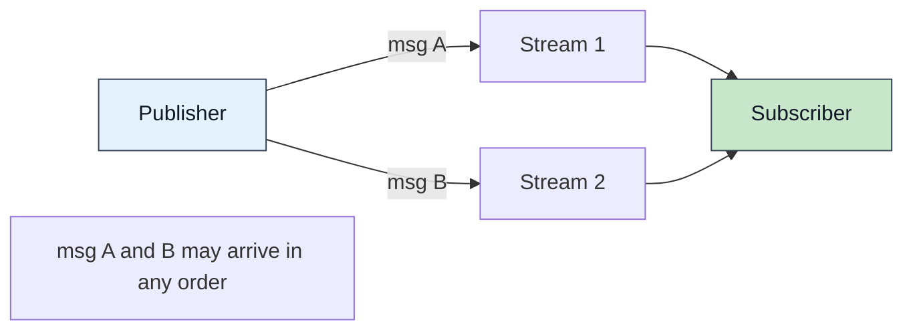
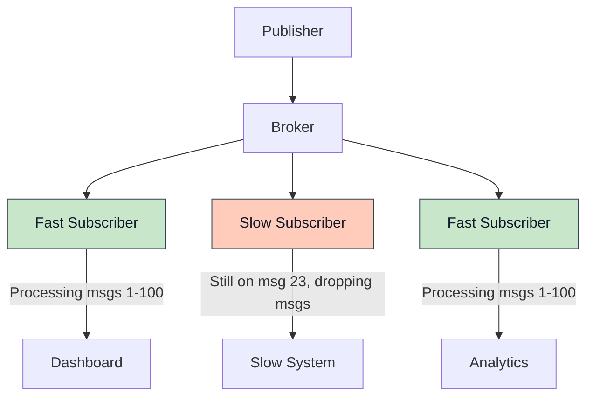
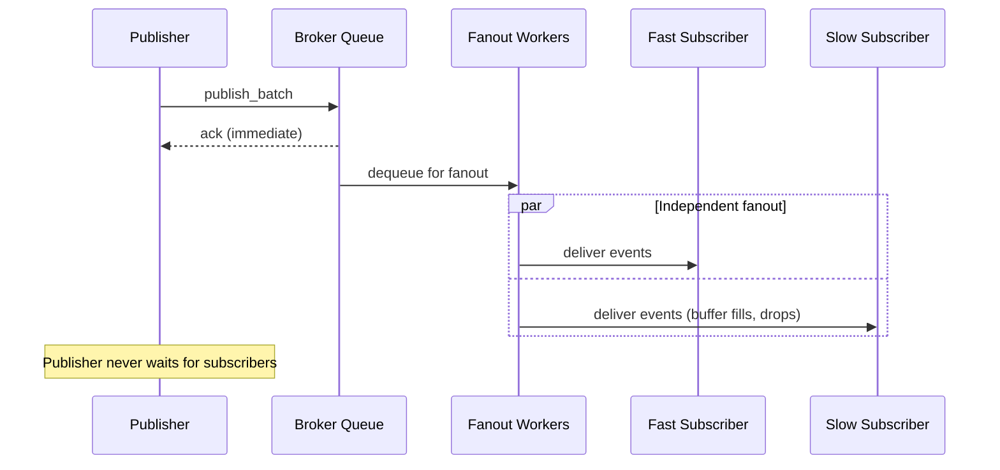
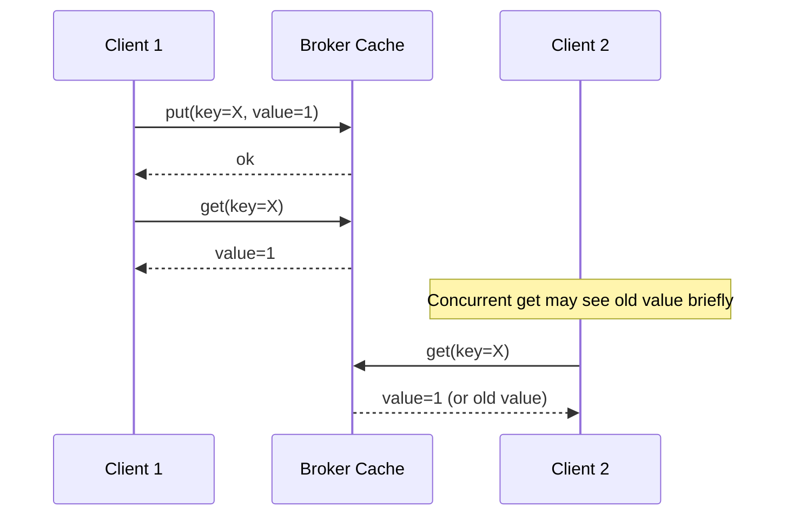
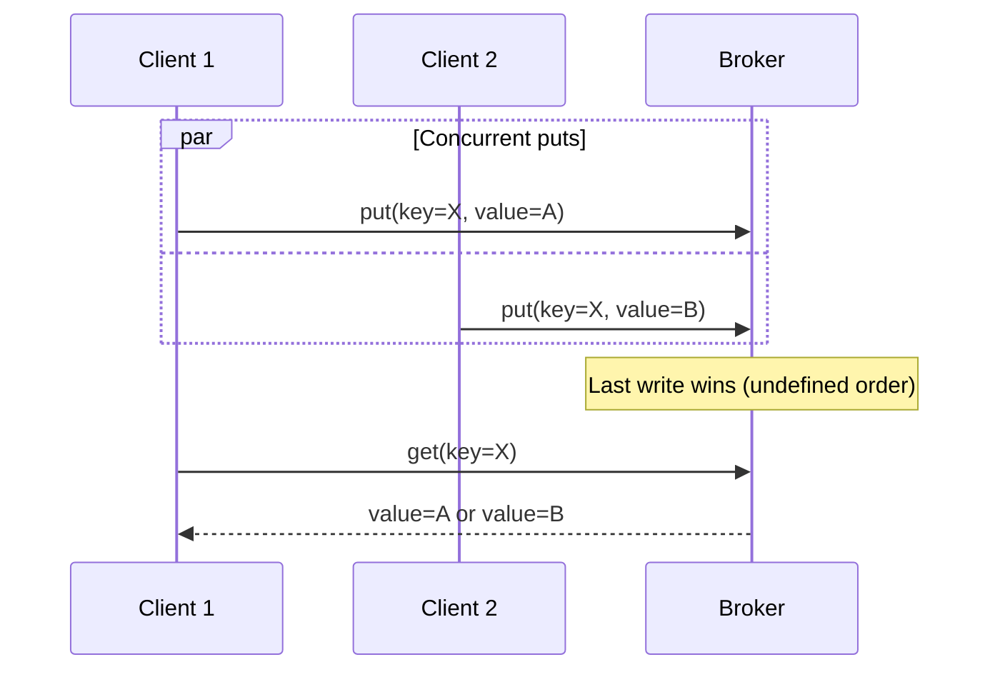
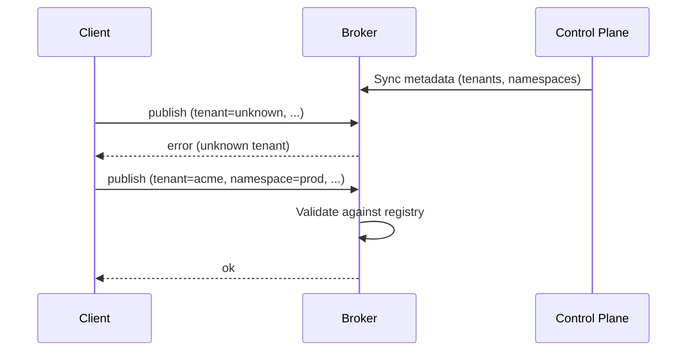

The behavioral contract: exactly what Felix promises about delivery, ordering, durability, and consistency — and, just as deliberately, what it does not. Applications should rely on what is written here and nothing stronger.

## Philosophy: Explicit Over Implicit

Felix makes trade-offs explicit rather than hiding them behind ambiguous guarantees. Every semantic choice has observable behavior that can be tested and reasoned about.

:::note[What is built and what is not]
This page describes behaviour that exists and behaviour that is planned. Where
they differ it says which. The [status table](/felix/getting-started/what-felix-is-for/)
is the authority per capability, and [Projections](/felix/architecture/projections/)
carries the test behind each claim about a semantic.
:::
## Pub/Sub Delivery Semantics

### Delivery Guarantees

A stream's guarantee follows from how it is registered.

**An ephemeral stream is at-most-once.** This is the default:

- Messages are delivered to subscribers zero or one time
- No retries or redelivery
- No acknowledgements from subscribers
- Slow subscribers may drop messages without notification

**A durable stream is at-least-once.** Every record is written to disk before
the publish is acknowledged, and a subscriber replays from any retained offset,
so a record survives a broker restart and can be read again. A stream declared
`Quorum` waits for a majority of its replicas before acknowledging, so the
record also survives losing the broker that accepted it.

**A consumer group is at-least-once, and redelivers.** A record handed to a
consumer that does not answer is handed to another once the visibility timeout
lapses. See [Projections](/felix/architecture/projections/).

At-most-once is appropriate for:
- Real-time signals where latest value matters most
- High-frequency metrics and telemetry
- Workloads where occasional loss is acceptable
- Applications that implement their own deduplication

:::caution[Message Loss Scenarios]
Messages can be lost when:
- Subscriber falls behind buffer capacity
- Network partition between broker and subscriber
- Subscriber disconnects without draining buffer
- Broker restarts — for **ephemeral** streams. A stream registered with
  `durable: true` persists each record before acknowledging it, and replays it
  after a restart; see [Durable Storage](/felix/architecture/durable-storage/).
:::
**Example at-most-once workload**:

```rust
// Real-time sensor data where latest reading matters most
let mut subscription = client.subscribe("acme", "sensors", "temperature").await?;

while let Some(event) = subscription.next_event().await? {
    // Process latest temperature reading
    // If we miss a reading, the next one will arrive soon
    update_dashboard(event.payload);
}
```

### At-least-once, and why there is no third guarantee

At-least-once is implemented, two ways, and both are described above: replay a
durable stream from a checkpointed offset, or consume through a **consumer
group**, which requires an acknowledgement per record, redelivers anything
unanswered once its visibility timeout lapses, and dead-letters a record that has
been attempted too many times.

**Idempotent producers are implemented; exactly-once delivery is not.** A
producer takes an id from the broker and numbers its batches, and a batch
re-sent after a lost acknowledgement lands once: the shard's leader answers a
sequence it already holds from memory rather than appending it again. That
closes the ambiguous-outcome gap on the publish side (`ClusterClient::idempotent_producer`,
negotiated as `FEATURE_IDEMPOTENT_PRODUCER`). It does not make delivery
exactly-once: a consumer can still see a record twice on redelivery, and
end-to-end exactly-once would also need transactional coordination across the
log and the consumer's own state, and deduplication on receive — which has to
live in the application regardless, because the application is the only thing
that knows what makes two records the same. Deduplicate there, keyed on
something the record carries.

:::caution[Three fields on a stream are declared and not enforced]
`kind` is the one most likely to mislead: creating a stream with `kind: Queue`
does not make it a queue, and does not stop it being subscribed to normally.
Consumer groups work over any durable stream. `retention` is decided by the
broker-wide `FELIX_DURABLE_RETENTION_*` settings instead, and `delivery` by how
a client chooses to read.
:::

:::caution[A stream's `delivery` field is not enforced]
The control plane accepts `AtMostOnce` and `AtLeastOnce` on a stream and stores
the value, but no broker code reads it. What a consumer gets is decided by how
it reads — a plain subscription, or a consumer group — and not by what the
stream declares. Do not rely on it.
:::

### Consistency: how many brokers must hold it

A durable stream is replicated to a set of brokers — one leader and its
replicas. `consistency` on the stream decides **how many of them must hold a
record before the publisher is told it is safe.**

![The same publish under two consistency levels. Under Leader, the shard's leader writes the record durably and acknowledges immediately; the replicas receive their copies afterwards, and the acknowledgement did not wait for them. Under Quorum, the leader writes durably, ships the record to both replicas, and acknowledges only once a majority of the replica set holds it, so the acknowledgement arrives later. A bar beneath each row shows the time until the client is told, and the Quorum bar is more than twice as long.](/felix/diagrams/quorum-ack.svg)

**`Leader`** — the default. The leader writes the record to its own log,
durably, and answers. Replication still happens; the acknowledgement simply
does not wait for it. One round trip.

With the broker's default `ack_on_commit: false`, that answer goes out when the
publish is queued, before the write. A record acknowledged that way is lost if
the leader crashes before writing it, or if a pause outlasts the leader's lease:
the write is then refused, because another broker may lead the shard by then.
Near the end of the lease the broker waits for the write anyway, so a lapse
comes back as `shard_unavailable`, and a loss after an ack is counted in
`felix_broker_acked_publishes_dropped_total`. For an acknowledgement that
means the record is on disk, set `ack_on_commit: true` or use `Quorum`.

**`Quorum`** — the leader writes durably, ships the record to its replicas
concurrently, and answers once a **majority of the replica set, counting
itself**, holds it. On a set of three that is two, so one unreachable replica
costs nothing — the leader is not waiting for all of them, only for enough.

Note what `Quorum` does *not* change. The record is written the same way, to the
same log, with the same fsync policy. What changes is what the acknowledgement
**means**:

> A `Quorum` acknowledgement survives losing the leader. A `Leader`
> acknowledgement is a promise only that one broker can keep.

:::caution[One interleaving does not yet honour this]
The guarantee holds against every fault the suite injects — kill, graceful
stop, freeze and partition. A model check of the promotion protocol
(`task tla:check`) finds one it does not reach: promotion picks from the
leader's **last report**, so a leader that acknowledges a `Quorum` write and
then dies before its next report leaves the control plane a *fresh* report
naming a replica that never received the record. Report expiry does not
close it — the report is recent, it is only older than the acknowledgement.

Promotion by greatest (last generation, length) closes it, and the model
finds no violating trace under that rule.
[#527](https://github.com/gabloe/felix/issues/527) tracks the change.
:::

#### What each one costs

`Quorum` costs latency, and it costs availability at the other end: a stream
that cannot reach a majority **stops accepting writes** rather than accepting
ones it might not keep. A publish with no reachable majority is refused, and a
refusal means *"this cannot be vouched for"* rather than *"this did not
happen"* — the record may well have landed on the leader. Retry through an
idempotent producer, which re-sends under the same sequence and cannot land
it twice.

`Leader` is one round trip instead of two, and it moves the moment you find out.
If the leader dies holding a record nothing else has, the control plane will not
promote a replica, because promoting one would open the shard **without** that
record and no reader could tell. The shard is left unavailable until the old
leader returns with its disk.

So the trade is not really safety against latency. Both refuse to lose a
record acknowledged after it was written (for `Leader`, with `ack_on_commit`
on); they differ in **when you learn there is a problem** —
`Quorum` at publish time, while you still hold the record, or `Leader` at
failover time, when the only copy is on a broker that is gone.

[`task cluster:consistency`](/felix/demos/cluster-consistency/) runs exactly
that: the same fault put to both, on a real three-node cluster.

### Message Ordering

**Within a stream**: Ordering is preserved per publisher-broker-subscriber path.



**Guarantees**:
- Messages from a single publisher to a stream arrive in send order
- A single subscriber sees messages in the order they were enqueued
- Order is preserved through batching and fanout

**Across streams**: No ordering guarantees.



**Example**:

```rust
// Publish to two streams
use felix_wire::AckMode;
let publisher = client.publisher().await?;
publisher
    .publish("acme", "prod", "user-login", login_event, AckMode::None)
    .await?;
publisher
    .publish("acme", "prod", "audit-log", audit_event, AckMode::None)
    .await?;

// Subscribers to user-login and audit-log may see events in any relative order
```

**Ordering within batches**:

```rust
// Batch publish preserves order within the batch
use felix_wire::AckMode;
let publisher = client.publisher().await?;
let messages = vec![msg1, msg2, msg3];
publisher
    .publish_batch("acme", "prod", "orders", messages, AckMode::PerBatch)
    .await?;

// Subscribers will see msg1, msg2, msg3 in that order
```

### Fanout Fairness

Felix enforces **subscriber isolation**: slow subscribers never block fast subscribers.



**Isolation mechanism**:

Each subscription maintains an independent buffer:

```rust
pub struct Subscription {
    buffer: BoundedQueue<Event>,  // Per-subscription buffer
    event_stream: UnidirectionalStream,  // Independent QUIC stream
}
```

**Buffer behavior**:

- Each subscriber has `subscriber_queue_capacity` buffer slots (default: 512)
- When buffer fills, new events are **dropped for that subscriber only**
- Other subscribers continue receiving events normally
- A drop is not announced. For a durable stream a subscriber can *detect* one, because delivered records carry log offsets and a jump between consecutive offsets is exactly a drop.

**Configuration**:

```yaml
# Broker config
subscriber_queue_capacity: 512  # Per-subscriber buffer size
subscriber_writer_lanes: 4
subscriber_lane_shard: auto
```

A larger buffer tolerates more bursty subscribers, trading memory for burst
tolerance:

```yaml
subscriber_queue_capacity: 4096
```

:::tip[Sizing Buffer Depth]
Choose `subscriber_queue_capacity` based on:
- Expected subscriber processing latency variance
- Memory budget (depth × average event size × subscriber count)
- Tolerance for temporary slowdowns

For latency-sensitive workloads with consistent throughput: 512-1024
For bursty workloads with high fanout: 2048-4096
:::
### Publisher Backpressure

**Publisher behavior**: Publishing never blocks on subscriber speed.



**Publisher queue**:

Publishers write to a bounded queue with configurable depth:

```yaml
pub_queue_depth: 64  # Bounded publish queue
publish_queue_wait_timeout_ms: 2000  # Timeout if queue full
```

When the publish queue is full:
- New publishes block up to `publish_queue_wait_timeout_ms`
- After timeout, publish fails with error
- This indicates broker overload (too many publishes, insufficient workers)

**Tuning publish pipeline**:

```yaml
# Increase parallelism
pub_workers_per_conn: 4

# Increase buffer (trades latency for burst tolerance)
pub_queue_depth: 256

# Faster timeout for fail-fast behavior
publish_queue_wait_timeout_ms: 1000
```

### Disconnection Behavior

**Subscriber disconnects**:

- Subscription is immediately removed from registry
- Buffered events for that subscriber are discarded
- No redelivery: a plain subscription has no record of what was handled. A
  consumer group does, and redelivers anything claimed but never acknowledged
  once its visibility timeout lapses
- Subscriber must re-subscribe. On a durable stream it can resume at a
  checkpointed offset rather than restarting at the tail; on an ephemeral one
  the tail is all there is

**Publisher disconnects**:

- In-flight publishes may be lost if not acknowledged
- No automatic retry or persistence of unacked publishes
- Application must handle reconnection and retry logic

**Broker restarts**:

- In-memory state is lost. Durable streams, the log-backed cache, and consumer-group positions are on disk and survive.
- Active subscriptions are terminated
- Clients detect connection loss and must reconnect
- No historical replay available

## Cache Semantics

### Consistency Model

Felix cache provides **eventual consistency** with **read-your-writes** for single clients:



**Guarantees**:

1. **Read-your-writes**: Client sees its own writes immediately
2. **Monotonic reads**: Client never sees older values after newer ones (single session)
3. **Eventual consistency**: All clients eventually see the latest value
4. **No dirty reads**: Clients never see partial or uncommitted writes

**Not guaranteed**:

- Linearizability across clients
- Causal consistency across keys
- Multi-key transactions

### TTL and Expiration

**TTL semantics**:

```rust
// Store with 60-second TTL
use bytes::Bytes;
client
    .cache_put(
        "acme",
        "prod",
        "session",
        session_id,
        Bytes::from(session_data),
        Some(60_000),
    )
    .await?;

// Store without expiration
client
    .cache_put("acme", "prod", "config", config_key, Bytes::from(config_value), None)
    .await?;
```

**Expiration behavior**:

- TTL countdown starts when `cache_put` returns `ok`
- Expiration is **lazy**: checked on access, not proactively
- Expired entries return `null` on `cache_get`
- Expired entries may occupy memory until accessed or evicted

:::caution[TTL Precision]
TTL enforcement is best-effort. Under high load, expired entries might be accessible for short periods after TTL expires. This is typically < 100ms but not guaranteed.
:::
### Cache Scoping

Cache entries are scoped to `(tenant_id, namespace, cache_name, key)`:

```rust
// These are independent cache entries:
client.cache_put_scoped("tenant1", "prod", "sessions", "user123", data).await?;
client.cache_put_scoped("tenant1", "staging", "sessions", "user123", data).await?;
client.cache_put_scoped("tenant2", "prod", "sessions", "user123", data).await?;
```

**Isolation guarantees**:

- Different tenants cannot access each other's cache entries
- Different namespaces within a tenant are isolated
- Keys are unique only within their (tenant, namespace, cache) scope

### Eviction Policy

**Today**: the in-memory cache evicts best-effort under pressure. The log-backed cache does not evict — it compacts, reclaiming superseded and expired records.

- No guaranteed LRU or LFU policy
- Eviction is opportunistic
- Applications should not rely on specific eviction order


### Concurrency and Race Conditions

**Concurrent writes to same key**:



**Behavior**: Last write wins, but order is undefined for concurrent writes.

**No atomic operations**:

- No compare-and-swap
- No atomic increment
- No multi-key transactions

**Planned features**:

- Conditional put (if-not-exists, if-match)
- Atomic increment/decrement
- Watch/notify on key changes

### Cache vs. Pub/Sub Integration (Future)

Planned feature: Pub/sub invalidation for cache consistency.

```rust
// Publish invalidates cache entry
client.publish_with_invalidation("events", "user-updated", event, 
    vec!["cache:sessions:user123"]).await?;

// Subscribers and cache both receive update
```

## Tenant and Namespace Model

### Existence Enforcement

**Wire protocol requirement**: All data-plane operations must specify tenant and namespace.

```json
{
  "type": "publish",
  "tenant_id": "acme-corp",
  "namespace": "production",
  "stream": "orders",
  "payload": "..."
}
```

**Broker validation**:

The broker enforces tenant/namespace existence:

1. Broker syncs metadata from control plane
2. Broker maintains local registry of valid tenant/namespace pairs
3. Operations for unknown tenant/namespace are rejected with `error` response



### Authorization

Enforced. Tenant-scoped tokens are verified at the broker, and publish,
subscribe and cache operations each check a permission before doing any work.

A **forwarded** publish is authorized twice — at the broker the client reached
and again at the shard's owner — so routing a request through the cluster does
not launder the credential it arrived with.

**Enforcement points**:
- Publish operations, at ingress and at the owner
- Subscribe operations
- Cache operations
- Control plane operations

Per-tenant quotas are a separate thing and are **not** enforced; see below.

### Quota Enforcement (Planned)

Not implemented. Nothing limits what a tenant can publish, subscribe to, or
cache. The shape it would take:

```yaml
quotas:
  - tenant: acme-corp
    namespace: production
    publish_rate_limit: 10000/s
    subscribe_connections: 100
    cache_memory: 10GB
    stream_retention: 7d
```

## Consistency Across Components

### Broker Internal Consistency

Within a single broker:

- **Publish-fanout ordering**: Messages fan out in publish order
- **Cache consistency**: Single-writer per key (no torn writes)
- **Subscription isolation**: Independent queues prevent crosstalk

### Multi-Broker Consistency

In a clustered deployment:

- **Shard leadership**: Only one leader per shard, and it serves only while it
  holds a lease. A broker that has been superseded stops acknowledging rather
  than discovering the fact later
- **Metadata consistency**: strongly consistent, because it lives in one Postgres that every control-plane instance reads and writes
- **Cross-shard ordering**: Not guaranteed. Ordering is per key, because a key
  always resolves to the same shard and a shard is one log on one leader
- **Cache consistency**: One owner per key, not eventual. A key hashes to a
  shard, that shard has one owner, and a broker receiving an operation for a key
  it does not own forwards it there — so a value written through any broker is
  readable through every other, and two brokers cannot hold divergent values for
  the same key. A cache write is acknowledged by its leader; a cache cannot
  declare `Quorum`

## Failure Scenarios and Behavior

### Network Partition

**Publisher-Broker partition**:

- Publisher detects connection loss (QUIC idle timeout)
- Unacknowledged publishes are lost
- Publisher must reconnect and retry

**Subscriber-Broker partition**:

- Subscriber detects connection loss
- Buffered events are lost
- Subscriber must reconnect and re-subscribe (starts from tail)

**Broker-Control Plane partition**:

- Broker continues serving with cached metadata
- New stream creation fails
- Existing streams continue operating
- Broker reconciles when connection restored

### Broker Failure

**Process crash**:

- In-memory state is lost. Durable streams, the log-backed cache, and consumer-group positions are on disk and survive.
- Clients detect connection loss
- Clients must reconnect to recovered broker
- Subscriptions must be re-established

**Planned behavior with durability**:

- Durable streams can replay from last checkpoint
- Subscribers can resume from last acknowledged offset
- Cache state can be rebuilt from log

### Slow Subscriber Behavior

**Scenario**: Subscriber processing slows down.

**Stages**:

1. **Buffer absorbs slowdown**: Events accumulate in subscriber buffer
2. **Buffer fills**: New events start getting dropped for that subscriber
3. **Other subscribers unaffected**: Fast subscribers continue normally

**Detection, today**: the broker counts drops per subscriber queue
(`felix_sub_queue_dropped_total`) and logs when a subscriber falls behind.
On a durable stream the subscriber itself can detect loss from an offset gap
and resume. There is no per-subscription lag API and no automatic disconnect
of chronically slow subscribers.

## Testing Semantics

### Conformance Testing

Applications can test semantic guarantees:

**Ordering test**:

```rust
// Publish ordered batch
let messages = vec!["msg1", "msg2", "msg3"];
use felix_wire::AckMode;
let publisher = client.publisher().await?;
publisher
    .publish_batch("test", "default", "orders", messages, AckMode::PerBatch)
    .await?;

// Verify subscriber receives in order
let events = collect_events(&mut subscription, 3).await?;
assert_eq!(events, vec!["msg1", "msg2", "msg3"]);
```

**Isolation test**:

```rust
// Start fast and slow subscribers
let mut fast_sub = client.subscribe("test", "default", "stream").await?;
let mut slow_sub = client.subscribe("test", "default", "stream").await?;

// Slow subscriber delays processing
simulate_slow_processing(&mut slow_sub);

// Verify fast subscriber still receives all messages
let fast_count = count_events(&mut fast_sub, timeout).await?;
assert!(fast_count >= expected_count);
```

## Summary: Semantic Guarantees Matrix

| Property | Today | Not built |
|----------|-------|-----------|
| **Pub/Sub delivery** | At-most-once ephemeral, at-least-once durable; idempotent producers land a re-sent publish once | Exactly-once delivery |
| **Consumer groups** | At-least-once, bounded redelivery, dead letters | Shard assignment across a group's consumers |
| **Message ordering** | Per shard | Configurable cross-shard |
| **Subscriber isolation** | Yes | — |
| **Cache** | Routed to one owner, replicated, read-your-writes through that owner; `Leader` or `Quorum` acknowledgement per cache | `Quorum` for counter updates, which are acknowledged by the leader |
| **TTL precision** | Lazy on access, against an absolute expiry | Sweeping expiry |
| **Durability** | Per stream: ephemeral, or `Leader` or `Quorum` acknowledgement | — |
| **Authorization** | Tenant-scoped tokens, RBAC per resource, OIDC exchange | — |
| **Quotas** | None | Per-tenant, per-namespace |
| **Multi-key operations** | None | Transactions |

## Recommendations

### Choosing Delivery Semantics

**Use an ephemeral stream (at-most-once) when**:
- Latest value is more important than history (sensor data, metrics)
- Occasional loss is acceptable (telemetry, monitoring)
- Throughput and latency matter more than guarantees
- Application implements own deduplication

**Use a durable stream, or a consumer group (at-least-once) when**:
- Every message matters (financial transactions, orders)
- Application can handle duplicates (idempotent processing)
- Durability matters more than latency

**Exactly-once delivery is not implemented.** An idempotent producer keeps a
publish retry from duplicating the record; a consumer's redelivery is still
at-least-once. If duplicates are unacceptable on the consuming side — billing,
accounting — the deduplication has to be in the application, keyed on
something the record carries.

### Cache Usage Patterns

**Good cache use cases**:
- Session data with TTL
- Configuration with infrequent updates
- Rate limiting counters (with planned atomic increment)
- Recently published message lookup

**Poor cache use cases**:
- Strongly consistent shared state requiring transactions
- Large values (> 1 MB) better served by object storage
- Frequently updated counters (better as pub/sub)

:::tip[Design for Semantics]
Design your application for the semantics Felix provides, not the semantics you
wish it had. Where a guarantee is missing, the honest options are to layer it in
the application or to choose a different tool — not to assume it will arrive.
:::
