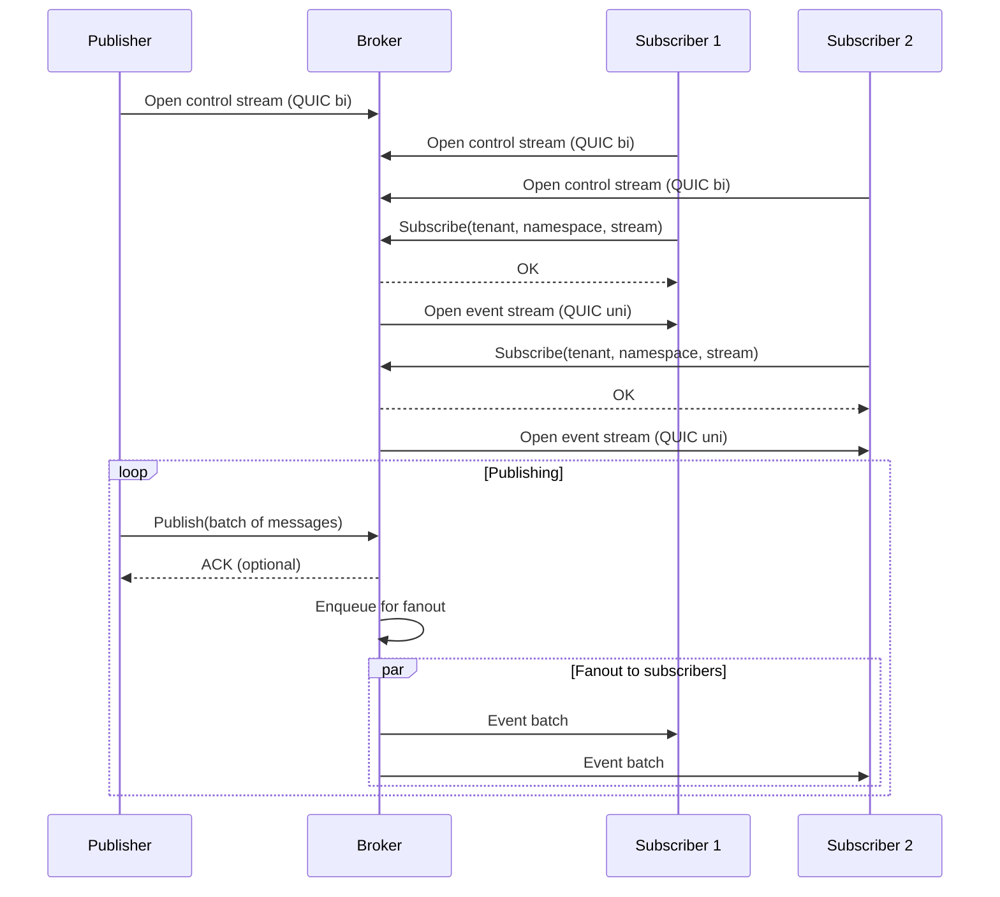
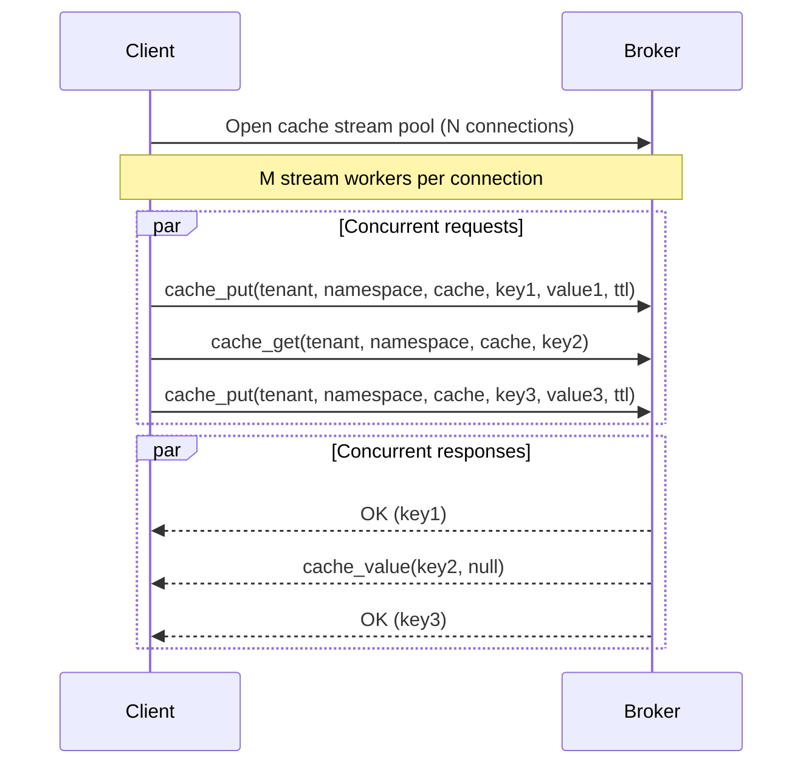
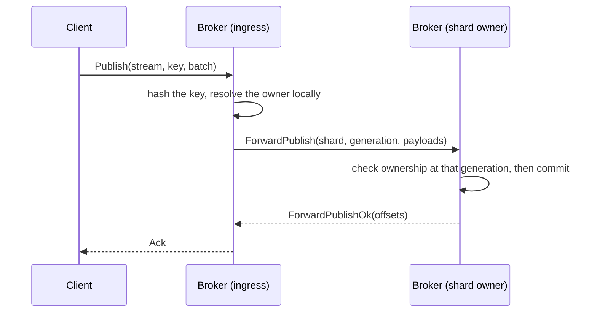
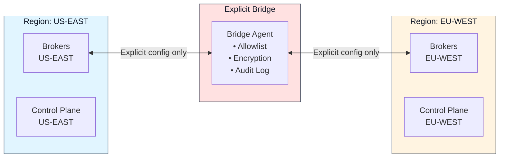

Felix is a low-latency distributed data backend that unifies event streaming, message queueing, and distributed caching over a single QUIC-based transport layer.

## Design Principles

### 1. One Core Log, Many Semantics

Internally, Felix is built around a single append-only log abstraction. Different external semantics are projections over this core:

- **Streams (Pub/Sub):** Fanout cursors per subscription
- **Queues:** Shared consumer-group cursors with acknowledgements
- **Cache:** key → latest value with TTL, written to the same log as records and read back through an index rebuilt from it. Compaction reclaims superseded and expired entries. Cache keys are sharded and routed to their owner like a stream's are, so a value written through any broker is readable through every other — see `docs/cache-on-log.md`

This drastically reduces operational complexity and consistency bugs compared to running Kafka, Redis, and a queueing system side-by-side.

### 2. Low-Latency First

Felix prioritizes predictable low latency over maximum batch throughput:

- **QUIC transport:** Multiplexed, encrypted, congestion-aware
- **Optional ephemeral streams:** No disk on hot path
- **Aggressive backpressure:** Bounded memory everywhere
- **Leader-based writes:** Tunable acknowledgement policies

### 3. Kubernetes-Native

Felix assumes Kubernetes for process lifecycle, identity (ServiceAccounts), networking and service discovery, and failure detection. Felix does **not** attempt to reimplement scheduling or node membership logic that Kubernetes already provides.

## System Architecture

Three things carry most of the design.

**Any broker accepts any request.** A client connects to whichever broker it can reach and asks it for the topology. If that broker does not lead the shard the request belongs to, it forwards the request to the broker that does and relays the answer — the client is never asked to find the right one first, and never talks to more than one broker for a single request.

**Ownership comes from the control plane, and only from there.** Every shard of every stream and cache has exactly one leader, chosen by rendezvous hashing over the live nodes. Brokers watch the assignment feed — a snapshot, then a change stream — and never negotiate ownership among themselves.

**No consensus protocol runs between brokers.** Placement is a pure function of a metadata snapshot, so two control-plane instances reading the same catalog reach the same answer without having to agree on one. Durability across a leader change comes from log shipping and leader leases: per-shard Raft was considered and rejected, for reasons set out in [`docs/replication-design.md`](https://github.com/gabloe/felix/blob/main/docs/replication-design.md).

That rejection is specific to *replicating records*. Making the control plane's own metadata highly available is a separate problem, and Raft remains the intended answer there — it is not implemented yet, and until it is, control-plane availability rests on Postgres.

The control plane is not on the data path. A publish, a subscribe, or a cache operation never calls it; brokers read it in the background and serve from what they already hold.

### Control plane

Serves metadata over REST, backed by Postgres or an in-memory store. It owns tenants, namespaces, streams, caches, the node catalog, and shard assignments, and it runs placement on a timer. Brokers seed from it at startup and gate readiness on that seeding, so a broker does not accept traffic for streams it does not yet know about.

### Data plane

Brokers serve clients over QUIC and reach each other over a separate QUIC endpoint with its own protocol. Each one leads some shards, replicates the ones it leads to followers, forwards what it does not lead, and refuses what it cannot route — a request served locally by a broker that does not own it is exactly the divergence the ownership check exists to prevent.

## Data Flow Patterns

### Publish/Subscribe Flow

**Key characteristics:**

- Publishers use bidirectional control streams for publish requests
- Subscribers get dedicated unidirectional event streams
- Fanout happens independently per subscriber (isolation)
- Batching is time and count-bounded for throughput optimization

### Cache Flow

**Key characteristics:**

- Connection pooling reduces handshake overhead
- Request multiplexing over long-lived streams
- Request IDs for request/response matching
- Sub-millisecond latency at moderate concurrency

### Cross-Broker Routing

When a client reaches a broker that does not lead the target shard:

**The control plane is not in this picture, and that is the point.** Resolving an
owner is an atomic load of a routing snapshot the broker already holds — no lock,
no network call — because this is the hottest question the broker is asked. The
snapshot is refreshed in the background from the assignment feed.

The `generation` the ingress broker resolved against travels with the request.
The owner compares it against its own and answers a mismatch explicitly in either
direction, so a stale view is a typed answer rather than a write to a shard
somebody has already been given.

## Storage Architecture

Storage is selected per stream. A stream registered with `durable: false` — the
default — behaves exactly as it always has; `durable: true` writes every publish
to disk before it is fanned out or acknowledged.

### Ephemeral (default)

- **In-memory only:** No disk writes on hot path
- **Bounded buffers:** Ring buffers with fixed capacity
- **TTL support:** Lazy expiration on access
- **No persistence:** Data lost on restart

**Use cases:**

- Ultra-low latency workloads
- Development and testing
- Temporary caching
- Non-critical event streams

### Durable (`durable: true`)

- **Segmented append-only log:** versioned, checksummed segments per stream
  shard, with sparse offset indexes. Not write-ahead logging — the log *is* the
  data, not a journal protecting another structure.
- **Configurable fsync:** `none`, `periodic { interval }`, or `on_commit`, which
  acknowledges only after the record is on the device
- **Crash recovery:** a provably incomplete tail is repaired; anything else
  fails startup loudly rather than discarding acknowledged records
- **Historical replay:** paged reads from disk by offset

Not yet implemented: **retention policies**, **snapshots/compaction**, and
**tiered storage**. Nothing currently deletes segments on age or size.

See [Durable Storage](/felix/architecture/durable-storage/).

**Use cases:**

- Production event streaming
- Critical message delivery
- Replay and audit trails

## Consistency Model

### Single node

- **Delivery:** At-most-once (best-effort)
- **Ordering:** Per-stream ordering preserved per subscriber. For a durable
  stream, the order on disk is authoritative and cursor replay and live
  delivery both follow it.
- **Durability:** Per stream. Ephemeral by default; `durable: true` persists
  every publish before acknowledging it.

### Clustered

Consistency is declared per stream:

- **`Leader`:** the leader acknowledges once the record is durable locally. Lowest
  latency, and the default.
- **`Quorum`:** the leader waits until a majority of the shard's replicas — itself
  included — hold the record. A record acknowledged this way survives the loss of
  its leader.

A leader serves only while it holds a lease on the shards it leads, so a broker
that has been superseded stops acknowledging rather than discovering the fact
later. On failover, only a replica that actually holds the log is promoted: a
shard whose leader is gone and whose replicas are behind is left unavailable
rather than reopened empty, because a silently empty shard *is* the data loss.

**Delivery guarantees:**

- **At-least-once:** with durable storage and replay on failure
- **At-most-once:** best-effort with no retries
- **Exactly-once:** not implemented

## Multi-Region Architecture (Planned)

:::caution[Not yet implemented]
Everything in this section describes a target design, not current
behavior. `felix-router` today is a simple allowlist of permitted
region pairs; there is no encryption-boundary enforcement, audit
logging, or metadata-level isolation wired into the broker yet, and no
compliance claim should be inferred until this actually lands.
:::
The target design has Felix enforce regional isolation with explicit bridges:

**Target bridge characteristics (not yet built):**

- **Explicit Configuration:** No implicit data movement
- **Stream Allowlist:** Only specified streams replicate
- **Independent Encryption:** Per-region key contexts
- **Audit Trail:** Complete log of cross-region data movement

None of this has been implemented or audited; do not rely on it for
regulatory or compliance purposes until it ships.

## Scalability Considerations

### Vertical Scaling (Single-Node)

- **CPU:** More cores for parallel stream processing
- **Memory:** Larger buffers and cache capacity
- **Network:** Higher bandwidth for fanout
- **Measured:** hundreds of thousands to millions of msg/s on a single node,
  depending entirely on payload size and fanout — see
  [Benchmarks](/felix/features/benchmarks/) rather than any single figure here

### Horizontal Scaling (Multi-Node)

- **Sharding:** Partition streams across brokers
- **Connection pooling:** Reuse connections across shards
- **Control plane:** stateless REST over Postgres; scale by adding instances,
  since placement is a pure function of the catalog and needs no agreement
  between them
- **Data plane:** many broker nodes for capacity

No cluster-level throughput figure is claimed here: the published benchmarks are
single-node, and a multi-node number measured on one machine would say more
about the loopback than about Felix.

## Next Steps

- [Components Deep Dive](/felix/architecture/components/) - Detailed component architecture
- [Wire Protocol](/felix/architecture/wire-protocol/) - Protocol specification
- [Semantics](/felix/architecture/semantics/) - Delivery and consistency guarantees
- [Performance Tuning](/felix/features/performance/) - Optimize for your workload
