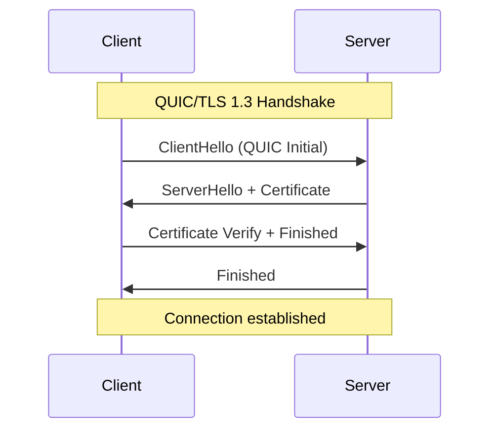
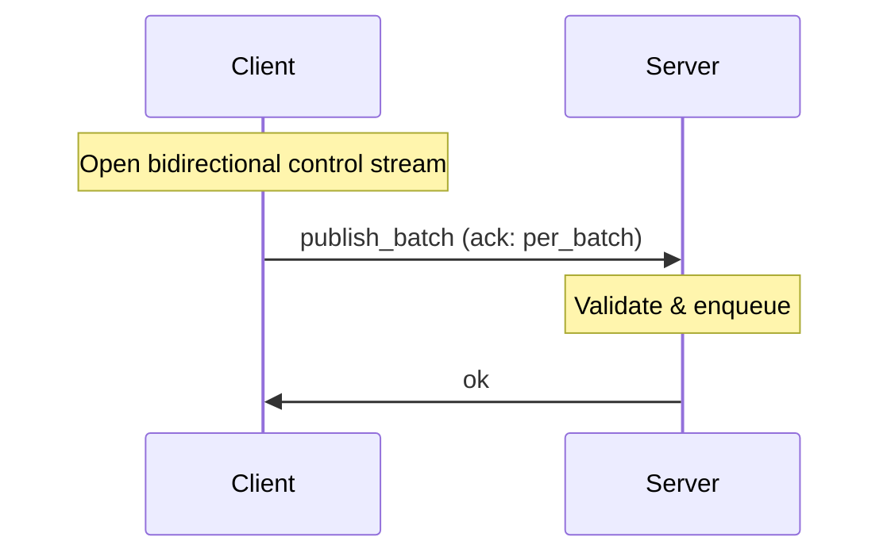
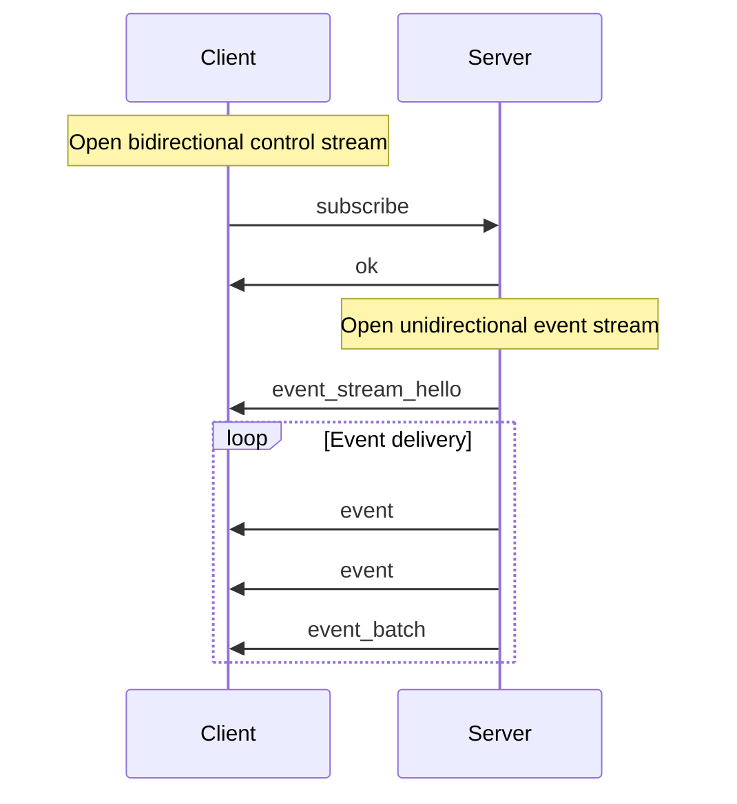
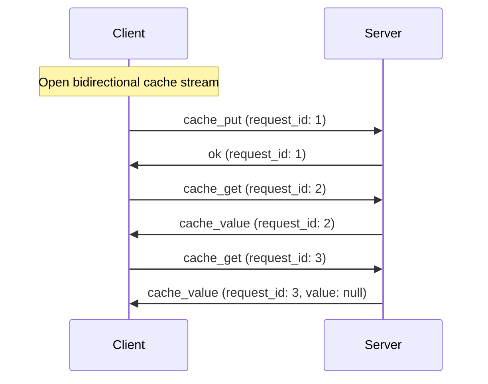

The Felix wire protocol is the language-neutral specification that defines how clients and brokers communicate over the network. This document provides a comprehensive reference for implementing Felix-compatible clients and servers.

## Design Goals

The wire protocol is designed with the following priorities:

1. **Language neutrality**: No Rust-specific types or semantics
2. **Forward compatibility**: Version negotiation and feature flags
3. **Debuggability**: Human-readable messages in v1 with binary fast paths
4. **Explicit framing**: Clear message boundaries over stream transport
5. **Performance escape hatches**: Binary encodings for high-throughput workloads

:::note[Stability Guarantee]
The wire protocol v1 is considered stable. All future changes will maintain backward compatibility through version negotiation or optional feature flags.
:::
## Transport Layer

Felix uses **QUIC over TLS 1.3** (IETF QUIC) as its exclusive transport:

- **Encrypted by default**: TLS 1.3 handshake integrated into connection setup
- **Multiplexed streams**: Multiple independent streams per connection
- **Flow control**: Built-in backpressure at connection and stream levels
- **No head-of-line blocking**: Stream independence prevents HOL blocking
- **0-RTT support**: Future optimization for repeat connections

The protocol is transport-agnostic in design and could theoretically run over TCP+TLS, but QUIC is the only supported transport in the initial implementation.

## Frame Structure

Every Felix message is transmitted as a **frame** consisting of a fixed-size header followed by a variable-length payload.

### Frame Header (12 bytes)

<svg viewBox="0 0 660 196" role="img" aria-labelledby="fh-title fh-desc" style="max-width:100%;height:auto;color:var(--sl-color-text)">
 <title id="fh-title">Felix v1 frame header layout</title>
 <desc id="fh-desc">Twelve bytes in three 32-bit rows: bytes 0 to 3 are magic, bytes 4 and 5 are version, bytes 6 and 7 are flags, bytes 8 to 11 are length.</desc>
 <g font-family="ui-monospace, SFMono-Regular, Menlo, monospace" font-size="13" fill="currentColor">
  <g opacity="0.65" text-anchor="middle">
   <text x="52" y="16">0</text>
   <text x="200" y="16">8</text>
   <text x="348" y="16">16</text>
   <text x="496" y="16">24</text>
   <text x="644" y="16">31</text>
  </g>
  <g stroke="currentColor" opacity="0.35"><path d="M52 22v6M200 22v6M348 22v6M496 22v6M644 22v6" /></g>
  <g opacity="0.65" text-anchor="end" font-size="12">
   <text x="42" y="63">0</text>
   <text x="42" y="115">4</text>
   <text x="42" y="167">8</text>
  </g>
  <g fill="none" stroke="currentColor" stroke-width="1.5">
   <rect x="52" y="34" width="592" height="44" rx="3" />
   <rect x="52" y="86" width="296" height="44" rx="3" />
   <rect x="348" y="86" width="296" height="44" rx="3" />
   <rect x="52" y="138" width="592" height="44" rx="3" />
  </g>
  <g text-anchor="middle">
   <text x="348" y="52">magic</text>
   <text x="348" y="70" opacity="0.7" font-size="12">u32 &#183; 0x464C5831 &#8220;FLX1&#8221;</text>
   <text x="200" y="104">version</text>
   <text x="200" y="122" opacity="0.7" font-size="12">u16 &#183; 1</text>
   <text x="496" y="104">flags</text>
   <text x="496" y="122" opacity="0.7" font-size="12">u16 &#183; bit field</text>
   <text x="348" y="156">length</text>
   <text x="348" y="174" opacity="0.7" font-size="12">u32 &#183; payload bytes</text>
  </g>
 </g>
</svg>

All multi-byte integers are big-endian (network byte order).

| Offset | Size | Field | Type | Value |
| --- | --- | --- | --- | --- |
| 0 | 4 | `magic` | u32 | `0x464C5831` (`"FLX1"`) |
| 4 | 2 | `version` | u16 | `1` |
| 6 | 2 | `flags` | u16 | Bit field; see below |
| 8 | 4 | `length` | u32 | Payload length in bytes |

#### Field Definitions

**magic (u32, big-endian)**

Fixed value: `0x464C5831` (ASCII "FLX1")

Purpose: Protocol identification and frame synchronization. Decoders should reject frames with incorrect magic numbers.

**version (u16, big-endian)**

Protocol version: `1` for current specification

Future versions will use different version numbers to enable negotiation and backward compatibility.

**flags (u16, big-endian)**

Bit field for optional features:

| Bit | Mask   | Meaning |
|-----|--------|---------|
| 0   | 0x0001 | Binary publish batch encoding |
| 1   | 0x0002 | Binary event batch (legacy, per-subscriber) |
| 2   | 0x0004 | Shared binary event batch |
| 3   | 0x0008 | Acked binary publish batch (modifier on bit 0) |
| 4   | 0x0010 | Binary publish acknowledgement (broker → client) |
| 5-15| -      | Reserved (must be 0) |

Receivers must **reject** a frame carrying a flag bit they do not recognise, rather
than ignoring the bit. These bits select how the payload is parsed, so ignoring an
unknown one means misparsing the body instead of failing cleanly. Bit 3 is the
cautionary example: it prefixes the publish-batch body with a `request_id`, so a
receiver that masked it off would read that prefix as a `tenant_len`.

**length (u32, big-endian)**

Payload length in bytes: `0` to `2^32 - 1`

This is the byte count of the payload following the header. The maximum practical frame size is typically much smaller (16 MB default limit).

### Frame Payload

Payloads are binary-encoded felix-wire frames. Flag bits indicate binary sub-formats such as batched event/publish payloads.

## Message Types

Message schemas below are shown in JSON-like notation for readability; on the wire, frames are binary-encoded.

### Client → Server Messages

#### Publish

Single-message publish operation.

```json
{
  "type": "publish",
  "tenant_id": "string",
  "namespace": "string",
  "stream": "string",
  "payload": "base64-encoded-bytes",
  "ack": "none" | "per_message"
}
```

**Fields**:
- `tenant_id`: Tenant identifier (must exist in broker registry)
- `namespace`: Namespace identifier within tenant
- `stream`: Stream name to publish to
- `payload`: Message payload encoded as base64
- `ack`: Acknowledgement mode
  - `none`: Fire-and-forget, no ack sent
  - `per_message`: Broker sends `ok` after accepting message

**Semantics**:
- Message is enqueued to the broker's publish pipeline
- If `ack` is `per_message`, broker responds with `ok` after enqueuing
- No ordering guarantees across different publish operations

#### PublishBatch

Batch publish operation for improved throughput.

```json
{
  "type": "publish_batch",
  "tenant_id": "string",
  "namespace": "string",
  "stream": "string",
  "payloads": ["base64-1", "base64-2", "base64-n"],
  "ack": "none" | "per_batch"
}
```

**Fields**:
- `tenant_id`, `namespace`, `stream`: Same as Publish
- `payloads`: Array of base64-encoded message payloads
- `ack`: Acknowledgement mode
  - `none`: Fire-and-forget
  - `per_batch`: Single `ok` after entire batch is accepted

**Semantics**:
- All messages in batch are enqueued atomically
- Ordering is preserved within the batch
- More efficient than individual publishes for high-throughput workloads

#### Subscribe

Initiate a subscription to a stream.

```json
{
  "type": "subscribe",
  "tenant_id": "string",
  "namespace": "string",
  "stream": "string"
}
```

**Semantics**:
- Subscription starts at **tail** (current offset)
- No historical replay in MVP
- Broker responds with `ok` on the control stream
- Broker opens a new **unidirectional stream** for event delivery
- First frame on event stream is `EventStreamHello` (see below)

#### CachePut

Store a key-value pair in the cache with optional TTL.

```json
{
  "type": "cache_put",
  "request_id": "string",
  "key": "string",
  "value": "base64-encoded-bytes",
  "ttl_ms": number | null
}
```

**Fields**:
- `request_id`: Client-provided identifier for request/response matching
- `key`: Cache key (arbitrary string)
- `value`: Value encoded as base64
- `ttl_ms`: Time-to-live in milliseconds (null = no expiration)

**Semantics**:
- Value is stored and expires after TTL if specified
- Broker responds with `ok` containing the same `request_id`
- Expiration is lazy (checked on access)

#### CacheGet

Retrieve a value from the cache.

```json
{
  "type": "cache_get",
  "request_id": "string",
  "key": "string"
}
```

**Semantics**:
- Broker responds with `cache_value` containing the same `request_id`
- Value is `null` if key is missing or expired

### Server → Client Messages

#### Event

Event delivery on a subscription stream.

```json
{
  "type": "event",
  "tenant_id": "string",
  "namespace": "string",
  "stream": "string",
  "payload": "base64-encoded-bytes"
}
```

**Semantics**:
- Sent on unidirectional event streams
- One event per frame (unless batched)
- No acknowledgement from client in MVP

#### EventBatch

Batched event delivery (optimization).

```json
{
  "type": "event_batch",
  "tenant_id": "string",
  "namespace": "string",
  "stream": "string",
  "payloads": ["base64-1", "base64-2", "base64-n"]
}
```

**Semantics**:
- Multiple events delivered in single frame
- Reduces framing overhead for high-throughput streams
- Configurable via broker batching parameters

#### EventStreamHello

First frame on a subscription event stream.

```json
{
  "type": "event_stream_hello",
  "subscription_id": "string"
}
```

**Semantics**:
- Allows client to correlate stream with subscription request
- Must be first frame on event stream
- Subsequent frames are events

#### CacheValue

Cache lookup response.

```json
{
  "type": "cache_value",
  "request_id": "string",
  "key": "string",
  "value": "base64-encoded-bytes" | null
}
```

**Fields**:
- `request_id`: Matches the request
- `key`: Requested key
- `value`: Retrieved value or `null` if missing/expired

#### Ok

Generic success acknowledgement.

```json
{
  "type": "ok",
  "request_id": "string"
}
```

**Semantics**:
- Sent in response to publish (if acked), subscribe, cache_put
- `request_id` matches the request when applicable

#### Error

Error response.

```json
{
  "type": "error",
  "request_id": "string",
  "message": "human-readable-error-description"
}
```

**Common error conditions**:
- Unknown tenant/namespace/stream
- Malformed frame
- Authorization failure (future)
- Resource exhaustion

## Binary Publish Batch Encoding

For high-throughput publish workloads, Felix supports binary encodings that reduce parsing overhead.

### When to Use Binary Mode

Binary mode is enabled by setting flag bit 0 (`flags | 0x0001`). **All client
publishes use binary encoding by default**, acknowledged or not — the Rust client's
`Publisher::publish`/`publish_batch` methods select it automatically. Call
`publish_json`/`publish_batch_json` explicitly to opt into JSON instead (e.g. for
debugging or a non-Rust client that hasn't implemented the binary decoder yet).

An acknowledged publish additionally sets bit 3 (`flags | 0x0008`), which prefixes
the batch with a `request_id` and an ack mode, and the broker replies with a binary
ack frame (bit 4) instead of a JSON `publish_ok`/`publish_error`.

:::caution[Version requirement]
Bits 3 and 4 were added after the initial v1 release, and v1 has no capability
negotiation. A broker that predates them matches on bit 0, does not know about the
prefix, and misparses `request_id` as `tenant_len` — so acked binary publishes
require a matching broker. Client and broker ship from the same workspace and are
expected to be deployed together.
:::

:::tip[Performance Impact]
Binary batches can achieve 30-40% higher throughput, especially with large payloads and high fanout.
:::
### Binary Format Specification

<svg viewBox="0 0 660 274" role="img" aria-labelledby="bpb-t bpb-d" style="max-width:100%;height:auto;color:var(--sl-color-text)">
 <title id="bpb-t">Binary publish batch payload layout</title>
 <desc id="bpb-d">Sequential fields: tenant_len and tenant_id, namespace_len and namespace, stream_len and stream, a u32 count, then that many payload_len and payload pairs.</desc>
 <g font-family="ui-monospace, SFMono-Regular, Menlo, monospace" font-size="13" fill="currentColor">
  <g fill="none" stroke="currentColor" stroke-width="1.5">
   <rect x="8" y="8" width="200" height="38" rx="3" />
   <rect x="208" y="8" width="444" height="38" rx="3" />
   <rect x="8" y="52" width="200" height="38" rx="3" />
   <rect x="208" y="52" width="444" height="38" rx="3" />
   <rect x="8" y="96" width="200" height="38" rx="3" />
   <rect x="208" y="96" width="444" height="38" rx="3" />
   <rect x="8" y="140" width="644" height="38" rx="3" />
   <rect x="20" y="214" width="188" height="38" rx="3" />
   <rect x="216" y="214" width="428" height="38" rx="3" />
   <rect x="8" y="188" width="644" height="76" rx="4" stroke-dasharray="5 4" opacity="0.55" />
  </g>
  <g text-anchor="middle">
   <text x="108" y="24">tenant_len</text>
   <text x="108" y="39" opacity="0.7" font-size="11.5">u16 BE</text>
   <text x="430" y="24">tenant_id</text>
   <text x="430" y="39" opacity="0.7" font-size="11.5">tenant_len bytes, UTF-8</text>
   <text x="108" y="68">namespace_len</text>
   <text x="108" y="83" opacity="0.7" font-size="11.5">u16 BE</text>
   <text x="430" y="68">namespace</text>
   <text x="430" y="83" opacity="0.7" font-size="11.5">namespace_len bytes, UTF-8</text>
   <text x="108" y="112">stream_len</text>
   <text x="108" y="127" opacity="0.7" font-size="11.5">u16 BE</text>
   <text x="430" y="112">stream</text>
   <text x="430" y="127" opacity="0.7" font-size="11.5">stream_len bytes, UTF-8</text>
   <text x="330" y="156">count</text>
   <text x="330" y="171" opacity="0.7" font-size="11.5">u32 BE &#183; number of payloads</text>
   <text x="114" y="230">payload_len</text>
   <text x="114" y="245" opacity="0.7" font-size="11.5">u32 BE</text>
   <text x="430" y="230">payload</text>
   <text x="430" y="245" opacity="0.7" font-size="11.5">payload_len bytes, opaque</text>
   <text x="330" y="206" opacity="0.7" font-size="11.5">repeated count times</text>
  </g>
 </g>
</svg>

**Encoding steps**:

1. Write `tenant_len` as u16 big-endian
2. Write `tenant_id` bytes (UTF-8)
3. Write `namespace_len` as u16 big-endian
4. Write `namespace` bytes (UTF-8)
5. Write `stream_len` as u16 big-endian
6. Write `stream` bytes (UTF-8)
7. Write `count` as u32 big-endian (number of payloads)
8. For each payload:
   - Write `payload_len` as u32 big-endian
   - Write `payload` bytes (raw binary)

**Constraints**:
- tenant_id, namespace, stream limited to 65535 bytes each
- count limited to 2^32 - 1 payloads per batch
- Each payload limited to 2^32 - 1 bytes

## Acked Binary PublishBatch

When `flags & 0x0008 != 0` (always set together with `0x0001`), the publish batch
above is prefixed with a correlation header:

<svg viewBox="0 0 660 98" role="img" aria-labelledby="apb-t apb-d" style="max-width:100%;height:auto;color:var(--sl-color-text)">
 <title id="apb-t">Acked binary publish batch prefix</title>
 <desc id="apb-d">A u64 request_id and a u8 ack mode, followed by the ordinary binary publish batch body.</desc>
 <g font-family="ui-monospace, SFMono-Regular, Menlo, monospace" font-size="13" fill="currentColor">
  <g fill="none" stroke="currentColor" stroke-width="1.5">
   <rect x="8" y="8" width="320" height="38" rx="3" />
   <rect x="336" y="8" width="316" height="38" rx="3" />
   <rect x="8" y="52" width="644" height="38" rx="3" />
  </g>
  <g text-anchor="middle">
   <text x="168" y="24">request_id</text>
   <text x="168" y="39" opacity="0.7" font-size="11.5">u64 BE &#183; correlation id</text>
   <text x="494" y="24">ack_mode</text>
   <text x="494" y="39" opacity="0.7" font-size="11.5">u8 &#183; 1 = per_message, 2 = per_batch</text>
   <text x="330" y="68">Binary PublishBatch body</text>
   <text x="330" y="83" opacity="0.7" font-size="11.5">exactly as specified above</text>
  </g>
 </g>
</svg>

The prefix comes first so a receiver can read `request_id` without parsing the rest
of the frame. That is what lets the broker answer a malformed body with an error the
client can still match to its pending request, instead of leaving it blocked until
timeout.

`ack_mode` has no encoding for "none": an unacknowledged publish uses the plain
`0x0001` frame with no prefix, so every mode has exactly one wire representation.

## Binary PublishAck

The response to an acked binary publish, sent when `flags & 0x0010 != 0`:

<svg viewBox="0 0 660 98" role="img" aria-labelledby="pak-t pak-d" style="max-width:100%;height:auto;color:var(--sl-color-text)">
 <title id="pak-t">Binary publish ack layout</title>
 <desc id="pak-d">A u8 status, a u64 request_id, a u16 message length, then that many bytes of UTF-8 error text.</desc>
 <g font-family="ui-monospace, SFMono-Regular, Menlo, monospace" font-size="13" fill="currentColor">
  <g fill="none" stroke="currentColor" stroke-width="1.5">
   <rect x="8" y="8" width="200" height="38" rx="3" />
   <rect x="216" y="8" width="252" height="38" rx="3" />
   <rect x="476" y="8" width="176" height="38" rx="3" />
   <rect x="8" y="52" width="644" height="38" rx="3" />
  </g>
  <g text-anchor="middle">
   <text x="108" y="24">status</text>
   <text x="108" y="39" opacity="0.7" font-size="11.5">u8 &#183; 0 = ok, 1 = error</text>
   <text x="342" y="24">request_id</text>
   <text x="342" y="39" opacity="0.7" font-size="11.5">u64 BE</text>
   <text x="564" y="24">message_len</text>
   <text x="564" y="39" opacity="0.7" font-size="11.5">u16 BE</text>
   <text x="330" y="68">message</text>
   <text x="330" y="83" opacity="0.7" font-size="11.5">message_len bytes, UTF-8 &#183; empty when ok</text>
  </g>
 </g>
</svg>

It carries exactly the information the JSON `publish_ok` / `publish_error` messages
do. A client that published with the JSON encoding still receives those JSON
messages instead — the reply always matches the encoding of the request.

## Shared Binary EventBatch Encoding

Subscriber event delivery is always binary in practice. When `flags & 0x0004
!= 0`, the event-stream frame carries a **shared** batch: it omits the
per-subscriber `subscription_id` entirely.

<svg viewBox="0 0 660 144" role="img" aria-labelledby="seb-t seb-d" style="max-width:100%;height:auto;color:var(--sl-color-text)">
 <title id="seb-t">Shared binary event batch payload layout</title>
 <desc id="seb-d">A u32 count followed by that many payload_len and payload pairs. No subscription id is present.</desc>
 <g font-family="ui-monospace, SFMono-Regular, Menlo, monospace" font-size="13" fill="currentColor">
  <g fill="none" stroke="currentColor" stroke-width="1.5">
   <rect x="8" y="8" width="644" height="38" rx="3" />
   <rect x="20" y="84" width="188" height="38" rx="3" />
   <rect x="216" y="84" width="428" height="38" rx="3" />
   <rect x="8" y="58" width="644" height="76" rx="4" stroke-dasharray="5 4" opacity="0.55" />
  </g>
  <g text-anchor="middle">
   <text x="330" y="24">count</text>
   <text x="330" y="39" opacity="0.7" font-size="11.5">u32 BE &#183; number of payloads</text>
   <text x="114" y="100">payload_len</text>
   <text x="114" y="115" opacity="0.7" font-size="11.5">u32 BE</text>
   <text x="430" y="100">payload</text>
   <text x="430" y="115" opacity="0.7" font-size="11.5">payload_len bytes, opaque</text>
   <text x="330" y="76" opacity="0.7" font-size="11.5">repeated count times</text>
  </g>
 </g>
</svg>

**Why no subscription id in the frame**: the subscription is already bound to
its uni-directional event stream by the `EventStreamHello` frame sent when
the stream opens (see [EventStreamHello](#eventstreamhello)) — every
subsequent frame on that stream belongs to that subscription, so repeating
the id per batch is redundant. This is also what makes the encoding
*shareable*: the broker encodes one `Bytes` buffer per publish batch and
fans out clones of the same buffer to every subscriber of that stream,
instead of re-encoding a subscriber-specific frame for each one. Encode cost
is then O(1) per publish batch regardless of fanout, rather than O(fanout).

The legacy per-subscriber format (`flags & 0x0002`, `subscription_id` +
`count` + payloads) remains decodable for backward compatibility, but the
broker only emits the shared (`0x0004`) format.

## Protocol Flows

### Connection Establishment



### Publish with Acknowledgement



### Subscribe and Receive Events



### Cache Operations



:::note[Request Multiplexing]
Cache streams support request pipelining. Clients can send multiple requests without waiting for responses. The broker may respond out of order; use `request_id` to correlate requests and responses.
:::
## Stream Types and Lifecycle

Felix uses different QUIC stream patterns for different workload characteristics:

### Control Streams (Bidirectional)

**Purpose**: Request/response control plane operations

**Lifecycle**:
1. Client opens bidirectional stream
2. Client sends publish, subscribe, or cache requests
3. Server sends acknowledgements and responses
4. Either side can close when done

**Characteristics**:
- Long-lived or short-lived depending on usage
- Multiplexed on single connection
- Flow control prevents backpressure

### Event Streams (Unidirectional, Server-opened)

**Purpose**: Push events from server to client

**Lifecycle**:
1. Server opens unidirectional stream after subscribe
2. Server sends `event_stream_hello`
3. Server sends stream of events
4. Server closes stream when subscription ends

**Characteristics**:
- One stream per subscription
- Independent flow control
- Isolation between subscriptions

### Cache Streams (Bidirectional, Pooled)

**Purpose**: High-concurrency cache operations

**Lifecycle**:
1. Client opens bidirectional stream
2. Client sends multiple cache requests with unique request_ids
3. Server responds with matching request_ids
4. Stream lives for duration of cache operations

**Characteristics**:
- Pooled for concurrency (multiple streams per connection)
- Request/response multiplexing via request_id
- Reduces stream setup overhead

## Error Handling

### Protocol Errors

**Malformed frame header**:
- Close connection with QUIC error code
- Log protocol violation

**Invalid payload encoding**:
- Send `error` message on same stream
- Close stream if error is unrecoverable

**Unknown message type**:
- Send `error` message
- Future versions may handle gracefully

### Application Errors

**Unknown tenant/namespace/stream**:
- Send `error` with descriptive message
- Client should not retry without fixing configuration

**Authorization failure**:
- Send `error` with "unauthorized" message
- Client should refresh credentials or permissions

**Backpressure / resource exhaustion**:
- Apply QUIC flow control (stop granting credits)
- Slow subscribers may drop events in MVP

## Conformance Testing

All Felix client and server implementations must pass the shared conformance test suite.

### Test Vectors

Test vectors are located in `crates/felix-wire/tests/vectors/`:

- `frame_valid.json`: Valid frame encodings
- `frame_invalid.json`: Invalid frames that must be rejected
- `message_valid.json`: Valid message payloads
- `message_invalid.json`: Invalid messages
- `binary_batch_valid.bin`: Binary batch test cases

### Conformance Runner

Run the conformance suite:

```bash
cargo run -p felix-conformance
```

**What it tests**:
- Frame header encoding/decoding
- Binary batch encoding/decoding
- Error handling for malformed inputs
- Round-trip serialization stability

:::caution[Implementation Requirement]
Any client or server claiming Felix protocol compatibility must pass the full conformance suite. This ensures interoperability and prevents subtle edge case bugs.
:::
## Backward Compatibility

### Version Negotiation (Future)

Future protocol versions will negotiate using the `version` field:

1. Client sends supported version list in connection metadata
2. Server selects highest mutually supported version
3. All subsequent frames use negotiated version

### Feature Flag Negotiation (Future)

Optional features (compression, alternative encodings) will be negotiated via the `flags` field:

1. Client advertises supported flag bits
2. Server responds with enabled flags
3. Both sides enable only mutually supported features

### Deprecation Policy

Deprecated protocol features will:

1. Be marked deprecated for at least 2 major versions
2. Generate warnings when used
3. Eventually be removed with major version bump

## Implementation Guidance

### Client Implementation Checklist

- [ ] Implement frame header encoding/decoding
- [ ] Implement binary frame encoding
- [ ] Handle all standard message types
- [ ] Implement proper error handling
- [ ] Pass conformance test suite
- [ ] Support connection pooling
- [ ] Implement proper QUIC stream lifecycle
- [ ] Handle backpressure gracefully

### Server Implementation Checklist

- [ ] Implement frame header decoding/encoding
- [ ] Implement binary batch decoding
- [ ] Route messages to appropriate handlers
- [ ] Implement proper error responses
- [ ] Pass conformance test suite
- [ ] Enforce stream type invariants
- [ ] Apply backpressure when needed
- [ ] Log protocol violations

### Performance Optimization Tips

1. **Avoid per-message allocation**: Pre-allocate buffers for frame headers
2. **Use larger batches**: Improve throughput for larger payloads and fanout
3. **Pool connections**: Amortize connection setup costs
4. **Pipeline cache requests**: Don't wait for responses before sending next request
5. **Batch events**: Reduce framing overhead by batching event deliveries
6. **Monitor flow control**: Don't send faster than receiver can consume

## Future Protocol Extensions

Planned protocol enhancements (not in v1):

- **Compression**: Optional zstd or lz4 compression (negotiated via flags)
- **Encryption metadata**: End-to-end encryption with key IDs in envelope
- **Message ordering**: Sequence numbers for exactly-once semantics
- **Acknowledgements**: Consumer acks for at-least-once delivery
- **Stream filtering**: Server-side filtering to reduce client bandwidth
- **Historical replay**: Subscribe from offset or timestamp
- **Multi-tenancy**: Tenant isolation and quotas

These extensions will be added in backward-compatible ways through version negotiation or optional feature flags.
