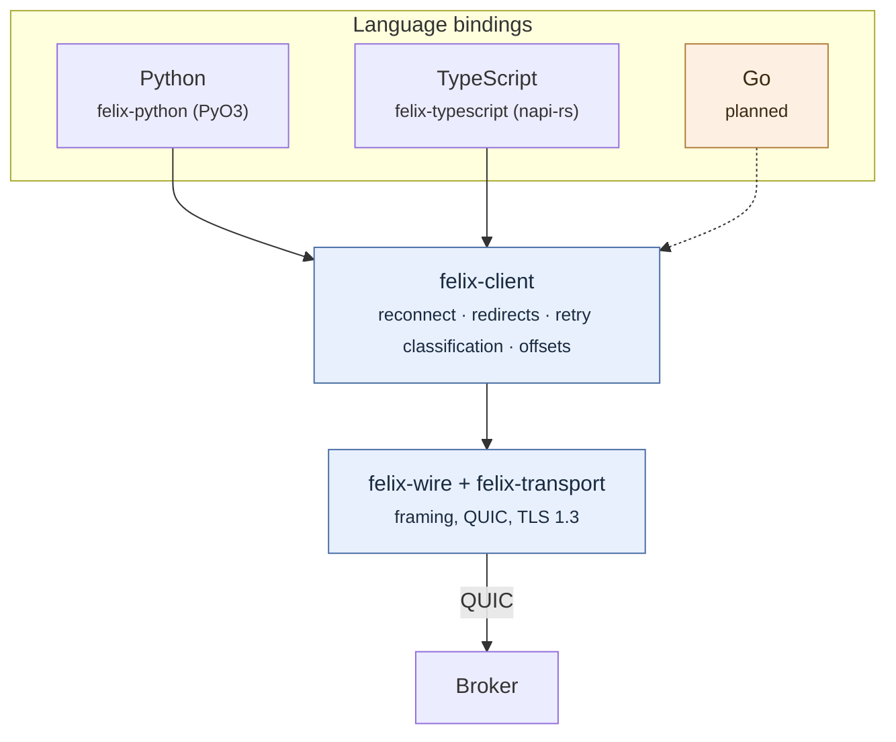

Felix has three clients today: Rust, Python, and TypeScript. This page is about
how they relate to each other — which is the part that usually goes wrong, and
the part worth understanding before you depend on one. Each client's own page
covers using it.

## One implementation, several bindings

A Felix client does more than encode frames. It reconnects when the broker it
was using disappears, follows redirects to whichever broker owns the shard it
wants, follows a subscription's shard when a rebalance moves it, decides which failures are worth retrying and which are not, and keeps
track of offsets precisely enough that a resuming subscriber neither skips a
record nor sees one twice.

None of that is easy, and all of it is easy to get *nearly* right. So Felix
does not write it more than once. The Rust client (`felix-client`) holds the
behaviour; every other language binds to it through a thin wrapper:



The alternative — a native client per language, each speaking the wire protocol
directly — is what most systems do, and it is why most systems have clients
that behave subtly differently from one another. The differences never show up
in a demo. They show up when a broker dies at an inconvenient moment and one
language's client loses records the other would have kept.

**What this costs:** a binding needs a Rust toolchain to build (though not to
*install* — wheels and their equivalents ship compiled), and a language whose
FFI story is poor is harder to serve. **What it buys:** when reconnection is
improved, every language gets the improvement, and no language can drift.

## The conformance suite

Sharing an implementation removes most divergence. It does not remove all of
it, because a binding still decides how to expose things: what an error looks
like, whether a timeout is an exception or a return value, whether closing
twice is safe.

So there is a catalogue of the semantics a client must implement, and a runner
that checks a client against it:

```bash
task conformance:scenarios     # what a client must implement, and why
task conformance:fixture       # a cluster to run a suite against
task conformance:verify -- results.json
```

The catalogue (`crates/testing/felix-conformance/scenarios.toml`) is deliberately
weighted toward the semantics a second client approximates rather than
implements. A few, so the flavour is clear:

| Scenario | What goes wrong without it |
|---|---|
| `redirect.carries_the_start_offset_through_every_hop` | A client that rebuilds the subscribe request when redirected drops the start offset and begins at the live tail. The call succeeds. Every record between the requested offset and now is simply absent, and nothing anywhere reports an error. |
| `reconnect.subscription_resumes_at_the_next_offset` | Off by one in one direction loses records silently; off by one in the other duplicates them. |
| `retry.ambiguous_outcomes_are_not_silently_retried` | Re-sending a publish that may already have been applied duplicates it, and nothing downstream can tell the copies apart — the delivery guarantee changes without anyone choosing it. |
| `retry.idempotent_producers_re_send_ambiguous_outcomes` | With a producer id and a sequence the broker can tell the copies apart, so the producer must re-send under the same sequence — and a client that advances the sequence on a failure, or re-sends after a refusal, turns the guarantee back into a guess. |
| `error.unauthorized_is_typed` | An application that cannot tell "not permitted" from "unreachable" retries the one that will never succeed. |
| `error.quorum_timeout_is_outcome_unknown` | A write that may have survived, reported as a plain failure, gets resent and duplicated; reported as success, it may be lost. |

Each scenario has a stable id. A client's test suite tags its tests with those
ids, emits a results document, and `verify` reports any **required** scenario
without a passing result — by name. A skip does not satisfy a requirement, and
a result naming a scenario that does not exist is reported rather than ignored,
because a misspelled tag would otherwise look like coverage.

Optional scenarios may go unclaimed — a binding is allowed not to wrap a
surface yet — but may not *fail*. Claiming a semantic and getting it wrong is
worse than not claiming it.

**New languages are gated on this rather than on review.** "Looks correct" is
exactly the standard that produces divergence.

### Why the kit is Apache-2.0

Most of Felix's server-side code is AGPL-3.0. The conformance catalogue and
verifier are **Apache-2.0** on purpose: someone writing a Felix client for a
language nobody here has considered should be able to vendor the specification
and check their work without taking a copyleft dependency. The fixture *server*
needs a broker, so it stays AGPL — but running a broker to test against was
always going to require a broker.

## The three clients

Each has its own page: what to install, the surface, and the failure modes
worth writing code for.

| | | |
| --- | --- | --- |
| **[Rust](/felix/clients/rust/)** | `felix-client` on crates.io | The reference client, and the one the others are built from. |
| **[Python](/felix/clients/python/)** | `felix-client` on PyPI | A PyO3 binding, with a synchronous and an asyncio surface over the same Rust client. |
| **[TypeScript](/felix/clients/typescript/)** | `felix-client` on npm | A napi-rs addon. One asynchronous surface, because blocking Node's event loop is not something a library may do. |

Python and TypeScript both pass every required scenario in the catalogue, and
CI is gated on both. Each leaves a couple of optional scenarios unclaimed
rather than passing over them in silence; their pages say which.

## Planned

Go, then C# — in that order, because it follows where Felix's intended
workloads actually live. Each is gated on passing the conformance suite.

If you want to write one sooner, the things you need are all public: the
[wire protocol](/felix/architecture/wire-protocol/) if you are implementing
natively, the conformance catalogue either way, and `crates/sdk/felix-python` or
`crates/sdk/felix-typescript` as worked examples of the binding approach — a few
hundred lines of Rust over a client that already works.
