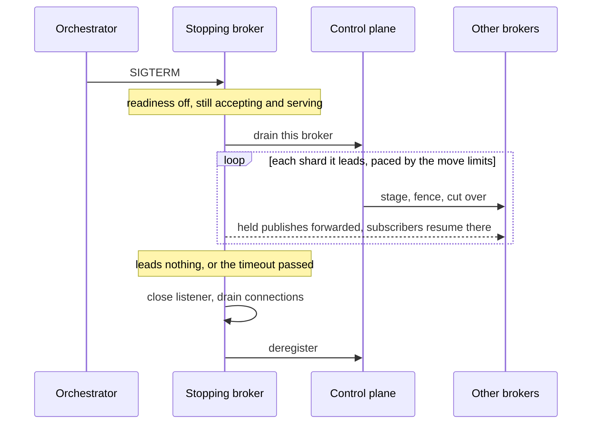

Covers how the broker and control plane start, and — mostly — how they stop.
Implemented in `crates/server/felix-common/src/lifecycle.rs`, which both services share.

## Termination signals

Both services wait on **SIGTERM and SIGINT** on Unix, and Ctrl-C elsewhere.

SIGTERM is the one that matters operationally. Kubernetes, systemd, and
`docker stop` all terminate a process with SIGTERM; SIGINT only covers an
interactive Ctrl-C. A process that handles only SIGINT has no shutdown path under
any of those supervisors — the default SIGTERM handler kills it outright, so every
rolling update drops in-flight publishes, acknowledgements, and subscription
writes.

## Shutdown order

The order matters more than the individual steps.

1. **Readiness goes false.** `/ready` starts returning `503 draining`. Load
   balancers and the Kubernetes endpoints controller stop routing new traffic here
   while the process can still serve it, so clients are steered away from a healthy
   instance rather than discovering a broken one.
2. **A clustered broker hands its shards off.** See
   [Handing shards off](#handing-shards-off) below. It keeps accepting and
   serving throughout.
3. **Keep serving while that propagates.** The control plane waits
   `FELIX_SHUTDOWN_PREDRAIN_MS` (default `5000`) before it stops accepting, still
   answering normally the whole time. Without this the listener closes in the same
   breath as the readiness flip, and a load balancer that has not polled yet is
   still sending requests to a socket that has gone away. A second SIGTERM ends the
   wait early. The broker has the same hold-off but defaults it to off — see below.
4. **Stop admitting new work.** The broker cancels its QUIC accept loop; the
   control plane stops accepting new HTTP connections. Already-accepted work is
   untouched.
5. **Drain, bounded by a deadline.** In-flight connections and requests finish on
   their own.
6. **Force-cancel the remainder and name it.** Anything still running when the
   deadline expires is aborted and logged by name at WARN.

A broker that rotates its credential also waits, inside the same deadline, for a
refresh already in flight to finish. The control plane rotates the refresh token as
soon as it answers, so a broker that exited before writing the replacement to
`FELIX_NODE_REFRESH_TOKEN_FILE` would present a spent token on its next start and
the control plane would revoke the whole chain.

`/live` stays `200` throughout. A draining process is alive and working correctly;
failing liveness would make Kubernetes restart a pod that is shutting down exactly
as intended.

Metrics are torn down **last**, after everything else has drained, so `/metrics`
and `/ready` remain scrapeable for the whole shutdown window. That window is the
only chance an operator has to see what the process was doing while it stopped.

## Handing shards off

A broker that simply stopped would leave every shard it leads to fail over:
publishes to those shards are refused until the control plane notices and
promotes a follower, and a shard with no follower waits for the broker to come
back. So a clustered broker first gives its shards away, the same way
[draining a broker](/felix/deployment/scaling/#draining-a-broker) does:

1. With readiness already off, it asks the control plane to drain it
   (`POST /v1/nodes/{id}/drain`, with its own credential). Placement stops
   giving it shards and moves each one it leads to a broker that is staying.
2. It keeps accepting and serving while they move. Each move is planned:
   publishes during the switch-over are held and forwarded, and subscriptions
   are told `shard_moved` and resume on the new owner at the offset they had
   reached.
3. Once it leads no shard, or after `FELIX_SHUTDOWN_HANDOFF_TIMEOUT_MS`
   (default `30000`), it carries on with the shutdown above: the listener
   closes, connections drain, and it deregisters.



The handoff is best effort and never blocks the shutdown for longer than its
timeout. It is skipped when the broker leads nothing, when no other broker is
eligible (a single-node cluster, say), and when the control plane does not
answer within 5 s. A second SIGTERM stops the wait. A shard still led here when
the wait ends fails over, exactly as it did without a handoff. `0` turns the
handoff off.

Moves run under the same limits as any other
(see [Tuning](/felix/deployment/scaling/#tuning)). With the default
`FELIX_SHARD_MOVES_MAX_CONCURRENT=1` they go one at a time. A move whose
destination is already a caught-up follower copies nothing, only fences and
cuts over, so replicated shards go quickly; watch
`felix_broker_shutdown_handoff_duration_ms` and size the timeout from it. A
drain's leaderships are moved
before its follower copies are replaced, so those copies do not hold the slots
the leaders need. A shard with no follower has its whole log copied first;
raise the timeout if brokers lead large unreplicated shards, or accept that
those fail over.

The drain does not outlive the process. A broker that starts again registers
as live, and placement gives it back its share of shards as it would any
broker that joins.

Rolling restarts need nothing else: restart brokers one at a time, and each
hands its shards to the others before it stops. Draining a broker by hand is
still the way to remove one for good.

| Metric | Meaning |
| --- | --- |
| `felix_broker_shutdown_handoffs_total{outcome}` | `completed`, `timed_out`, `interrupted` or `skipped` |
| `felix_broker_shutdown_handoff_shards_total` | shards led elsewhere by the time the handoff ended |
| `felix_broker_shutdown_handoff_duration_ms` | how long the last handoff took |

The log says the same thing on one line: `handed every shard off`, or a WARN
naming how many shards were left to fail over.

## The drain deadline

`FELIX_SHUTDOWN_DRAIN_TIMEOUT_MS` (default `25000`) is a **single budget shared by
every subsystem**, not a per-subsystem timeout. Each subsystem gets whatever is left
when its turn comes, so N subsystems cannot stretch a 25s deadline into 25N seconds.
Total shutdown time is bounded by this value regardless of how many things hang.

Set it below the platform's kill deadline. Kubernetes defaults
`terminationGracePeriodSeconds` to 30 and sends SIGKILL when it expires, so the
default leaves headroom to finish the drain, log the outcome, and exit first. If you
raise the grace period, raise this to match.

On a clean drain you get:

```
INFO drain complete elapsed_ms=142
```

On a forced one — work was dropped, and this is the line to alert on:

```
WARN drain deadline expired; forcing cancellation elapsed_ms=25001 deadline_ms=25000 unfinished=["quic_connections"]
```

## Watching a drain happen

The log line dies with the pod; these survive on the metrics endpoint, which
is deliberately torn down last:

| Metric | Meaning |
| --- | --- |
| `felix_ready_state` | `1` in rotation, `0` draining — the same flag both `/ready` endpoints read |
| `felix_inflight_requests` | requests currently being served, so "waiting on what?" has an answer |
| `felix_drain_duration_ms` | how long the last drain took |
| `felix_drain_forced_total{subsystem}` | subsystems cut off by the deadline — non-zero means work was dropped, and this counter is the thing to alert on |

## Kubernetes configuration

Readiness propagation is not instant. The endpoints controller has to observe the
pod going `Terminating` and update every kube-proxy before traffic actually stops
arriving, and that takes a few seconds.

There are two ways to cover that gap, and you want one of them, not both stacked:

- A **`preStop` hook** that sleeps before SIGTERM is delivered. This is the standard
  Kubernetes pattern and it works for the broker and the control plane alike.
- **`FELIX_SHUTDOWN_PREDRAIN_MS`**, which does the same waiting after SIGTERM, with
  readiness already false and the listener still admitting. Prefer this outside
  Kubernetes, where nothing removes an instance from rotation except its readiness
  probe failing and there is no preStop hook to configure. The control plane
  defaults it to 5 s; the broker defaults it to 0, because the chart covers brokers
  with a preStop sleep instead.

The example below uses `preStop`, so it turns the in-process hold-off off:

```yaml
spec:
  # preStop 5s + handoff 30s + drain 20s, with headroom.
  terminationGracePeriodSeconds: 60
  containers:
    - name: felix-broker
      env:
        - name: FELIX_SHUTDOWN_HANDOFF_TIMEOUT_MS
          value: "30000"
        - name: FELIX_SHUTDOWN_DRAIN_TIMEOUT_MS
          value: "20000"
        # preStop already covers propagation; waiting twice only shortens the drain.
        - name: FELIX_SHUTDOWN_PREDRAIN_MS
          value: "0"
      lifecycle:
        preStop:
          exec:
            # Give the endpoints controller time to remove this pod from rotation
            # before SIGTERM is delivered.
            command: ["/bin/sleep", "5"]
      readinessProbe:
        httpGet:
          path: /ready
          port: 9090
        periodSeconds: 2
      livenessProbe:
        httpGet:
          path: /live
          port: 9090
```

Budget the total: `preStop` sleep + `FELIX_SHUTDOWN_HANDOFF_TIMEOUT_MS` +
`FELIX_SHUTDOWN_PREDRAIN_MS` + `FELIX_SHUTDOWN_DRAIN_TIMEOUT_MS` must fit inside
`terminationGracePeriodSeconds`, or SIGKILL arrives mid-handoff or mid-drain and
you are back to failovers and dropped in-flight work. Kubernetes' default of 30 s
does not fit the broker's defaults once the handoff runs, so raise it, as above.
The Helm chart derives it from all three (`broker.shutdown.handoffTimeoutMs`).

## What is not covered yet

Tracked under [#139](https://github.com/gabloe/felix/issues/139):

- Cancellation is coordinated at the **connection** boundary. The drain waits for
  each connection task to finish, but does not separately signal publish workers,
  acknowledgement waiters, or subscription writers to wind down early. A connection
  that would otherwise sit idle for its full timeout is only cut short by the
  overall deadline.
- Subscription streams are not flushed or closed according to their delivery
  contract; they end when their connection task ends.
- The "an acknowledged publish is never lost solely because SIGTERM arrived"
  guarantee is verified only for a clustered broker that hands its shards off:
  `a_stopping_broker_hands_its_shard_over_under_load`
  (`crates/testing/felix-cluster/tests/routing/shutdown_handoff.rs`) sends the
  real broker binary SIGTERM under publish and subscribe traffic and asserts a
  clean, bounded exit, no publish refused, and every acknowledged record
  delivered once and in order. A lone broker, or one whose handoff times out, is
  not covered by a test.
- Otherwise broker coverage is at the accept-loop and readiness level
  (`services/felix-broker-service/tests/graceful_shutdown.rs`). The control plane
  has both halves: `services/felix-controlplane-service/tests/main_runtime.rs` sends the real
  binary a SIGTERM and asserts the ordering above, and
  `services/felix-controlplane-service/tests/rolling_restart.rs` restarts every instance of a
  two-instance deployment — and kills one outright — under continuous broker
  heartbeat and watch traffic, asserting zero failed calls.
