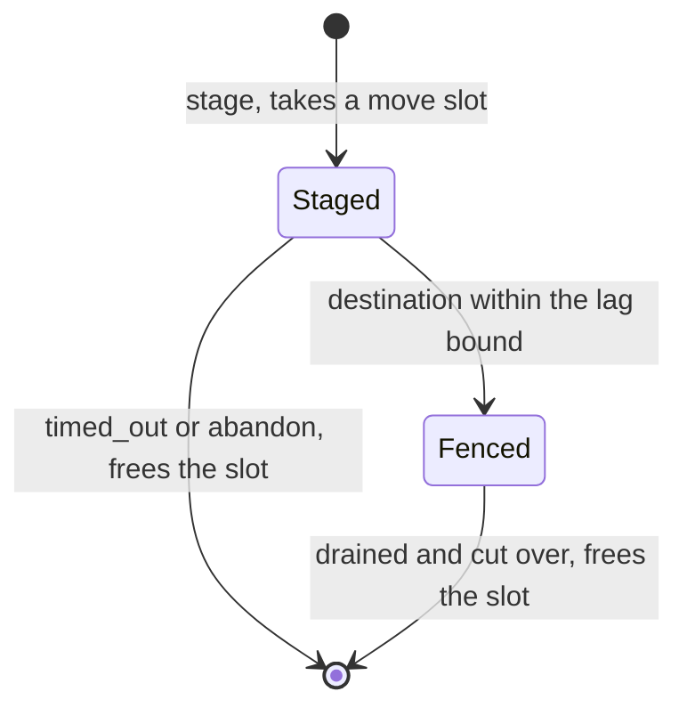

How shards move between brokers, what to do to make them move, and what to
watch while they do. Applies to any deployment; the Kubernetes page has the
chart-specific commands.

## What moves a shard

Two things, and an operator (see
[Moving shards by hand](/felix/deployment/moving-shards/)):

- **A broker over its share.** Placement counts the shards each live broker
  leads. A broker leading more than `ceil(shards / live brokers)` hands shards,
  one at a time, to a broker under its share, until no broker is over. A new
  broker registering is the usual cause: it starts with nothing and takes
  shards from whoever has the most.
- **A draining broker.** `POST /v1/nodes/{id}/drain` marks a broker as
  leaving. Placement moves every shard it leads to brokers that are staying,
  and replaces it as a follower wherever it holds a copy for someone else.
  The broker keeps serving throughout; nothing stops until each shard's
  handoff completes.

A shard is never simply reassigned while its leader is alive, because a
broker that has not seen the log would serve it empty. It is **moved**:

1. **Stage.** The destination joins the shard's replica set and the leader
   ships it the log.
2. **Fence.** Once the destination is caught up, the leader is told to stop
   serving the shard. It lets what it already accepted land, ships the last
   records, and reports that its log has stopped growing.
3. **Cut over.** The destination is named leader at a new generation and
   opens the shard.

Every step is written to the control plane's store, so a control-plane restart
or leader change resumes the move where it was. A destination that dies before
it leads is passed over: another caught-up replica takes the shard, or the old
leader keeps it and the move is chosen again. A leader that dies mid-move is
an ordinary failover.

## Adding a broker

Start it with a new `FELIX_NODE_ID` and the same control-plane URL and
credential the others use. Once it registers it is a placement target, and
the rebalance above starts on the next placement pass
(`FELIX_SHARD_RECONCILE_INTERVAL_MS`, 5 s by default).

Nothing else is required. A cluster that came up unevenly — every shard on
the first broker to register, say — corrects itself the same way.

## Draining a broker

With an operator token carrying `node.manage` on `cluster:*`:

```bash
curl -X POST -H "Authorization: Bearer $OPERATOR_TOKEN" \
  http://controlplane:8443/v1/nodes/broker-2/drain
```

Then wait until it leads nothing:

```bash
curl -s -H "Authorization: Bearer $OPERATOR_TOKEN" \
  "http://controlplane:8443/v1/shard-assignments?leader=broker-2"
# {"items":[]} when it is done
```

Stopping the process before that point is a failover, not a drain: the
shards it still leads fail over to caught-up replicas, and a shard with no
replica waits for the broker to come back.

Cancel a drain by putting the broker back into placement:

```bash
curl -X PATCH -H "Authorization: Bearer $OPERATOR_TOKEN" \
  -H "Content-Type: application/json" -d '{"lifecycle":"live"}' \
  http://controlplane:8443/v1/nodes/broker-2
```

Moves already staged run to completion; nothing further starts, and the
broker may then take shards back if it is under its share.

A broker registers every time it starts, and registering makes it `live`, so
**any restart of a draining broker also cancels its drain**. A rolling restart
in the middle of a drain has to be followed by draining it again.

## Removing a broker

Drain it, then wait until no assignment names it at all — not as leader, and
not as a follower either. Leading nothing is not enough: the drain also
replaces the broker wherever it holds a copy for another leader, and that
only happens while it is `draining`. Once it has left, a follower slot still
naming it stays as it is, and that shard runs one replica short.

```bash
curl -s -H "Authorization: Bearer $OPERATOR_TOKEN" \
  http://controlplane:8443/v1/shard-assignments |
  jq '[.items[] | select(.leader == "broker-2" or (.replicas | index("broker-2")))] | length'
# 0 when it is done
```

Then stop the process. Its shutdown marks it `left` with
`POST /v1/nodes/{id}/deregister`, which is what tells the control plane this
was intentional rather than a crash. The record is kept, so the identity and
its incarnation survive if a broker with that `FELIX_NODE_ID` is started again.
To remove it for good once the broker has stopped:

```bash
curl -X DELETE -H "Authorization: Bearer $OPERATOR_TOKEN" \
  http://controlplane:8443/v1/nodes/broker-2
```

The delete is refused while the broker is `live` or `draining`, and while any
shard names it: the assignment is the only record of where that shard's data
is, and a follower slot naming a node that no longer exists is never replaced.

## Watching a move

`GET /v1/shard-assignments` shows each shard's `state` and, during a move,
its `successor`:

| `state` | `successor` | Meaning |
| --- | --- | --- |
| `assigning` or `active` | absent | Nothing in progress |
| `assigning` or `active` | set | Staged: the successor is catching up |
| `draining` | set | Fenced: the leader is stopping, the cut-over is next |

A follower on a draining broker is replaced rather than moved: the
replacement shows as `joining`, copied in beside the follower it replaces,
which leaves once the replacement has caught up. `move_started_at_millis`
is when the move or replacement started, on the control plane's clock; on a
shard with neither in progress, it marks one that timed out.



Metrics on the control plane:

| Metric | Meaning |
| --- | --- |
| `felix_shard_move_steps_total{step}` | steps written: `stage`, `fence`, `cut_over`, `abandon`, `timed_out`, `reseat`, `seat` |
| `felix_shard_moves_timed_out_total` | moves and follower replacements given up at `FELIX_SHARD_MOVE_TIMEOUT_MS` |
| `felix_shard_moves_waiting` | moves that could not advance in the last pass |
| `felix_shard_assignment_write_conflicts_total` | steps not written because another control-plane instance changed the shard after this pass read it |
| `felix_shard_move_duration_seconds` | histogram: from a move's first step to its cut-over |
| `felix_shard_move_fence_seconds` | histogram: from the fence to the cut-over, the window in which the shard is not served |

Metrics on the destination broker:

| Metric | Meaning |
| --- | --- |
| `felix_broker_shard_move_seconds` | histogram: from the broker first seeing itself named as the destination to serving the shard |
| `felix_broker_shard_switchover_seconds` | histogram: from the fence to the destination serving the shard — the window clients see |

Metrics on any broker a publish reaches during the switch-over:

| Metric | Meaning |
| --- | --- |
| `felix_broker_shard_move_held_total` | publishes held for the cut-over instead of refused |
| `felix_broker_shard_move_hold_seconds` | histogram: how long each held publish waited |
| `felix_broker_shard_move_hold_refused_total{reason}` | publishes refused as `moving`: `timed_out` after `FELIX_SHARD_MOVE_HOLD_MS`, or `full` past `FELIX_SHARD_MOVE_HOLD_MAX` |
On the broker a shard is moving off:

| Metric | Meaning |
| --- | --- |
| `felix_broker_replication_move_throttled_bytes_total` | bytes shipped to move destinations under `FELIX_SHARD_MOVE_BYTES_PER_SEC` |

Every step is written only if the shard is still at the generation the pass
planned from, so two control-plane instances running placement at once
cannot undo each other's steps. A conflict is skipped and re-planned on the
next pass; an occasional one is normal with several instances.

`felix_shard_moves_waiting` sitting above zero for longer than a couple of
placement intervals means a successor is not catching up (check the leader's
`felix_broker_replication_lag_records` and `/replication/halted`), a fenced
leader is not reporting drained (a write stuck inside its fence, or the broker
lost its control-plane connection), or a drain is queued behind a move
limit.

## What clients see

Between the fence and the successor taking over, nobody serves the shard. A
publish that arrives in that window, at the old leader or at any other broker,
is **held**, before it is accepted, until the broker's routes show the new
owner, and is then sent there. The client sees a slower acknowledgement rather
than an error: the switch-over is tens of milliseconds on a local cluster. A
publish is refused, as `shard_unavailable` with reason `moving`, only if the
move has not cut over within `FELIX_SHARD_MOVE_HOLD_MS` (2 s) or more than
`FELIX_SHARD_MOVE_HOLD_MAX` publishes are already waiting; it was not written,
and the client retries. Cache writes, counter adds and consumer-group writes
are not held and are refused for the length of the switch-over.

While the destination is still copying the log, it does not count toward the
shard's quorum, so a `Quorum` publish waits for a majority of the replicas the
stream asked for and not for the copy.

Subscriptions and cache watches on the old leader are **ended** when it is
fenced, and each is told where to resume. A write routed to the old leader before
the fence lands there and the move waits for it; a publish arriving after the
fence is held until the cut-over and then sent to the new owner. The readers
are ended only once the writes already under way have landed, so each of them first receives every record the old leader committed.
Its last frame, `shard_moved`, names the broker taking the shard and the offset
to resume from; a client too old to ask for it sees the stream close instead.

A `ClusterClient` subscription follows the shard: it resubscribes on the new
owner at the larger of that offset and the last one it delivered, so on a
durable stream nothing is repeated or skipped. An in-memory stream resumes at
the new owner's tail. A sharded subscription does the same per shard and
reports `ShardMoved`; a sharded cache watch reports `ShardMoved` and moves that
shard's resume offset. A `Client` subscription ends with the same information
and leaves the resubscribe to the caller. Subscriptions are not migrated: the
new owner serves the shard only once it has opened it, and a resubscribe before
then is refused and retried.

Every publish acknowledged before or during a move is on the new owner. The
tests behind these claims are in `crates/testing/felix-cluster/tests/routing/rebalance.rs`,
`crates/testing/felix-cluster/tests/routing/moved_readers.rs` and
`crates/testing/felix-cluster/tests/routing/subscriptions_follow.rs`; the write
fence and its tests are in `services/felix-broker-service/src/shards/lifecycle/fence.rs`.

## Tuning

| Setting | Default | Effect |
| --- | --- | --- |
| `FELIX_SHARD_MOVES_MAX_CONCURRENT` | `1` | Copies in flight across the cluster: moves, and followers being replaced on a draining broker. Each is a full copy of a shard's log; raise it to drain a broker with many shards faster, at the cost of that much more replication traffic at once. `0` holds every move. |
| `FELIX_SHARD_MOVES_MAX_PER_NODE` | unset | Copies in flight into or out of any one broker. Raise the cluster-wide limit and set this to keep any one broker's disk and network from carrying all of them. |
| `FELIX_SHARD_MOVE_FENCE_MAX_LAG_RECORDS` | `1000` | How far behind the leader a destination may be when the leader is fenced. A busy shard's destination is almost never exactly level, so a move waits for this instead; the leader then stops and the rest is copied before the cut-over. Larger shortens the wait to fence and lengthens the switch-over by the time it takes to copy that many records. |
| `FELIX_SHARD_MOVE_TIMEOUT_MS` | `1800000` | How long a move may copy before its fence (or a replacement before it has caught up) before it is given up and its slot goes to the next move. Keep it well above the time the largest shard takes to copy. `0` never gives up. A fenced move is always finished, unless an operator cancels it. |
| `FELIX_SHARD_MOVE_BYTES_PER_SEC` (broker) | `0` | Bytes per second a broker ships to move destinations, across every shard it leads. Applied only to a destination the quorum does not need (one still copying is left out of it), so `Quorum` publishes never wait on it, and not to the remainder after the fence. `0` is unlimited. |
| `FELIX_SHARD_RECONCILE_INTERVAL_MS` | `5000` | How often placement runs on its own. A report a move is waiting for (the successor caught up, the leader drained) runs a pass straight away when the control-plane instance that receives it is the one running placement. |
| `FELIX_CONTROLPLANE_SYNC_INTERVAL_MS` (broker) | `2000` | How often a broker refreshes its node catalog and runs its background passes. Assignment changes are long-polled and reach the broker as they are written, so this does not bound a move's switch-over, except against a control plane too old to long-poll. |

A drain of `n` shards at the default policy takes up to one placement
interval per shard to start its move, plus the time to copy each log. The
fence and the cut-over follow the reports that allow them rather than the
interval.

## Troubleshooting

| Symptom | Likely cause |
| --- | --- |
| A drain never finishes; `felix_shard_moves_waiting` is `1` | The successor is not catching up. Look at the leader's `/replication/halted` and replication lag. |
| `felix_shard_moves_timed_out_total` keeps rising | A destination the leader cannot reach, or a copy slower than the timeout allows: check peer connectivity, `FELIX_SHARD_MOVE_BYTES_PER_SEC`, and the timeout against the shard's size. |
| A drain never finishes; no successor is ever staged | No live broker under its share has capacity (`max_shards`), or `FELIX_SHARD_MOVES_MAX_CONCURRENT` is `0`. |
| Shards moved, then moved back | The drained broker was put back to `live`, or restarted (which registers it `live`), while under its share. Drain it again. |
| A removed broker is still listed in a shard's `replicas` | It was stopped before the drain reseated that follower. Start it again, drain it, and wait for the check above to reach 0. |
| `POST /v1/nodes/{id}/drain` returns 409 | The broker is `down` or `left`, so there is nothing to drain. |
| `DELETE /v1/nodes/{id}` returns 409 | The broker is still running, or a shard still names it. The message says which. |
