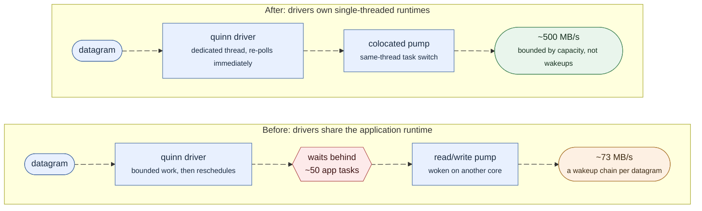

Felix has six distinct places where a message can be slowed down, queued, or
shed, spread across the publish and subscribe paths covered in
[Internals: The Publish Path](/felix/development/internals-publish/) and
[Internals: Subscribe & Fanout](/felix/development/internals-subscribe/). This page is the
map of all six in one place — what each one guards against, what happens
when it's full, and how they compose into the "throughput plateaus, latency
stays bounded, overload becomes visible" curve the
[Benchmarks](/felix/features/benchmarks/) page measures.

It also covers `core_shards`, the thread-per-core mode that changes *where*
(which OS thread/core) this pipeline runs, without changing any of the
policy logic below.

## The full backpressure chain

In publish → delivery order:

| # | Checkpoint | Bounds | Policy knob | Default |
|---|---|---|---|---|
| 1 | Client `PublishAdmission` | in-flight publish **bytes**, shared across all client workers | — (always waits) | `publish_inflight_bytes` = 4 MiB |
| 2 | Client worker mpsc channel | queued publish **items** per stream-worker | — (backpressure via channel) | `publish_queue_depth` = 64 |
| 3 | Broker `PublishAdmission` | in-flight publish **bytes**, process-wide | — (always waits, within `EnqueuePolicy::Wait`'s timeout) | `pub_inflight_bytes` = 64 MiB |
| 4 | Broker worker mpsc channel | queued publish **items**, process-wide (or per-shard) | `EnqueuePolicy`: `Drop` / `Fail` / `Wait` / `Backpressure` | `pub_queue_depth` = 64, `Drop` unless `pub_ingress_wait` (then `Backpressure`) |
| 5 | Broker-core subscriber channel | queued `DeliveryEnvelope`s per subscriber | `subscriber_queue_policy`: `Block` / `DropNew` / `DropOld` | `subscriber_queue_capacity` = 512, `drop_new` |
| 6 | Writer lane channel | queued `LaneCommand`s per lane | `subscriber_lane_queue_policy`: same three | `subscriber_lane_queue_depth` = 64, `drop_new` |

Checkpoints 1-2 are client-side (see
[Internals: The Publish Path](/felix/development/internals-publish/#client-side-publisherpublish)),
3-4 are broker ingest, 5-6 are broker egress (see
[Internals: Subscribe & Fanout](/felix/development/internals-subscribe/)). Below that, QUIC's
own flow control is the final backpressure layer — a subscriber that isn't
reading eventually blocks the connection writer's `send.write_all()`, which
is why checkpoints 5-6 exist at all: without them, one slow subscriber's
QUIC-level backpressure would eventually block fanout to every other
subscriber sharing the broker-core `Arc` snapshot loop.

### Why bytes *and* items, twice

Checkpoints 1/3 (bytes) and 2/4 (items) look redundant but aren't:
`pub_queue_depth` alone bounds how many *jobs* queue, but a job's payload
can be as large as `max_frame_bytes` (16 MiB default) — a handful of large
batches can blow the intended memory budget long before they fill an
item-count queue. `PublishAdmission` (`crates/felix-client/src/client/publisher.rs`
and `services/broker/src/transport/quic/handlers/publish/` — two separate
structs, same design) is a `tokio::sync::Semaphore` sized in bytes rather
than permits-as-items, acquired via `acquire_many_owned(byte_count)`. The
permit is attached to the request/job and released only when it's actually
processed, not when it's merely handed to a channel — so the byte budget
reflects real resident memory, not just admission-time throughput.

### Why two queue-policy checkpoints on egress (5 and 6)

`subscriber_queue_policy` (5) gates the broker-core fanout loop in
`Broker::publish_batch_to_handle` — the very first hand-off after a message
is appended to the log. `subscriber_lane_queue_policy` (6) gates a second,
independent hand-off one hop later, from a subscription's feeder task to
its writer lane. They're separate because they guard against different
failure modes: (5) is about a subscriber's application-level consumer
falling behind (not reading fast enough); (6) is about the *lane* — shared
across many subscribers — being saturated, e.g. because one lane's
connection writer is stuck on a flow-control-blocked QUIC stream. A
subscriber can be perfectly healthy at checkpoint 5 and still get shed at
checkpoint 6 because it happens to share a lane with a slow neighbor.

### `Block` vs `DropNew`/`DropOld`

```rust
pub enum SubQueuePolicy {
    Block,    // sender awaits queue space — nothing is ever shed
    DropNew,  // sender try_sends; on Full, the new item is discarded
    DropOld,  // emulated as DropNew today; tracked separately in metrics
}
```

Production defaults are `drop_new` at both checkpoints: overload becomes a
counted, bounded-latency event (`felix_subscribe_dropped_total`,
`felix_sub_queue_dropped_total`) instead of an ever-growing backlog with
unbounded tail latency. The [Benchmarks](/felix/features/benchmarks/) harness
flips both to `Block` (plus `pub_ingress_wait: true` upstream, so the
publisher itself slows down rather than getting shed at checkpoint 4) to
measure *lossless sustainable throughput* — a deliberately different mode
from the production default, not a "more correct" one. Which mode you want
is a product decision, not a performance one: `Block` guarantees delivery
at the cost of publishers slowing down for one bad subscriber; `DropNew`
guarantees publishers never slow down at the cost of that subscriber
missing events.

## Core sharding

**File**: `services/broker/src/core_shards.rs`

Everything above describes *what* queues and *what* gets shed. Core
sharding is about *where* the code that does this actually runs — normally,
tokio's work-stealing scheduler bounces tasks across OS threads/cores
freely, which means a stream's publish worker and its subscribers' feeder
tasks can end up on different cores, turning every hand-off in the chain
above into a cross-core cache-line bounce and a scheduler wakeup.

`core_shards` (off by default; `FELIX_CORE_SHARDS` / `core_shards: N`) is a
fixed set of single-threaded tokio runtimes, one per shard, each pinned to
a CPU core on Linux (`sched_setaffinity`; a dedicated thread with no hard
pinning elsewhere):

```rust
pub struct CoreShards {
    handles: Vec<tokio::runtime::Handle>,
    _shutdown: Vec<oneshot::Sender<()>>,
}

impl CoreShards {
    pub fn shard_for(&self, handle_id: u64) -> usize {
        (handle_id as usize) % self.handles.len()
    }
    pub fn handle_for(&self, handle_id: u64) -> &tokio::runtime::Handle {
        &self.handles[self.shard_for(handle_id)]
    }
}
```

A stream's `StreamHandle::id()` deterministically picks its shard. Two
places use `shard_for`/`handle_for` with that *same* id, so they always
agree on which shard owns a given stream:

- **Publish workers** (`conn.rs:build_publish_context`): when `core_shards`
  is set, the worker count becomes the shard count (one worker per shard,
  replacing `pub_workers_per_conn`), and worker `i` is spawned on shard
  `i`'s runtime via `shards.handle_for(worker_id as u64).spawn(..)`.
  `publish_worker_index` (`handle.id() % worker_count`) then routes a
  stream's publishes to the worker — and therefore the core — that owns it.
- **Subscription lane feeders** (`subscribe.rs:handle_subscribe_message`, feeding `subscribe/feeder.rs`):
  after registering with the lane manager, the broker resolves the
  subscription's `StreamHandle` and spawns `run_lane_feeder` on
  `shards.handle_for(handle.id())` instead of the default runtime.

The result: a stream's publish-side append/fanout and its subscribers'
dequeue/encode all execute on one core. What stays *off* the shards
deliberately: QUIC I/O — quinn does packetization and TLS in its own driver
tasks regardless of who calls it, and those have their own placement story
(next section). See
[Benchmarks: Core Sharding](/felix/features/benchmarks/) for measured impact
(scales with stream count; single-stream workloads are neutral-to-positive
by design, since a single stream only ever has one owning shard either way).

## The QUIC I/O runtime

**File**: `crates/felix-transport/src/lib.rs`

Quinn's driver tasks (the endpoint receive loop and each connection's
transmit/ACK/timer loop) do a *bounded* slice of work per poll and then
reschedule themselves. That makes their scheduler re-poll latency the
transport's throughput ceiling: wakeups scale with datagram count, so a
shared, loaded runtime turns per-wakeup latency directly into a per-byte
rate cap — measured as a ~7.5× sustained-throughput defect before this
existed, and per-byte rather than per-message, which is what made it look
like a payload-size problem rather than a scheduling one.



The two rows animate at different speeds on purpose: the work per hop is the
same in both, and only the waiting differs. Every stage measured in
microseconds while the pipeline ran at a fraction of its capacity, which is
exactly the signature of a latency-bound dependency chain rather than a
saturated resource.

Felix therefore runs quinn drivers on a pool of dedicated *single-threaded*
runtimes, high QoS on macOS, via a custom `quinn::Runtime` implementation.
`FELIX_IO_RUNTIME_THREADS` sizes the pool (default: 2; `0` restores the
shared runtime).

Which endpoints share a runtime is load-bearing. Assignment is by role,
not round-robin: server endpoints spread across every runtime but the last,
and client endpoints all share the last one. A server endpoint multiplexes
every connection and drives traffic in both directions, so sharing its
runtime starves it — measured 5–6× slower when a client endpoint landed
next to it. A client's publish and event endpoints carry the two halves of
one request/response flow, so *splitting* them across threads makes every
message pay two cross-thread wakeups. The partition is independent of
creation order — a history-dependent assignment recreated the slow topology
on every second benchmark case before this was fixed.

Two pump tasks are *colocated* with their connection's drivers through
`QuicConnection::spawn_pump`, because they exchange a wakeup with the
transport per datagram or per write, and a same-thread wakeup is a task
switch rather than a cross-core kernel round trip:

- the client's subscription read task (`felix-client`, `subscription.rs`);
- the broker's per-connection delivery writer (`subscribe/lane.rs`).

The client's *publisher* writer is deliberately not colocated: it spends its
time blocked in `write_all` against a full send window, and parking it on
the I/O thread starves the very drivers it waits on (measured 5× worse).

## Putting it together: what a "saturated" system looks like

With defaults (checkpoints 4-6 shedding, not blocking): as publish rate
exceeds what a subscriber's consumer can drain, checkpoint 5 or 6 starts
shedding for *that subscriber only* — other subscribers on the stream are
unaffected (checkpoint 5 is per-subscriber; checkpoint 6 is per-lane, and
lane assignment spreads subscribers across lanes). Publish-side throughput
is untouched; the overloaded subscriber sees drops and bounded queue depth
instead of growing latency. That's the "plateau, don't degrade" curve.

With lossless mode (`Block` + `pub_ingress_wait`): the same overload instead
propagates backward through every checkpoint — a slow subscriber blocks its
lane, which blocks its feeder, which blocks broker-core fanout for *every*
subscriber of that stream (checkpoint 5 sends to all subscribers before
returning), which blocks the publish worker, which fills the broker
`PublishAdmission` byte budget, which blocks publishers. This is why
lossless mode is explicitly opt-in: it turns one slow consumer into
backpressure on every producer of that stream.

## If you want to change...

| You want to... | Look at |
|---|---|
| Add a new backpressure checkpoint | Decide which layer it belongs to (ingest vs. broker-core fanout vs. lane) — see the table above for precedent |
| Change what happens when a checkpoint is full | `SubQueuePolicy` (`crates/felix-broker/src/config.rs`) for 5/6, `EnqueuePolicy` (`publish/ack.rs`) for 3/4 |
| Change the byte-budget admission logic | `PublishAdmission` — separately in `crates/felix-client/src/client/publisher.rs` (client) and `services/broker/src/transport/quic/handlers/publish/admission.rs` (broker); kept intentionally symmetric, change both if you change the design |
| Change core-sharding/stream-ownership logic | `services/broker/src/core_shards.rs`; the two call sites in `conn.rs` and `subscribe.rs` that must agree on `handle_id -> shard` |
| Debug "why is this subscriber not getting messages" | Check `felix_subscribe_dropped_total` / `felix_sub_queue_dropped_total` counters first — if either is nonzero for a stream, you're at checkpoint 5 or 6, not a bug |
