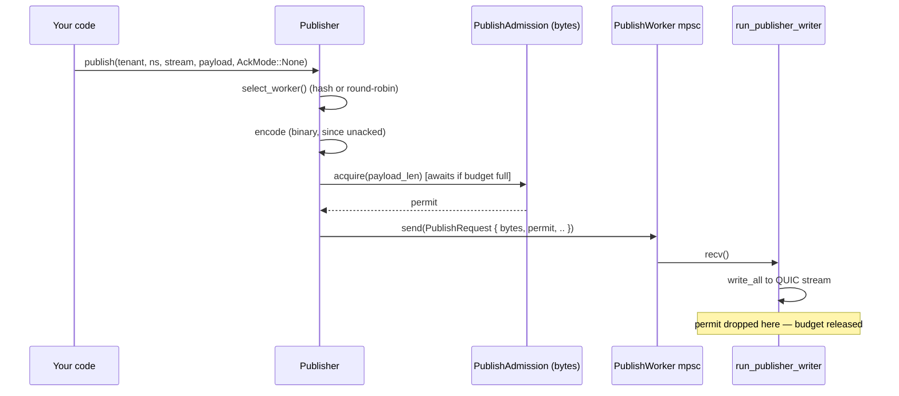

This page traces exactly what happens, function by function, when a client
publishes a message — from `Publisher::publish()` to the message landing in
every subscriber's queue. It's written for contributors who need to change
or debug this path, not as an API reference (see the
[Client SDK](/felix/api/client-sdk/) for that).

Every code reference below is `path/to/file.rs:function_name` as of this
writing — line numbers drift, function names are stable, use your editor's
"go to definition" from there.

## The cast of types

Keep these in your head; everything below is these types moving data around.

| Type | Where | What it is |
|---|---|---|
| `Publisher` / `PublisherInner` | `crates/felix-client/src/client/publisher.rs` | Client-side handle; owns a pool of `PublishWorker`s and a byte-budget `PublishAdmission` |
| `PublishRequest` | same | Enum sent over an mpsc channel to a `PublishWorker`'s writer task — carries the encoded message *and* an admission permit |
| `PublishJob` | `services/broker/src/transport/quic/handlers/publish.rs` | Broker-side unit of work — a resolved `PublishTarget`, payloads, optional ack channel, optional admission permit |
| `StreamHandle` | `crates/felix-broker/src/lib.rs` | A cheap `Arc<StreamState>` clone — the dense, pre-resolved identity of a stream. Resolving this once and reusing it is what removed string hashing from the hot path (see [below](#stream-resolution-why-a-handle-not-a-string)) |
| `StreamState` | same | The actual per-stream state: subscriber registry, in-memory replay log, queue policy |
| `DeliveryEnvelope` | same | An `Arc`-wrapped batch of payloads handed to every subscriber of a stream — the same `Arc`, not a copy per subscriber |

## Client side: `Publisher::publish()`

**File**: `crates/felix-client/src/client/publisher.rs`

```rust
pub async fn publish(
    &self,
    tenant_id: &str,
    namespace: &str,
    stream: &str,
    payload: Vec<u8>,
    ack: AckMode,
) -> Result<()>
```

1. **Worker selection.** `select_worker()` picks one of the pool's
   `PublishWorker`s, either round-robin or by hashing `(tenant_id, namespace,
   stream)` (`PublishSharding::HashStream` — the mode that keeps a stream's
   messages on one QUIC stream, preserving order). The hash result is cached
   per-connection in `stream_cache: Mutex<StreamShardCache>` so repeat
   publishes to the same stream skip re-hashing.

2. **Encoding.** If `ack == AckMode::None`, the message is binary-encoded by
   default (`felix_wire::binary::encode_publish_batch` under the hood) —
   this is the fast path. If you want JSON instead (debugging, a client that
   hasn't implemented the binary decoder), call `publish_json`/
   `publish_batch_json` explicitly. Acked publishes (`PerMessage`/`PerBatch`)
   still use the JSON control encoding until binary ack framing exists — see
   [Wire Protocol](/felix/architecture/wire-protocol/#binary-publish-batch-encoding).

3. **Admission.** Before the message is handed to the worker's channel, the
   caller awaits `PublishAdmission::acquire(estimated_bytes)` — a
   `tokio::sync::Semaphore` sized in **bytes**, shared across every worker in
   the pool (`publish_inflight_bytes`, default 4 MiB). This is a second,
   independent bound from the worker's mpsc channel depth
   (`publish_queue_depth`, default 64 *items*): a handful of large messages
   can fill the byte budget long before they fill the item-count queue. The
   `OwnedSemaphorePermit` returned here is attached to the `PublishRequest`
   and travels with it — released only when the worker finishes processing,
   not when it's merely queued. See
   [Internals: Backpressure](/felix/development/internals-concurrency/) for why that timing
   matters.

4. **Enqueue.** The encoded `PublishRequest` (carrying the permit) goes onto
   the worker's mpsc channel. `run_publisher_writer` — one task per QUIC
   stream — pulls requests off that channel **one at a time**: it's a
   single-writer loop, so a stream's messages are always written in the
   order they were enqueued. This is why `publish_conn_pool` /
   `publish_streams_per_conn` control your actual publish parallelism: each
   stream is strictly serial internally.



## Broker side: from QUIC frame to `PublishJob`

**File**: `services/broker/src/transport/quic/handlers/publish/` (`control.rs`, `uni.rs`, `ingress.rs`, `admission.rs`, `ack.rs`)

The broker's publish workers are a **global, process-wide pool** — not
per-connection. The comment at `conn.rs:build_publish_context` explains why:
per-connection pools meant more publisher connections multiplied concurrent
`Broker::publish_batch` callers and caused lock contention on shared broker
state. One fixed pool, sharded by stream, avoids that.

1. **Stream resolution.** `resolve_stream_cached()` turns
   `(tenant_id, namespace, stream)` into a `StreamHandle`, backed by a
   short-lived cache (`StreamHandleCache`, TTL'd) keyed on a scratch string
   built without extra allocation. Once resolved, the handle travels as
   `PublishTarget::Resolved(handle)` — no more string hashing or `RwLock`
   reads for this stream until the cache entry expires.

   #### Stream resolution: why a handle, not a string
   Before this existed, every publish re-hashed `(tenant, namespace, stream)`
   and read through an `RwLock<HashMap<..>>` to find the stream's state. A
   `StreamHandle` is just `Arc<StreamState>` with an `id()` — clone it, pass
   it around, and worker/shard selection becomes `handle.id() % worker_count`
   instead of a string hash. See `crates/felix-broker/src/lib.rs:StreamHandle`.

2. **Admission.** Mirrors the client exactly: `enqueue_publish()` computes
   `job_bytes = payloads.iter().map(Bytes::len).sum()` and acquires from a
   broker-side `PublishAdmission` (byte semaphore, `pub_inflight_bytes`,
   default 64 MiB, process-wide) *before* the job is hard-committed to a
   worker channel. The policy for what happens when admission or the queue
   is full is an explicit enum:

   ```rust
   pub(crate) enum EnqueuePolicy {
       Drop, // shed silently — fire-and-forget traffic
       Fail, // reject immediately — acked traffic, fail fast
       Wait, // bounded wait (publish_queue_wait_timeout_ms) — commit-ack traffic
   }
   ```

   Unacked publishes use `Drop` (or `Wait` if `pub_ingress_wait` is set —
   see [Internals: Backpressure](/felix/development/internals-concurrency/)). This is where
   "overload becomes visible instead of silently buffering" is enforced on
   ingest.

3. **Worker dispatch.** `job.target`'s handle id picks a worker index
   (`handle.id() as usize % worker_count`). With `core_shards` enabled, this
   is *also* the shard index — the worker for a given stream always runs on
   the same OS thread, pinned to the same core. See
   [Internals: Backpressure & Core Sharding](/felix/development/internals-concurrency/#core-sharding).

4. **The worker loop** (`conn.rs:build_publish_context`, spawned once per
   worker) does the actual work:

   ```rust
   while let Some(job) = publish_rx.recv().await {
       match &job.target {
           PublishTarget::Resolved(handle) => {
               broker.publish_batch_to_handle(handle, &job.payloads).await
           }
           // ..
       }
   }
   ```

   The `job`'s admission permit is a field on `PublishJob` and is dropped
   here, at the end of the loop iteration — after `publish_batch_to_handle`
   returns. That's the "released only when actually processed" guarantee.

## Broker core: `Broker::publish_batch_to_handle`

**File**: `crates/felix-broker/src/lib.rs`

This is where the message actually becomes visible to subscribers.

```rust
pub async fn publish_batch_to_handle(
    &self,
    handle: &StreamHandle,
    payloads: &[Bytes],
) -> Result<usize> {
    if !handle.state.active.load(Ordering::Acquire) {
        return Err(BrokerError::StreamHandleInactive(handle.id()));
    }
    let stream_state = &handle.state;
    stream_state.append_batch(payloads, self.log_capacity);   // 1
    let senders = stream_state.subscriber_snapshot();          // 2
    let envelope = DeliveryEnvelope::new(payloads);             // 3
    for subscriber in senders.iter() {                          // 4
        // match on stream_state.subscriber_queue_policy: Block / DropNew / DropOld
        subscriber.sender.send(envelope.clone()).await; // or try_send / try_reserve
    }
}
```

1. **`append_batch`**: appends to an in-memory `VecDeque<LogEntry>` under
   one `Mutex` lock — one lock acquisition per *batch*, not per payload —
   then trims to `log_capacity`. This log exists for cursor-based replay
   (subscribers reading from an offset); it is not durable storage.

2. **`subscriber_snapshot`**: reads an `ArcSwap<Vec<SubscriberEntry>>` —
   lock-free on the hot path. The actual subscriber registry
   (`Mutex<SubscriberRegistry>`, a `Slab`) is only touched on
   subscribe/unsubscribe; every publish just clones the current `Arc`
   snapshot. This is why adding/removing subscribers doesn't contend with
   in-flight publishes.

3. **`DeliveryEnvelope::new`**: wraps `payloads` in one `Arc<[Bytes]>` plus a
   `Mutex<Option<Bytes>>` cache slot for the encoded wire frame (filled
   lazily, once, by whichever subscriber's feeder task encodes it first —
   see [Internals: Subscribe & Fanout](/felix/development/internals-subscribe/)). Every
   subscriber gets a `.clone()` of this `DeliveryEnvelope` — an `Arc` bump,
   not a payload copy, and critically *not* a per-subscriber re-encode. This
   is the single biggest fanout-cost change in Felix's history: fanout used
   to be O(fanout) encode calls per publish; it's now O(1).

4. **Per-subscriber send**, gated by `stream_state.subscriber_queue_policy`
   (`SubQueuePolicy::Block | DropNew | DropOld`) — this is the first of two
   backpressure checkpoints on the subscribe side. See
   [Internals: Backpressure](/felix/development/internals-concurrency/#the-full-backpressure-chain)
   for the complete picture, including the second checkpoint (the writer
   lane) further downstream.

## Worked example

Publishing one message to a stream with 3 active subscribers, unacked,
`core_shards` disabled:

1. Client hashes `(t1, orders, updates)` to worker 2, encodes binary, awaits
   the 4 MiB byte budget, enqueues on worker 2's channel.
2. `run_publisher_writer` for worker 2 (a dedicated task owning one
   bidirectional QUIC stream — publish streams are `open_bi`, opened and
   authenticated once at connect time) writes the frame; the broker's stream
   handler on the other end decodes it into
   `PublishJob { target: PublishTarget::Resolved(handle), .. }`.
3. Global publish worker `handle.id() % worker_count` picks up the job,
   calls `publish_batch_to_handle`.
4. One payload is appended to the log; the subscriber snapshot (3 entries)
   is read without a lock; one `DeliveryEnvelope` is created.
5. The envelope is `.clone()`d 3 times (3 `Arc` bumps) and sent to 3
   different `mpsc::Sender<DeliveryEnvelope>` — one per subscriber.
6. Each subscriber's feeder task independently calls
   `envelope.shared_event_frame()`. The *first* one to call it pays the
   encode cost and caches the result in the envelope; the other two get the
   cached `Bytes` for free. See [Internals: Subscribe & Fanout](/felix/development/internals-subscribe/).

## If you want to change...

| You want to... | Look at |
|---|---|
| Change how publishes are encoded (binary vs JSON, new wire format) | `crates/felix-client/src/client/publisher.rs` (`publish`/`publish_json`), `crates/felix-wire/src/lib.rs` |
| Change client-side publish backpressure | `PublishAdmission` in `publisher.rs`; `publish_queue_depth`/`publish_inflight_bytes` in `crates/felix-client/src/config.rs` |
| Change broker ingest admission/shedding behavior | `EnqueuePolicy` in `handlers/publish/ack.rs` and `enqueue_publish()` in `handlers/publish/ingress.rs` |
| Change stream resolution/caching | `resolve_stream_cached`, `StreamHandleCache` in `publish.rs`; `StreamHandle` in `crates/felix-broker/src/broker.rs` and `resolve_stream_handle` in `crates/felix-broker/src/registry.rs` |
| Change fanout/queue policy for subscribers | `SubQueuePolicy` match in `Broker::publish_batch_to_handle`, `crates/felix-broker/src/lib.rs` |
| Change the in-memory replay log | `StreamState::append_batch`/`snapshot_range`, `crates/felix-broker/src/lib.rs` |
| Add a new publish worker sharding strategy | `PublishSharding` in `crates/felix-client/src/client/sharding.rs`; `publish_worker_index` in `publish/ingress.rs` |

Next: [Internals: Subscribe & Fanout](/felix/development/internals-subscribe/) picks up where
this page leaves off — what happens to the `DeliveryEnvelope` after it lands
in a subscriber's queue.
