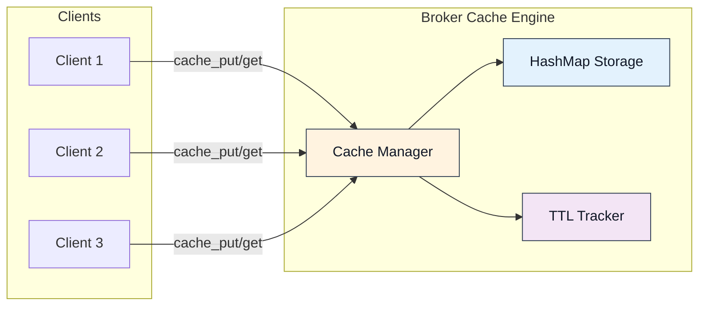
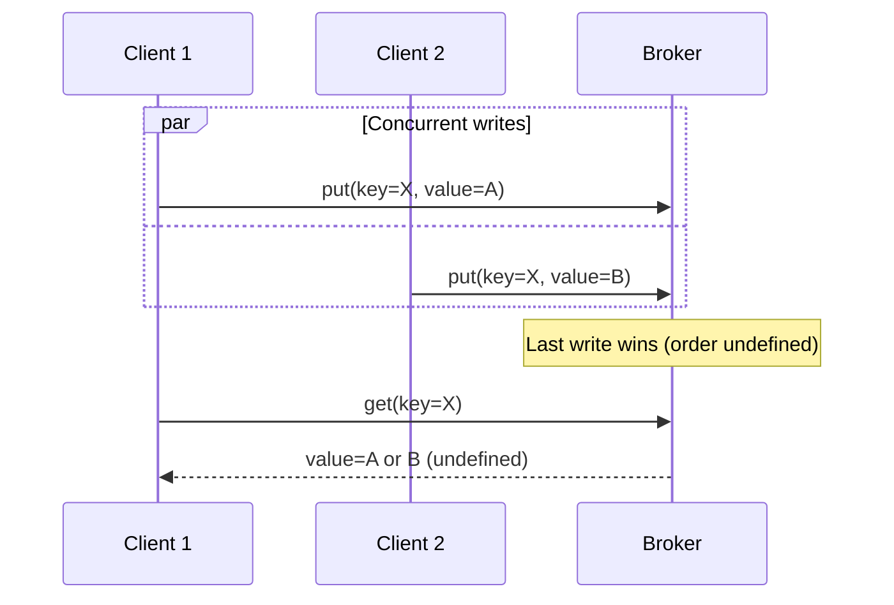
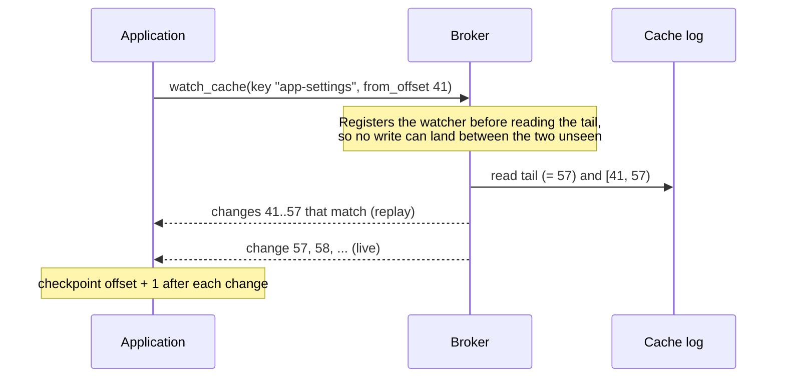

The Felix cache is a key-value store served over the same QUIC transport and
wire protocol as everything else. It exists for the workloads a sidecar Redis
usually gets deployed for — sessions, configuration, hot lookups — without
running a second system.

## Overview

The Felix cache is:

- **Key-value store** with optional TTL (time-to-live)
- **Scoped** to `(tenant_id, namespace, cache_name, key)`
- **In-memory** for lowest latency, when the broker has no durable storage configured. With `FELIX_DURABLE_STORAGE_DIR` the cache is backed by a log and survives a restart.
- **Watchable** when log-backed: subscribe to changes for one key or key prefix, resume by offset, with loss made loud rather than silent
- **Multiplexed** over pooled QUIC streams
- **Highly concurrent** with request pipelining



## Core Features

### 1. Low-Latency Operations

Felix cache is optimized for microsecond-level latency:

**Localhost performance** (concurrency=32):

| Operation | Payload | p50 Latency | p99 Latency | Throughput |
|-----------|---------|-------------|-------------|------------|
| put | 0 B | 158 µs | 350 µs | 184k ops/sec |
| put | 256 B | 179 µs | 380 µs | 155k ops/sec |
| put | 4 KB | 260 µs | 480 µs | 78k ops/sec |
| get (hit) | 256 B | 177 µs | 360 µs | 166k ops/sec |
| get (miss) | - | 165 µs | 340 µs | 179k ops/sec |

Methodology and current figures live in
[Benchmarks](/felix/features/benchmarks/). Compared to a plain-TCP cache,
Felix pays some latency for always-on TLS and QUIC framing; what it buys is
multiplexing, per-stream flow control, and one system instead of two.

### 2. Time-to-Live (TTL)

Store entries with automatic expiration:

```rust
// Store session with 1-hour TTL
client.cache_put(
    "acme",
    "prod",
    "sessions",
    "user-abc",
    session_data,
    Some(3600_000)  // 60 minutes in milliseconds
).await?;

// After 1 hour, entry automatically expires
tokio::time::sleep(Duration::from_secs(3601)).await;

// Returns None (expired)
assert_eq!(
    client.cache_get("acme", "prod", "sessions", "user-abc").await?,
    None
);
```

**TTL semantics**:

- **Countdown starts**: When `cache_put` completes
- **Expiration checking**: Lazy (on access)
- **Precision**: Best-effort, typically < 100 ms variance
- **Updates**: Each `cache_put` resets TTL

**Common TTL patterns**:

```rust
// Short-lived session (5 minutes)
client
    .cache_put("acme", "prod", "sessions", key, data, Some(300_000))
    .await?;

// Medium-lived cache (1 hour)
client
    .cache_put("acme", "prod", "user-profiles", key, data, Some(3600_000))
    .await?;

// Long-lived config (24 hours)
client
    .cache_put("acme", "prod", "config", key, data, Some(86400_000))
    .await?;

// Permanent (until restart or eviction)
client
    .cache_put("acme", "prod", "static-data", key, data, None)
    .await?;
```

### 3. Namespace Scoping

Cache entries are scoped to prevent collisions:

**Scope hierarchy**:

```
(tenant_id, namespace, cache_name, key)
```

**Example**:

```rust
// These are completely independent entries
client.cache_put_scoped("acme", "prod", "sessions", "user-123", data1, ttl).await?;
client.cache_put_scoped("acme", "staging", "sessions", "user-123", data2, ttl).await?;
client.cache_put_scoped("acme", "prod", "profiles", "user-123", data3, ttl).await?;
client.cache_put_scoped("other-tenant", "prod", "sessions", "user-123", data4, ttl).await?;
```

**Benefits**:

1. **Isolation**: Tenants can't access each other's data
2. **Organization**: Group related entries by cache name
3. **Flexibility**: Different TTLs/eviction per cache
4. **Multi-tenancy**: Safe shared infrastructure

### 4. Request Pipelining

Send multiple cache requests without waiting for responses:

```rust
use futures::future::join_all;

// Issue 10 concurrent gets
let futures = (0..10).map(|i| {
    let key = format!("key-{}", i);
    client.cache_get("acme", "prod", "config", &key)
});

// Await all responses
let results: Vec<Option<Vec<u8>>> = join_all(futures).await
    .into_iter()
    .collect::<Result<Vec<_>>>()?;
```

Ten sequential gets cost ten round trips; ten pipelined gets cost roughly
one. It works because each request carries a `request_id`, the broker may
answer out of order, and the client correlates replies — so nothing waits on
anything it doesn't have to.

### 5. Stream Pooling

Felix uses stream pooling for high-concurrency cache workloads:

```yaml
# Client configuration
cache_conn_pool: 8              # QUIC connections
cache_streams_per_conn: 4       # Streams per connection
# Total concurrent operations: 8 × 4 = 32
```

**Why pooling matters**:

Without pooling (single stream):
- All requests serialize on one stream
- HOL blocking if any request is slow
- Limited throughput

With pooling, requests spread across streams with independent flow control,
so concurrency scales until the transport or broker saturates — not a fixed
multiplier. Measure your own workload's shape; the concurrency sweep in
[Benchmarks](/felix/features/benchmarks/) is the reference point.

### 6. Consistency Model

Felix cache provides **read-your-writes** consistency:

```rust
// Put value
use bytes::Bytes;
client
    .cache_put("acme", "prod", "data", "key", Bytes::from_static(b"value-1"), None)
    .await?;

// Immediately read (same client)
assert_eq!(
    client.cache_get("acme", "prod", "data", "key").await?,
    Some(b"value-1".to_vec())
);
```

**Consistency guarantees**:

1. **Read-your-writes**: Client sees its own writes immediately
2. **Monotonic reads**: Never see older value after newer one (same session)
3. **Eventual consistency**: All clients eventually see latest value
4. **No torn writes**: Writes are atomic

**No linearizability**: Concurrent writes from different clients may see inconsistent ordering.



### 7. Keyed Watch

A log-backed cache is not just readable — it is *subscribable*. `watch_cache`
delivers every applied write for one key or key prefix, in the shard's write
order, each change carrying the cache-log offset that makes it resumable:

```rust
use felix_client::{CacheWatchFilter, CacheWatchItem};

// Current changes only, from now on
let mut watch = client
    .watch_cache("acme", "prod", "config", CacheWatchFilter::Key("app-settings".into()), None)
    .await?;

while let Some(item) = watch.recv().await {
    match item {
        CacheWatchItem::Change(change) => match change.value {
            Some(value) => reload_config(&value),           // put
            None => clear_config(),                          // delete
        },
        CacheWatchItem::Lagged { resume_from } => {
            // The watch fell behind and was ended. Re-watching from
            // `resume_from` replays everything missed — gapless.
            break;
        }
        CacheWatchItem::ShardMoved(moved) => {
            // The shard moved to another broker, which ended the watch.
            // Re-watch from `moved.resume_from`, or after the last offset seen.
            break;
        }
    }
}
```

A prefix watch works the same way — `CacheWatchFilter::Prefix("user:".into())`
sees every key under `user:` — and an empty prefix is every key in the shard.

![An animated walkthrough of a keyed cache watch. Writes for several keys are applied to one cache shard's log in order, each taking the next offset. A watch on the prefix user: receives a copy of each matching change the moment it is applied — puts with their values, a delete as a tombstone — while writes to other keys pass it by. The delivered copies keep their log offsets, so the watch's offsets are sparse by construction, which is why a gap between them is not a drop signal and falling behind is reported explicitly instead.](/felix/diagrams/cache-watch.svg)

**Resume by offset.** Pass `Some(offset)` to resume at the first change not yet
seen; the broker replays `[offset, tail)` from the cache's log before live
delivery, joined with no gap and no duplicate. An application checkpoints
`change.offset + 1` exactly as a stream subscriber does.

**Compaction is never a silent gap.** The cache's log compacts, so a
long-disconnected watcher can name an offset that no longer exists. The broker
answers with `resnapshot() == true` and each matching key's *current* value,
then live changes — the same snapshot-plus-changes contract etcd answers a
compacted watch revision with.

**Loss is loud.** A filtered watch cannot detect a drop from an offset jump
(other keys' writes make offsets sparse), so a watch that falls behind is ended
with `Lagged { resume_from }` rather than quietly thinned. Re-watching from
`resume_from` is gapless.



**Retained delivery: current state first.** A watch can start from the state
instead of from now — MQTT's retained message, and the primitive presence and
state-sync applications are built on. `watch_cache_retained` delivers each
matching key's current value (at the offset of the write that produced it),
then live changes; a client joins and immediately holds the roster:

```rust
let mut watch = client
    .watch_cache_retained("acme", "prod", "presence", CacheWatchFilter::Prefix("room:7:".into()))
    .await?;

// Exactly this many values are the current state — 0 means the room is
// empty, which is an answer, not a silence.
let joining = watch.retained_count().expect("a retained watch reports its count");

let mut roster = std::collections::HashMap::new();
while let Some(item) = watch.recv().await {
    if let CacheWatchItem::Change(change) = item {
        match change.value {
            Some(value) => roster.insert(change.key, value),
            None => roster.remove(&change.key),
        };
        // After `joining` changes the roster is complete; everything further
        // is someone arriving or leaving, live.
    }
}
```

Retained and `from_offset` are mutually exclusive — a resume already replays
the state a retained start shortcuts. And the two compose with everything
above: a retained watch that later falls behind still lags loudly, and a key
whose newest write races past the join arrives as the first live change
instead of in the state, folding to the same result.

TTL expiry delivers no event — expiry is lazy and appends nothing to the log —
but every put carries its `expires_at_millis`, so a watcher that mirrors the
cache can expire entries itself.

The features are negotiated (`FEATURE_CACHE_WATCH`, with retained delivery as
its own `FEATURE_CACHE_WATCH_RETAINED` bit) and advertised only by brokers
whose cache is log-backed: an in-memory cache has no offsets to anchor resume,
duplicate detection, or the lag signal to. See the
[wire protocol](/felix/architecture/wire-protocol/) for the message shapes.

### 8. Counters

A counter as a log semantic: `counter_add` appends a signed delta, the broker
folds the running sum, and the answer is the sum *including* your delta — so
incrementing and learning where you stand is one round trip:

```rust
// One round trip: apply the delta and learn the result.
let hits = client.counter_add("acme", "prod", "limits", "user:42:reqs", 1).await?;
if hits > LIMIT {
    return Err(RateLimited);
}

// Point read; None means never written, which is not the same as zero.
let views = client.counter_get("acme", "prod", "metrics", "page:home").await?;
```

Counters are scoped and routed exactly like cache keys — same cache scope,
same key-to-shard hash, same owner — but live beside the cache, not in it: a
counter and a cache value may share a key and are unrelated, and a cache
watch does not see counter changes.

The sum is durable and replicated: it survives a restart (rebuilt by folding
the log), compaction (applied deltas collapse into a checkpoint without the
sum or the offsets moving), and leader failover (the counter log ships with
its cache shard, so the promoted replica folds the true sum and keeps
counting). Negotiated as `FEATURE_COUNTERS`, durable brokers only.

:::caution[At-least-once, honestly]
A retried `counter_add` after a lost acknowledgement counts twice — deltas
carry no dedupe identity. This replaces the earlier best-effort
read-modify-write rate limiting shown below with something durable and
atomic per shard, but it does not make increments exactly-once; an
application that cannot tolerate a double-count keeps its own idempotency
key.
:::

### 9. Composed semantics: which flow for which problem

The cache's semantics are readings of one log, so they compose — and each
composition is the primitive a class of application is usually hand-built
from:

| You are building | Reach for | Why this shape |
|---|---|---|
| Config push, feature flags, cache invalidation | **Keyed watch** on the config key or prefix | Every instance learns of the change the moment it lands; the offset makes reconnects gapless instead of "poll and hope" |
| Presence, lobbies, collaborative state | **Retained watch** on a prefix | Join and immediately hold the roster, then stay current; `retained_count` tells you the exact moment your state is complete, and an empty room is a definite zero |
| A read-heavy dashboard over changing state | **Retained watch**, materialized locally | Current values first, then only the changes — no re-fetch loop, and a lag is signalled loudly rather than shown as stale data |
| Rate limiting, quotas, usage metering | **Counter** per principal | Increment-and-read in one round trip against the shard's owner, durable across restart and failover — not a racy get-modify-put |
| Live tallies (votes, likes, inventory deltas) | **Counter**, read by pollers or fronted by a put | Deltas fold server-side; publish the folded sum into a watched cache key when watchers need push instead of poll |

### 10. Eviction (in-memory only: best-effort)

The in-memory backend evicts opportunistically under memory pressure — no
guaranteed LRU or LFU, so don't rely on a specific eviction order. The
log-backed cache does not evict at all; it compacts. Configurable eviction
policies are a possible future, not a present.

## API Reference

### cache_put

Store a key-value pair with optional TTL.

**Signature**:

```rust
async fn cache_put(
    &self,
    tenant_id: &str,
    namespace: &str,
    cache: &str,
    key: &str,
    value: Bytes,
    ttl_ms: Option<u64>
) -> Result<()>
```

**Parameters**:

- `tenant_id`: Tenant identifier
- `namespace`: Namespace within the tenant
- `cache`: Cache name (e.g., "sessions", "config")
- `key`: Cache key (arbitrary string)
- `value`: Value to store (binary data)
- `ttl_ms`: Optional TTL in milliseconds (None = no expiration)

**Returns**: `Ok(())` on success, error on failure

**Example**:

```rust
use bytes::Bytes;

// Store with 30-minute TTL
client.cache_put(
    "acme",
    "prod",
    "sessions",
    "session-xyz",
    Bytes::from(session_data),
    Some(1800_000)
).await?;
```

### cache_get

Retrieve a value from the cache.

**Signature**:

```rust
async fn cache_get(
    &self,
    tenant_id: &str,
    namespace: &str,
    cache: &str,
    key: &str
) -> Result<Option<Vec<u8>>>
```

**Parameters**:

- `tenant_id`: Tenant identifier
- `namespace`: Namespace within the tenant
- `cache`: Cache name
- `key`: Cache key to retrieve

**Returns**:

- `Ok(Some(value))`: Key found, value returned
- `Ok(None)`: Key not found or expired
- `Err(e)`: Operation failed

**Example**:

```rust
match client.cache_get("acme", "prod", "sessions", "session-xyz").await? {
    Some(data) => {
        let session: Session = deserialize(&data)?;
        // Use session
    }
    None => {
        return Err("Session expired or not found");
    }
}
```

### cache_delete

Remove a key, reporting the value it held.

**Signature**:

```rust
async fn cache_delete(
    &self,
    tenant_id: &str,
    namespace: &str,
    cache: &str,
    key: &str
) -> Result<Option<Bytes>>
```

**Returns**:

- `Ok(Some(value))`: The key was there; this is what was removed
- `Ok(None)`: The key was not there — an answer, not an error
- `Err(e)`: Operation failed, or the broker predates `FEATURE_CACHE_DELETE`

### watch_cache

Subscribe to changes for one key or key prefix. See [Keyed Watch](#7-keyed-watch).

**Signature**:

```rust
async fn watch_cache(
    &self,
    tenant_id: &str,
    namespace: &str,
    cache: &str,
    filter: CacheWatchFilter,   // Key(String) or Prefix(String)
    from_offset: Option<u64>    // None = from now; Some(n) = resume at n
) -> Result<CacheWatch>
```

**Returns**: a `CacheWatch` whose `recv()` yields `CacheWatchItem::Change`
(key, optional value, offset, expiry) and, if the watch falls behind,
`CacheWatchItem::Lagged { resume_from }` before ending, or
`CacheWatchItem::ShardMoved` if its shard moved to another broker.
`resnapshot()` reports
whether a resume began from current values because compaction collapsed the
requested history. Fails without sending anything when the broker did not
advertise `FEATURE_CACHE_WATCH`.

## Use Cases

### 1. Session Management

Store user sessions with automatic expiration:

```rust
struct SessionStore {
    client: Arc<Client>,
}

impl SessionStore {
    async fn create_session(&self, user_id: &str) -> Result<String> {
        let session_id = generate_session_id();
        let session = Session {
            user_id: user_id.to_string(),
            created_at: Utc::now(),
            expires_at: Utc::now() + Duration::minutes(30),
        };
        
        // Store with 30-minute TTL
        use bytes::Bytes;
        self.client
            .cache_put(
                "acme",
                "prod",
                "sessions",
                &session_id,
                Bytes::from(serialize(&session)?),
                Some(1800_000),
            )
            .await?;
        
        Ok(session_id)
    }
    
    async fn get_session(&self, session_id: &str) -> Result<Option<Session>> {
        match self
            .client
            .cache_get("acme", "prod", "sessions", session_id)
            .await?
        {
            Some(data) => Ok(Some(deserialize(&data)?)),
            None => Ok(None),
        }
    }
    
    async fn extend_session(&self, session_id: &str) -> Result<()> {
        if let Some(mut session) = self.get_session(session_id).await? {
            session.expires_at = Utc::now() + Duration::minutes(30);
            use bytes::Bytes;
            self.client
                .cache_put(
                    "acme",
                    "prod",
                    "sessions",
                    session_id,
                    Bytes::from(serialize(&session)?),
                    Some(1800_000),
                )
                .await?;
        }
        Ok(())
    }
}
```

### 2. Configuration Cache

Cache application configuration with refresh:

```rust
struct ConfigCache {
    client: Arc<Client>,
}

impl ConfigCache {
    async fn get_config(&self, key: &str) -> Result<Config> {
        // Try cache first
        if let Some(data) = self
            .client
            .cache_get("acme", "prod", "config", key)
            .await?
        {
            return Ok(deserialize(&data)?);
        }
        
        // Cache miss: load from database
        let config = self.load_from_db(key).await?;
        
        // Store in cache with 1-hour TTL
        use bytes::Bytes;
        self.client
            .cache_put(
                "acme",
                "prod",
                "config",
                key,
                Bytes::from(serialize(&config)?),
                Some(3600_000),
            )
            .await?;
        
        Ok(config)
    }
    
    async fn update_config(&self, key: &str, config: &Config) -> Result<()> {
        // Update database
        self.save_to_db(key, config).await?;

        // Write through to the cache. Every watcher of this key is notified
        // with the new value — no separate invalidation channel needed.
        use bytes::Bytes;
        self.client
            .cache_put(
                "acme",
                "prod",
                "config",
                key,
                Bytes::from(serialize(config)?),
                Some(3600_000),
            )
            .await?;

        Ok(())
    }
}
```

### 3. Rate Limiting

Simple rate limiting with TTL:

```rust
struct RateLimiter {
    client: Arc<Client>,
    limit: u32,
    window_ms: u64,
}

impl RateLimiter {
    async fn check_rate_limit(&self, user_id: &str) -> Result<bool> {
        let key = format!("rate-limit:{}", user_id);
        
        // Try to get current count
        let count = match self
            .client
            .cache_get("acme", "prod", "rate-limits", &key)
            .await?
        {
            Some(data) => u32::from_be_bytes(data.try_into().unwrap()),
            None => 0,
        };
        
        if count >= self.limit {
            return Ok(false);  // Rate limit exceeded
        }
        
        // Increment count
        let new_count = count + 1;
        use bytes::Bytes;
        self.client
            .cache_put(
                "acme",
                "prod",
                "rate-limits",
                &key,
                Bytes::from(new_count.to_be_bytes()),
                Some(self.window_ms),
            )
            .await?;
        
        Ok(true)  // Allow request
    }
}
```

:::note[Better Rate Limiting]
Shipped: [counters](#8-counters) are the atomic increment this note used to
promise — `counter_add` is one durable, routed round trip and replaces the
read-modify-write above.
:::
## Performance Tuning

### Client Configuration

**Latency-optimized** (low concurrency):

```rust
let quinn = quinn::ClientConfig::with_platform_verifier();
let config = ClientConfig {
    cache_conn_pool: 2,
    cache_streams_per_conn: 2,
    ..ClientConfig::optimized_defaults(quinn)
};
```

**Throughput-optimized** (high concurrency):

```rust
let quinn = quinn::ClientConfig::with_platform_verifier();
let config = ClientConfig {
    cache_conn_pool: 16,
    cache_streams_per_conn: 8,
    ..ClientConfig::optimized_defaults(quinn)
};
```

### Broker Configuration

```yaml
# QUIC flow control (see the environment variable reference for the
# FELIX_CACHE_* names and defaults)
cache_conn_recv_window: 268435456    # 256 MiB per connection
cache_stream_recv_window: 67108864   # 64 MiB per stream
cache_send_window: 268435456         # Send window
```

## Limitations and Planned Features

### Current limitations

1. **No atomic operations**: no compare-and-swap, no increment
2. **No multi-key operations**: no transactions
3. **Best-effort eviction** in the in-memory backend: no guaranteed LRU or LFU. The log-backed cache does not evict at all — it compacts.
4. **A prefix watch reads one shard**: keys sharing a prefix hash to different shards, so watching a whole multi-shard cache means one `watch_cache_shard` per shard, and nothing opens them for you yet the way `subscribe_sharded` does for streams
5. **No declared consistency level**: a write is acknowledged by the shard's leader, so losing that leader between the acknowledgement and replication loses the write. A stream can ask for `Quorum`; a cache cannot.

What used to be listed here and no longer applies: the cache persists across a
restart when the broker has durable storage, it is routed to a single owner per
key so two brokers cannot hold different values, its shards are replicated,
`cache_delete` is on the wire, and "no cache invalidation broadcast" — a keyed
watch is exactly that notification, with offsets instead of best effort.

### Planned Features

**Atomic operations**:

```rust
// Compare-and-swap
client.cache_cas(
    "locks",
    "resource-a",
    expected_value,
    new_value
).await?;
```

Increment shipped as [counters](#8-counters) — a fold over the log rather
than an operation on a cache value, which is why it survives failover.
Compare-and-swap remains future.

**Multi-key operations**:

```rust
// Batch get
let keys = vec!["key1", "key2", "key3"];
let values = client.cache_get_batch("data", &keys).await?;

// Transaction
client.cache_transaction()
    .put("accounts", "alice", decrease(100))
    .put("accounts", "bob", increase(100))
    .commit()
    .await?;
```

Watch-and-notify and explicit delete used to be listed here; both shipped —
see [Keyed Watch](#7-keyed-watch) and [cache_delete](#cache_delete).

## One design rule worth keeping

Treat the cache as acceleration, not as the source of truth: design the read
path to fall back to wherever the data really lives. That keeps a miss, an
eviction, or a broker restart a performance event instead of a correctness
event — and it is why the in-memory cache's best-effort nature is acceptable
at all. (For state the cache *is* the truth of — presence, rosters, counters
— use the log-backed cache with watches and counters, which is built for
exactly that.)
