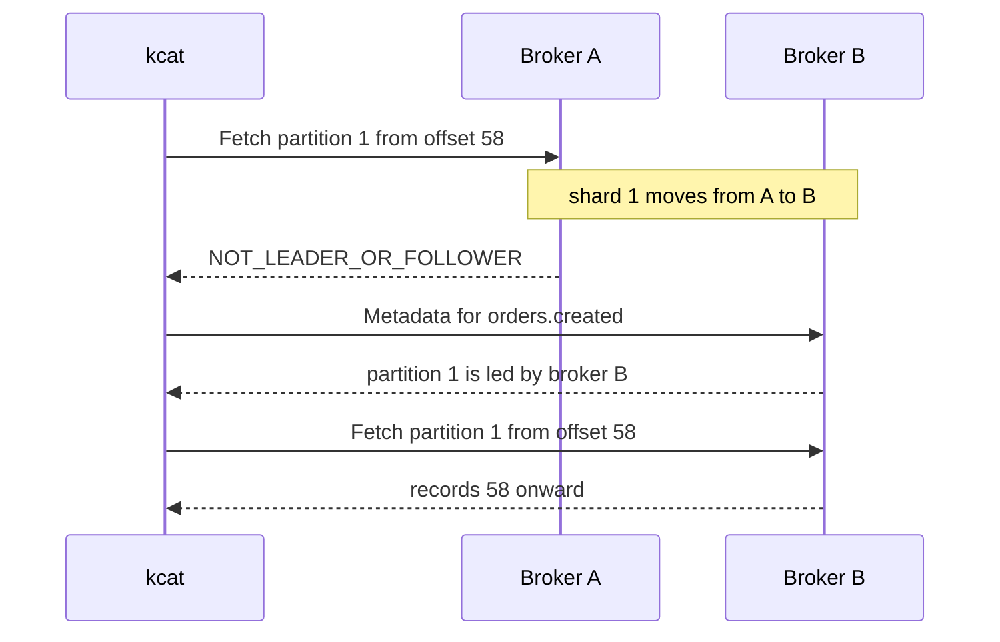

A Felix broker can serve Kafka consumers. Turn on the Kafka listener and a
durable stream shows up as a Kafka topic: `kcat`, a librdkafka program or a Java
`KafkaConsumer` can list it, look up offsets, and read records from it, with the
same offsets a Felix client sees.

It is read-only and it has no consumer groups. A consumer that assigns its own
partitions and keeps its own offsets works. A consumer that sets `group.id` and
calls `subscribe()` gets an error telling it so, which also means Kafka Connect,
Kafka Streams, ksqlDB, Debezium and MirrorMaker do not work against Felix.

The reference for the protocol side, including every error code and why groups
are refused, is
[`docs/kafka-compatibility.md`](https://github.com/gabloe/felix/blob/main/docs/kafka-compatibility.md).

## What works

- Listing topics and partitions (`Metadata`), with each partition's leader.
- Earliest and latest offsets, and the offset for a point in time (`ListOffsets`).
- Fetching from any offset, including long-polling at the tail. A waiting fetch
  is woken the moment a publish commits.
- SASL/PLAIN over TLS, with a Felix token as the password.
- Following a partition to its new leader when a shard moves or fails over.

Tested with kcat 1.7.1 (librdkafka 1.8.2), on a single broker and on a
three-broker cluster whose shards are led by different brokers.

## Quick start

### 1. Turn the listener on

The listener is off unless `FELIX_KAFKA_LISTEN` is set. Only durable streams are
served, so the broker needs durable storage too:

```bash
export FELIX_DURABLE_STORAGE_DIR=/var/lib/felix
export FELIX_KAFKA_LISTEN=0.0.0.0:9092
export FELIX_KAFKA_ADVERTISE_ADDR=broker-1.internal:9092
export FELIX_TLS_CERT_EXPORT=/etc/felix/felix-ca.pem
```

`FELIX_KAFKA_ADVERTISE_ADDR` is the address clients are told to connect to. Set
it whenever the listen address is not reachable as written, which is always the
case for `0.0.0.0`. `FELIX_TLS_CERT_EXPORT` writes the broker's certificate out
so clients can trust it; copy that file to wherever kcat runs.

### 2. Name the topic

A topic is `<namespace>.<stream>`. Stream `created` in namespace `orders`,
created with `durable: true`, is topic `orders.created`. The tenant is not in
the name; it comes from the username you connect with.

### 3. Get a token

The password is an ordinary Felix token, the same one a Felix client uses. It
needs `stream.subscribe` on the streams you want to read. Exchange an OIDC token
for one at the control plane:

```bash
FELIX_TOKEN=$(curl -s -X POST "https://controlplane:8443/v1/tenants/t1/token/exchange" \
  -H "Authorization: Bearer $OIDC_TOKEN" \
  -H "Content-Type: application/json" \
  -d '{"requested": ["stream.subscribe"], "resources": ["stream:t1/orders/*"]}' \
  | jq -r .felix_token)
```

See [Security](/felix/features/security/) for how tokens and permissions work.

### 4. Connect

With TLS on (the default), connect with `SASL_SSL`. The username is the tenant
id:

```bash
kcat -b broker-1.internal:9092 \
  -X security.protocol=SASL_SSL \
  -X ssl.ca.location=felix-ca.pem \
  -X sasl.mechanisms=PLAIN \
  -X sasl.username=t1 \
  -X sasl.password="$FELIX_TOKEN" \
  -L
```

The commands below leave those `-X` options out for brevity; every one of them
needs them. Putting them in a file and passing `-F kcat.conf` saves typing:

```properties
bootstrap.servers=broker-1.internal:9092
security.protocol=SASL_SSL
ssl.ca.location=felix-ca.pem
sasl.mechanisms=PLAIN
sasl.username=t1
```

The certificate is the broker's generated self-signed one, and its name is
`localhost`. librdkafka 2.0 and later check the hostname, so add
`-X ssl.endpoint.identification.algorithm=none` there. librdkafka before 2.0
does not check it.

If the broker runs with `FELIX_KAFKA_TLS=false`, use `SASL_PLAINTEXT` and drop
`ssl.ca.location`. The token then crosses the network in clear text, so keep
that to networks you trust.

### Anonymous access for development

On a laptop, `FELIX_KAFKA_ANONYMOUS_TENANT=t1` lets a connection that does not
authenticate read every stream of tenant `t1`. With TLS off as well, plain kcat
works:

```bash
FELIX_KAFKA_TLS=false FELIX_KAFKA_ANONYMOUS_TENANT=t1 FELIX_KAFKA_LISTEN=127.0.0.1:9092 felix-broker

kcat -b 127.0.0.1:9092 -L
kcat -b 127.0.0.1:9092 -C -t orders.created -o beginning -e -q -f '%p:%o:%s\n'
```

Leave it unset anywhere else. It gives read access to a whole tenant to anyone
who can reach the port.

### 5. Read

```bash
# Every partition from the start, then exit
kcat -C -t orders.created -o beginning -e -q -f '%p:%o:%s\n'

# Partition 1 from offset 42
kcat -C -t orders.created -p 1 -o 42 -e
```

## Use cases

### Looking at a stream during an incident

kcat is useful when you want to see what is actually in a stream without writing
a Felix client. Latest offset of partition 1:

```console
$ kcat -Q -t orders.created:1:-1
orders.created [1] offset 3
```

The last 10 records of every partition (a negative offset counts back from each
partition's end):

```bash
kcat -C -t orders.created -o -10 -e -f '%p:%o %T %s\n'
```

`%T` is the record's timestamp, which is the time the broker appended it, in
milliseconds.

Everything since a point in time, found with an offset-for-time lookup:

```bash
kcat -C -t orders.created -o s@1727200000000 -e
```

Following new records as they are published:

```bash
kcat -C -t orders.created -o end
```

A fetch waiting at the tail is woken by the publish itself, so records appear as
soon as they are durable rather than on a polling interval.

Where it stops: only durable streams are visible. An in-memory stream does not
appear as a topic at all; read it with a Felix subscriber instead.

### Feeding an existing Kafka-consuming program

A program that already consumes from Kafka can read a Felix stream if it
assigns partitions itself and stores its own offsets. Partition N is shard N,
and the offsets are Felix's log offsets, so a stored offset means the same thing
to Felix and to the program.

A sketch with Python's `confluent-kafka` (client configuration only; kcat is
what is tested):

```python
from confluent_kafka import Consumer, TopicPartition

consumer = Consumer({
    "bootstrap.servers": "broker-1.internal:9092",
    "security.protocol": "SASL_SSL",
    "ssl.ca.location": "felix-ca.pem",
    "sasl.mechanisms": "PLAIN",
    "sasl.username": "t1",
    "sasl.password": felix_token,
    "enable.auto.commit": False,
})

# Where each partition left off, from your own store.
start = load_offsets()  # e.g. {0: 1200, 1: 980}
consumer.assign([TopicPartition("orders.created", p, o) for p, o in start.items()])

while True:
    msg = consumer.poll(1.0)
    if msg is None or msg.error():
        continue
    handle(msg.value())
    save_offset(msg.partition(), msg.offset() + 1)
```

Leave `group.id` out if your client allows it. A librdkafka consumer that has
one may ask for a group coordinator, and Felix refuses that request; the refusal
surfaces as an error from `poll()` naming the reason. Some client versions
insist on a `group.id`: that has not been tested here, so check that fetching
carries on past that error before relying on it.

The same in Java, as a sketch. Without `group.id` a `KafkaConsumer` cannot
commit offsets, which is what you want here, since there is nowhere to commit
them to:

```java
Properties props = new Properties();
props.put("bootstrap.servers", "broker-1.internal:9092");
props.put("security.protocol", "SASL_SSL");
props.put("ssl.truststore.type", "PEM");
props.put("ssl.truststore.location", "felix-ca.pem");
props.put("ssl.endpoint.identification.algorithm", "");
props.put("sasl.mechanism", "PLAIN");
props.put("sasl.jaas.config",
    "org.apache.kafka.common.security.plain.PlainLoginModule required "
    + "username=\"t1\" password=\"" + felixToken + "\";");
props.put("enable.auto.commit", "false");
props.put("key.deserializer", ByteArrayDeserializer.class.getName());
props.put("value.deserializer", ByteArrayDeserializer.class.getName());

KafkaConsumer<byte[], byte[]> consumer = new KafkaConsumer<>(props);
TopicPartition p0 = new TopicPartition("orders.created", 0);
consumer.assign(List.of(p0));
consumer.seek(p0, loadOffset(0));
```

Records have a value and a timestamp. There is no key and there are no headers,
so a pipeline that routes on the Kafka key needs the value parsed instead.

Where it stops: anything that manages its own consumption through a group. Kafka
Connect, Kafka Streams, ksqlDB, Debezium and MirrorMaker all do, and none of
them will run. To split a stream's records across several workers inside Felix,
use a [Felix consumer group](/felix/features/queues/) through a Felix client. To
checkpoint and resume, a Felix subscription can start from an offset and every
event it delivers carries one.

### Piping records into a script

kcat's `-e` exits at the end of the log and `-f` formats each record, which is
enough for quick shell work:

```bash
# How many records are there right now?
kcat -C -t orders.created -o beginning -e -q -f '\n' | wc -l

# Large orders, assuming JSON payloads
kcat -C -t orders.created -o beginning -e -q -f '%s\n' | jq -c 'select(.amount > 1000)'

# One partition's records to a file, with offsets
kcat -C -t orders.created -p 0 -o beginning -e -q -f '%o\t%s\n' > partition-0.tsv
```

Where it stops: kcat reads whatever it is given, so large streams are best
bounded with `-o` and `-c` rather than read from the beginning.

### Feeding Felix from Kafka producers (not available yet)

Producing through the Kafka listener is not supported. `Produce` is advertised,
because librdkafka will not fetch otherwise, but every produce is refused with a
policy violation and the message
`Felix's Kafka listener is read-only; publish with a Felix client`.

Accepting writes is planned as a later change. Recent Kafka producers turn on
idempotence by default, and Felix's idempotent producers are what would back
that. Until then, publish with a Felix client.

## How it maps

**Partitions are shards.** A topic has one partition per shard, and partition N
is shard N.

**Offsets are Felix's.** The offset kcat prints is the offset in the shard's
log, the same one a Felix subscriber sees on `Event.offset`. They start at 0 and
have no gaps. The earliest offset is the oldest record retention has kept, and
the latest is the log's tail. Asking for an offset outside that range gets
`OFFSET_OUT_OF_RANGE`, and the client falls back to its `auto.offset.reset`.

**Records.** The value is the Felix payload. The timestamp is when the broker
appended the record.

**Tenants come from the credential.** The SASL username is the tenant, and the
token must belong to it. Two tenants can each have an `orders.created` topic;
which one you read depends on who you are.

**Topics that do not appear.** In-memory streams, streams in a namespace that
contains a dot (the name would read back as a different stream), names with
characters outside `A-Z a-z 0-9 . _ -`, names longer than 249 characters, and
streams your token cannot read.

## When a leader moves

Each partition is served by its shard's leader, and Metadata tells the client
which broker that is. When a shard moves to another broker, or its leader fails
and a replica takes over, the old broker answers the next fetch with "not
leader". librdkafka asks for Metadata again and continues at the new leader
from the same offset. The new leader holds the same log with the same offsets,
so nothing is skipped or read twice. The consumer sees a short pause.



Every broker in a cluster needs the listener for this to work. A partition whose
leader has no Kafka listener is reported as having no leader.

## Configuration

| Variable | Default | Meaning |
|---|---|---|
| `FELIX_KAFKA_LISTEN` | unset | `ip:port` to listen on. Unset turns the listener off. |
| `FELIX_KAFKA_ADVERTISE_ADDR` | the listen address | `host:port` clients are told to connect to. A hostname is fine. Every broker learns it through the control plane. |
| `FELIX_KAFKA_TLS` | `true` | TLS with the broker's certificate (`SASL_SSL`). `false` means `SASL_PLAINTEXT`, with tokens in clear text. |
| `FELIX_KAFKA_ANONYMOUS_TENANT` | unset | Development only: unauthenticated connections read every stream of this tenant. |
| `FELIX_KAFKA_DEFAULT_NAMESPACE` | unset | Namespace used for a topic name without a dot, so `created` can mean `orders.created`. |
| `FELIX_KAFKA_MAX_CONNECTIONS` | `1024` | Connections served at once. Extra ones are closed as they arrive. |

The listener's metrics are on the [Observability](/felix/features/observability/)
page, under `felix_kafka_*`.

## Troubleshooting

The messages below are as librdkafka prints them; other clients word them
differently but report the same codes.

**Unknown topic or partition.** The name does not resolve to a durable stream
you can see. Check that the stream was created with `durable: true`, that the
topic is `<namespace>.<stream>` (the split is on the first dot, so a namespace
with a dot in it cannot be reached), and that a topic without a dot has
`FELIX_KAFKA_DEFAULT_NAMESPACE` to fall back on. A partition number at or above
the stream's shard count gets the same error.

**Topic authorization failed.** Either the connection is not authenticated (no
SASL settings, and no anonymous tenant on the broker) or the token lacks
`stream.subscribe` on that stream. A stream you cannot read also does not appear
in `kcat -L`.

**SASL authentication failed.** The broker rejected the token, and the message
says why: `Felix: token rejected: ...`. The usual causes are a username that is
not the tenant the token was issued for, or an expired token. Tokens are checked
once, when the connection authenticates, so a long-running consumer is not cut
off when its token expires; the next connection needs a fresh one.

**Leader not available.** The shard is unassigned, still opening, or in the
middle of a move, or its leader is a broker without the Kafka listener. The
first three clear up on their own. The last needs `FELIX_KAFKA_LISTEN` on that
broker.

**Not leader for partition.** The shard moved or failed over. It is transient;
the client refreshes Metadata and carries on.

**Offset out of range.** The offset is older than anything retention kept, or
past the end of the log. The client resets according to `auto.offset.reset`.

**Waiting for group rebalance, then a consumer error.** The consumer used a
group (`kcat -G`, or `group.id` with `subscribe()`). Felix refuses it:

```console
% Waiting for group rebalance
% ERROR: Consumer error: FindCoordinator response error: Felix has no Kafka consumer groups; assign partitions instead. See docs/kafka-compatibility.md
```

Assign partitions with `-t topic -p N` (or `assign()`) instead.

**Policy violation on produce.** The listener is read-only. Publish with a Felix
client.

**SSL handshake failed.** Either the client does not trust the broker's
certificate (point `ssl.ca.location` at the file `FELIX_TLS_CERT_EXPORT`
wrote) or it is checking the hostname against a certificate named `localhost`
(set `ssl.endpoint.identification.algorithm=none` on librdkafka 2.0 and later).

**Connection closed right after connecting.** The client and broker disagree
about TLS: a `SASL_SSL` client against a broker with `FELIX_KAFKA_TLS=false`, or
a `SASL_PLAINTEXT` client against the default TLS listener. It can also be the
connection limit, which shows up as
`felix_kafka_refused_total{reason="connection_limit"}`.

## Limits

- Durable streams only.
- No consumer groups, so no committed offsets and none of the tools built on
  them.
- No produce.
- No fetch sessions: clients send full fetch requests, which costs a little
  bandwidth with many partitions.
- No leader epochs (reported as unknown) and an ISR of the leader alone.
- No keys or headers on records.
- SASL/PLAIN only: no OAUTHBEARER, and no re-authentication on a long-lived
  connection.
- A fetch waits at most 30 seconds, whatever `fetch.wait.max.ms` asks for.
- Requests larger than 8 MiB close the connection.
- TLS uses the broker's generated self-signed certificate; there is no way to
  give it your own yet.
