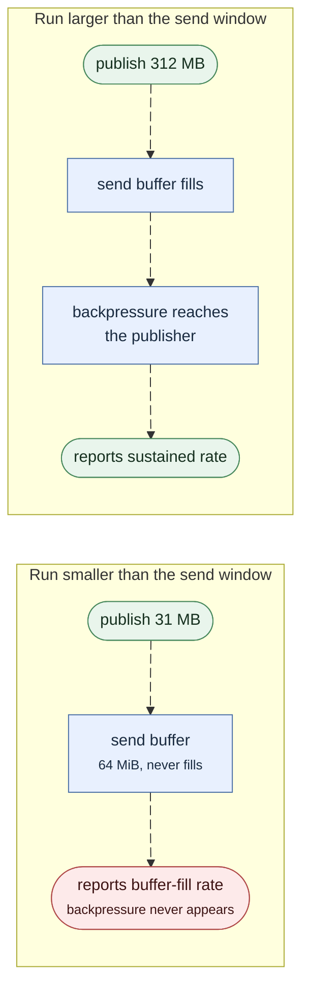

Felix's sustained loopback throughput was once capped at about **73 MB/s** of
payload regardless of configuration, and after that cap was lifted, roughly
**one benchmark run in three** still landed 5–6× below the rest on identical
settings. This page documents both defects: what they looked like, how they
were diagnosed, what fixed them, and — most importantly — the investigative
method, which generalizes better than either fix does.

The mechanisms and the code that implements them are described in
[Concurrency internals](/felix/development/internals-concurrency/#the-quic-io-runtime).
Current numbers are in [Benchmarks](/felix/features/benchmarks/).

:::note[Scope: these are macOS findings]
Every measurement here is macOS on loopback, and the first defect turns out
to be a macOS pathology: the same benchmark on Linux sustains ~643 MB/s at
the *pre-fix* baseline, above what macOS reaches with all of these fixes
applied. The dedicated I/O runtime pool is therefore enabled on macOS only —
on Linux it measures slower. The second defect (the MTU black-hole collapse)
and the measurement lessons are platform-neutral.
:::

## Defect 1: a throughput ceiling exactly proportional to bytes

### The symptom

The ceiling was **per-byte**, and nothing else:

| Payload | Messages/s | Payload rate |
|---|---:|---:|
| 2 KiB | 35,707 | 73.1 MB/s |
| 4 KiB | 17,128 | 70.2 MB/s |
| 8 KiB | 8,675 | 71.1 MB/s |
| 16 KiB | 4,382 | 71.8 MB/s |
| 32 KiB | 2,185 | 71.6 MB/s |

A 16× spread in payload size and a 16× spread in message rate produced the
same byte rate. That single result eliminates every per-message, per-batch,
and per-frame explanation at once — encode cost, channel operations, publisher
round trips, framing overhead. Any of those would hold *messages* per second
constant, not *bytes*.

Meanwhile every individual stage measured fast: decode 27 µs, append 1 µs,
QUIC write 2 µs. Twelve of sixteen cores sat idle. No queue, lock, or
flow-control window was ever saturated, and the QUIC layer reported zero
packet loss, zero congestion events, and zero blocked frames in either
direction.

That combination — everything fast, nothing saturated, rate fixed per byte —
is the signature of a **latency-bound dependency chain**, not a resource
limit.

### What it wasn't

Fifteen hypotheses were measured and rejected before the real one was found.
They are recorded because most are plausible enough to be proposed again:

| Hypothesis | Verdict |
|---|---|
| Transport / MTU / packet loss | MTU 16354, 0 lost, 0 congestion events |
| QUIC flow control | 0 blocked frames, both directions |
| CPU saturation | 12 of 16 cores idle |
| Redundant payload copy | 0.2% of one core |
| Read strategy (`read_exact` vs `read_chunk`) | no measurable difference |
| Channel hops, locks, re-encode copies | a relay with 4 extra hops: no change |
| Egress topology (writer lanes → direct writer) | no change |
| Egress frame granularity (64 KiB → 1 MiB) | no change |
| Queue depths (core, lane, in-flight bytes) | flat |
| Publish worker sharding | more workers was *worse* |
| Publisher connection concurrency | flat from 1 to 16 connections |
| Per-event and per-batch client costs | ruled out by the byte-rate invariance above |

Five structural refactors were tested against this ceiling. None moved it,
because none of them was the problem.

### The mechanism

Quinn's driver tasks — the endpoint receive loop and each connection's
transmit/ACK/timer loop — do a **bounded slice of work per poll** and then
reschedule themselves. Sustained throughput is therefore:

```
bounded work per poll ÷ scheduler re-poll latency
```

On a runtime shared with ~50 application tasks, that re-poll latency grows
with load. And because wakeups scale with **datagram count**, and datagram
count is bytes ÷ MTU, the cost lands per byte — which is exactly why the
ceiling looked like a payload-size problem rather than a scheduling one.

Felix was, in effect, clocked by its own scheduler.

### The fix

Three changes, all in Felix, using only official quinn APIs:

1. **Dedicated I/O runtimes.** Quinn drivers run on a pool of single-threaded
   tokio runtimes, isolated from application tasks and assigned by endpoint
   role, so a driver's self-wake is re-polled immediately instead of queueing
   behind application work or migrating cores.
2. **Pump colocation.** The two tasks that trade a wakeup with the transport
   per datagram or per write — the client's subscription reader and the
   broker's per-connection delivery writer — run on the same thread as their
   connection's drivers, turning a cross-core kernel round trip into a task
   switch.
3. **ACK-frequency tuning.** Max ACK delay 25 ms → 2 ms, and one ACK per 20
   packets instead of every other packet. Each reverse-path ACK costs a
   datagram plus its own wakeup chain.

| Config | Before | After |
|---|---:|---:|
| 4 KiB × batch 64, fanout 1 | 73 MB/s | **~508 MB/s** (median) |
| 1 KiB × batch 64, fanout 1 | 75 MB/s | **~461 MB/s** |
| 16 KiB × batch 64, fanout 1 | 72 MB/s | **~503 MB/s** |

The latency profile was unaffected by design — these changes alter transport
acking and task placement, not request round trips.

## Defect 2: one run in three, 5–6× slower

### The symptom

With the ceiling fixed, identical fresh-process benchmark runs became
bimodal: most delivered ~118–120 K msg/s (4 KiB × batch 64), but ~30% landed
at 20–24 K. The slow mode was selected near startup, was sticky for the life
of the process, and became much more likely under background CPU load.

Everything about it pointed at scheduling. It appeared during scheduling
work; a real scheduling defect had just been fixed in the same area
(endpoint-to-runtime assignment depended on creation history, making every
second in-process benchmark case slow — deterministic alternation that had
masqueraded as randomness); and the slow mode's fingerprint was **5.7× more
system time and 5.7× more context switches per message** at the same CPU
utilization — one kernel round trip per item instead of one per batch, the
textbook shape of a wakeup lockstep.

A scheduling-based theory was tested directly (keeping the I/O threads
runnable through the inter-datagram gap so cross-thread wakes become flag
checks) and changed nothing: the slow-run rate was identical with and
without it. A fix that does not move the failure rate is a diagnosis
falsified — the theory was discarded and the investigation went back to
observation.

### The diagnosis

Logging per-connection `quinn::ConnectionStats` on both ends
(`FELIX_CONN_STATS_MS`) and comparing one fast against one slow run found the
difference in a single field on a single connection — the publish connection
carrying the offered load:

| | Fast run | Slow run |
|---|---:|---:|
| Path MTU at end of run | 16354 | **1200** |
| UDP datagrams for ~240 MB | 14,278 | **166,580** |
| Bytes per datagram | 15,744 | **1,549** |
| Lost packets | 0 | 674, in one burst |

The slow run's timeline shows MTU discovery *succeeding* and then being
un-done:

```
t=0.25s   mtu=8792    discovery in progress
t=0.50s   mtu=16354   discovery complete, zero loss
t=0.75s   mtu=1200    one ~674-packet loss burst → collapse
t≥0.75s   mtu=1200    pinned for the rest of the run
```

At MTU 1200 the same byte stream costs ~13.6× the datagrams, and each
datagram carries a syscall and a wakeup chain — which is precisely the 5.7×
system-time-per-message fingerprint that had read as a scheduling defect.
An earlier check ("MTU reaches 16354 in both modes") had been performed on a
*delivery* connection; the collapse hits the connection carrying the load.

### The mechanism

Three interlocking behaviors, all in the QUIC layer:

1. **The loss burst is congestion, not an MTU problem.** At high rate the
   publish path keeps a multi-megabyte standing queue in the receiver's UDP
   socket buffer, within a couple MB of its cap. A scheduling stall of a few
   milliseconds on the draining side overflows it, and the kernel drops a
   window of packets. Background CPU load makes stalls — and therefore the
   collapse — more likely. If the startup ramp survives without a burst,
   steady state is loss-free: hence bimodal and startup-selected.
2. **Quinn's black-hole detector cannot tell the difference.** Every packet
   in the burst is full-MTU — that is simply what a saturated sender's
   traffic looks like — and "large packets vanish while small ones survive"
   is exactly the signature the detector watches for. It declares an MTU
   black hole and resets the path MTU to `min_mtu` (1200 by default), with a
   60-second cooldown before discovery may run again.
3. **Recovery is starved by the load itself.** Quinn sends MTU probes only
   when a transmit poll finds nothing else to send. A backlogged publisher
   never has an empty transmit buffer, so after a collapse no probe is ever
   sent: the connection stays collapsed not for the 60-second cooldown but
   for the life of the load.


### The fix

For loopback peers — the benchmark's topology, and the one path where a
16 KiB datagram is guaranteed by the interface itself — connections now
start at the loopback MTU *and* guarantee it, on both the connect and accept
sides:

- `initial_mtu = 16336` (fits IPv4/IPv6 headers within the 16 KiB loopback
  interface MTU), removing the discovery ramp;
- `min_mtu = 16336`, which is the part that matters: the black-hole verdict
  resets to `min_mtu`, so with the floor at the real MTU there is nothing to
  collapse to, and a congestive loss burst is handled as ordinary congestion;
- an initial congestion window scaled to the MTU per RFC 9002's formula —
  quinn's default window is a flat 14,720 bytes, smaller than one 16 KiB
  segment, which otherwise deadlocks the handshake outright.

The guarantee is conditional on the socket buffers the OS actually granted:
jumbo datagrams are only safe when the kernel buffers hold a real burst of
them (~64 datagrams, about 1 MiB), so hosts where Linux silently clamps
`SO_RCVBUF` to a stock `net.core.rmem_max` (~208 KB — about 26 jumbo
datagrams) keep the RFC-safe default path instead. An explicit
`FELIX_INITIAL_MTU` disables the special case. For non-loopback paths, where
`min_mtu` must never be raised, the black-hole cooldown drops from 60 s to
2 s (`FELIX_MTU_BLACK_HOLE_COOLDOWN_MS`), so a spurious collapse on an
intermittently loaded connection heals at the next idle gap instead of being
pinned for a minute.

### The result

Fresh-process runs, 4 KiB × batch 64 × fanout 1, same machine:

| | Before | After |
|---|---|---|
| Slow runs | 5 of 16, at ~21 K msg/s | **0 of 20** |
| Median | ~118 K msg/s | **~122 K msg/s (~500 MB/s)** |
| Worst ÷ median | 5.9× | **1.11×** |

Reverting the fix on the same binary (via `FELIX_INITIAL_MTU=1200` and the
stock 60 s cooldown) reproduces the slow runs, so the attribution is causal
rather than machine drift.

## What generalizes

**Check that the benchmark measures what you think.** The original numbers
were inflated by a measurement artifact: any run whose total volume fits
inside the 64 MiB QUIC send window is absorbed by buffers before backpressure
appears, so the harness reports buffer-fill rate rather than sustained
throughput. A 1 KiB run appeared to do 358 MB/s and actually sustained
74.9 MB/s.



The benchmark harness now warns when a throughput run is undersized, and the
matrix scales message counts per payload so this cannot silently return.

**Build the honest baseline.** A minimal store-and-forward relay — the
smallest thing doing the broker's job over two QUIC hops — reached 540 MB/s.
That single number reframed everything: it proved the architecture was worth
~7× what Felix was achieving, so the gap had to be in Felix's code rather
than in QUIC, the extra hop, or the OS.

**Let invariance do the eliminating.** The byte-rate invariance across a 16×
payload range ruled out more hypotheses in one measurement than the
preceding five refactors did.

**Distrust a fix that arrives without a mechanism — and a mechanism whose
fix changes nothing.** Five topology changes were implemented and measured
before anyone could explain why the first ceiling existed; all five were
wasted. The second defect ran the same trap in reverse: a plausible
scheduling theory survived until its direct fix failed to move the failure
rate, which falsified it in one experiment.

**A bimodal distribution is a state machine, not noise.** Two clean modes
with nothing in between means something discrete latches early and persists.
The productive question is *what state distinguishes the modes* — here,
one field (`current_mtu`) on one connection — not *why is the benchmark
noisy*. Averaging across modes, or publishing medians without investigating
the spread, would have reported the defect as the product's performance.

**Inspect the entity carrying the load.** The MTU had been checked and found
healthy — on a delivery connection. Per-connection statistics on *every*
connection, kept until the anomaly is attributable to one of them, is what
turned four rounds of dead ends into a one-line diagnosis.
