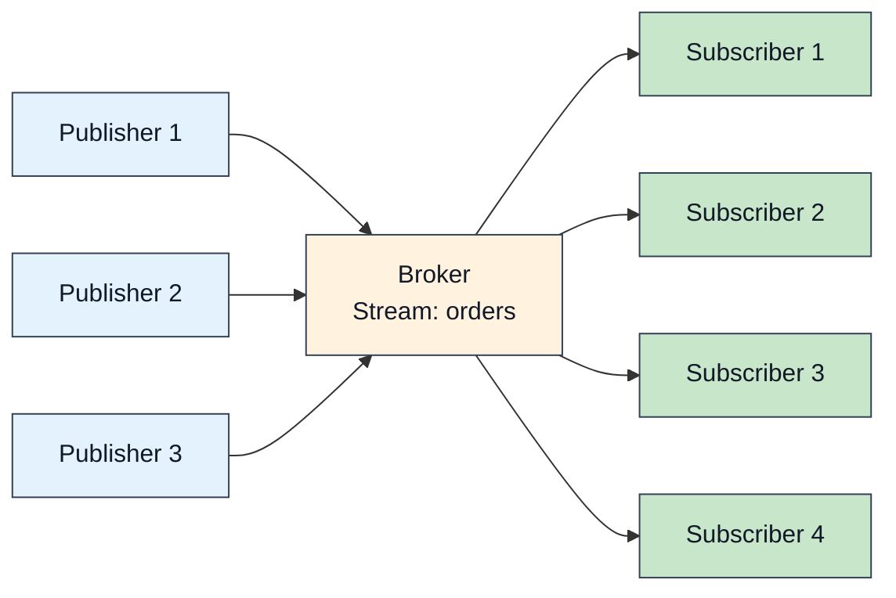

The model is small: publishers send to a **stream**, every subscriber to that
stream receives what lands on it, and streams are scoped by
`(tenant, namespace, stream)`. What this page is really about is the two
properties the implementation works hardest for — cheap fanout, and the
guarantee that one slow subscriber cannot hurt anyone else.



## Fanout

A publish is encoded **once** and the encoded frame is shared by every
subscriber, so adding subscribers adds delivery work but not re-encoding
work. Measured latency at fanout 1 and 10 (macOS loopback, per-message ack,
median of 5–10 trials):

| Fanout | p50 | p99 |
|--------|-----|-----|
| 1 | 109–136 µs | 138–176 µs |
| 10 | 236–269 µs | 278–399 µs |

Fanout above 10 has not been benchmarked; see
[Benchmarks](/felix/features/benchmarks/) for methodology and the full tables.
Treat behaviour at hundreds or thousands of subscribers as unmeasured.

## Batching

### Publisher side

Send several payloads in one request:

```rust
use felix_wire::AckMode;

let mut batch = Vec::new();
for i in 0..64 {
    batch.push(format!("Event {}", i).into_bytes());
}

let publisher = client.publisher().await?;
publisher
    .publish_batch("tenant", "ns", "stream", batch, AckMode::PerBatch)
    .await?;
```

Batching amortizes per-request overhead (framing, syscalls, one ack for the
whole batch), and it is the single biggest throughput lever on the publish
path. Measured batch throughput is in
[Benchmarks](/felix/features/benchmarks/) — and note that a batched run
measures a throughput profile, not request latency.

### Acked publishes are pipelined

Acked publishes (`AckMode::PerMessage` / `AckMode::PerBatch`) do not stall
the stream for the broker's round trip. The client writes acked requests back
to back and resolves each caller's future as the matching ack arrives, in
order — so concurrent publishers on the same stream share the stream's full
bandwidth instead of taking turns paying a round trip each. In-flight acked
data is bounded by the publisher's byte budget (`publish_inflight_bytes`,
4 MiB by default): a request holds its budget until the broker's ack, not
merely until the frame is written.

A single caller that awaits each publish before issuing the next still
experiences one round trip per publish, by construction — batch, or publish
concurrently, to amortize it.

### Broker side

The broker coalesces events into delivery batches per subscription. A batch
flushes when **any** bound is hit:

```yaml
event_batch_max_events: 64      # this many events, or
event_batch_max_bytes: 262144   # this many bytes, or
event_batch_max_delay_us: 250   # this much time since the first event
```

Small events under a steady load flush on the count bound; big events flush
on bytes; a trickle flushes on the delay, which is therefore the latency
floor batching adds. Delivery uses binary `EventBatch` framing by default.

## Ordering

Within one stream (strictly: one shard of one stream), subscribers see
records in publish order. Across streams there is no ordering relationship at
all — two publishes to different streams may be observed in either order.
On a multi-shard stream, ordering is per routing key; see
[Benchmarks](/felix/features/benchmarks/) and the wire protocol page for how
keys map to shards.

## Isolation and backpressure

Each subscription gets its own bounded queue in the broker and its own QUIC
stream to the client, with its own flow-control window. Backpressure applies
at each level:

- **QUIC flow control** (per connection and per stream) bounds bytes in
  flight; a full window pauses that stream only.
- **The publish queue** (`pub_queue_depth`) bounds admitted-but-uncommitted
  publishes; when full, new publishes wait up to
  `publish_queue_wait_timeout_ms`, then fail. That failure means the broker
  is overloaded, and it is deliberately visible.
- **The subscriber queue** (`subscriber_queue_capacity`) bounds what one
  subscription can have pending. What happens when it fills is the overflow
  policy, and it is the crux:


This is the trade the whole design turns on. Under the default a publisher never
waits on a subscriber, which is exactly why one stalled consumer cannot degrade
the rest — and exactly why a subscriber can silently miss records.

The overflow policy covers live records only. A subscription resumed from an
earlier offset reads history the broker pages off disk for it alone, with no
publisher to protect, so history below the subscription's `live_offset` is
never dropped: the client waits for room in its queue, and a slow reader slows
the replay instead of losing part of it.

`DropOld` is accepted in configuration and counted separately, but it currently
behaves as `DropNew`: the arriving record is the one discarded. The metric
`felix_sub_queue_drop_old_emulated_total` is what tells you that happened.

:::caution[At-Most-Once Semantics]
A dropped event is not redelivered. A subscriber that falls behind its queue
misses messages — but on a **durable** stream the loss is detectable and
recoverable: delivered events carry log offsets, so a gap in offsets is exactly
a drop, and the subscriber can resume from the offset it last saw. On an
ephemeral stream there is nothing to resume from.

If you need redelivery rather than detection, use a **consumer group**: it
acknowledges each record and hands back anything unanswered once the visibility
timeout lapses. See [Projections](/felix/architecture/projections/).
:::

## Delivery semantics

### At-most-once, per subscriber

This is what a plain subscription gives: no subscriber acknowledgements, no
redelivery, the lowest latency. The right fit for signals whose old values
are worthless — dashboards, telemetry, presence.

Ways a subscriber misses records: it fell behind its bounded queue, the
network partitioned, or the broker restarted while the stream was
**ephemeral**. A durable stream keeps its records across a restart, and a
subscriber resumes from the offset it last saw.

### At-least-once, via a consumer group

A different shape from `subscribe`: records are **pulled**, because only the
consumer knows when it has capacity for more work.

- Each record is claimed by one consumer and not handed to another while the
  claim holds
- An acknowledgement finishes a record; the group's cursor advances over a
  contiguous run, so acknowledging out of order cannot skip a gap
- Anything unanswered is redelivered once the visibility timeout lapses
- Redelivery is bounded: past `max_attempts` the record is dead-lettered
- Requires durable storage, and costs a round trip per settle

```rust
// Waits up to 5s for work rather than spinning on empty polls.
let records = client
    .group_poll_wait("tenant", "ns", "orders", shard, "fulfilment", 32, Duration::from_secs(5))
    .await?;

for record in records {
    match process_order(&record.payload) {
        Ok(()) => client.group_ack("tenant", "ns", "orders", shard, "fulfilment", record.offset).await?,
        // Hand it back for immediate redelivery instead of waiting out the timeout.
        Err(_) => client.group_nack("tenant", "ns", "orders", shard, "fulfilment", record.offset).await?,
    }
}
```

`record.attempts` carries how many times this record has been delivered, so a
consumer can treat a retry differently from a first attempt.

See [Queues](/felix/features/queues/) for dead letters, redrive, and the
ordering rules that make the cursor safe.

### Exactly-once is not planned

At-most-once and at-least-once are the two guarantees Felix intends to offer.
Deduplicating on receive has to happen in the application in any case — it is
the only layer that knows what makes two records the same — so deduplicate
there, keyed on something the record carries.

## Tuning

Start with the defaults and change things only off a measurement — the
defaults are what [Benchmarks](/felix/features/benchmarks/) measures. The
knobs pull in two directions:

**Toward latency** — smaller batches, shorter delays, shallower queues:

```yaml
event_batch_max_events: 8
event_batch_max_delay_us: 100
fanout_batch_size: 8
pub_queue_depth: 16
subscriber_queue_capacity: 64
subscriber_writer_lanes: 2
```

**Toward throughput** — bigger batches, deeper queues, more connections:

```yaml
event_batch_max_events: 256
event_batch_max_delay_us: 2000
fanout_batch_size: 256
pub_queue_depth: 512
subscriber_queue_capacity: 4096
subscriber_writer_lanes: 8
```

```rust
let quinn = quinn::ClientConfig::with_platform_verifier();
let config = ClientConfig {
    event_conn_pool: 16,
    publish_conn_pool: 8,
    publish_streams_per_conn: 4,
    event_router_max_pending: 4096,
    ..ClientConfig::optimized_defaults(quinn)
};
```

In a throughput-shaped configuration, per-message latency is dominated by
batch fill and queueing — the latency percentiles of a batched run measure
the queue, not the request.

## How this compares

Roughly: Kafka is durable-first and batch-oriented, with a far bigger
ecosystem and higher per-message latency; Redis pub/sub and NATS (core) are
fast fire-and-forget with no per-subscriber isolation or replay. Felix sits
between: at-most-once fanout with real isolation, plus durable streams and
consumer groups on the same log when you need replay or redelivery. If your
workload is heavy stream *processing* — joins, windows, transformations —
that layer does not exist here; use a processing framework on top, or a
system that ships one.
