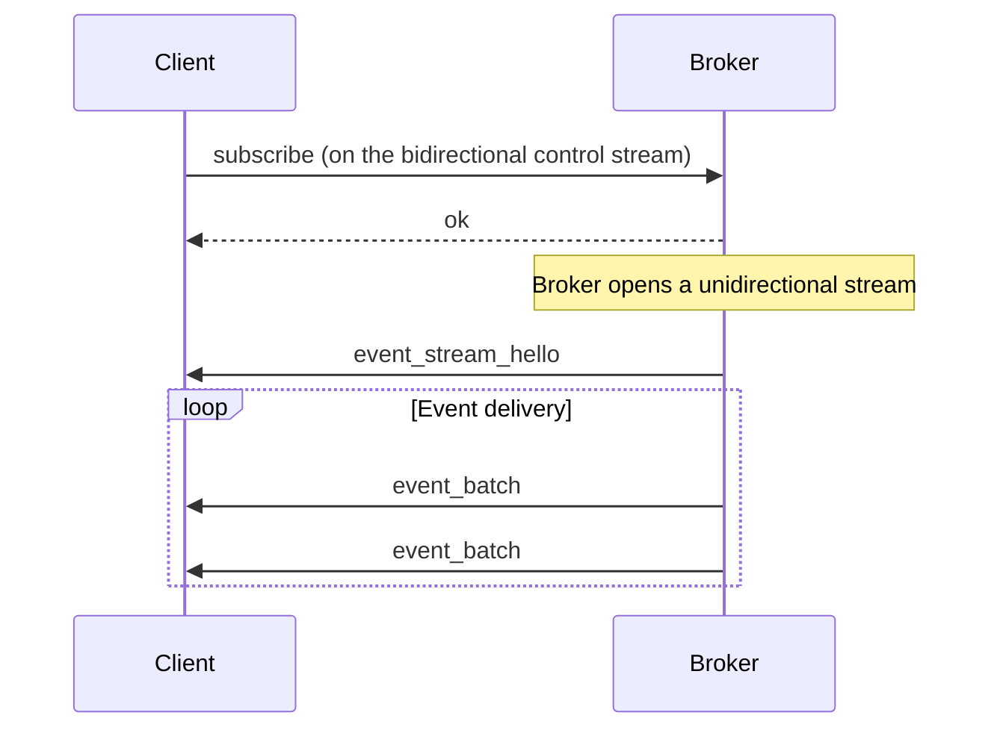

Felix speaks QUIC and nothing else. Every connection is encrypted (TLS 1.3 is
part of the protocol, not a layer bolted on top), and many independent streams
multiplex over one connection without blocking each other. This page explains
what that buys Felix, how Felix uses QUIC's streams, and which knobs matter.

## Why QUIC

Two properties do most of the work.

**No head-of-line blocking between streams.** TCP delivers one ordered byte
stream, so when a packet is lost, everything behind it waits — even bytes that
belong to unrelated traffic and have already arrived. QUIC orders each stream
independently: a lost packet stalls only the stream whose data it carried.


Nothing was lost for streams 1 and 3 in either case. Under TCP their bytes had
already arrived and simply could not be handed over, because the transport has
no way to say which bytes belong to which stream. That is the difference the
whole comparison rests on — and it is why one Felix connection can carry many
subscriptions without a retransmission on one delaying the others.

**Encryption and the handshake are one thing.** A new QUIC connection is ready
in one round trip, versus two or three for TCP plus TLS, and there is no
unencrypted mode to misconfigure. In practice this matters less than it
sounds for Felix, because clients pool and reuse connections — the hot path
never pays connection setup at all.

QUIC also gives Felix per-stream *and* per-connection flow control (the
backpressure story below), and connection IDs that survive an IP change.
Felix does not currently do anything special with connection migration.

## How Felix uses streams

**Bidirectional streams** carry request/response traffic:

- The *control stream*: publish, subscribe, and acknowledgements. A client
  authenticates once on the stream, then multiplexes requests down it.
- *Cache streams*: `cache_get`/`cache_put` requests tagged with a
  `request_id`, several in flight per stream, answered on the same stream.
  Reusing streams this way is what keeps cache tail latency flat under
  concurrency — no per-request stream setup.

**Unidirectional streams** carry one-way event delivery. After a subscribe,
the broker opens a fresh uni stream to the client and sends events down it —
one stream per subscription, so each subscription gets its own flow-control
window and its own backpressure. A slow subscription fills its own window; it
cannot touch another subscription's.



## Measured behavior

All measured figures live on one page — [Benchmarks](/felix/features/benchmarks/)
— so they cannot drift page to page. Two summaries worth repeating here:

**Single message round trip** (publish + ack, macOS loopback, median of 5–10
trials):

| Workload | p50 | p99 |
|----------|-----|-----|
| Empty payload | 119 µs | 165 µs |
| 256 B | 109 µs | 138 µs |
| 1 KiB | 111 µs | 140 µs |
| 4 KiB | 136 µs | 176 µs |

**Sustained pub/sub at fanout 1**:

| Payload | Delivered | Payload rate |
|---|---:|---:|
| 1 KiB | ~450 K msg/s | ~461 MB/s |
| 4 KiB | ~124 K msg/s | ~508 MB/s |
| 16 KiB | ~31 K msg/s | ~503 MB/s |

:::caution[Connection count is not a throughput multiplier]
An earlier version of this page claimed throughput scales "nearly linearly"
with connection count, up to millions of msg/s at 16 connections. That is not
what the transport does, and measurement contradicts it in both directions:
before the I/O-runtime work, publisher concurrency was flat from 1 to 16
connections (78.3 → 73.8 MB/s); after it, additional connections help only
until the I/O runtime saturates, because each endpoint's driver is a single
task on a single runtime.

Add connections to isolate workloads and avoid head-of-line blocking, not to
multiply throughput. Measure your own shape with `latency-demo` before sizing.
:::

## Tuning

### Connection pools

The client keeps separate pools for publishing, events, and cache traffic, so
one kind of load cannot starve another of connections:

```rust
let quinn = quinn::ClientConfig::with_platform_verifier();
let config = ClientConfig {
    event_conn_pool: 8,
    cache_conn_pool: 8,
    publish_conn_pool: 4,
    ..ClientConfig::optimized_defaults(quinn)
};
```

Start with `optimized_defaults` and change pool sizes only off a measurement.
Each connection holds buffers and flow-control state, so pools trade memory
for isolation.

### Flow-control windows

Windows bound how much data may be in flight, per connection and per stream.
Bigger windows favor throughput (more in flight); smaller ones bound memory
and keep latency predictable. They are set as client config fields or
environment variables — `FELIX_EVENT_CONN_RECV_WINDOW`,
`FELIX_EVENT_STREAM_RECV_WINDOW`, `FELIX_EVENT_SEND_WINDOW`, and the
`FELIX_CACHE_*` equivalents. The full list, with defaults, is in the
[environment variable reference](/felix/reference/environment-variables/).

The memory bound is roughly what you would expect: the sum of each
connection's window plus each open stream's window. Size them against the
memory you are willing to spend on in-flight data.

### Congestion control and ACK cadence

Felix uses quinn's default congestion controller, **CUBIC** (RFC 8312),
loss-based and safe on shared networks. Two Felix-level knobs sit on top:

- `FELIX_INITIAL_CWND` — optional initial-window override for trusted
  low-loss paths (skips the slow-start ramp). Measured workloads did not
  benefit, so the RFC default stands.
- **ACK frequency** — between quinn peers Felix negotiates the QUIC
  ACK-frequency extension: 2 ms max ACK delay (instead of 25 ms) and an ACK
  at most every 20 ack-eliciting packets (instead of every other). Delayed
  ACKs stall window-limited senders, and every reverse-path ACK costs a
  datagram plus its wakeup chain; the tuned cadence measured ~+15% sustained
  throughput. Override with `FELIX_ACK_ELICITING_THRESHOLD`, or disable the
  extension with `FELIX_ACK_FREQ_DISABLE=1`.

Just as important as the algorithm is *where the transport runs*: quinn's
driver tasks execute on dedicated single-threaded I/O runtimes
(`FELIX_IO_RUNTIME_THREADS`), isolated from application tasks, because their
scheduler re-poll latency — not congestion control — was the measured
throughput ceiling. See
[Concurrency internals](/felix/development/internals-concurrency/#the-quic-io-runtime).

### Per-connection path stats

Set `FELIX_CONN_STATS_MS` on the broker to log path statistics (MTU, cwnd,
RTT, loss, flow-control blocking) for healthy connections on an interval.
This is the data that says whether a throughput problem is transport-side or
above it; it is off by default and costs nothing when unset.

## Troubleshooting

**Connection timeout.** QUIC is UDP; the most common cause is a firewall that
passes TCP and silently drops UDP on the broker port. Check that the UDP port
is open and the broker is bound where you think it is.

**Certificate validation failure** (`UnknownIssuer`). The client verifies the
broker's certificate against the platform trust store by default
(`quinn::ClientConfig::with_platform_verifier()`). A self-signed development
certificate needs its CA added to the client's root store — the demos and the
cluster harness show how.

**A stream blocked on flow control.** The receiver is not draining. For a
subscription, that usually means the application's receive loop is stuck;
for larger burst tolerance, raise the stream window. Non-zero
`stream_data_blocked` counts in the `FELIX_CONN_STATS_MS` output confirm
flow control is the constraint, and zero rules it out.

## What is deliberately not here

Felix does not use QUIC's unreliable datagrams, multipath, or 0-RTT
resumption today, and does not act on connection migration. Nothing in the
design forecloses them; they are simply not built, and this page only
describes what is.
