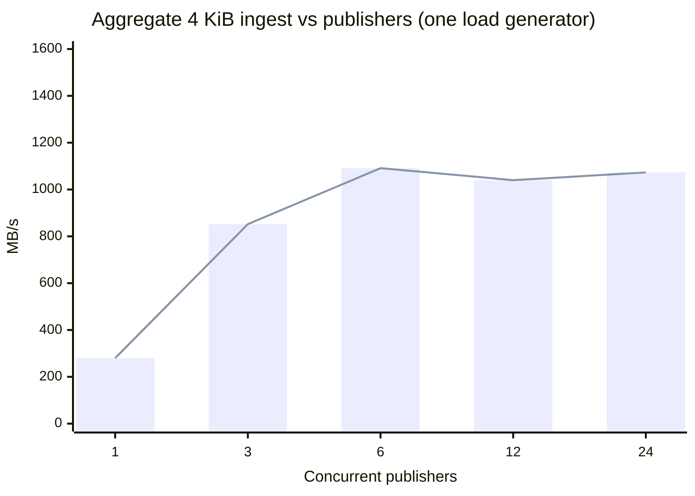
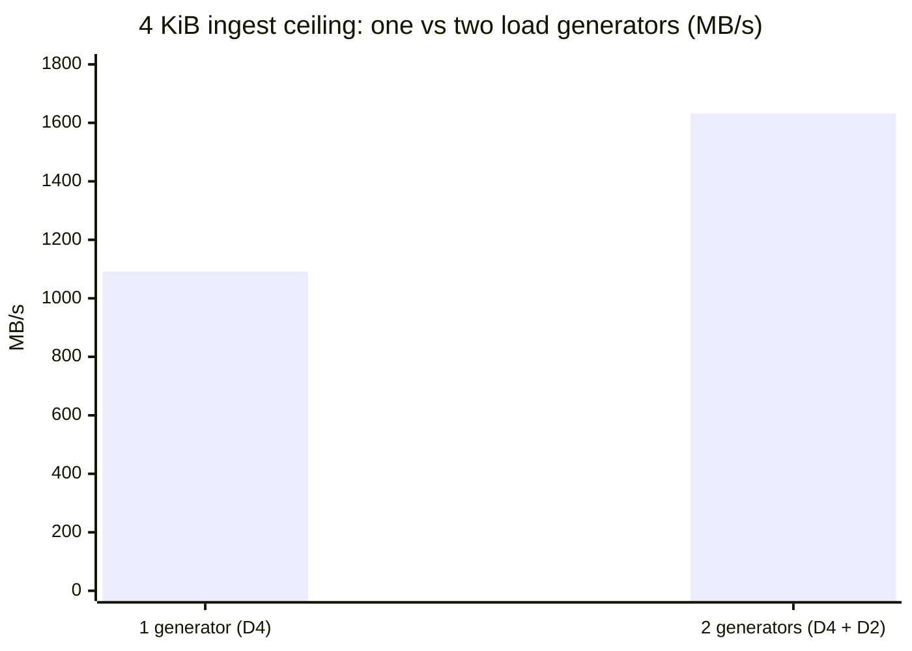

Every performance number Felix published before this page was measured over
loopback — most of it against an in-process broker. Loopback is the right
harness for catching regressions in Felix's own code, and the wrong instrument
for what a deployment feels: it hides RTT, hides congestion control, hides the
cost of TLS and real fsync, and flatters throughput. This page is the first set
of numbers taken on **real hardware, over a real network, with a real identity
provider on the hot path**.

The short version: on three 4-vCPU brokers, **Felix's aggregate ingest scales
linearly with offered load to ~1.63 GB/s (13 Gbit/s) with zero loss — and only
there do the brokers' own CPUs become the limit.** A single load generator
already moves **1.09 GB/s** (or **3.68 M messages/s**), ~73 % of the raw network
line rate while encrypting every byte, before *its* NIC caps out; a second one
lifts the total to 1.63 GB/s with the first undegraded. Acknowledged-publish
latency is **~181 µs** p50, and **durability is free for throughput**. Nothing
here bottlenecks on Felix until the brokers are genuinely saturated.

## How this was measured

| | |
|---|---|
| **Cluster** | 3 × `Standard_D4as_v5` brokers (4 vCPU, 16 GiB), 1 × `D2as_v5` control plane, 1 × `D4as_v5` load generator |
| **Region / placement** | `eastus2`, one availability zone, proximity placement group, accelerated networking |
| **Broker storage** | Premium SSD (`Premium_LRS`), 128 GiB |
| **Artifacts under test** | broker `v0.3.0` release tarball; control plane a `v0.3.1`-candidate build (see [What we found and fixed](#what-we-found-and-fixed)) |
| **Identity** | Microsoft Entra ID app registration, client-credentials grant, **RS256** — verified on every token exchange, not demo auth |
| **Instrument** | `felix-loadgen` (`crates/felix-loadgen`), built once on the load-gen VM, driving the cluster over its real routed paths |

**Honesty rules**, carried over from the local suite and enforced here:
compare only within one provisioned session (cloud VMs are a hardware lottery);
report spread, not just medians; and every number cites the environment that
produced it. Full inventory in `scripts/perf/azure/sessions/t1-a-results/`.

### The network and the machines, measured first

Before Felix's numbers mean anything, the environment they run in has to be a
known quantity:

| Baseline | Value | How |
|---|---|---|
| Raw TCP line rate | **11.9 Gbit/s (1.49 GB/s)** | `iperf3`, load-gen → broker, in-VNet |
| QUIC path RTT | **~260 µs** | broker `quinn` connection stats |
| ICMP ping RTT | 0.64–0.93 ms | `ping` (ICMP is deprioritised on Azure and overstates — use the QUIC figure) |
| Path MTU | ~1400 | settled DPLPMTUD |
| Premium-SSD `fsync` | **3.6 ms p50, 8.7 ms p99** | raw `fsync()` of a 256 B write to `/data` |

These five numbers are the yardsticks every result below is read against.

## Two profiles, one cluster

A messaging system does not have "a" latency or "a" throughput — it has two
operating points, chosen by a handful of knobs, and the right question is what
each costs. Every result here is labelled with its profile.

- **Latency profile** — batch 1, per-message ack, delivery batching off
  (`FELIX_EVENT_BATCH_MAX_DELAY_US=0`, `FELIX_EVENT_BATCH_MAX_EVENTS=1`).
- **Throughput profile** — large batches, concurrent publishers across shards,
  fire-and-forget, delivery batching on (the defaults).

## Latency

### Acknowledged publish (latency profile)

The request-latency number: publish one message, wait for the broker's
acknowledgement, over the real NIC. p50 / p99, batch 1, in-memory stream. The
fanout-1 cells are the **median of five trials**; the spread is tight (181–185 µs
across trials), so these are stable, not lucky samples.

| Payload | Fanout 1 | Fanout 10 | Fanout 50 |
|---|---|---|---|
| 0 B | **182 / 221 µs** | 186 / 242 µs | 198 / 339 µs |
| 256 B | **183 / 216 µs** | 187 / 330 µs | 199 / 862 µs |
| 4 KiB | **203 / 287 µs** | 211 / 763 µs | 227 / 2866 µs |

p50 barely moves with fanout or payload — the acknowledgement is one round trip
plus durability admission, and it sits sensibly above the ~260 µs QUIC RTT.
Tails widen with fanout and payload, which is the real network showing itself;
loopback cannot.

**Against the loopback baseline** (`benchmarks.md`, Apple M4 Max, in-memory) —
a fair matchup, both in-memory:

| Payload | Loopback p50 | Azure T1 p50 | Cost of the real network |
|---|---|---|---|
| 0 B | 127 µs | 182 µs | +55 µs |
| 256 B | 128 µs | 183 µs | +55 µs |
| 4 KiB | 136 µs | 203 µs | +67 µs |

The real network adds ~55–67 µs to p50 (NIC, switch, real QUIC RTT). That is
the honest replacement for every localhost latency number Felix has quoted.

### Publish-to-delivery latency — and the knob that owns it

End-to-end publish→subscriber latency depends almost entirely on the broker's
delivery-batching knobs. Same cluster, same batch-1 workload, only the delivery
knobs changed:

| Payload | Fanout | Default batching (p50) | **Latency profile (p50)** |
|---|---|---|---|
| 0 B | 1 | 5,907 µs | **190 µs** |
| 256 B | 1 | 6,014 µs | **202 µs** |
| 4 KiB | 1 | 2,209 µs | **253 µs** |
| 0 B | 10 | 6,140 µs | **325 µs** |

```mermaid
xychart-beta
    title "Publish-to-delivery p50 (µs), fanout 1: default batching vs latency profile"
    x-axis "Payload" ["0 B", "256 B", "4 KiB"]
    y-axis "delivery p50 (µs)" 0 --> 6500
    bar [5907, 6014, 2209]
    bar [190, 202, 253]
```

The tall bars are the default (throughput-oriented) batching; the near-flat bars
are the latency profile. Turning delivery batching off cuts publish-to-delivery
latency by **~30×**, to essentially the acknowledgement latency — the message
reaches the subscriber the instant it is durable. The default trades that for batching that helps sustained
fanout throughput. Neither is "the" number; both are, and now both are measured.

### Token exchange (the real IdP hot path)

The control plane verifies the Entra RS256 token, evaluates RBAC, and mints a
Felix EdDSA token on every exchange:

| | p50 | p99 |
|---|---|---|
| Token exchange (warm JWKS) | **686 µs** | 876 µs |

Sub-millisecond on the control plane; add the ~260 µs network hop for a remote
caller. This is measured on the deployment's own identity flow, not a shortcut.

## Throughput

### The aggregate ingest ceiling

A single publisher on a single shard is the least-parallel configuration
possible and tells you nothing about a cluster. Kafka's and Redpanda's headline
numbers are aggregate across many partitions and producers; measured the same
way — N publishers across brokers, fire-and-forget binary, no subscriber to
false-bottleneck it — Felix's write ceiling is:

**4 KiB (the MB/s ceiling):**

| Publishers | Throughput |
|---|---|
| 1 | 280 MB/s |
| 3 | 852 MB/s |
| 6 | **1,091 MB/s** |
| 12 | 1,040 MB/s |
| 24 | 1,073 MB/s |

**256 B (the msg/s ceiling):**

| Publishers | Throughput |
|---|---|
| 1 | 972 K msg/s |
| 6 | 2.87 M msg/s |
| 24 | **3.68 M msg/s** |

Ingest is loss-free at every point (`publish_retries = 0`). Throughput climbs to
**~1.09 GB/s** / **3.68 M msg/s** and then plateaus.

The climb is steep to 6 publishers, then flat — the signature of hitting a fixed
limit, which the next section identifies.

### Where the ceiling actually is

The plateau from 6→24 publishers is the tell, and two measurements confirm it is
**not the brokers**:

- **Raw network:** the load-gen VM's NIC tops out at **1.49 GB/s** (iperf3).
  Felix's 1.09 GB/s of *application* payload is **~73 % of raw TCP line rate** —
  while encrypting (QUIC/TLS 1.3), framing a durable log record, and routing
  across 12 shards on 3 brokers.
- **Broker CPU during a sustained 1 GB/s run:** 73 % / 48 % / 42 % across the
  three brokers. Warm, not saturated — real headroom remains.

So the ceiling at one load generator is that VM's NIC, not the brokers. Proven
directly by adding a **second** load generator (a D2) and driving both at once:

| Source | Throughput | Retries |
|---|---|---|
| Load generator 1 (D4) | 1,084 MB/s | 0 |
| Load generator 2 (D2) | 549 MB/s | 0 |
| **Aggregate** | **1,633 MB/s (13.1 Gbit/s)** | 0 |

The first generator held its full 1,084 MB/s while the second added 549 — clean
linear addition, zero loss. The single-generator 1.09 GB/s was never Felix's
limit; the cluster sustains **~1.63 GB/s**, and only now do the brokers become
the constraint (broker-0 at **84 %** CPU under the doubled load). The true
ceiling of these three 4-vCPU brokers is ~1.6–1.9 GB/s; a third generator would
pin it exactly, but the session sits at the 20-vCPU MSDN quota. The headline is
the shape, not just the number: **Felix's ingest scales linearly with offered
load until the brokers' own CPU is the wall.**

### Durability is free for throughput

The same ingest sweep against a **durable** stream with `FsyncMode::OnCommit` —
a real premium-SSD flush per commit — is **indistinguishable from in-memory**:

| Publishers | Non-durable | Durable (`on_commit`) |
|---|---|---|
| 1 | 280 MB/s | 280 MB/s |
| 6 | 1,091 MB/s | **1,093 MB/s** |
| 12 | 1,040 MB/s | 1,075 MB/s |

Group commit is why: under concurrency, one blocking flush serves many waiters,
so the 3.6 ms device `fsync` is amortised to nothing. Durability costs latency,
not throughput — provided there is concurrency to amortise it (see the cache
path below for the counter-example).

## Durability: latency vs throughput

The two ends of the fsync knob, measured on the cache write path (each cache put
lands on durable storage):

| Config | put p50 | put throughput |
|---|---|---|
| Periodic fsync (default) | **316 µs** | 16.9 K/s |
| OnCommit, 1 writer | **4.0 ms** | 226/s |
| OnCommit, 8 writers | 33.4 ms | 233/s |

Two things stand out. First, per-commit durability on the cache path costs a
full device flush (~4 ms) — exactly the raw `fsync` figure plus the round trip.
Second — and this is a **finding, not a tuning** — the cache write path does
*not* group-commit: eight concurrent writers get the same ~230 puts/s as one,
just with 8× the latency. The durable *stream append* path amortises fsync to
>1 GB/s; the durable *cache write* path serialises on it. That gap is a concrete
optimisation target (tracked in the backlog).

## The semantics, each measured

| Scenario | Result |
|---|---|
| **Cache** get (warm) | 407 µs p50 |
| **Counter** add / get | 307 µs / 297 µs p50 — one round trip that applies the delta and returns the sum |
| **Keyed watch** fanout 1 / 50 / 500 | 199 µs / 513 µs / 4.6 ms p50; **every put delivered to every watcher** (1,100,000 / 1,100,000 at fanout 500) |
| **Retained join** roster 100 / 1 K / 10 K | 3.9 ms / 5.5 ms / 38 ms time-to-complete-state for a late joiner |
| **Queue** drain (consumer group), 0 / 256 B / 4 KiB | 17.3 K / 9.6 K / 5.8 K msg/s, at-least-once (every record delivered) |

The watch fanout curve is the composed-semantics headline: at 500 watchers on
one key, all 1.1 M deliveries land, p50 4.6 ms. (The queue figure is a
backlog-drain rate — publish-then-drain — and its redelivery count climbs with
payload; at-least-once redelivery under a slow drain is a characteristic worth
its own study.)

## What we found and fixed

Measuring the *real* IdP flow found bugs the ES256-only localhost path never
could — every one now fixed for a `v0.3.1`:

- **The control plane could not validate any Entra token.** It required the
  optional `alg` member on JWKS keys (RFC 7517 §4.4), which Entra omits, so
  every real token was rejected. Fixed: accept alg-less keys, bound by the
  key-type match.
- **Exchanged-token TTL was fixed at 900 s** — too short for a broker that holds
  its node credential for its lifetime. Made configurable (proper refresh is the
  real fix, tracked separately).
- **Throughput was single-publisher/single-shard** and looked disappointing
  (131 MB/s) until measured with parallelism — nothing was wrong with Felix, the
  measurement was wrong.

## Reproducing

The whole session — provision, seed through the real IdP, run the matrix, tear
down — is `scripts/perf/azure/` (see `docs/perf-real-network.md` for the design
and budget). Raw results, including the out-of-band context metrics
(`session-extras.json`), live under `scripts/perf/azure/sessions/`.

This is one T1 session, single-trial for most cells (five for the headline
latency cells; the throughput ceiling confirmed with a second load generator).
Cross-session variance, a **third** load generator to pin the exact broker
ceiling (this session ran into the 20-vCPU MSDN quota with two), and a
matched-hardware comparison against Kafka/Redpanda via the OpenMessaging
Benchmark are the next steps.
