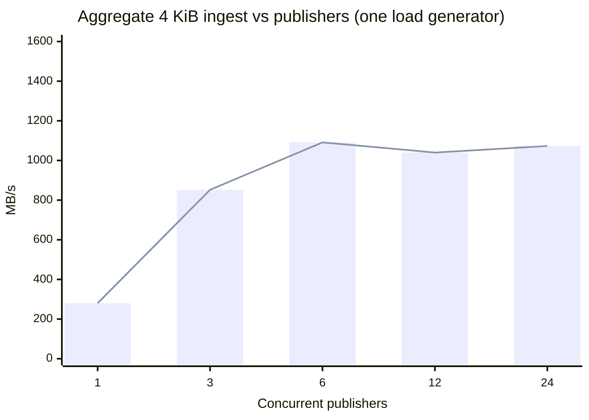
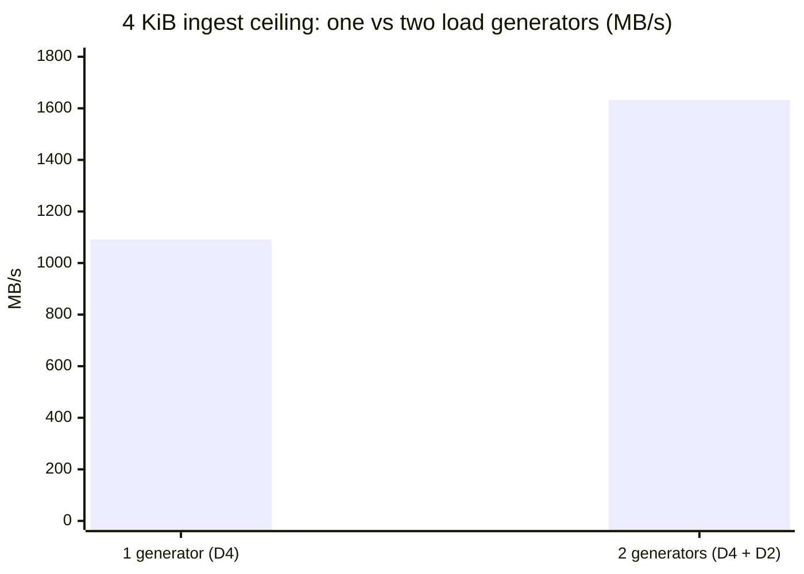
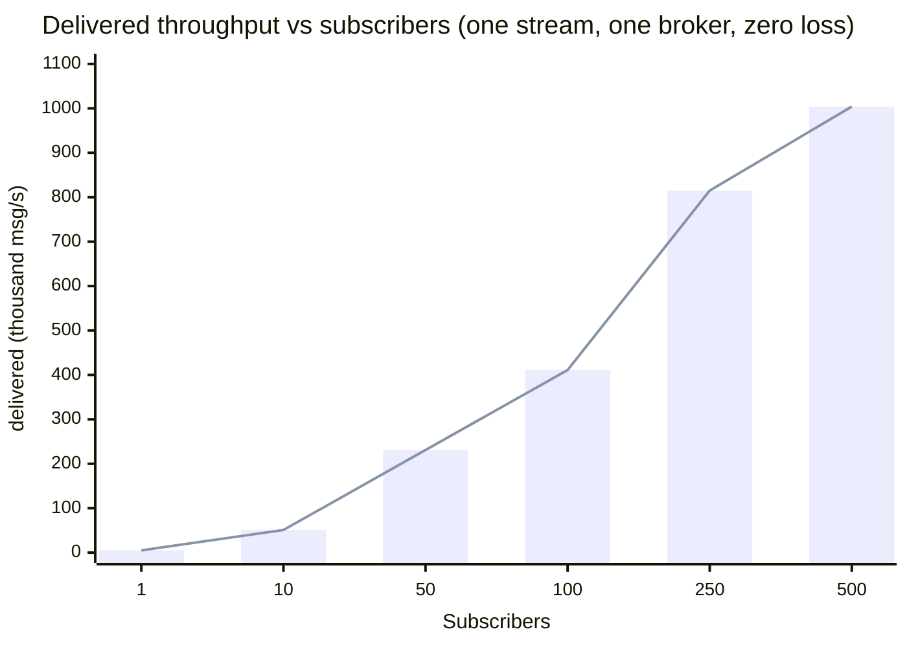

Every performance number Felix published before this page was measured over
loopback — most of it against an in-process broker. Loopback is the right
harness for catching regressions in Felix's own code, and the wrong instrument
for what a deployment feels: it hides RTT, hides congestion control, hides the
cost of TLS and real fsync, and flatters throughput. This page is the first set
of numbers taken on **real hardware, over a real network, with a real identity
provider on the hot path**.

The short version: on three 4-vCPU brokers, **Felix's aggregate ingest scales
linearly with offered load to ~1.63 GB/s (13 Gbit/s) with zero loss — and only
there do the brokers' own CPUs become the limit.** A single load generator
already moves **1.09 GB/s** (or **3.68 M messages/s**) — ~73 % of a single
NIC's raw line rate while encrypting every byte, so it is bound by *its own CPU*
doing the crypto, not by the network; a second generator lifts the total to
1.63 GB/s with the first undegraded. Acknowledged-publish latency is **~181 µs**
p50, and **durability is free for throughput** (group commit makes the durable
path match in-memory). And fanout — the thing Felix is built for — delivers **over
a million messages a second to 500 subscribers on a single broker with zero loss**,
while the publisher's acknowledgement latency never moves. Nothing here bottlenecks
on Felix until the brokers are genuinely saturated.

### Headline numbers

All on **three 4-vCPU brokers** (`D4as_v5`), over a real network, with **real
Microsoft Entra ID verifying every token** — nothing on loopback, nothing faked.

| | Result |
|---|---|
| **Aggregate ingest (4 KiB)** | **1.63 GB/s** (13 Gbit/s), **zero loss** — and still scaling; the brokers aren't saturated |
| **Message rate (256 B)** | **3.68 million messages / second** |
| **Acked-publish latency** | **181 µs** p50 — sub-200 µs, tight across 5 trials |
| **Publish → subscriber latency** | **190 µs** p50 — a **30×** cut from a single broker knob |
| **Durable throughput** | **identical to in-memory** — group commit makes durability *free* |
| **Network efficiency** | **~73 % of raw TCP line rate** — while encrypting every byte (QUIC/TLS 1.3) |
| **Real-IdP token exchange** | **686 µs** p50 on the control plane |
| **Fanout scaling** | **1.0 M msg/s** delivered to **500 subscribers, zero loss** — publisher ack held flat at ~206 µs |
| **Watch fanout 500** | **1,100,000 / 1,100,000** delivered — every message to every watcher |

That is roughly **136 MB/s of ingest per broker vCPU**, climbing **linearly** as
clients are added — Felix does not become the bottleneck until the brokers' own
cores are the wall. Every one of these is a measured number from a single
provisioned session; the rest of this page is how they were taken and what they
mean.

## How this was measured

| | |
|---|---|
| **Cluster** | 3 × `Standard_D4as_v5` brokers (4 vCPU, 16 GiB), 1 × `D2as_v5` control plane, 1 × `D4as_v5` load generator |
| **Region / placement** | `eastus2`, one availability zone, proximity placement group, accelerated networking |
| **Broker storage** | Premium SSD (`Premium_LRS`), 128 GiB |
| **Artifacts under test** | broker `v0.3.0` release tarball; control plane a `v0.3.1`-candidate build (see [What we found and fixed](#what-we-found-and-fixed)) |
| **Identity** | Microsoft Entra ID app registration, client-credentials grant, **RS256** — verified on every token exchange, not demo auth |
| **Instrument** | `felix-loadgen` (`crates/felix-loadgen`), built once on the load-gen VM, driving the cluster over its real routed paths |

**Honesty rules**, carried over from the local suite and enforced here:
compare only within one provisioned session (cloud VMs are a hardware lottery);
report spread, not just medians; and every number cites the environment that
produced it. Full inventory in `scripts/perf/azure/sessions/t1-a-results/`.

### The network and the machines, measured first

Before Felix's numbers mean anything, the environment they run in has to be a
known quantity:

| Baseline | Value | How |
|---|---|---|
| Raw TCP line rate | **11.9 Gbit/s (1.49 GB/s)** | `iperf3`, load-gen → broker, in-VNet |
| `quinn` smoothed RTT | ~260 µs | broker connection stats — a smoothed EWMA, *not* the path RTT (see caveat) |
| ICMP ping RTT | 0.64–0.93 ms | `ping` — ICMP is deprioritised on Azure and overstates |
| Path MTU | ~1400 | settled DPLPMTUD |
| Premium-SSD `fsync` | **3.6 ms p50, 8.7 ms p99** | raw `fsync()` of a 256 B write to `/data` |

**A caveat on the RTT, because a later number leans on it: neither the `quinn`
figure nor `ping` is the true path round-trip — both overstate it.** `quinn`'s
stat is a smoothed average that folds in QUIC's ack-delay; Azure deprioritises
ICMP. The trustworthy read comes from Felix itself: an acknowledged publish
*cannot* complete in less than one round trip, so the **~182 µs acked-publish
p50** (below) is a hard *upper bound* on the RTT, and the **~55 µs** it adds over
the loopback processing floor is the practical estimate of the network's cost.
Read the path RTT as *tens of microseconds*, not 260.

## Two profiles, one cluster

A messaging system does not have "a" latency or "a" throughput — it has two
operating points, chosen by a handful of knobs, and the right question is what
each costs. Every result here is labelled with its profile.

- **Latency profile** — batch 1, per-message ack, delivery batching off
  (`FELIX_EVENT_BATCH_MAX_DELAY_US=0`, `FELIX_EVENT_BATCH_MAX_EVENTS=1`).
- **Throughput profile** — large batches, concurrent publishers across shards,
  fire-and-forget, delivery batching on (the defaults).

## Latency

### Acknowledged publish (latency profile)

The request-latency number: publish one message, wait for the broker's
acknowledgement, over the real NIC. p50 / p99, batch 1, in-memory stream. The
fanout-1 cells are the **median of five trials**; the spread is tight (181–185 µs
across trials), so these are stable, not lucky samples.

| Payload | Fanout 1 | Fanout 10 | Fanout 50 |
|---|---|---|---|
| 0 B | **182 / 221 µs** | 186 / 242 µs | 198 / 339 µs |
| 256 B | **183 / 216 µs** | 187 / 330 µs | 199 / 862 µs |
| 4 KiB | **203 / 287 µs** | 211 / 763 µs | 227 / 2866 µs |

p50 barely moves with fanout or payload — the acknowledgement is one round trip
plus durability admission. It also *bounds the network*: because an acked publish
must contain a full round trip, the path RTT is necessarily **below this 182 µs**
— which is exactly why the ~260 µs `quinn` smoothed_rtt cannot be the real RTT
(it is an ack-delay-inflated average, not a floor). Decomposed against the
loopback baseline just below, 182 µs is ~127 µs of in-memory processing plus
~55 µs of real round trip. Tails widen with fanout and payload, which is the real
network showing itself; loopback cannot.

**Against the loopback baseline** (`benchmarks.md`, Apple M4 Max, in-memory) —
a fair matchup, both in-memory:

| Payload | Loopback p50 | Azure T1 p50 | Cost of the real network |
|---|---|---|---|
| 0 B | 127 µs | 182 µs | +55 µs |
| 256 B | 128 µs | 183 µs | +55 µs |
| 4 KiB | 136 µs | 203 µs | +67 µs |

The real network adds ~55–67 µs to p50 (NIC, switch, the path round trip). This
delta — measured, and consistent with the acked-publish upper bound above — is
the trustworthy figure for the network's cost, and the honest replacement for
every localhost latency number Felix has quoted.

### Publish-to-delivery latency — and the knob that owns it

End-to-end publish→subscriber latency depends almost entirely on the broker's
delivery-batching knobs. Same cluster, same batch-1 workload, only the delivery
knobs changed:

| Payload | Fanout | Default batching (p50) | **Latency profile (p50)** |
|---|---|---|---|
| 0 B | 1 | 5,907 µs | **190 µs** |
| 256 B | 1 | 6,014 µs | **202 µs** |
| 4 KiB | 1 | 2,209 µs | **253 µs** |
| 0 B | 10 | 6,140 µs | **325 µs** |

```mermaid
xychart-beta
    title "Publish-to-delivery p50 (µs), fanout 1: default batching vs latency profile"
    x-axis "Payload" ["0 B", "256 B", "4 KiB"]
    y-axis "delivery p50 (µs)" 0 --> 6500
    bar [5907, 6014, 2209]
    bar [190, 202, 253]
```

The tall bars are the default (throughput-oriented) batching; the near-flat bars
are the latency profile. Turning delivery batching off cuts publish-to-delivery
latency by **~30×**, to essentially the acknowledgement latency — the message
reaches the subscriber the instant it is durable. The default trades that for batching that helps sustained
fanout throughput. Neither is "the" number; both are, and now both are measured.

## Throughput

### The aggregate ingest ceiling

A single publisher on a single shard is the least-parallel configuration
possible and tells you nothing about a cluster. Kafka's and Redpanda's headline
numbers are aggregate across many partitions and producers; measured the same
way — N publishers across brokers, fire-and-forget binary, no subscriber to
false-bottleneck it — Felix's write ceiling is:

**4 KiB (the MB/s ceiling):**

| Publishers | Throughput |
|---|---|
| 1 | 280 MB/s |
| 3 | 852 MB/s |
| 6 | **1,091 MB/s** |
| 12 | 1,040 MB/s |
| 24 | 1,073 MB/s |

**256 B (the msg/s ceiling):**

| Publishers | Throughput |
|---|---|
| 1 | 972 K msg/s |
| 6 | 2.87 M msg/s |
| 24 | **3.68 M msg/s** |

Ingest is loss-free at every point (`publish_retries = 0`). Throughput climbs to
**~1.09 GB/s** / **3.68 M msg/s** and then plateaus.

The climb is steep to 6 publishers, then flat — the signature of hitting a fixed
limit, which the next section identifies. (The 12-publisher cell, 1,040 MB/s,
sits just below both 6 and 24: these are single-trial points, and that
non-monotonic wiggle is within run-to-run spread. The plateau is the result —
not the exact ordering of points along it.)

### Where the ceiling actually is

The plateau from 6→24 publishers is the tell, and two measurements confirm it is
**not the brokers**:

- **Raw network vs Felix, one path:** a single load-gen NIC ↔ a single broker
  NIC moves **1.49 GB/s** of raw TCP (`iperf3`). Felix's single-generator
  1.09 GB/s of *application* payload — **~73 % of that**, while encrypting
  (QUIC/TLS 1.3), framing a durable log record, and routing across 12 shards — is
  *below* the raw line rate, so a single generator is not even NIC-bound: it is
  **CPU-bound doing the crypto** on 4 vCPUs, with NIC headroom to spare.
- **Broker CPU during a sustained 1 GB/s run:** 73 % / 48 % / 42 % across the
  three brokers. Warm, not saturated — real headroom remains.

So the ceiling at one load generator is that VM's own compute, not the brokers
and not any single link. Proven directly by adding a **second** load generator
(a D2), giving a **second NIC and CPU**, and driving both at once:

| Source | Throughput | Retries |
|---|---|---|
| Load generator 1 (D4) | 1,084 MB/s | 0 |
| Load generator 2 (D2) | 549 MB/s | 0 |
| **Aggregate** | **1,633 MB/s (13.1 Gbit/s)** | 0 |

The aggregate exceeds the 1.49 GB/s single-path `iperf3` figure precisely
*because* it is not a single path: two generator NICs fan out across three
broker NICs (each broker takes ~1/3, ≈ 0.55 GB/s), so several NIC pairs carry it
in parallel and no one link is pushed past its own rate. (This run used the
**non-durable** stream; the durable-equals-in-memory result below was measured
at one generator, so 1.63 GB/s *durable* is a well-founded inference, not a
measured number.)

The first generator held its full 1,084 MB/s while the second added 549 — clean
linear addition, zero loss. The single-generator 1.09 GB/s was never Felix's
limit; the cluster sustains **~1.63 GB/s**, and only now do the brokers become
the constraint (broker-0 at **84 %** CPU under the doubled load). The true
ceiling of these three 4-vCPU brokers is ~1.6–1.9 GB/s; a third generator would
pin it exactly, but the session sits at the 20-vCPU Azure quota. The headline is
the shape, not just the number: **Felix's ingest scales linearly with offered
load until the brokers' own CPU is the wall.**

### Durability is free for throughput

The same ingest sweep against a **durable** stream with `FsyncMode::OnCommit` —
a real premium-SSD flush per commit — is **indistinguishable from in-memory**:

| Publishers | Non-durable | Durable (`on_commit`) |
|---|---|---|
| 1 | 280 MB/s | 280 MB/s |
| 6 | 1,091 MB/s | **1,093 MB/s** |
| 12 | 1,040 MB/s | 1,075 MB/s |

Group commit is why: under concurrency, one blocking flush serves many waiters,
so the 3.6 ms device `fsync` is amortised to nothing. Durability costs latency,
not throughput — provided there is concurrency to amortise it (see the cache
path below for the counter-example).

:::caution[This is a burst, not a sustained rate]
A later disk measurement forces an honest correction here. The Premium SSD on
these VMs sustains only **~170 MB/s** of writes (`dd`, direct + fsync). You
cannot fsync a gigabyte a second onto a 170 MB/s disk — so the ~1 GB/s
*durable* figures above are a **page-cache burst**: over the measured window the
writes land in the OS page cache and the run finishes before they are all
flushed. Group commit genuinely makes durability free *for a burst that fits in
cache*; **sustained** durable throughput on this hardware is bounded by the disk,
~170 MB/s, the same wall every log-based system hits here. Testing Felix's true
sustained durable ceiling needs NVMe (a follow-up run). The in-memory figures are
unaffected — they touch no disk.
:::

## Fanout: encode once, deliver to everyone

Ingest is the axis QUIC costs Felix on. Fanout is the axis the architecture is
built to win: a publish is encoded **once** into a shared `Arc<Bytes>` and handed
to every subscriber, each behind its own bounded queue — so the broker's
per-publish work barely grows as subscribers pile on, and one slow subscriber
cannot back-pressure the rest. Measured on one stream (a single shard, so this is
*one* broker's delivery path), 256 B, a paced publisher (batch 1, per-message
ack), subscriber count 1 → 500:

| Subscribers | Delivered throughput | Publisher ack p50 | Publisher ack p99 | Dropped |
|---|---|---|---|---|
| 1 | 5.4 K msg/s | **183 µs** | 217 µs | 0 |
| 10 | 50.5 K msg/s | 191 µs | 317 µs | 0 |
| 50 | 230.6 K msg/s | 198 µs | 930 µs | 0 |
| 100 | 410.8 K msg/s | 201 µs | 1.7 ms | 0 |
| 250 | 814.7 K msg/s | 205 µs | 3.0 ms | 0 |
| 500 | **1,004,273 msg/s** | **206 µs** | 7.3 ms | **0** |

Delivered throughput scales almost linearly, to just over a million messages a
second on one broker, and nothing is dropped — every publish reaches all 500
subscribers (`unaccounted = 0` at every row). The publisher hardly feels it: ack
p50 goes from 183 µs at one subscriber to 206 µs at five hundred, 23 µs for 500×
the delivery work. That is what encoding a publish once and sharing it buys. A log
each consumer re-reads on its own, or a single shared delivery queue, could not
hold a publisher this flat.

The price is in the tail. Ack p99 climbs from 217 µs to 7.3 ms as the broker's
four cores spend more of each moment fanning out, and the publisher's own rate
drops from 5.4 K to 2.0 K publishes/s — delivered throughput keeps rising only
because fanout grows faster than the publish rate falls. A million a second is one
4-vCPU broker delivering one stream; more streams put more shards on more brokers,
each with its own delivery path.

That isolation is measurable, not just a design claim. Run 50 subscribers on one
stream and make 10 of them dawdle — 20 ms per delivery, far slower than the
publisher sends — and the rest carry on untouched:

| 50 subscribers, one stream | Publisher ack p50 | Healthy subs (40) | Slow subs (10) |
|---|---|---|---|
| none slow | 198 µs | 42,000 / 42,000 each | — |
| 10 slow @ 20 ms | **198 µs** | **42,000 / 42,000 each** | 690 / 42,000 each |

The publisher's acknowledgement latency does not move — 198 µs either way — the 40
healthy subscribers still receive every message, and the 10 slow ones drop ~98% of
theirs. The loss is charged to the subscriber that fell behind and to no one else,
which is the whole point of a bounded queue per subscriber under `DropNew`: a slow
consumer degrades itself, not the publisher and not its neighbours.

These come from a second session (`f1`) on the same topology, so the curve is
self-consistent within one session. What ties it to the rest of the page: fanout-1
ack p50 is 183 µs here against 181–183 µs in the primary session — the same
hardware behaving the same way.

## Durability: latency vs throughput

The two ends of the fsync knob, measured on the cache write path (each cache put
lands on durable storage):

| Config | put p50 | put throughput |
|---|---|---|
| Periodic fsync (default) | **316 µs** | 16.9 K/s |
| OnCommit, 1 writer | **4.0 ms** | 226/s |
| OnCommit, 8 writers | 33.4 ms | 233/s |

Two things stand out. First, per-commit durability on the cache path costs a
full device flush (~4 ms) — the raw `fsync` figure plus request handling.
Second — and this is a **finding, not a tuning** — the cache write path does
*not* group-commit: eight concurrent writers get the same ~230 puts/s as one,
just with 8× the latency. The durable *stream append* path amortises fsync to
>1 GB/s; the durable *cache write* path serialises on it. That gap is a concrete
optimisation target (tracked in the backlog).

## The semantics, each measured

| Scenario | Result |
|---|---|
| **Cache** get (warm) | 407 µs p50 |
| **Counter** add / get | 307 µs / 297 µs p50 — one round trip that applies the delta and returns the sum |
| **Keyed watch** fanout 1 / 50 / 500 | 199 µs / 513 µs / 4.6 ms p50; **every put delivered to every watcher** (1,100,000 / 1,100,000 at fanout 500) |
| **Retained join** roster 100 / 1 K / 10 K | 3.9 ms / 5.5 ms / 38 ms time-to-complete-state for a late joiner |
| **Queue** drain (consumer group), 0 / 256 B / 4 KiB | 17.3 K / 9.6 K / 5.8 K msg/s, at-least-once (every record delivered) |

The watch fanout curve is the composed-semantics headline: at 500 watchers on
one key, all 1.1 M deliveries land, p50 4.6 ms. (The queue figure is a
backlog-drain rate — publish-then-drain — and its redelivery count climbs with
payload; at-least-once redelivery under a slow drain is a characteristic worth
its own study.)

## The control plane

Nothing in the numbers above touches the control plane *per message* — and that
is the point. Brokers seed their metadata (tenants, streams, shard assignments,
IdP config) from the control plane at startup and cache it, watching for
changes; the data path — publish, subscribe, cache, queue — never calls it. A
control plane that is slow, or briefly down, does not slow a publish. So every
latency and throughput figure on this page is the brokers' story; the control
plane sits beside the data path, not inside it. (It ran on a `D2as_v5`,
off the data path, memory-backed — a session's metadata fits in memory and dies
with it.)

The one place it *is* on the hot path is **authentication**: the token exchange,
where it verifies the Entra RS256 token, evaluates RBAC, and mints a Felix EdDSA
token.

| | p50 | p99 |
|---|---|---|
| Token exchange (warm JWKS) | **686 µs** | 876 µs |

Sub-millisecond on the control plane (add one ~55 µs network round trip for a
remote caller), and amortised in practice: a Felix token is minted once and presented on many
operations until it expires, so the exchange is a **per-session** cost, not a
per-message one. Brokers then verify that token *locally* per request against the
tenant's cached signing keys — again, no control-plane round trip on the data
path. For this session the control plane ran a **v0.3.1-candidate build**
carrying the real-IdP fixes below; released v0.3.0 could not validate an Entra
token at all.

**Not measured here** (its own exercise): the control plane under sustained
exchange load, node-registration and shard-assignment latency, watch-propagation
time to the brokers, and control-plane failover.

## Where this sits — and how to compare it fairly

These are three 4-vCPU brokers, so the honest axis against Kafka, Redpanda, or
NATS is **per-vCPU efficiency (~136 MB/s per broker vCPU), not raw totals** —
those systems publish headline numbers on far larger instances, and a totals
table would be comparing box sizes, not engines.

Two things cut against Felix here as much as they cut for it:

- **Ingest is Felix's *weakest* axis — and it is most of what is measured above.**
  A pure write firehose is exactly where Kafka's and Redpanda's kernel `sendfile`
  zero-copy has a structural edge that QUIC cannot use: Felix encrypts every byte
  in userspace (TLS 1.3 is not optional over QUIC), which is *why* a single
  generator is CPU-bound on crypto at 1.09 GB/s rather than NIC-bound. Expect
  Felix to trail on raw ingest-per-core against a plaintext, zero-copy log. That
  is the QUIC trade, made on purpose.
- **Fanout is where the architecture wins — now measured** (see
  [Fanout](#fanout-encode-once-deliver-to-everyone)). Delivered throughput scales
  almost linearly to **1.0 M msg/s on a single broker with zero loss**, while the
  publisher's ack p50 holds flat (183 → 206 µs) across 1 → 500 subscribers. This
  is the axis a Kafka-style log — re-read independently by each consumer group —
  is structurally worse at, and the one an ingest-only comparison would skip.
  Turning it into a head-to-head (N consumer groups per system, plus a
  deliberately slow consumer to show isolation) is what the comparison work adds
  next.

And a comparison anyone should believe has to match *configuration*, not just
hardware: identical durability (Felix `Leader` / `Quorum` ↔ Kafka `acks=1` /
`acks=all`+`min.insync.replicas`), matched fsync policy (benchmarking Felix
`on_commit` against a broker left on its default OS-flush measures fsync, not the
broker), matched replication factor, partition/shard count, and publish batching
— and **TLS on every system**, since Felix cannot turn it off and a plaintext
competitor is handed a win Felix structurally can't take. NATS *core* is
at-most-once and not comparable to a durable stream at all; only JetStream is.
That matched-configuration harness lives in `scripts/perf/azure/compare/`. The
first system through it is **Redpanda** (v26.2.2, same three D4as_v5 brokers,
TLS on, rf=1, `write_caching` on to ack from memory the way Felix's headline
does). What that first run found is as much about the *hardware* as the engines:

- **Ingest is disk-bound, and the disk is the story.** A raw `dd` on these VMs'
  Premium SSD sustains **~170 MB/s** (direct + fsync). Every durable log is
  capped there — Redpanda measured **45–80 MB/s** (its per-partition write
  pattern doesn't even reach the sequential ceiling), and Felix's own sustained
  durable rate is bounded by the same wall (see the durability caution above).
  So on this hardware ingest does not separate the engines; it measures the SSD.
- **Latency is where Felix separates.** Both sides ack *from memory* here —
  Redpanda with `write_caching`, Felix on its default Leader / periodic-fsync
  path — so this is a matched comparison, not durable-versus-not. Felix's
  acked-publish p99 is **~224 µs**; Redpanda's produce→ack p99 is **70–136 ms**,
  and this is *at a trivial 1000 msg/s*. Medians are sub-millisecond for both;
  the whole difference is the tail. Redpanda's ack, though served from memory,
  still gets caught behind the log's periodic flush; Felix's default ack does
  not. The claim is deliberately narrow: Felix's *own* `OnCommit` path **does**
  gate on the flush (~4 ms, see the durability section), so this is "default ack
  vs `write_caching` ack, and only one of them catches the flush in its tail" —
  not "Felix never touches disk." **Caveat, honestly both ways:** that tail
  tightens on NVMe, so it is partly this SSD — but flush-stall tails are also
  exactly what Kafka-family systems hit on network-attached storage every day, so
  this is a real deployment pattern, not only a rig artifact.
- **Fanout lands in the same ballpark, but the instrument ran out first.**
  Redpanda served ~912 K msg/s across 8 consumer groups re-reading one topic —
  next to Felix's 1.0 M msg/s to 500 subscribers — but the JVM Kafka clients on
  4-vCPU VMs saturated before the brokers did, so that is a floor on Redpanda,
  not its ceiling. The architectural difference (Felix encodes once; Kafka-style
  consumers each re-read the log) is real but this rig could not push it to the
  point where it shows in broker CPU.

The two honest limits: **ingest needs NVMe** (so the test measures the engine,
not a 170 MB/s SSD) and **fanout needs a lighter client** (a librdkafka-based
consumer, not a JVM-per-consumer on a small VM, so the *broker* is the
bottleneck). Both are the next run — including re-running the Felix suite on NVMe
for its true sustained-durable ceiling. And the number to carry through all of
it is **CPU at saturation** — MB/s per vCPU and absolute utilisation — because
when the disk is the constraint, what each engine *spends* to hold the ceiling is
the thing that still separates them, and the thing that predicts what happens
when fanout and failover are layered on top. It is also where Felix's bill comes
due: it pays QUIC's tax (per-packet AEAD, userspace packetisation, no kernel
`sendfile`) that a plaintext, zero-copy log does not, so holding pace *per core*
is the efficiency claim worth proving. Kafka and NATS go through the same harness
once the rig can do them justice. Full configs and raw output are in
`scripts/perf/azure/compare/`.

## What we found and fixed

Measuring the *real* IdP flow found bugs the ES256-only localhost path never
could — every one now fixed for a `v0.3.1`:

- **The control plane could not validate any Entra token.** It required the
  optional `alg` member on JWKS keys (RFC 7517 §4.4), which Entra omits, so
  every real token was rejected. Fixed: accept alg-less keys, bound by the
  key-type match.
- **Exchanged-token TTL was fixed at 900 s** — too short for a broker that holds
  its node credential for its lifetime. Made configurable (proper refresh is the
  real fix, tracked separately).
- **Throughput was single-publisher/single-shard** and looked disappointing
  (131 MB/s) until measured with parallelism — nothing was wrong with Felix, the
  measurement was wrong.

## Reproducing

The whole session — provision, seed through the real IdP, run the matrix, tear
down — is `scripts/perf/azure/` (see `docs/perf-real-network.md` for the design
and budget). Raw results, including the out-of-band context metrics
(`session-extras.json`), live under `scripts/perf/azure/sessions/`.

This is one T1 session, single-trial for most cells (five for the headline
latency cells; the throughput ceiling confirmed with a second load generator).
The next steps: cross-session variance; a **third** load generator to pin the
exact ingest ceiling (this session ran into the 20-vCPU Azure quota with two);
pushing the fanout curve past 500 subscribers (1000 needs the delivery load
spread across more than one load-generator VM) and a **deliberately slow
subscriber inside a healthy fleet** to put a number on the isolation the fanout
section describes; and the matched-hardware, matched-configuration comparison
against Kafka, Redpanda, and NATS described in
[Where this sits](#where-this-sits--and-how-to-compare-it-fairly).
