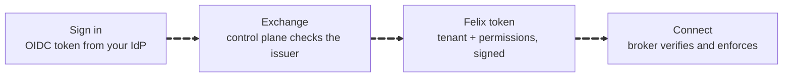
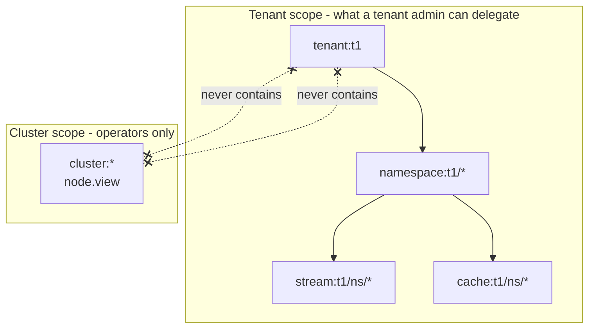
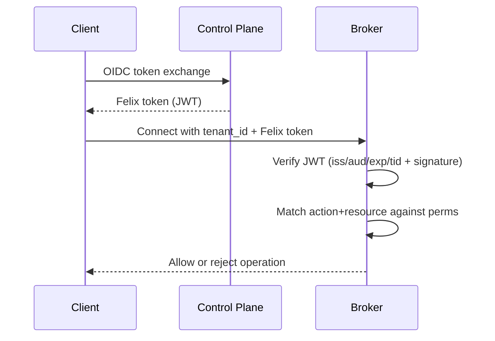

What Felix secures today, exactly how the authentication chain works, and
what is not built yet. The one-line summary: every connection is TLS 1.3
because QUIC allows nothing less; identity comes from your own IdP via OIDC
token exchange; authorization is tenant-scoped RBAC enforced at the broker;
brokers authenticate each other with mTLS when given certificates. Encryption
at rest and audit logging are **not** built.

:::note[Security Maturity]
Felix is in early development and has not been through an external security
review. This page states plainly which protections exist and which are
planned; the [status table](/felix/getting-started/what-felix-is-for/) is
kept current per capability.
:::

## Transport security

QUIC integrates TLS 1.3 into the protocol itself: there is no unencrypted
mode, no downgrade to older TLS versions, and forward secrecy comes with the
handshake. All Felix traffic — client-to-broker, broker-to-broker,
everything — is encrypted in transit.

**Certificates, honestly.** Today the broker generates a **self-signed
certificate at startup**; there is no configuration key for operator-supplied
certificates yet. The demos and the cluster harness distribute trust for that
certificate to their clients. The broker-internal transport is different:
given `FELIX_INTERNAL_TLS_CERT`, `FELIX_INTERNAL_TLS_KEY` and
`FELIX_INTERNAL_TLS_CA`, peers authenticate each other with mTLS, and the
certificate's DNS name is the broker's identity, checked against its node id
in both directions. Without those three the internal link is encrypted with
generated certificates and not authenticated, and startup warns — so set them
for any deployment where the network between brokers is not already trusted.

The one place operator-supplied certificates *are* wired up is the control
plane's bootstrap listener, below — because that endpoint hands out
admin-equivalent power and got hardened first.

Client-side, certificate verification is Quinn's:

```rust
// Production: validate against the platform trust store
let quinn = quinn::ClientConfig::with_platform_verifier();
let config = ClientConfig::optimized_defaults(quinn);

// Development: configure Quinn with a test CA or custom verifier
```

## Multi-tenancy and isolation

Everything is scoped `tenant → namespace → stream/cache`, and the scope is
part of every wire operation — there is no unscoped request to forget to
check. The broker rejects unknown tenants, and a token for one tenant is
useless against another (the `tid` claim is checked after signature
verification, precisely so a valid signature for the wrong tenant fails).

Within a tenant, namespaces are the isolation unit for environments or teams:
`acme/production/orders` and `acme/staging/orders` share nothing but a
naming convention.

Per-tenant quotas and rate limits are not built.

## Authentication and authorization

Felix implements token-based authentication with upstream OIDC and tenant-scoped RBAC enforced by brokers using Felix tokens.

The whole flow, end to end:



Felix never sees your IdP password, and the broker never calls the control plane
on the request path: it verifies the signature against published JWKS and reads
the permissions out of the token.

### Bootstrap Mode (Day-0)

New tenants need IdP issuers, signing keys, and initial RBAC before any admin tokens exist. Felix provides a **one-time bootstrap mode** for operators:

1. Enable bootstrap on the control plane (disabled by default):

```
FELIX_BOOTSTRAP_ENABLED=true
FELIX_BOOTSTRAP_BIND_ADDR=127.0.0.1:9095
FELIX_BOOTSTRAP_TOKEN=<random secret>
```

Two optional hardening layers, independent of each other:

- **Token rotation without an outage.** `FELIX_BOOTSTRAP_TOKEN_PREVIOUS`
  holds the token being retired; both are accepted (each compared in constant
  time) while a rolling deploy replaces one with the other. Setting only the
  previous token fails startup — that shape means the rotation removed the
  wrong half.
- **mTLS on the bootstrap listener.** `FELIX_BOOTSTRAP_TLS_CERT`,
  `FELIX_BOOTSTRAP_TLS_KEY`, and `FELIX_BOOTSTRAP_TLS_CLIENT_CA` (all three,
  or startup fails rather than coming up half-secured) make the listener
  terminate TLS itself and refuse, at the handshake, any client without a
  certificate signed by that CA. An unauthenticated caller never reaches the
  endpoint, so the token never even gets read.

2. Call the internal endpoint (bound to the bootstrap address):

```
POST /internal/bootstrap/tenants/{tenant_id}/initialize
X-Felix-Bootstrap-Token: <secret>
Content-Type: application/json

{
  "display_name": "Tenant One",
  "idp_issuers": [
    {
      "issuer": "https://login.microsoftonline.com/<tenant>/v2.0",
      "audiences": ["api://felix-controlplane"],
      "discovery_url": null,
      "jwks_url": null,
      "claim_mappings": {
        "subject_claim": "sub",
        "groups_claim": "groups"
      }
    }
  ],
  "initial_admin_principals": ["p:alice"]
}
```

3. Disable bootstrap after the initial setup.

Initialization is **atomic and exactly-once per tenant**: the signing keys,
issuers, RBAC seed, and the bootstrapped flag commit as one store operation,
serialized on the tenant row. Racing the call against itself — including
through different control-plane instances behind one load balancer — produces
one winner and `409 already_initialized` for everyone else, and a failure
part-way leaves the tenant retryable rather than half-initialized. The token
itself is a static shared secret, valid while bootstrap is enabled — the full
threat model, replay rules, rotation procedure, and recovery steps are in
[`docs/security/bootstrap.md`](https://github.com/gabloe/felix/blob/main/docs/security/bootstrap.md).

After bootstrap, admin actions require explicit Felix permissions:
- IdP issuer admin: `tenant.manage:tenant:{tenant_id}`
- RBAC list: `rbac.view:<scoped object>`
- RBAC policy writes: `rbac.policy.manage:<scoped object>`
- RBAC assignment writes: `rbac.assignment.manage:<scoped object>`
- Namespaces, streams and caches: `ns.manage`, `stream.manage` or `cache.manage`
  over the object, from a token minted for that tenant; listings are filtered
  to the caller's scope
- Tenant catalog (create, list, delete): `tenant.manage:cluster:*`
- Metadata feeds brokers seed from (`snapshot`, `changes`): `node.view:cluster:*`
- Cluster membership reads: `node.view:cluster:*`
- Cluster membership writes: `node.manage:node:{node_id}` or `node.manage:cluster:*`

The credential is checked before existence, so nothing about what exists can
be learned without one: a tenant with no signing keys answers `401`, not `404`.

### RBAC Object Grammar and Delegation

Canonical RBAC object formats:
- `tenant:{tenant_id}`
- `namespace:{tenant_id}/{namespace}`
- `stream:{tenant_id}/{namespace}/{stream_or_*}`
- `cache:{tenant_id}/{namespace}/{cache_or_*}`
- `cluster:*` — the cluster itself, outside the tenant hierarchy
- `node:{node_id}` — one broker, also outside it

Write-time protections:
- `tenant:*` is rejected
- non-tenant-scoped wildcards are rejected
- policy/assignment writes are rejected if target scope is broader than caller scope

This prevents common privilege-escalation footguns when delegating namespace or stream admins.

#### Cluster scope

`cluster:*` covers broker membership — which brokers exist, whether they are
alive, and whether placement can use them — plus the tenant catalog and the
metadata feeds. It is an island in both directions, and that is the property
it exists for:



A permission is only writable when its object already sits inside the writer's
own scope. The two crossed links are the whole security property: because no
arrow runs between them, a tenant admin cannot write themselves `cluster:*`, and
cluster scope cannot read tenant data.

- **No tenant scope contains it.** Since a policy write is admitted only when
  its object is already inside the caller's scope, a tenant admin cannot grant
  themselves `cluster:*`. The bootstrap seed does not grant it either.
- **It contains no tenant object.** Cluster scope is not a backdoor into tenant
  data.

Reads require `node.view:cluster:*`. Writes — register, heartbeat, drain,
deregister — require `node.manage` over the node being changed, held either as
`node:{node_id}` by that broker or as `cluster:*` by an operator. A node is an
RBAC object rather than a field the caller asserts, which is what stops one
broker acting for another.

Cluster scope reaches a token only through bootstrap: initialize an operator
tenant whose policies grant the cluster actions to a role, assign the operator
principal to it, and exchange. The same route gives a broker its
`node.view:cluster:*`.

### Supported Identity Providers

Felix supports any OIDC-compliant IdP that exposes a JWKS endpoint (via discovery or direct JWKS URL) and uses an allowed upstream OIDC signing algorithm.

Supported upstream OIDC JWT signing algorithms:
- `ES256` (default)
- `RS256`, `RS384`, `RS512`
- `PS256`, `PS384`, `PS512`

Control plane configuration:
- YAML: `oidc_allowed_algorithms: ["ES256"]`
- Env: `FELIX_CONTROLPLANE_OIDC_ALLOWED_ALGORITHMS=ES256,RS256,...`

Common providers that work out of the box include Microsoft Entra ID, Okta,
Auth0, Google, and Apple.

### Allowing Upstream IdPs Per Tenant

IdP trust is configured per tenant in the control plane store. Each tenant has an allowlist of issuers and audiences, plus optional claim mappings.

The control plane validates:
- `iss` matches an allowed issuer for the tenant
- `aud` matches one of the configured audiences
- signature via JWKS (cached with TTL; an unknown `kid` re-fetches the JWKS
  at most once per 30 seconds per URL, because it is reachable before the
  signature is checked)
- `exp` with clock skew and `iat` not in the future

### Token Exchange (OIDC → Felix)

Clients authenticate to the control plane with an upstream OIDC JWT and exchange it for a tenant-scoped Felix token.

```text
POST /v1/tenants/{tenant_id}/token/exchange
Authorization: Bearer <oidc_jwt>
Content-Type: application/json

{
  "requested": ["stream.publish", "cache.read"],
  "resources": ["namespace:t1/payments", "stream:t1/payments/orders/*"]
}
```

Response:

```json
{
  "felix_token": "<jwt>",
  "expires_in": 900,
  "token_type": "Bearer"
}
```

The request body can only narrow the permissions RBAC grants — never widen
them.

### Felix Token Claims

Felix tokens are JWTs minted by the control plane and validated by brokers.

- `iss`: `felix-auth`
- `aud`: `felix-broker`
- `sub`: `principal_id` (sha256 of `iss|sub`)
- `tid`: tenant id
- `exp`, `iat`
- `perms`: effective permissions
- **Algorithm**: EdDSA (Ed25519) only; Felix-issued tokens never use RSA.
  The tenant JWKS publishes the current key and any previous ones, and
  verification tries them all. There is no operator command to rotate a
  tenant's signing key yet; a tenant keeps the key it was created with.

### RBAC Model (Casbin)

Casbin is used with domains for tenant scoping. Policies and groupings are stored per tenant.

**Objects**:
- `tenant:{tenant_id}`
- `namespace:{tenant_id}/{namespace}` or `namespace:{tenant_id}/*`
- `stream:{tenant_id}/{namespace}/{stream}` or `stream:{tenant_id}/{namespace}/*`
- `cache:{tenant_id}/{namespace}/{cache}` or `cache:{tenant_id}/{namespace}/*`

**Actions**:
- `rbac.view`, `rbac.policy.manage`, `rbac.assignment.manage`
- `tenant.manage`, `ns.manage`, `stream.manage`, `cache.manage`
- `stream.publish`, `stream.subscribe`
- `cache.read`, `cache.write`

Consumer-group operations have no action of their own: a group is a read
position over a stream, so poll, acknowledge, hand-back and the dead-letter
requests are all authorized as **`stream.subscribe`** on the stream being read.

**Permission strings** embedded in Felix tokens:

```
stream.publish:stream:t1/payments/orders
cache.read:cache:t1/payments/session
ns.manage:namespace:t1/payments
tenant.manage:tenant:t1
```

### Inheritance Rules

- `tenant.manage:tenant:{T}` implies tenant-scoped namespace/stream/cache permissions.
- `ns.manage:namespace:{T}/{N}` implies stream/cache manage + read/write within `{N}`.

### Group-Based RBAC from IdP Claims

If tenant issuer config sets `groups_claim`, exchange maps each incoming group
to `group:<name>` (always prefixed, so `group:ops` and `ops` stay distinct) and adds a
transient grouping edge for evaluation:

```text
g, <principal_id>, group:<name>, <tenant>
```

This enables role assignment by group without per-user policy writes.

### Broker Enforcement

Brokers validate Felix tokens (signature + claims) using tenant JWKS published by the control plane and enforce permissions locally using wildcard matching (`keyMatch2` semantics).



## Not built

Stated plainly, so nobody designs around a protection that is not there:

- **Encryption at rest.** Durable log segments are plaintext on disk. If the
  disk needs protecting today, use filesystem or block-level encryption.
- **End-to-end payload encryption.** The broker sees plaintext payloads. A
  client can of course encrypt its own payloads before publishing — the
  broker treats them as opaque bytes either way — but Felix ships no key
  management for it.
- **Broker-to-broker authentication without certificates.** mTLS is built
  and is the recommended mode; without `FELIX_INTERNAL_TLS_*` peers encrypt
  but do not authenticate each other and the internal network is trusted.
- **Operator-supplied broker certificates.** The client-facing certificate
  is generated at startup.
- **Audit logging, quotas, and rate limits.**

## Reporting a vulnerability

Open a report through
[GitHub Security Advisories](https://github.com/gabloe/felix/security/advisories)
rather than a public issue.
