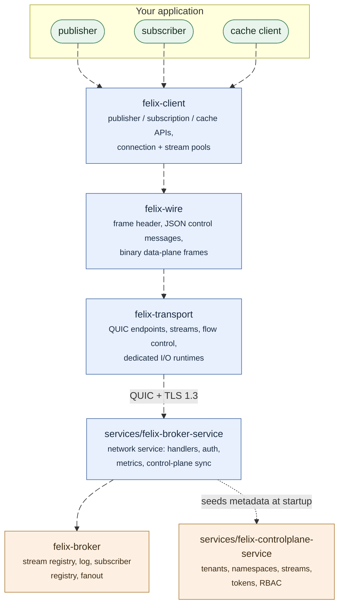

Felix is a distributed data backend that serves three things most systems run
three products for: event streams, work queues, and a key-value cache. All
three are readings of the same replicated, append-only log, reached over one
QUIC connection.

This page is the short version of how it fits together. The
[status table](/felix/getting-started/what-felix-is-for/) is the page to trust
for what is and is not built.

## The core idea: one log, three readings

Internally there is a single primitive — an append-only log per shard. Each
external API is a different way of reading it:

- **Streams** read by offset. Every subscription keeps its own cursor, so a
  slow reader never holds anyone else back.
- **Queues** read through a cursor a consumer group shares. A record goes to
  one consumer, is redelivered if unacknowledged, and dead-lettered when it
  keeps failing.
- **Cache** reads through a key index over the same log: latest value per key,
  with TTL.

Because it is one log, there is one durability path, one recovery path, one
placement rule and one replication path. There is no cache-vs-stream
consistency bug to have, because there is no second system to disagree with
the first.

## What Felix optimizes for

Predictable latency under load, more than peak batch throughput. The choices
that follow from that:

- **QUIC as the only transport.** Streams multiplex over one connection
  without head-of-line blocking, and every connection is TLS 1.3.
- **Backpressure everywhere.** Queues are bounded and overflow policy is
  explicit, so one slow path degrades locally instead of cascading.
- **Slow-consumer isolation.** A stalled subscriber loses *its own* events
  (under the default `drop_new` policy) rather than stalling the publisher or
  other subscribers. The [slow-consumer demo](/felix/demos/slow-consumer-isolation/)
  runs both policies side by side.
- **Explicit tuning knobs.** Batching bounds, flow-control windows, pool
  sizes, and fsync policy are configuration, not magic.

Measured numbers live on the [Benchmarks](/felix/features/benchmarks/) page —
one place, so they can't drift page to page.

## The pieces

Five crates, and the boundaries between them are the design. Everything below
the dotted line is transport-independent: the broker core has no idea QUIC
exists, which is what makes it testable in-process.

- **`felix-wire`** is the protocol: a fixed frame header, JSON control
  messages, binary frames on the data plane, and capability negotiation so
  old and new peers interoperate. Full details in
  [Wire Protocol](/felix/architecture/wire-protocol/).
- **`felix-transport`** wraps QUIC: endpoints, streams, flow-control windows,
  and dedicated I/O runtimes so the transport driver is never starved by
  application tasks.
- **`felix-broker`** is the data plane with no networking in it: the log,
  subscriber registry, fanout, cache index, consumer groups.
- **`felix-client`** is the Rust SDK: publisher, subscription, and cache APIs
  over pooled connections, with reconnection and redirect-following in the
  cluster client. Python (`crates/sdk/felix-python`) and TypeScript
  (`crates/sdk/felix-typescript`) ship too, both as bindings over this client
  rather than reimplementations; Go and C# are not started.
- **The control plane** (`services/felix-controlplane-service`) holds metadata — tenants,
  namespaces, streams, caches, nodes — behind a REST API, and assigns every
  shard to a broker. Brokers watch its assignment feed. It is not on the data
  path: a publish never waits on it.

## Delivery guarantees, plainly

Configured per stream:

- **Ephemeral streams** are at-most-once. The broker acknowledges receipt,
  fans out from memory, and a subscriber that falls behind misses records.
  This is the low-latency mode, and the right one when stale data is worthless
  anyway.
- **Durable streams** are at-least-once: a record is persisted before it is
  acknowledged, and can be replayed from any retained offset. With
  `consistency: quorum`, the acknowledgement additionally waits until a
  majority of the replica set holds the record — so a failover cannot lose an
  acknowledged write.
- **Consumer groups** redeliver anything unacknowledged, count attempts, and
  park repeat failures as dead letters you can list, discard, or redrive.
- **Exactly-once is not implemented** and is not close. If duplicates are
  unacceptable, deduplicate in the application.

A lost leader is replaced by a replica that provably holds the log — about a
second on a local three-node cluster. This is tested against process kill,
graceful stop, a leader frozen past its lease, and a partitioned broker that
keeps heartbeating.

## Security

Today: TLS 1.3 on every connection, OIDC token exchange at the control plane,
tenant-scoped tokens, RBAC enforced at the broker, and mutually authenticated
broker-to-broker QUIC once `FELIX_INTERNAL_TLS_CERT`, `_KEY` and `_CA` are set.
Not yet: end-to-end payload encryption, encryption at rest, audit logging.
Details in [Security](/felix/features/security/).

## Running it

A single broker is fine for development and for workloads that fit on one
machine — durable storage and the cache work there; replication needs
somewhere to replicate to.

A cluster is brokers plus a control plane:

The control plane keeps its metadata in one of three backends:

| Backend | What holds the metadata | When to pick it |
| --- | --- | --- |
| `memory` | This process, nothing else. The default. | Development, and the harness |
| `postgres` | One external database the instances share | A platform that already runs an HA Postgres |
| `raft` | The control-plane instances themselves, replicated between them | No external database to operate — edge sites, appliances, or anywhere Postgres is a burden rather than a convenience |

Raft has shipped: the instances form a quorum and survive losing one without
losing an acknowledged write. Postgres remains fully supported; the trade
between the two, and the migration path, are in
[Metadata Raft](/felix/architecture/metadata-raft/) and
[Control-plane HA](/felix/deployment/control-plane-ha/).

Felix runs anywhere a process runs. For orchestrators it ships the pieces
they expect: readiness and liveness endpoints that answer different questions,
and a bounded graceful drain on SIGTERM — see
[Graceful shutdown](/felix/deployment/graceful-shutdown/).

## Is Felix right for your workload?

A good fit: real-time streaming with high fanout, low-latency caching,
work distribution with retries and dead letters, and services that currently
run a broker *and* a cache *and* a queue and would rather run one system.
Services that already talk Kafka can keep their producers and their
partition-assigning consumers: Felix serves the Kafka protocol for those (see
[Kafka compatibility](/felix/features/kafka/)).

A bad fit: petabyte-scale batch pipelines, complex stream processing
(joins, windowing — use Flink or Kafka Streams), or anything that needs a
mature connector ecosystem today. Kafka Connect and Kafka Streams need
consumer groups, which Felix's Kafka listener does not offer. Felix is young and its ecosystem is one
language deep.

The honest version of this list, kept current per capability, is
[What Felix Is For](/felix/getting-started/what-felix-is-for/).

## Where to next

- [Quickstart](/felix/getting-started/quickstart/) — run a broker and the demos
- [Installation](/felix/getting-started/installation/) — build from source
- [System design](/felix/architecture/system-design/) — the architecture in depth
- [Broker API](/felix/api/broker-api/) — the wire-level API
