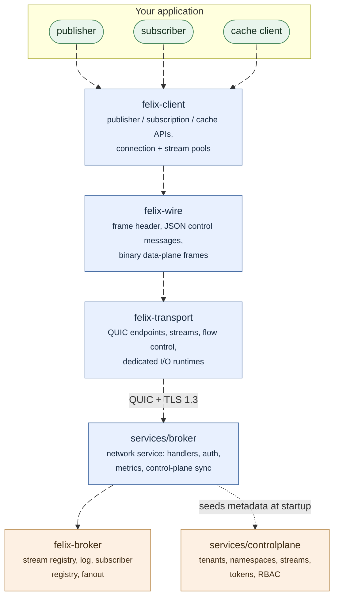
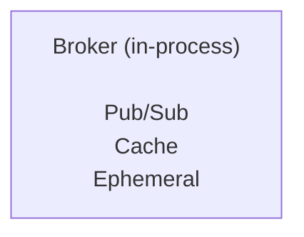
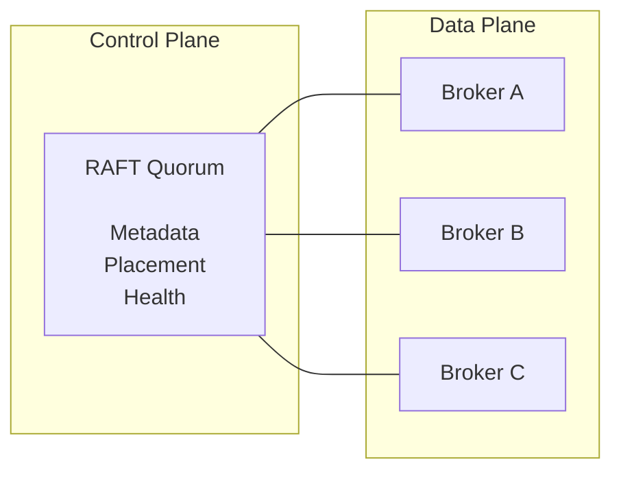

Felix is a low-latency, QUIC-based distributed data backend that unifies three critical patterns into a single system:

- **Event Streaming (Pub/Sub):** High-fanout message delivery with isolation and backpressure
- **Message Queues:** Shared consumer groups with acknowledgements
- **Distributed Cache:** Key-value storage with TTL support

## Design Philosophy

Felix is built around core principles that differentiate it from traditional message brokers and caches:

### 1. Low Latency First

Felix prioritizes **predictable low latency** over maximum batch throughput:

- QUIC transport eliminates head-of-line blocking
- Optional ephemeral streams with no disk on the hot path
- Aggressive backpressure prevents cascade failures
- Bounded memory everywhere to maintain predictable behavior
- Explicit performance knobs for latency/throughput trade-offs

Real-world results (single-node localhost):

- **Pub/Sub:** p50 ~40-50μs, p99 ~300-500μs (varies by payload and fanout)
- **Cache:** p50 ~160-180μs, p99 ~350-450μs at concurrency=32

### 2. One Core Log, Many Semantics

Internally, Felix uses a single append-only log abstraction. Different external semantics are projections over this core:

- **Streams:** fanout cursors per subscription
- **Queues:** shared consumer-group cursors with acks
- **Cache:** key → latest value with TTL

This eliminates the operational complexity and consistency bugs from running multiple systems (Kafka + Redis + RabbitMQ) side-by-side.

### 3. Kubernetes-Native

Felix assumes Kubernetes for:

- Process lifecycle management
- Identity (ServiceAccounts for mTLS)
- Networking and service discovery
- Failure detection and orchestration

Felix does **not** reimplement scheduling or node membership—it leverages what Kubernetes already provides.

## Core Components

Five crates, and the boundaries between them are the design. Everything below
the dotted line is transport-independent: the broker core has no idea QUIC
exists, which is what makes it testable in-process.

### Felix Wire Protocol (`felix-wire`)

Language-neutral framed protocol over QUIC:

- Fixed header with magic number, version, and flags
- Binary frame encoding across the data plane
- Forward-compatible versioning scheme

See the [Wire Protocol](/felix/architecture/wire-protocol/) documentation for full specification.

### Transport Layer (`felix-transport`)

QUIC abstraction layer providing:

- Client and server connection management
- Connection pooling with configurable size
- Stream lifecycle management
- Flow control window configuration
- TLS 1.3 encryption by default

### Broker (`felix-broker`)

The core data plane implementation:

- Pub/sub logic with fanout and batching
- Cache storage with TTL and lazy expiration
- Stream registry and routing
- Backpressure and isolation enforcement

### Client SDK (`felix-client`)

Rust client SDK with:

- Publisher/subscriber/cache APIs
- Connection and stream pooling
- Automatic reconnection
- Configurable batching and flow control

**Planned:** Thin adapters for Python, Go, and other languages.

### Control Plane (In Progress)

Metadata and coordination layer (in progress). Current capabilities include:

- Control plane service with REST API and OpenAPI spec (`/v1/openapi.json`)
- Tenant, namespace, stream, and cache management endpoints
- Snapshot + changes feeds for metadata consumers
- Auth bootstrap endpoints (JWKS + token exchange)
- In-memory or Postgres-backed metadata storage

Planned next steps:

- RAFT-based consensus for cluster metadata
- Placement and multi-node coordination
- Quota and retention policy enforcement
- Fleet-wide health aggregation

## Consistency & Delivery Guarantees

Felix provides **tunable consistency** configured per stream:

### Current MVP (Single-Node)

- **Delivery:** At-most-once (best-effort)
- **Ordering:** Per-stream ordering preserved for each subscriber
- **Acknowledgements:** Broker acknowledges receipt, not delivery to subscribers

### Planned Multi-Node

- **Leader-only acks:** Low latency, no replication wait
- **Quorum acks:** Higher durability, waits for replica confirmation
- **At-least-once:** With durable storage and replay
- **Exactly-once:** (future) via idempotent producers and transactions

## Security Architecture

### Current

- TLS 1.3 for all QUIC connections
- Transport-level encryption by default
- OIDC token exchange via control plane with tenant-scoped Felix JWTs
- Broker-side RBAC enforcement using Felix token permissions

### Planned

- **mTLS:** Mutual authentication between brokers and clients
- **Envelope Encryption:** Per-region and per-tenant key isolation
- **End-to-End Encryption:** Optional client-to-client encryption
- **Audit Logging:** Complete audit trail for compliance

## Deployment Models

### Single-Node (MVP)

Current implementation for development and testing:

### Multi-Node Cluster (Planned)

See [Deployment Guides](/felix/deployment/local/) for detailed instructions.

## Performance Characteristics

Felix is designed for workloads where:

- **Latency matters more than maximum throughput**
- **Predictable p99/p999 is critical**
- **High fanout is common** (1:N message delivery)
- **Mixed workloads** (streams + cache) share infrastructure

### When Felix Excels

✅ Real-time event streaming with tight latency SLAs  
✅ Microservice communication with low overhead  
✅ Regional data isolation requirements  
✅ Cache + stream unification to reduce system count  

### When to Use Something Else

❌ Maximum historical batch processing throughput (use Kafka)  
❌ Complex stream processing / transformations (use Kafka Streams, Flink)  
❌ Mature ecosystem with hundreds of connectors required  
❌ Multi-petabyte data warehouse workloads  

## What's Next?

- [Quickstart Guide](/felix/getting-started/quickstart/) - Get Felix running in minutes
- [Installation](/felix/getting-started/installation/) - Build from source
- [Architecture](/felix/architecture/system-design/) - Deep dive into system design
- [API Documentation](/felix/api/broker-api/) - Learn the APIs
