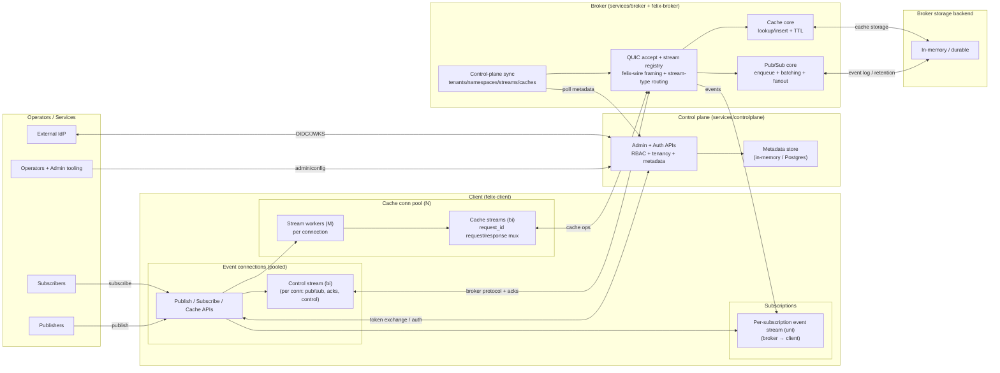

import { Card, CardGrid, LinkCard, Aside, Steps } from '@astrojs/starlight/components';

<Aside type="caution" title="Early Development">
Felix is in **early active development**. The design and implementation are evolving
quickly. This documentation reflects the current state and planned architecture.
</Aside>

Felix is a **low-latency** distributed data backend that unifies event streaming,
message-oriented middleware, and distributed caching over a single QUIC-based
transport layer.

## Why Felix?

<CardGrid>
  <Card title="Low tail latency" icon="rocket">
    Designed for predictable p99/p999 under load, not just aggregate throughput.
    QUIC gives multiplexed streams without head-of-line blocking, and explicit
    backpressure stops one slow path cascading into the rest.
  </Card>
  <Card title="Unified primitives" icon="puzzle">
    One core log abstraction behind several semantics — **streams** (per-subscription
    fanout cursors), **queues** (shared consumer-group cursors with acks), and
    **cache** (key → value with TTL). One system instead of three.
  </Card>
  <Card title="QUIC from the ground up" icon="approve-check">
    Encrypted by default with TLS 1.3, multiplexed streams per connection,
    built-in flow control and congestion awareness, and resistance to
    head-of-line blocking.
  </Card>
  <Card title="Tunable, explicitly" icon="setting">
    Connection pooling, stream multiplexing, time- and count-bounded batching,
    flow-control window sizing, and optional per-stage telemetry — all under
    your control rather than hidden behind defaults.
  </Card>
</CardGrid>

## See it behave

The demos are not simulations — each one runs a real broker and real clients, and
each asserts the property it demonstrates as a test.

<CardGrid>
  <LinkCard
    title="Slow-consumer isolation"
    href="/felix/demos/slow-consumer-isolation/"
    description="One consumer stalls. Under drop_new the healthy consumers never notice; under block it takes down the publisher. The same workload, twice."
  />
  <LinkCard
    title="Local state divergence"
    href="/felix/demos/state-divergence/"
    description="The counterpart: what at-most-once actually costs a consumer that holds local state, and what lossless delivery costs in throughput."
  />
</CardGrid>

## How It Works

Felix uses a framed protocol (`felix-wire`) over QUIC streams to unify event
streaming and request/response caching, with explicit control over multiplexing,
batching, and flow control.



<CardGrid>
  <Card title="Pub/Sub data flow" icon="right-arrow">
    1. The client opens a bidirectional control stream to publish/subscribe and receive acknowledgements.
    2. The broker validates scope, enqueues publish jobs, and fans out to subscribers.
    3. Each subscription gets a dedicated unidirectional event stream for delivery.
    4. Events travel as binary `EventBatch` frames with configurable batching.
  </Card>
  <Card title="Cache data flow" icon="right-arrow">
    1. The client maintains a cache connection pool with long-lived stream workers.
    2. Cache requests carry a `request_id` and are multiplexed over those streams.
    3. The broker processes request frames in a read loop and replies on the same stream.
    4. This avoids per-request stream setup cost and improves tail latency under concurrency.
  </Card>
</CardGrid>

## Key Features

| Feature | What it gives you |
| --- | --- |
| **QUIC transport** | Modern, multiplexed, encrypted transport layer |
| **High fanout** | Efficient delivery to many subscribers, with isolation between them |
| **Connection pooling** | Reusable connections and streams, so hot paths skip setup cost |
| **Batch processing** | Time- and count-bounded batching for throughput |
| **TTL support** | Time-to-live on cache entries with lazy expiration |
| **Backpressure** | Explicit flow control at six checkpoints to prevent cascade failures |
| **Metrics** | Prometheus-compatible metrics endpoint |
| **Observability** | Structured logging with optional per-stage telemetry |

## Use Cases

Felix is a good fit today for:

- **Real-time streaming** with high fanout and tunable latency/throughput trade-offs
- **Event pipelines** with batch publishing and batch delivery
- **Low-latency caching** over QUIC with predictable tail latency under load
- **Microservice communication** with unified pub/sub and cache semantics

See [What Felix Is For](/felix/getting-started/what-felix-is-for/) for the honest
boundaries — including what Felix is deliberately *not*.

## Current Status

<CardGrid>
  <Card title="Working today" icon="approve-check">
    - Single-node broker
    - In-process pub/sub with fanout
    - Ephemeral cache with TTL
    - Stable wire envelope (v1)
    - Basic observability (structured logs)
    - Comprehensive test coverage
  </Card>
  <Card title="On the roadmap" icon="seti:plan">
    - Durable log and retention policies
    - Metadata and control plane with RAFT consensus
    - Multi-node clustering with shard placement
    - Cross-region bridges with explicit data movement
    - Security hardening (mTLS, RBAC, end-to-end encryption)
    - Additional language clients (Python, Go)
  </Card>
</CardGrid>

## Quick Start

<Steps>

1. Clone the repository.

   ```bash
   git clone https://github.com/gabloe/felix.git
   cd felix
   ```

2. Build the workspace.

   ```bash
   cargo build --workspace --release
   ```

3. Run a demo — each one is self-contained and starts its own broker.

   ```bash
   task demo:slow-consumer
   task demo:state-divergence
   ```

4. Or run the broker on its own.

   ```bash
   cargo run --release -p broker
   ```

</Steps>

See the [Demos Overview](/felix/demos/overview/) or the
[Quickstart Guide](/felix/getting-started/quickstart/) for the full set.

## Community & Support

<CardGrid>
  <LinkCard
    title="Source on GitHub"
    href="https://github.com/gabloe/felix"
    description="The workspace, the demos, and the CI that keeps them honest."
  />
  <LinkCard
    title="Issues"
    href="https://github.com/gabloe/felix/issues"
    description="Report a bug or request a feature."
  />
  <LinkCard
    title="Contributing"
    href="/felix/development/contributing/"
    description="How to build, test, and land a change."
  />
  <LinkCard
    title="How Felix Works"
    href="/felix/development/how-felix-works/"
    description="The end-to-end tour, from a publish call to a subscriber's socket."
  />
</CardGrid>
