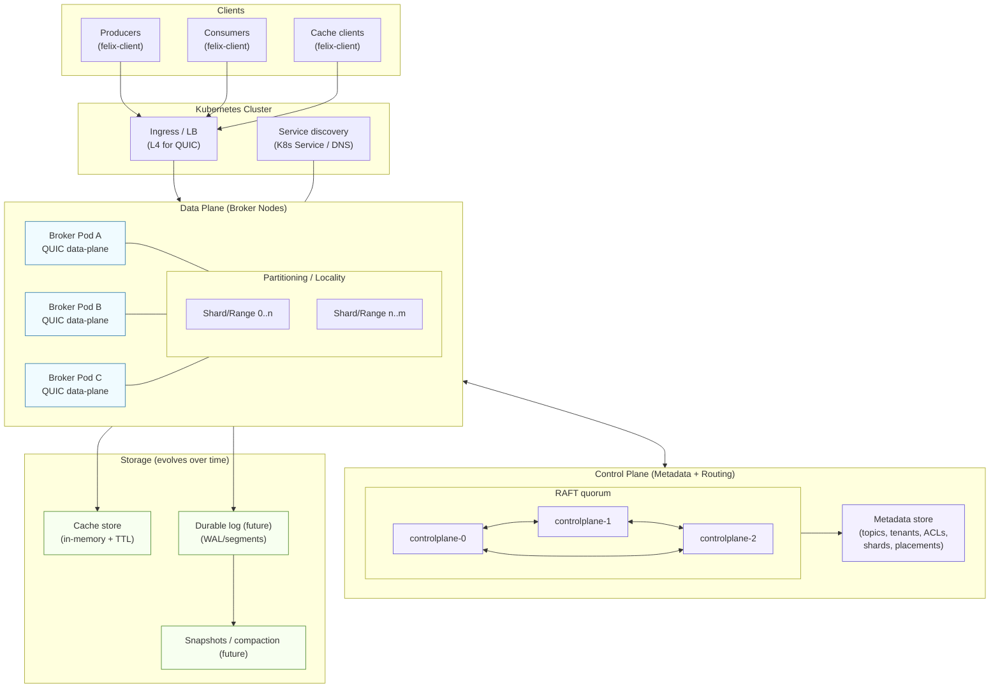
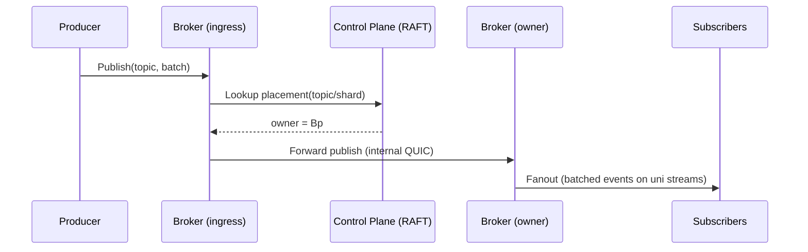

# Felix Architecture

Felix is a sovereign-first, low-latency distributed data backend designed to unify the roles of
event streaming, message-oriented middleware, and distributed caching. It is built for Kubernetes
from day one and optimized for real-time workloads where latency, isolation, and security matter
as much as throughput and durability.

Felix is **not** a Kafka clone. It deliberately optimizes for:
- Region and data sovereignty as a first-class concept
- Low tail latency (p99/p999), not just aggregate throughput
- Unified primitives (streams, queues, cache) over a single core log
- Explicit, auditable cross-region data movement
- Strong cryptographic boundaries, including optional end-to-end encryption

---

## Core Design Principles

### 1. Sovereignty by Default
Each Felix cluster represents a **single sovereign region**. Data is isolated by default and cannot
leave the region unless an explicit, configured bridge exists. This is enforced in routing, metadata,
and encryption boundaries — not left to deployment discipline.

### 2. One Core Log, Many Semantics
Internally, Felix is built around a single append-only log abstraction. Different external semantics
are projections over this core:
- **Streams (Pub/Sub):** fanout cursors per subscription
- **Queues:** shared consumer-group cursors with acknowledgements
- **Cache:** key → latest value with TTL, backed by the same log for invalidation and replay

This drastically reduces operational complexity and consistency bugs compared to running Kafka,
Redis, and a queueing system side-by-side.

### 3. Low-Latency First
Felix prioritizes predictable low latency over maximum batch throughput. Design choices reflect this:
- QUIC for transport (multiplexed, encrypted, congestion-aware)
- Optional non-persistent (ephemeral) streams with no disk on the hot path
- Aggressive backpressure and bounded memory everywhere
- Leader-based writes with tunable acknowledgement policies

### 4. Kubernetes-Native
Felix assumes Kubernetes for:
- Process lifecycle
- Identity (ServiceAccounts)
- Networking and service discovery
- Failure detection

Felix does **not** attempt to reimplement scheduling or node membership logic that Kubernetes
already provides.

---

## Major Components

### Broker (Data Plane)
The broker is responsible for:
- Accepting client connections
- Routing publish and subscribe requests
- Managing streams, shards, and cursors
- Enforcing backpressure and delivery semantics

Each broker hosts zero or more shard leaders and followers. Only leaders accept writes.

### Transport Layer
Felix uses QUIC as its sole transport:
- Encrypted by default
- Multiplexed streams per connection
- Built-in flow control
- Resistant to head-of-line blocking

The wire protocol is versioned and explicitly framed to allow forward compatibility.

### Storage Layer
Felix supports tiered storage:
- **Ephemeral:** in-memory ring buffers and TTL maps for ultra-low latency
- **Durable:** append-only WAL + segmented log on persistent volumes
- **Retention:** time-based and size-based policies per stream

Durable storage is optional and configurable per stream.

### Metadata & Control Plane
Metadata is strongly consistent and minimal by design. It stores:
- Stream definitions
- Shard counts and placement
- Retention and quota policies
- Region and bridge configuration

The control plane exposes administrative APIs but is not on the data path.

### Routing & Placement
Routing is region-aware and shard-aware. Clients are routed directly to shard leaders
to avoid unnecessary hops. Region boundaries are enforced at the routing layer.

---

## Consistency Model

Felix provides **tunable consistency**, configured per stream:
- Leader-only acknowledgements (low latency)
- Quorum acknowledgements (higher durability)
- Asynchronous or synchronous replication

Delivery guarantees:
- At-least-once (default)
- At-most-once (ephemeral streams)
- Exactly-once (future, via idempotent producers and transactions)

---

## Security Architecture

### Transport Security
- mTLS between brokers
- TLS for client connections
- All encryption uses modern, configurable cipher suites

### Data Encryption
- Envelope encryption per region and per tenant
- Optional end-to-end encryption (broker routes ciphertext only)
- Explicit key rotation and key IDs embedded in message metadata

### Authorization
- Tenant / namespace / stream-level RBAC
- Policy enforcement at publish and subscribe time
- Full audit logging for administrative and data-access actions

---

## Multi-Region and Bridges

Felix does not federate clusters implicitly.

Cross-region data movement requires:
- An explicit bridge definition
- Explicit allowlists of streams
- Independent encryption contexts
- Auditable replication behavior

This model is designed to satisfy strict data residency and regulatory requirements.

---

## Intended Use Cases

- Sovereign SaaS platforms (finance, healthcare, government)
- Real-time microservice backbones
- Cache + event unification to reduce system sprawl
- Edge-to-cloud data pipelines
- Regulated environments requiring strong auditability

---

## Non-Goals

Felix intentionally does **not** aim to:
- Replace the entire Kafka ecosystem
- Optimize for maximum historical batch throughput
- Support every possible protocol or client initially

Felix is opinionated by design.

---

## Planned Multinode Architecture

The current MVP is single-node. The intended multinode design adds explicit control-plane
coordination, shard placement, and a QUIC data plane that scales horizontally.

## Cross-Broker Delivery

If publishes can enter any broker and forward to the shard owner, the flow looks like:

## Status

This document reflects the **intended architecture**. Implementation will proceed incrementally,
starting with a single-node broker and expanding toward clustering, durability, and sovereignty
features over time.
