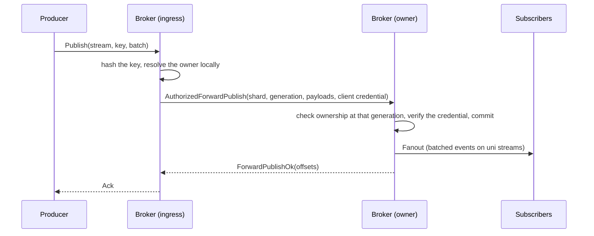

# Felix Architecture

Felix is a low-latency distributed data backend designed to unify the roles of
event streaming, message-oriented middleware, and distributed caching. It is built for Kubernetes
from day one and optimized for real-time workloads where latency, isolation, and security matter
as much as throughput and durability.

Felix is **not** a Kafka clone. It deliberately optimizes for:
- Low tail latency (p99/p999), not just aggregate throughput
- Unified primitives (streams, queues, cache) over a single core log
- Strong cryptographic boundaries, including optional end-to-end encryption (planned)

Region and data sovereignty as a first-class concept, with explicit, auditable
cross-region data movement, is a design goal for a later milestone — not
current behavior. Today a stream created with a `region` is placed only in
that region or one `FELIX_REGION_BRIDGES` bridges it to, and brokers forward
only across bridged regions; nothing more. See [Status](#status) and
[Multi-Region and Bridges](#multi-region-and-bridges) below; do not rely on
region isolation for compliance purposes until it ships.

---

## Core Design Principles

### 1. One Core Log, Many Semantics
Internally, Felix is built around a single append-only log abstraction. Different external semantics
are projections over this core:
- **Streams (Pub/Sub):** fanout cursors per subscription
- **Queues:** shared consumer-group cursors with acknowledgements. A group's
  position is itself a key → latest-value projection, the same one the cache
  is, so it reuses that machinery rather than adding a second store.

What each of the three stores, keeps in memory, and rebuilds from the log — and
the test behind every claim about them — is in
[`projections.md`](projections.md). Claims about a semantic belong there, where
`scripts/check_doc_evidence.py` checks that the tests cited still exist.
- **Cache:** key → latest value with TTL, written to the same log as records and read back through an index rebuilt from it. Compaction reclaims superseded and expired entries. Cache operations route across brokers like a stream's do: a key hashes to a shard, and a broker that does not own it forwards — see `docs/cache-on-log.md`

This drastically reduces operational complexity and consistency bugs compared to running Kafka,
Redis, and a queueing system side-by-side.

### 2. Low-Latency First
Felix prioritizes predictable low latency over maximum batch throughput. Design choices reflect this:
- QUIC for transport (multiplexed, encrypted, congestion-aware)
- Optional non-persistent (ephemeral) streams with no disk on the hot path
- Aggressive backpressure and bounded memory everywhere
- Leader-based writes with tunable acknowledgement policies

Every subscriber has its own bounded queue, so one that cannot keep up sheds
records rather than slowing anybody else down:

  

### 3. Kubernetes-Native
Felix assumes Kubernetes for:
- Process lifecycle
- Identity (ServiceAccounts)
- Networking and service discovery
- Failure detection

Felix does **not** attempt to reimplement scheduling or node membership logic that Kubernetes
already provides.

---

## Major Components

### Broker (Data Plane)
The broker is responsible for:
- Accepting client connections
- Routing publish and subscribe requests
- Managing streams, shards, and cursors
- Enforcing backpressure and delivery semantics

Each broker hosts zero or more shard leaders and followers. Only leaders accept writes.

### Transport Layer
Felix uses QUIC as its sole transport:
- Encrypted by default
- Multiplexed streams per connection
- Built-in flow control
- Resistant to head-of-line blocking

  

The wire protocol is versioned and explicitly framed to allow forward compatibility.

### Storage Layer
- **Ephemeral:** in-memory ring buffers and TTL maps for ultra-low latency
- **Durable:** a segmented, checksummed append-only log on persistent volumes,
  selected per stream by `durable: true`. See
  [Durable Storage](durable-storage.md).
- **Retention:** implemented per broker via `FELIX_DURABLE_RETENTION_BYTES` / `_SECONDS`, and off unless set. A *per-stream* policy is recorded and not yet read, so a stream's declared retention is not the one enforced. `truncate` exists for replication's
  benefit; nothing deletes segments on age or size.
- **Tiering:** not yet implemented. `TieredStore` is declared and unimplemented;
  tracked as [#172](https://github.com/gabloe/felix/issues/172).

Durable storage is optional and configurable per stream.

Note that this is a **log-structured store, not write-ahead logging**. In a WAL
system the log is a journal that protects a separate primary structure - a
B-tree, a memtable, heap pages - and is replayed into it after a crash, then
checkpointed away. Here the log *is* the primary structure: records are appended
to segments and read back from those same segments, and recovery validates and
truncates rather than replaying into anything. The two share most of their
mechanisms (sequential append, group commit, fsync policy, checksums, torn-tail
repair), which is why the techniques are borrowed freely from WAL
implementations, but the shapes are different.

### Metadata & Control Plane
Metadata is strongly consistent and minimal by design. It stores:
- Stream definitions
- Shard counts and placement
- Retention and quota policies
- Region and bridge configuration

The control plane exposes administrative APIs and is off the data path for
reads, for subscribes, and for `Leader` publishes. A **`Quorum`** publish is the
one exception, and it is deliberate — see "Routing & Placement" below.

### Routing & Placement
Routing is region-aware and shard-aware. Clients are routed directly to shard leaders
to avoid unnecessary hops. Region boundaries are enforced at the routing layer.

---

## Consistency Model

Felix provides **tunable consistency**, configured per stream:
- Leader-only acknowledgements (low latency)
- Quorum acknowledgements (higher durability)
- Asynchronous or synchronous replication

Delivery guarantees:
- At-least-once (default)
- At-most-once (ephemeral streams)
- Exactly-once (future, via idempotent producers and transactions)

---

## Security Architecture

### Transport Security
- TLS 1.3 for client connections, with no unencrypted mode — QUIC has none
- Broker-to-broker QUIC is mutually authenticated when
  `FELIX_INTERNAL_TLS_CERT`, `_KEY` and `_CA` are set: every peer connection is
  verified against that CA and the certificate's name is checked against the
  node id in both directions. Left unset, the internal listener accepts any
  certificate — encrypted, unauthenticated, and warned about at startup
- All encryption uses modern, configurable cipher suites

The rest of this section is the intended design, not what ships today. The
[status table](https://gabloe.github.io/felix/getting-started/what-felix-is-for/)
is per capability and is the page to trust when another disagrees.

### Data Encryption
- Envelope encryption per region and per tenant
- Optional end-to-end encryption (broker routes ciphertext only)
- Explicit key rotation and key IDs embedded in message metadata

### Authorization
- Tenant / namespace / stream-level RBAC
- Policy enforcement at publish and subscribe time
- Full audit logging for administrative and data-access actions

---

## Multi-Region and Bridges

Felix does not federate clusters implicitly.

Cross-region data movement requires:
- An explicit bridge definition
- Explicit allowlists of streams
- Independent encryption contexts
- Auditable replication behavior

This model is designed to satisfy strict data residency and regulatory requirements.

---

## Intended Use Cases

- Real-time microservice backbones
- Cache + event unification to reduce system sprawl
- Edge-to-cloud data pipelines
- Regionally-isolated SaaS platforms (finance, healthcare, government) — once region isolation ships; see [Multi-Region and Bridges](#multi-region-and-bridges)
- Regulated environments requiring strong auditability

---

## Non-Goals

Felix intentionally does **not** aim to:
- Replace the entire Kafka ecosystem
- Optimize for maximum historical batch throughput
- Support every possible protocol or client initially

Felix is opinionated by design.

---

## Cluster Architecture

Three properties carry most of the design.

**Any broker accepts any request.** A client connects to whichever broker it can
reach and asks it for the topology. If that broker does not lead the shard the
request belongs to, it forwards the request to the one that does and relays the
answer. The client never has to find the right broker first, and never talks to
two of them for a single request.

**Ownership comes from the control plane and nowhere else.** Every shard of every
stream and cache has exactly one leader, chosen by rendezvous hashing over the
live nodes. Brokers watch the assignment feed — a snapshot, then a change stream
— and never negotiate ownership among themselves.

**No consensus protocol runs between brokers.** Placement is a pure function of a
metadata snapshot, so two control-plane instances reading the same catalog reach
the same answer without having to agree on one. Durability across a leader change
comes from log shipping and leader leases instead; `replication-design.md` argues
that choice in full, including why per-shard Raft was rejected.

That rejection is about replicating *records*. Making the control plane's own
metadata highly available is a separate problem, and Raft is the decided
answer there — designed in
[`metadata-raft-design.md`](metadata-raft-design.md) and tracked as milestone
M13 under [#333](https://github.com/gabloe/felix/issues/333), and shipped:
`FELIX_CONTROLPLANE_STORAGE_BACKEND=raft` selects it and the instances hold
the metadata themselves, with no external database. Postgres remains fully
supported — any number of stateless instances over one HA database, whose
required properties are spelled out in [`ha-postgres.md`](ha-postgres.md).

Resolving an owner is an atomic load of a routing snapshot the broker already
holds — no lock and no network call, because it is the hottest question a broker
is asked. The snapshot is refreshed in the background.

**One path does reach the control plane, and it is not an oversight.** A
`Quorum` publish is released by the shard's quorum mark, and the leader sends
its replica report *before* moving that mark, awaiting the answer. Releasing the
publish first would leave a window where a leader has told a client its record
is on a majority while the control plane knows nothing about which replica holds
it — and a leader dying in that window is replaced by whichever replica scores
highest, which may be the one without the record. The acknowledgement would then
be a promise nothing could keep.

So a quorum acknowledgement costs a control-plane round trip, and a control
plane that cannot be reached stalls `Quorum` publishes rather than
acknowledging them on a report that never landed. `Leader` publishes,
subscribes and cache operations are untouched by this. Coalescing those round
trips across a sweep is #479.

## Cross-Broker Delivery

A publish entering a broker that does not lead the shard:

```mermaid
sequenceDiagram
  participant Client as Producer
  participant B0 as Broker (ingress)
  participant Bp as Broker (owner)
  participant S as Subscribers

  Client->>B0: Publish(stream, key, batch)
  B0->>B0: hash the key, resolve the owner locally
  B0->>Bp: AuthorizedForwardPublish(shard, generation, payloads, client credential)
  Bp->>Bp: check ownership at that generation, verify the credential, commit
  Bp->>S: Fanout (batched events on uni streams)
  Bp-->>B0: ForwardPublishOk(offsets)
  B0-->>Client: Ack
```

The control plane does not appear here, and that is the design. Resolving the
owner is an atomic load of a snapshot the broker already holds.

The `generation` travels with the request. The owner compares it against its own
and answers a mismatch explicitly in either direction, so a stale routing view
produces a typed answer rather than a write to a shard that has been reassigned.

A broker asked for a shard it does not own answers `NotLeader` — it never
forwards onward on the requester's behalf, because a chain of relays would have
unbounded latency and a failure mode nobody can reason about.

## Status

Clustering, replication, and cross-broker routing are implemented; see the status
table in `docs-site/src/content/docs/getting-started/what-felix-is-for.md`, which
is kept current per capability. Multi-region and the sovereignty features below
are design intent, not code.

---

## Demos and Example Workflows

Felix ships with runnable demo binaries under `demos/` that illustrate pub/sub,
cache, latency benchmarking, multi-tenant workflows, live RBAC mutation, and
cross-tenant isolation. These demos are self-contained and start an in-process
broker or full control-plane/broker stack on local ports.

See `docs/demos.md` and `demos/README.md` for details, run commands, and
expected output.
