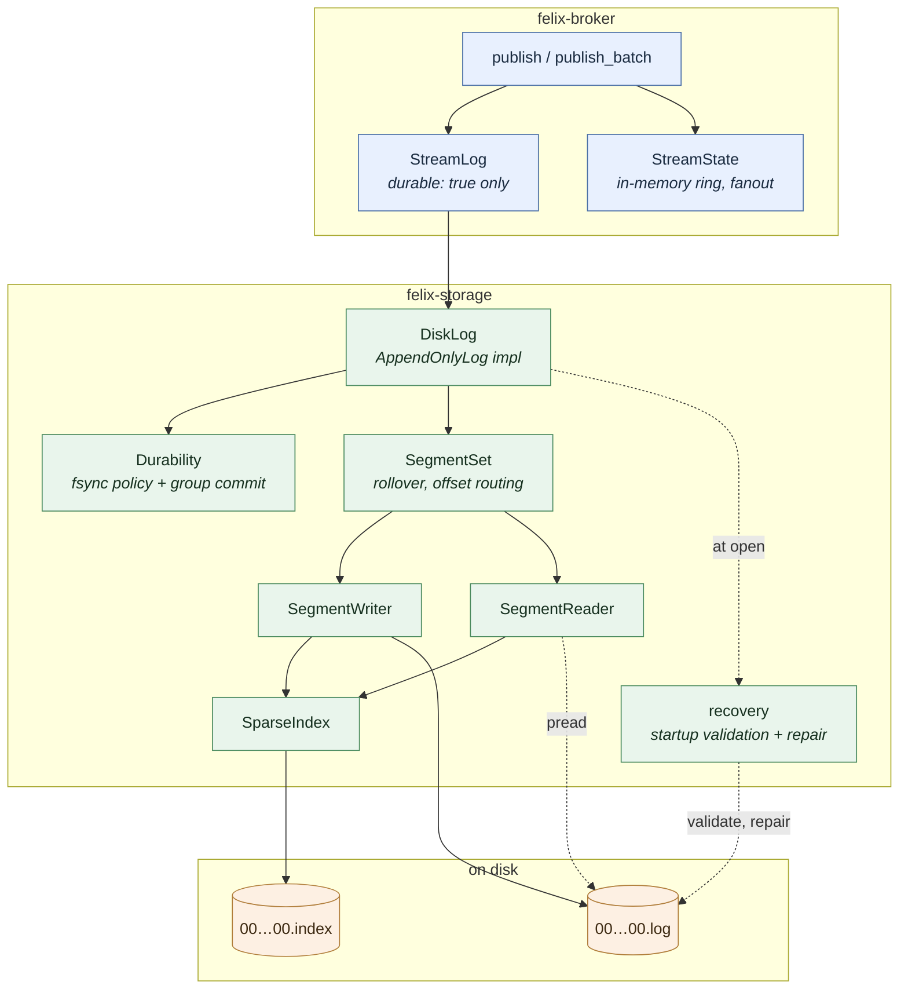
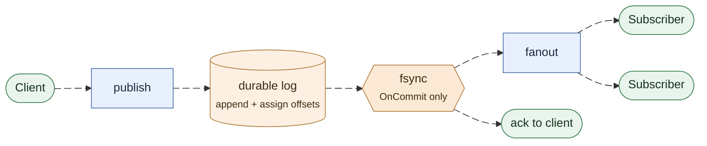
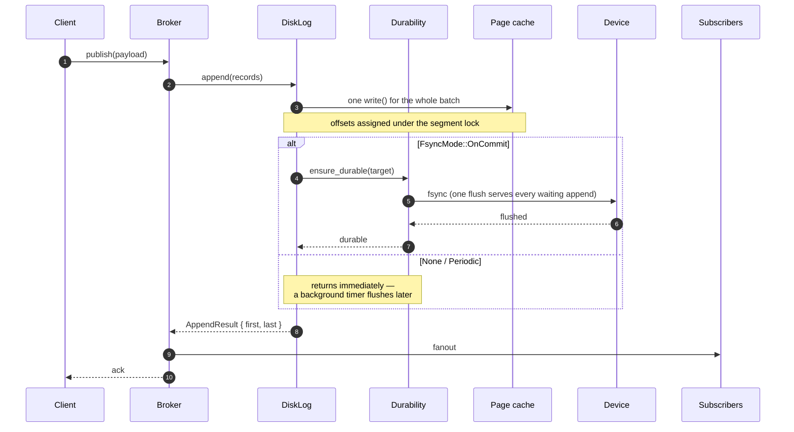
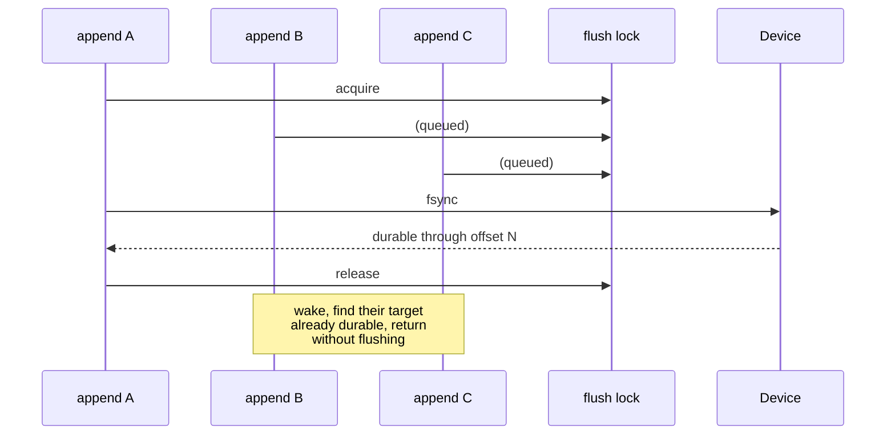
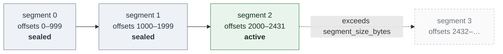
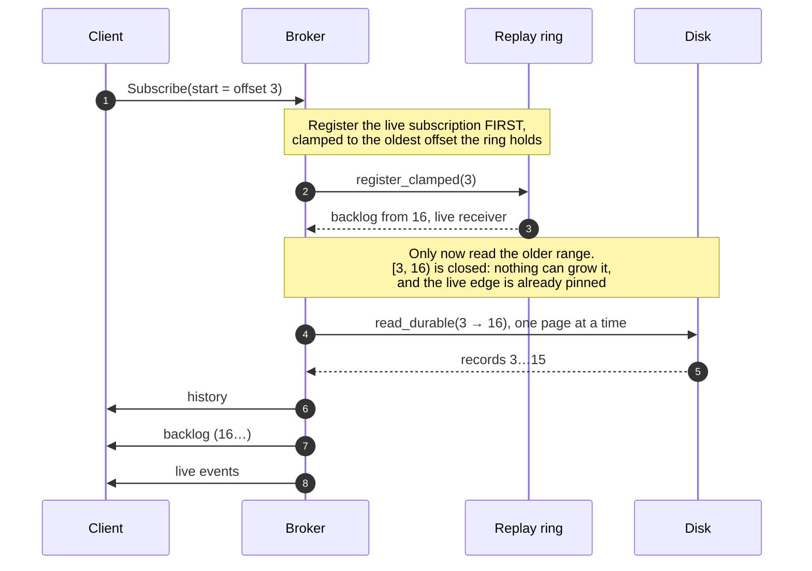
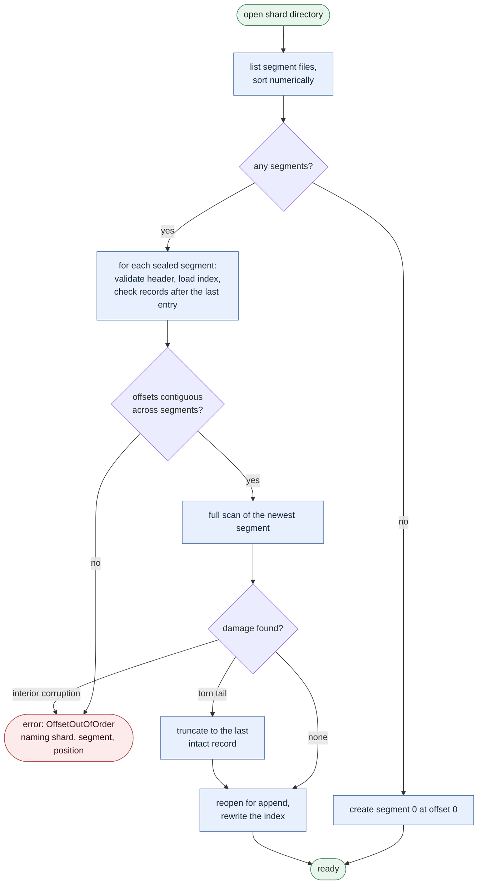

# Durable Storage

How a stream marked `durable: true` gets its records onto disk, keeps them there
across a crash, and reads them back.

Companion documents:

- [`storage-format.md`](storage-format.md) — the byte layout, versioning rules,
  and exactly which corruption recovery may repair.
- [`storage-performance.md`](storage-performance.md) — what durability costs,
  measured, and the regression budget.

## The guarantee

> A record that a durable publish acknowledged is readable after a restart,
> within the window the configured fsync policy allows.

Everything below exists to make that sentence true and to make its cost
explicit. The window is zero for `OnCommit`, one interval for `Periodic`, and
undefined for `None`.

## Layers



Each module owns one decision:

| Module | Owns |
| --- | --- |
| `segment/format` | the byte layout and every corruption verdict |
| `io` | positioned reads, preallocation, device flush |
| `segment/index` | the sparse index and how a seek position is chosen |
| `segment/writer` | appending to one file; nothing about rollover |
| `segment/scan` | validating scans, and whether damage is a repairable tail |
| `segment/reader` | bounded range reads |
| `disk_log/append` | the append path, and when it rolls a segment |
| `disk_log/segments` | rollover, which segment holds an offset, truncation |
| `disk_log/recovery` | startup discovery, validation, torn-tail repair |
| `disk_log/sync` | when a flush happens and who waits for it |
| `disk_log/layout` | `ShardKey` to a safe directory name |
| `broker/durable` | the ordering of append, fanout, and acknowledgement |

## The publish path



Nothing downstream of the log observes a record before it is durable: fanout
and the acknowledgement both hang off the flush, not off the append. Ordering
is the whole design, so the same path is worth spelling out step by step:



### One order, not three

Offsets are assigned under the segment lock, but the fsync wait happens after it
is released — so two concurrent publishes can resume from a shared group-commit
flush in either order. Left alone, the log on disk could read `A, B` while a
cursor replay and a live subscriber both saw `B, A`.

A per-stream commit sequencer closes that gap. After its durable append, each
publisher waits until every lower offset has been applied, then appends to the
replay ring and fans out before releasing the next in line. Disk order is the
single source of truth for cursor order and delivery order alike.

This deliberately does not serialise the durable append: offsets are still
assigned concurrently and flushes are still shared, so group commit keeps its
fan-in. Only the cheap post-flush half is ordered.

Releasing a turn wakes exactly the publisher whose turn it now is, not every
publisher parked behind it. The distinction only shows up under concurrency, and
then it dominates — waking all of them makes the work per commit grow with the
number in flight, so throughput falls as load rises. Measured at
[storage-performance.md](storage-performance.md#8-releasing-a-commit-turn-wakes-one-publisher-not-all-of-them).

The append happens **before** fanout and **before** the acknowledgement. The
alternative is unrecoverable: a record delivered to subscribers and acknowledged
to the publisher but lost in a crash is a silent hole in a log that consumers
believe they have read. Paying the append latency first turns a failed write into
a failed publish, which the publisher can retry.

A storage error therefore never produces a success acknowledgement, and it never
reaches a subscriber.

## Durability policies

| Mode | Flush trigger | Acknowledged when | Loss window |
| --- | --- | --- | --- |
| `None` | seal, shutdown | bytes reach the page cache | unbounded — whatever the OS decides |
| `Periodic { interval }` | background timer | bytes reach the page cache | one interval |
| `OnCommit` | the append itself | bytes reach the device | none |

`None` is not "no durability": the data survives a *process* crash, because the
page cache belongs to the kernel. It does not survive a machine crash or power
loss. That distinction is the reason it is a useful setting at all.

### Group commit

`OnCommit` would be unaffordable without it. An `fsync` flushes the whole file,
not one caller's bytes, so when N appends are in flight one flush can satisfy all
N:


The lock protocol behind that picture — who flushes, and what the others find
when they wake:



Measured on a Mac Studio (Apple M4 Max, APFS): 253 durable appends/second at
concurrency 1,
14,387 at concurrency 64 — a 57× gain from the same code path. The fan-in
actually achieved is reported as `felix_storage_sync_batch_appends`; a value near
1 under load means appends are serialising on the device instead of sharing a
flush.

This is the same mechanism behind PostgreSQL's `commit_delay` and the WAL
group-commit paths in MySQL and RocksDB.

### Where the flush runs

The winner does not run the `fsync` itself: it would block a reactor thread.
Each log has a flush thread of its own, started on its first flush and stopped
after 10 s without one, and the winner hands the sync to it over a channel and
awaits the answer. The thread only ever runs that log's flushes, so a flush
does not queue behind reads, rollovers or other shards the way it would on
Tokio's shared blocking pool. The job owns the file handles it syncs, so a
caller that gives up (a disconnected publisher) cannot close a file under a
sync in progress, and the sync still completes for whoever flushes next. If a
thread cannot be started, the flush falls back to the blocking pool.
[storage-performance.md](storage-performance.md#9-each-log-flushes-on-its-own-thread)
has the measurements.

## Segments and rollover

A shard's log is one *active* segment plus any number of sealed ones, and the
whole of its life — filling, sealing, rolling, and eventually being trimmed away
by retention — looks like this:

<p align="center">
  
</p>



Rules that recovery depends on:

- Offsets are contiguous **within** a segment and **across** the boundary. A gap
  is corruption, not a shrug.
- A batch is never split across segments. Rollover is decided before the write,
  from the projected size, so one append is always one `write` call.
- A record larger than `segment_size_bytes` gets a segment to itself rather than
  being split or rejected.
- Sealing syncs the data and index, then trims any preallocated tail so the file
  on disk is exactly its contents.

## Reads

A read seeks through the sparse index rather than scanning from the head:

<p align="center">
  
</p>

The entry only says where to start. The forward scan over real records is what
answers, which is why a stale or missing index costs a rebuild rather than a
wrong answer.


Cost is `O(log n)` over index entries plus at most one `index_spacing_bytes`
interval of sequential decoding.

Bounds that hold regardless of log size:

- `max_bytes` caps the payload bytes returned, across every segment the read
  touches — one budget for the whole call, not one per file.
- `max_records_per_read` caps the record count, because payload bytes alone do
  not bound a response made of empty records.
- At least one record is always returned when the range has data, so a record
  larger than the caller's budget is still readable.
- Reading at or past the tail returns an empty vector. Reading *below* the base
  offset returns `StorageError::Trimmed { requested, oldest }` — those offsets
  existed and are gone, which is a different fact from "nothing here yet".

## Resuming a subscription

Durability is only half of a resume: records surviving a restart is worthless if
a reconnecting client cannot say where it got to. A subscriber asks for a start
position — `latest`, `earliest`, or an exact offset — and delivered events carry
their offsets so the client has something to checkpoint. See
[the protocol](protocol.md#subscribe).

The hard part is not reading history. It is joining history to live delivery
without losing a record in between, and the ordering that achieves it is not the
obvious one.

<p align="center">
  
</p>



Registering first is what makes the disk range `[requested, backlog_start)`
**closed**: every record from `backlog_start` onward is already captured, either
in the returned backlog or on the subscription's receiver. Nothing can be
evicted out of the range while it is being read, and nothing published during
the read can fall between the two halves.

Reading history first and subscribing after is the version that looks natural
and loses records: a publish landing between the read and the registration
reaches neither.

Two consequences worth stating plainly:

- **History is paged, never collected.** The broker reads one bounded page at a
  time and writes it before reading the next, so a client resuming from the
  start of a large stream costs one page of memory rather than the whole
  history. A slow client turns into slower reading rather than unbounded
  buffering, because the client queues history with backpressure whatever its
  overflow policy: a record below `live_offset` waits for room, which stops it
  reading the stream, and QUIC flow control holds the broker's next write. Only
  live records past `live_offset` are subject to `drop_new`. A client that
  stops reading mid-replay therefore holds up to one stream receive window of
  its event connection until it resumes or closes the subscription.
- **A discarded offset is an error, not a silent skip.** Asking for an offset
  below what retention still holds returns `CursorTooOld` naming the oldest
  available offset. Quietly restarting at the tail — which is what a client got
  before resume existed — is the failure this exists to remove, so it is not the
  fallback.

## Recovery



Four properties:

1. **A provably incomplete tail is repaired.** A crash mid-append leaves a
   partial record at the end of the newest segment — one cut short by end of
   file, or claiming a length that could not fit. Nothing could have
   acknowledged a record that was never finished, so it is truncated away.

   A *complete* trailing record that fails its checksum is a different case and
   is **not** repaired by default. A torn write and bit rot on an already
   acknowledged record produce identical bytes, and under `OnCommit` that record
   may have been fsynced and acknowledged before rotting. Recovery refuses to
   guess: it fails to start, naming the segment and position.
   `repair_checksum_tail` opts in to truncating it, which is defensible under
   `FsyncMode::None` and is not under `OnCommit`.
   A **failed fsync poisons the segment writer**: no later sync or append on it
   can report durability. Linux may drop the dirty pages a failed writeback
   could not write, so the *next* fsync returns success having flushed nothing —
   "fsyncgate". Believing it would acknowledge records that are gone, which is
   the same silent loss the checksum rule above refuses to risk.

2. **Committed data is never silently discarded.** Corruption anywhere else is a
   startup error naming the shard, segment and byte position. Refusing to start
   is better than losing acknowledged records quietly.
3. **Recovery is idempotent.** Reopening an already recovered log changes
   nothing, so a crash *during* recovery is safe.
4. **Indexes are derived, never trusted.** A missing, short, or mismatched index
   is rebuilt from its segment, and a rebuilt index is byte-identical to one
   written during append.

Idempotent producers' state is derived the same way, before the log takes its
first append: each producer's place comes from the marks its records carry,
replayed from the `producers` snapshot saved at the last rollover. The marks
after the snapshot are in the active segment, which the full scan above has
already read, so a current snapshot adds nothing to startup. A missing or
stale one is replaced by reading the sealed segments' marks, which
`felix_storage_producer_state_rebuilt_total` counts. See
`docs/storage-format.md`, "`producers` — the producer snapshot".

### What is validated at startup

Fully checksumming every segment is `O(bytes on disk)` — minutes for a large
shard, which is the difference between a rolling restart and an outage. By
default:

- The **active** segment is always scanned in full. It is the only one that can
  have a torn tail, and it is bounded by `segment_size_bytes`.
- **Sealed** segments get their header validated, their index loaded, and the
  records after the last index entry checked — bounded by one index interval.
  Everything else is verified lazily, because every read verifies the checksum of
  every record it returns.

Set `verify_all_on_open` to trade startup time for eager detection of bit rot in
cold data.

## Configuration

Durability is opt-in. With `FELIX_DURABLE_STORAGE_DIR` unset the broker is
in-memory only, and a stream the control plane marks `durable: true` is **rejected
at registration** rather than silently downgraded to a guarantee the broker
cannot keep.

Durability is immutable while a stream is registered. Remove and recreate a
stream to change it between ephemeral and durable; this explicitly invalidates
old handles and prevents durable offsets from diverging from existing in-memory
cursors.

| Variable | Default | Meaning |
| --- | --- | --- |
| `FELIX_DURABLE_STORAGE_DIR` | unset | Root directory; setting it enables durable streams |
| `FELIX_DURABLE_FSYNC_MODE` | `periodic` | `none` \| `periodic` \| `on_commit` |
| `FELIX_DURABLE_FSYNC_INTERVAL_MS` | `250` | Interval for `periodic` |
| `FELIX_DURABLE_SEGMENT_BYTES` | `268435456` | Rollover size |
| `FELIX_DURABLE_INDEX_SPACING_BYTES` | `4096` | Sparse index interval |
| `FELIX_DURABLE_MAX_RECORDS_PER_READ` | `10000` | Record cap on one range read |
| `FELIX_DURABLE_PREALLOCATE` | `true` | Reserve segment blocks at creation |
| `FELIX_DURABLE_VERIFY_ALL_ON_OPEN` | `false` | Checksum every segment at startup |
| `FELIX_DURABLE_REPAIR_CHECKSUM_TAIL` | `false` | Truncate a complete trailing record that fails its checksum (see below) |
| `FELIX_STORAGE_IO_URING` | `0` | Submit device flushes to `io_uring` instead of the log's flush thread (Linux only) |

Invalid combinations fail at startup, not at the first publish.

`FELIX_STORAGE_IO_URING=1` replaces the hand-off to the log's flush thread
with `IORING_OP_FSYNC` (with `DATASYNC`, like the thread's `fdatasync`) on one
process-wide ring. It is Linux-only and default off: a kernel too old for the
opcode, or a container that forbids the syscall, falls back to the flush thread
rather than failing, because durability must not depend on an optimisation
being available. The kernel runs the sync on a worker thread of its own, so a
single log's flush is not faster this way; see
[storage-performance.md](storage-performance.md#9-each-log-flushes-on-its-own-thread).

```sh
FELIX_DURABLE_STORAGE_DIR=/var/lib/felix/streams \
FELIX_DURABLE_FSYNC_MODE=on_commit \
  cargo run --release -p felix-broker-service --bin felix-broker
```

## Observability

| Metric | Answers |
| --- | --- |
| `felix_storage_append_duration_seconds` | how long a durable publish takes end to end |
| `felix_storage_sync_duration_seconds` | how much of that is the device |
| `felix_storage_sync_batch_appends` | group-commit fan-in; near 1 under load means no batching |
| `felix_storage_unsynced_bytes` | data a crash would lose right now |
| `felix_storage_sync_failures_total` | non-zero means acknowledged durability is in doubt |
| `felix_storage_segment_roll_total` | rollover rate |
| `felix_storage_recovery_duration_seconds` | startup cost |
| `felix_storage_recovery_truncated_bytes` | bytes discarded from a torn tail |
| `felix_storage_producer_state_rebuilt_total` | opens or truncations that read sealed segments to rebuild idempotent producers' state, because the snapshot was missing or out of date |

The first two together answer the question that actually comes up: *is durability
the bottleneck?* If sync dominates append, the fsync policy is the cost.

## Tools

```sh
# Write, then verify what survived.
felix-log-tool write  --dir /var/lib/felix/streams/shard --records 100000 --fsync on_commit
felix-log-tool verify --dir /var/lib/felix/streams/shard --payload-bytes 128

# Measure one policy.
felix-log-tool bench  --dir /tmp/bench --records 20000 --concurrency 8 --fsync on_commit
```

The end-to-end demo — publish, crash, restart, recover — is:

```sh
cargo run --release -p felix-broker-service --bin durable-restart-demo
```

It verifies its own claims rather than narrating them, so a regression makes it
fail rather than print the wrong numbers.

## Testing

| Suite | Covers |
| --- | --- |
| `felix-storage` unit tests | format round-trips, golden vectors, rollover, index equivalence, every recovery verdict |
| `tests/crash_recovery.rs` | a real process `SIGKILL`ed mid-append, per fsync mode, including repeated crash cycles |
| `tests/format_fuzz.rs` | seeded mutation fuzzing: no panics, no unbounded allocation, no silent loss |
| `fuzz/` | libFuzzer targets exploring the same properties much further |
| `felix-broker/tests/durable_streams.rs` | ordering, restart, rejection without storage, durable vs non-durable isolation |

## Limits today

- **Retention is off unless configured.** `retention_bytes` and `retention_age`
  are both unset by default, so an existing deployment keeps growing without
  bound exactly as before. Setting either bounds the log: whole sealed segments
  are deleted from the head, `base_offset` rises, and offsets below it report
  `Trimmed` (storage) or `CursorTooOld` (broker) rather than a short read. See
  [Retention](#retention) below.
- **No tiered storage.** [`tiered.rs`](../crates/server/felix-storage/src/tiered.rs) is
  still trait scaffolding — `TieredStore`, `OffloadedSegment`, `ColdCacheConfig`
  and `RetentionPolicy` are declared, and nothing implements them. There is no
  hot/cold split, no offload, and no cold-tier read path; every read comes from
  local segments. See [Tiered storage](#tiered-storage-what-is-already-in-place)
  below for what the log already provides for it.

## Retention

A durable log grows until something deletes from it. Two bounds, both optional
and both off by default:

| setting | meaning |
| --- | --- |
| `retention_bytes` | delete oldest sealed segments once the log exceeds this size |
| `retention_age` | delete sealed segments whose newest record is older than this |
| `retention_check_interval` | how often the bounds are evaluated (default 60s) |

Four properties are worth knowing, because each rules out a class of surprise:

- **Whole segments, from the head only.** Records are never rewritten, which is
  what lets recovery keep trusting "valid bytes end at EOF". A partial segment is
  never trimmed.
- **The active segment is never deleted.** A log therefore retains at least the
  records written since its last roll, no matter how small the bound. Setting
  `retention_bytes` below `segment_size_bytes` does not empty the log; it just
  cannot be satisfied.
- **Age comes from the records, not the filesystem.** `timestamp_micros` on the
  newest record in a segment decides, so restoring or copying a directory does
  not reset the clock. The *newest* record is the one that counts, which is the
  conservative end — a segment survives until everything in it has expired.
- **It runs on its own timer, never on an append.** Retention is bulk file
  deletion; putting it on the publish path would trade a bounded disk for an
  unbounded p999.

What a reader sees after a trim is the point of the feature. `read_range` below
`base_offset` returns `StorageError::Trimmed { requested, oldest }`, which the
broker translates to `BrokerError::CursorTooOld`. That distinction — "those
records existed and are gone" versus "nothing here yet" — is what lets a
resuming subscriber tell a real gap from an empty tail. A trim landing
*mid-replay* surfaces the same way rather than silently ending the history
early. `earliest` means the oldest record still retained, so it keeps working on
a trimmed stream instead of becoming an error.

An operator can force a pass with `StreamLog::enforce_retention_now` instead of
waiting out the interval.

## Tiered storage: what is already in place

Tiering is not built. The log is shaped so that adding it means adding a tier
rather than reworking the log:

- **Sealed segments are immutable and self-describing.** Once sealed, a segment
  is fsynced, trimmed to exactly its contents, and never written again — so it is
  safe to copy to object storage while the log keeps running.
- **`AppendOnlyLog::seal` already returns the offload unit.** `SealedSegment {
  descriptor, checksum }` maps directly onto `OffloadedSegment`: the descriptor
  carries the offset and byte ranges, and the CRC-32 over the whole file is what
  makes a round trip through a remote tier verifiable.
- **Reads already route per segment.** `SegmentSet::read` walks segments in
  offset order and asks each one for its share of the range, under a single
  shared budget. A cold tier slots in as another source at that seam; nothing
  above it — `read_range`, the trimmed-offset error, the byte and record
  bounds — needs to change.
- **`StorageError::Trimmed` already distinguishes "gone" from "not yet".** A
  reader asking for an offset that has left local storage gets a distinct,
  actionable error rather than an empty range, which is exactly the signal a
  cold-tier fetch would hang off.

The open questions tiering still has to answer — when a segment becomes cold, how
much local cache to keep, and what a cold read costs in tail latency — are design
work, not refactoring. Tracked as
[#172](https://github.com/gabloe/felix/issues/172).
