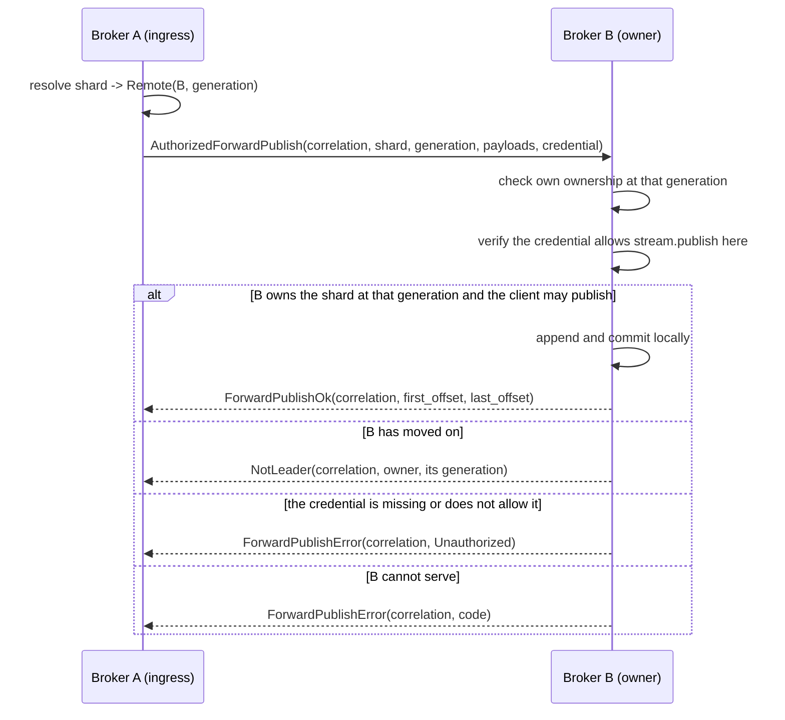
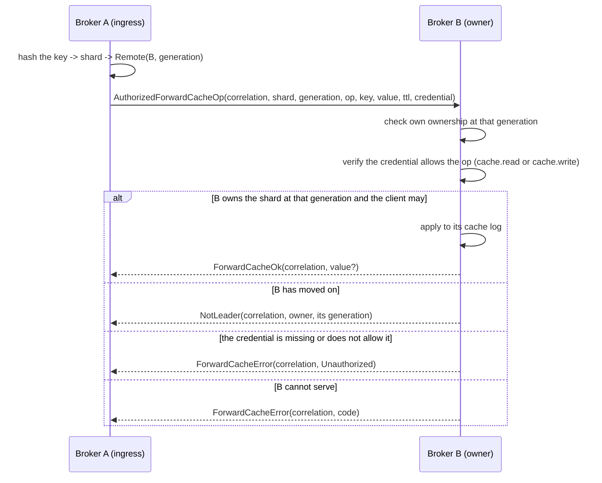
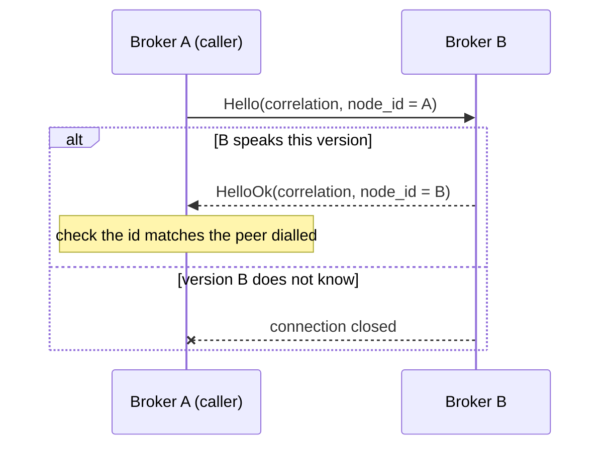

# Broker-internal forwarding protocol

The protocol brokers speak to each other. Separate from the client protocol in
`docs/protocol.md`, and deliberately not a superset of it.

## Why it is a separate protocol

A client frame and an internal frame must never be mistaken for one another. A
client that could send `ForwardPublish` could write to a shard on a broker that
never checked ownership; a broker that accepted client frames on its internal
listener would treat a peer as an authenticated publisher.

Three things keep them apart, and only the first is a wire concern:

1. **A distinct magic.** `FLXI` rather than `FLX1`, so a frame from one side
   fails to decode on the other rather than parsing into something plausible.
2. **A distinct listener.** Internal traffic arrives on the broker-internal QUIC
   role, never the client one. The two bind different ports, and startup refuses
   a configuration where they share one. Both internal endpoints negotiate the
   `felix-internal/1` ALPN and the client-facing role negotiates none, so a
   client pointed at the internal port has no protocol in common with it and TLS
   refuses the handshake — before a frame is read, and before any broker state
   is touched.
3. **A distinct credential.** Peer authentication is mTLS between brokers (M8.1).

The magic alone is not security — it is what makes a misdirected connection fail
loudly instead of quietly.

## Framing

```
+--------+---------+------+--------+---------+
| magic  | version | kind | length | body    |
| u32    | u16     | u16  | u32    | length  |
+--------+---------+------+--------+---------+
```

Big-endian throughout, matching the client protocol.

`kind` is a message discriminant, not a flag set. The client protocol uses flag
*bits* because they modify one payload layout; here each kind **is** a layout, and
an enum makes "unknown kind" a single unambiguous check.

**An unknown kind is refused, never interpreted.** Same reasoning as the client
protocol's unknown flag bits: the kind selects how to read the body, so ignoring
one means confidently misparsing it.

Refused, though, not fatal. The receiver reads the body — the frozen header says
how long it is — and answers `UnsupportedKind` against the correlation id, then
carries on with the next frame. That distinction is what makes *adding a kind*
an additive change: these streams are long-lived and multiplex every in-flight
request to a peer, so dropping one on an unrecognised frame would turn "the peer
is newer than me" into "every request in flight to that peer failed", and make
every protocol addition a cutover.

It rests on one invariant: **every body begins with its correlation id, and
nothing may be added before it.** Without that the refusal could not be matched
to the request that caused it, and closing the connection would be the only
option left. `every_body_begins_with_its_correlation_id` holds every kind to it.

A frame that is not *ours* is still fatal — a wrong magic, or a version this
build does not speak. There is nothing to step over, because the bytes are not
laid out the way the reader assumes, so its length field means nothing.

### Handshake

The first message on a connection is `Hello`, answered by `HelloOk`. Both carry
a node id.

It exists for *when* a mismatch is found, not for what is found. Every frame
already carries the version, so a mismatched peer would be rejected on its first
request either way — but that request would be a real forwarded publish, which
then has to be failed and retried. Doing it at connect makes the connection
unusable before anything is riding on it.

The node ids make one further check possible: the caller compares `HelloOk`
against the node id it dialled. An address the catalog has since reassigned
answers with a different id, which is a connection to the wrong broker whether
or not it would have served the request.

### Versioning

`version` is this protocol's own, independent of the client protocol's. A peer
speaking a version this broker does not know gets `ProtocolVersion` and the
connection closes; there is no partial understanding.

Additive evolution happens by adding kinds, not by bumping the version. A new
kind on an old peer is an unknown kind, which is already a typed error rather
than a misparse. The version exists for the case additive change cannot cover —
a change to the header or to an existing body layout.

## Correlation

Every request carries a `correlation_id`, unique per connection and chosen by the
requester. Every response echoes it.

**Every request has exactly one terminal response.** `ForwardPublish` is answered
by exactly one of `ForwardPublishOk`, `ForwardPublishError`, or `NotLeader`;
`ForwardCacheOp` by exactly one of `ForwardCacheOk`, `ForwardCacheError`, or
`NotLeader`. A requester that never receives one, because the connection
dropped, treats the request as failed — nothing is silently abandoned as
pending.

The two paths share `NotLeader`, which carries a routing answer rather than an
error, and share nothing else. A refusal is answered in the shape of the request
that caused it: a requester matches on the message kind to decide what happened,
so a cache operation refused with a publish's error type would read as a
protocol violation rather than as a refusal.

Correlation ids are per connection, so two connections may reuse a value.
Responses are matched within the connection they arrive on and nowhere else.

## Flows

### Forwarded publish



The `generation` field is what makes this safe. A forwarding broker names the
assignment generation it resolved against; the owner compares it with its own.

- **Equal** — both agree, and the publish proceeds.
- **Requester behind** — the shard moved. `NotLeader` carries the new owner, so
  the requester can retry against it rather than guess.
- **Requester ahead** — the *owner* is behind, and answers `StaleRoute`. It must
  not accept the write: it would be writing a shard it may no longer hold.

That asymmetry is the point. A generation mismatch in either direction is an
explicit typed answer, and **never a successful ownership claim**.

### Authorization across a forward

Ownership says the owner *may* write the shard. It says nothing about whether
the client behind the forward may, and the owner cannot tell an honest
forwarder from anything else that can reach its port. So a forward carries the
client's own bearer token, and the owner verifies it exactly as a direct
request is verified: against the tenant's keys, for `stream.publish` on that
stream (or `cache.read` / `cache.write` for a cache operation). A credential
that is missing, does not verify, or does not allow the action is refused
`Unauthorized` before anything is written. The owner's decision therefore
depends on the client's authority, not on the forwarder's honesty — which is
the property peer authentication alone cannot give.

The credential rides two kinds of its own, `AuthorizedForwardPublish` (22) and
`AuthorizedForwardCacheOp` (23): the legacy layouts are frozen, so the field is
appended on a new kind rather than added to the old one. A forwarder holding a
credential always sends the authorized kind — the credential decides the kind,
not a flag — and the legacy kinds, though still decodable, are refused by an
owner on this build for the same reason a missing credential is. An owner from
*before* these kinds answers them `UnsupportedKind`; the forwarder then sends
the legacy kind once, which is all that owner can read and which it checks no
differently, so a rolling upgrade keeps forwarding in that direction. See
[upgrades](../docs-site/src/content/docs/deployment/upgrades.md) for the
other direction.

An authorized frame relabelled as the legacy kind has trailing bytes and is
refused; a legacy frame relabelled as authorized has no credential to read and
is refused. A peer cannot pick the weaker check by rewriting the kind.

**The `shard` a forward names must be the shard the route was resolved for.**
The owner appends to the shard the message names, so the routing decision and
the batch have to agree: a record whose key resolved to shard 3, forwarded with
shard 0, is written to the wrong log. Nothing downstream detects it — the owner
legitimately owns shard 0 and the write succeeds — so a whole multi-shard
stream's keys can silently collapse onto one shard while the router dispatched
them correctly all along.

### Replicating a cache

A cache shard is a log, so it is replicated by the same exchange as a stream's:
`ReplicateCacheRecords` carries the same body as `ReplicateRecords`, and the
follower runs the same tail, gap, and divergence checks against it.

**The kind is in the message kind, not in the shard reference.** A cache and a
stream may share a name, and a follower that guessed wrong would append one's
records into the other's log. A separate kind rather than a new field, because
this protocol evolves by adding kinds: widening `ShardRef` is a change to an
existing body layout, which needs a version bump, and a version bump means an
upgraded broker cannot talk to one that has not restarted yet.

An old peer answers an unknown kind with `Malformed`, which is not retryable, so
a leader shipping to a peer that predates this stops and says so rather than
silently writing a cache's records somewhere they do not belong.

One property the cache brings that a stream does not: **compaction must not
renumber the log.** Records are shipped at their offsets, so a leader that
restarted numbering on compaction would make its offset 0 a different record
from every follower's. Cache compaction appends the live set at the tail for
that reason.

### Replicating group state

A stream shard carries two more logs beside its records: the positions its
consumer groups have reached, and the offsets those groups gave up on. Each is
shipped by the same exchange with a kind of its own —
`ReplicateGroupRecords`/`ReplicateGroupBootstrap` (kinds 16 and 17) for the
cursors, `ReplicateDeadLetterRecords`/`ReplicateDeadLetterBootstrap` (kinds 18
and 19) for the dead letters — same bodies, for the reason the cache pair
exists: the kind is the only thing stopping a follower from appending the
offsets a group abandoned into the cursor log that says where it resumes.

Both ride the shard's own replica set at the shard's generation, and neither
gates the records: no publish waits on group state, and group state lagging
never holds up the log it describes. What this buys is a promotion that keeps
the whole group, not half of it — the promoted leader resumes each group where
it had reached *and* can list and redrive what it had given up on.

A cache shard has the same shape of companion:
`ReplicateCounterRecords`/`ReplicateCounterBootstrap` (kinds 20 and 21) ship
its counter log on the cache's replica set, so a promoted replica folds the
true sum rather than restarting it. And the forwarded cache operation grew two
op kinds beside put/get/delete — `CounterAdd` (4) and `CounterGet` (5) — with
the delta and the sum riding the envelope's existing value bytes as eight
big-endian bytes, so the body layout is untouched and an old peer refuses the
op rather than misparsing it.

### Forwarded cache operation

A cache key hashes to a shard, and that shard has one owner. A broker that
receives an operation for a key it does not own hands it over rather than
serving it, which is what stops two brokers holding different values for one
key.



The same generation rules as a forwarded publish, and the same reason: a
mismatch in either direction is a typed answer, never a successful ownership
claim. The same credential check too — `Get` and `CounterGet` need
`cache.read`, everything else `cache.write` — for the reason given under
[Authorization across a forward](#authorization-across-a-forward).

`ForwardCacheOk` carries the value a `Get` found or a `Delete` removed, and
nothing for a `Put`. The value is length-prefixed **behind a presence byte**, so
a stored empty value stays distinguishable from a miss — the two mean different
things, and one encoding for both would make a cached empty value read as
absent forever.

A `Get` and a `Delete` are safe to re-send after an indeterminate answer,
because both land on the same state twice. A `Put` is not: re-sending one with a
TTL restarts its clock. So a lost answer to a write is reported as
indeterminate rather than retried, and the caller decides.

### Handshake



### Subscribe

A subscription for a shard this broker does not own is **redirected**, not
proxied. See [subscribe routing](subscribe-routing.md) for the decision and the
measurements behind it.

The primitive is `NotLeader`, which carries the owning node's id, its advertised
address, and its generation. It is the answer to a misrouted subscribe, and it
is also what ends a live subscription whose shard has moved.

No relay kinds are defined, because nothing relays. Should proxying ever be
added they are additive: an unknown kind is already a typed error rather than a
misparse, so it needs no version bump.

### Replication

A shard leader ships records it has committed to the followers in the shard's
replica set. `ReplicateRecords` carries the leader's epoch, the offset its first
payload belongs at, a checksum over the batch, and the payloads.

The offsets are the **leader's**. A follower stores a record at the leader's
offset or not at all, which is what makes the two logs comparable by offset —
the acknowledged mark, the catch-up range, and the caught-up test that gates
promotion all rest on it.

The follower cannot tell its log where to put a record; the log appends at its
own tail. So position is *verified* rather than commanded: the batch must begin
exactly at the follower's tail.

| The batch | Answer | What the leader does |
| --- | --- | --- |
| begins at the tail | `ReplicateOk` | send the next batch from `durable_offset` |
| begins past the tail | `LogGap`, with `expected_offset` | resume from `expected_offset` |
| lies entirely below the tail | `ReplicateOk` | nothing; it was already stored |
| straddles the tail | `ReplicateOk` | nothing; the new suffix was stored |
| disagrees on stored bytes | `LogConflict` | **stop** |
| fails its checksum | `Malformed` | resend the same records |
| names an older epoch | `FencedEpoch` | stop; this broker is no longer the leader |
| names a newer epoch than the follower knows | `StaleRoute` | retry shortly |

The middle two rows are what make a resend safe. Replication has to be able to
resend a batch whose acknowledgement was lost, and resending must not duplicate
a record: an overlap is resolved by position, and the overlapping bytes are
compared rather than assumed.

`ReplicateOk.durable_offset` is one past the last record the follower holds **on
disk**. It is both the acknowledgement and the offset to send next. It never
reports buffered data: a follower acknowledging before its own fsync would let
the leader believe a record had survived a failure it would not have survived,
and under `Quorum` that belief is the guarantee.

The batch checksum covers each payload's length as well as its bytes. Without
the length, a batch resplit in transit hashes the same as the original — and a
resplit batch is a different set of records, which is exactly the divergence the
checksum is there to catch. `felix_wire::internal::batch_checksum` is the single
definition, so the two sides cannot compute it differently.

`LogConflict` does not converge by *retrying* — the same batch meets the same
bytes. It can be repaired, and the follower does it without an exchange: a
conflict from a **newer** generation than the one this follower last accepted,
at or after where that older generation began, is a suffix a dead leader left
behind and no majority adopted. The follower truncates it and replication
resumes.

Both conditions matter. A leader disagreeing with *itself* is an inconsistency
rather than a predecessor's leftovers, and a divergence reaching further back
than the older generation's start is not that generation's to discard. Anything
else halts, as before, and is surfaced. See `docs/replication-design.md`,
"Divergence and truncation"; the invariant the storage layer actually needs is
narrower than "never rewritten", and stated there.

### Bootstrapping a follower

A follower can be positioned below everything the leader still holds — a new
replica of a stream with retention, or one that fell far enough behind. Shipping
cannot bridge that: the records in between are gone from the leader too.

`ReplicateBootstrap` carries the offset of the oldest record the leader still
has. It is the one fact a follower cannot work out for itself, and the fact it
needs before it may place a log that begins anywhere other than zero.

| The follower | Answer |
| --- | --- |
| holds no log for the shard | places it at `base_offset`, `ReplicateOk` |
| already holds a log starting there | `ReplicateOk`; the offer is idempotent |
| holds records starting elsewhere | `LogConflict` |

The last row is the point. A log placed over existing records would have a hole
between what the follower held and what it was given, and a log with a hole is
one nothing downstream can detect — from the follower's own view its offsets are
still contiguous. Discarding those records is not something a bootstrap may do,
so the leader halts that follower instead, and rebuilds it under its policy.

### Rebuilding a follower

`ReplicateRebuild` (kind 24) is the one message that discards records. It names
the shard, which of the shard's logs (`ReplicaLog`: stream, cache, group
cursors, dead letters, or counters), and the leader's oldest surviving offset.
A follower of that shard at that generation discards its copy of that log,
generation history included, and answers `ReplicateOk` with the offset it was
given, where its new copy begins. Shipping then resumes from there as if the
follower had been bootstrapped.

| The follower | Answer |
| --- | --- |
| follows the shard at that generation | discards the log, `ReplicateOk` at `base_offset` |
| knows a newer generation | `FencedEpoch` |
| is outside the replica set | `Unauthorized` |
| predates the kind | `UnsupportedKind`; it stays halted |

The fence matters more here than anywhere: a superseded leader telling a
follower to discard its copy is the most damage a stale leader could do. The
leader sends it only for a halt discarding would resolve (`diverged`,
`needs_bootstrap`), never when it is itself fenced, and only within the policy
in `docs/replication-design.md`, "Rebuilding a halted follower".

The same fence applies as to storing records: a superseded leader cannot place a
log, and a broker outside the replica set cannot be given a shard. Placing a log
and filling it are the same authority question, and a fence applied to one and
not the other is a fence with a way round it.

## Errors

Typed, because they need different responses:

| Code | Meaning | What the requester does |
| --- | --- | --- |
| `NotLeader` | the shard is owned elsewhere | retry against the named owner |
| version mismatch | the peer speaks a version this broker does not know | the connection closes; there is no frame to answer with, because a reply would carry the version the peer just rejected |
| `StaleRoute` | the *responder* is behind the requester's generation | retry shortly; the owner is catching up |
| `Unavailable` | the owner cannot serve right now, e.g. still opening | retry with backoff |
| `Unauthorized` | the peer is not permitted, or the credential a forward carries is missing or does not allow the write | do not retry |
| `Overload` | the owner is shedding load | retry with backoff |
| `ProtocolVersion` | version not understood | do not retry; close |
| `Malformed` | the body did not decode | do not retry; close |
| `StorageFailed` | the responder tried and its own disk failed | do not retry; nothing is wrong with the request |
| `LogGap` | a replication batch starts past the follower's tail | resume from `expected_offset` |
| `LogConflict` | a replication batch disagrees with stored bytes | do not retry; the logs have diverged |
| `FencedEpoch` | the sender named an epoch older than the responder's | do not retry; it is no longer the leader |
| `UnsupportedKind` | the responder predates the kind that was sent | do not retry with that kind; a forwarder falls back to the legacy forward kind once |

`ReplicateBootstrap` is kind 10 and `ReplicateRebuild` kind 24. A peer that
predates either rejects the kind rather than misreading the body, which is why
each is a new kind rather than a field on `ReplicateRecords`: this protocol
freezes existing body layouts.

`NotLeader` is a distinct kind rather than an error code, because it carries a
routing answer rather than only a reason.

## Acknowledging a forwarded publish

**The ingress broker never acknowledges before the owner has.** A forwarded
publish is acknowledged from the owner's answer and from nothing else.

This overrides `ack_on_commit`, the broker setting that otherwise decides
whether a publish is acknowledged on enqueue or after commit. That setting is a
statement about a *local* write — "accepted into this broker's ingress queue is
good enough" — and for a forward the ingress broker has accepted nothing: the
data is not on its disk, and the owner may still refuse it. So a forward always
takes the commit-ack path, whatever the setting says.

The owner's write is durable-then-answer, so `ForwardPublishOk` means the batch
is as safe on the owner as a local publish would have been on the ingress
broker.

## Retrying a forwarded publish

One question decides it: *could the owner already have applied this batch?* If it
could, a retry is a duplicate rather than a repair, and the ingress broker has no
way to tell the two apart.

| Outcome | Applied? | Retried |
| --- | --- | --- |
| Shed, backoff, unreachable | No — nothing was sent | Yes |
| `NotLeader` | No — the refusal is the evidence | Yes, against the owner it names |
| `StaleRoute`, `Unavailable`, `Overload` | No — refused before writing | Yes |
| `Unauthorized`, `Malformed`, `StorageFailed` | Refused, or tried and failed | No |
| Connection dropped, request timed out | **Unknown** | **No** |

The last row is the important one. The batch may be on the owner's disk, and no
answer is coming. The publish is reported as *indeterminate* rather than failed,
because "failed" is a claim the ingress broker cannot make.

**This is stricter than `AtLeastOnce` allows**, deliberately. A duplicate
produced inside the broker is invisible to the client, which holds the
`request_id` and is the only layer that could deduplicate. A client that wants
the retry can reissue and know that it did.

Retries are bounded by an attempt budget, so a shard being reassigned converges
or fails explicitly instead of chasing `NotLeader` around the cluster. A redirect
back to a `(broker, generation)` the batch has already been sent to is refused
rather than followed: that is a loop, and following it would bounce the batch
between two brokers that disagree.

A redirect to a broker *not* yet tried is followed even when the generation has
not advanced. On a freshly formed cluster every shard sits at generation 0, so a
requester whose routing snapshot has not converged points at the wrong owner
*there* — and the correct owner's redirect is also at generation 0. Refusing
every same-generation redirect made that transient misroute fatal instead of
self-correcting.

## Chains are refused, not relayed

A broker asked for a shard it does not own answers `NotLeader`. It never forwards
onward on the requester's behalf. One request crossing an unbounded chain of
brokers would have unbounded latency and a failure mode nobody can reason about;
the requester holds the decision instead. This applies to a forwarded cache
operation exactly as it does to a forwarded publish — both go through the same
ownership check for that reason.

## The transport

Peers reach each other over a QUIC endpoint of their own. What it guarantees,
and what it refuses:

**Connections are pooled and reused.** Repeated requests to one peer share a
connection; several multiplexed streams carry them, because a QUIC stream is
ordered and one large forwarded batch would otherwise hold up every smaller
request behind it.

**Every request terminates.** A connection that drops fails every request
waiting on it at that moment, rather than leaving each to reach its own timeout.
This is what makes the correlation rule above true in practice: a forwarded
publish is never left pending.

**An unhealthy peer cannot consume this broker.** Three bounds, each failing
differently:

| Bound | What crossing it means |
| --- | --- |
| In-flight requests per peer | Requests are shed immediately, not queued. Nothing was sent, so the caller may retry elsewhere at once |
| Reconnect backoff | A peer that refuses connections is redialled on a jittered exponential schedule, and requests arriving inside the window fail without a dial. Jitter matters because every broker notices the same peer restart at the same moment |
| Request timeout | A peer that accepts a request and never answers still releases its waiter |

**A dropped connection and a timeout are not retryable.** The peer may have
applied the write before the answer was lost, so retrying is a duplicate rather
than a repair. Only a shed request — where nothing was sent — is safe to retry
as-is.

Idle connections are closed: rebalancing changes which peers a broker forwards
to, and a connection to one it no longer talks to is a file descriptor and a
keepalive with nothing to do.

## Limits and validation

Every peer-provided field is validated before it is used to allocate:

- Declared payload counts are bounded by what the remaining bytes could hold,
  before any allocation, exactly as the client binary path does.
- String fields are length-prefixed and bounded, and must be valid UTF-8.
- The total body is bounded by the frame length, which is itself bounded.

Peer-provided does not mean trusted. A broker is authenticated, not assumed
correct: a compromised or buggy peer must fail decoding rather than be able to
allocate on demand.
