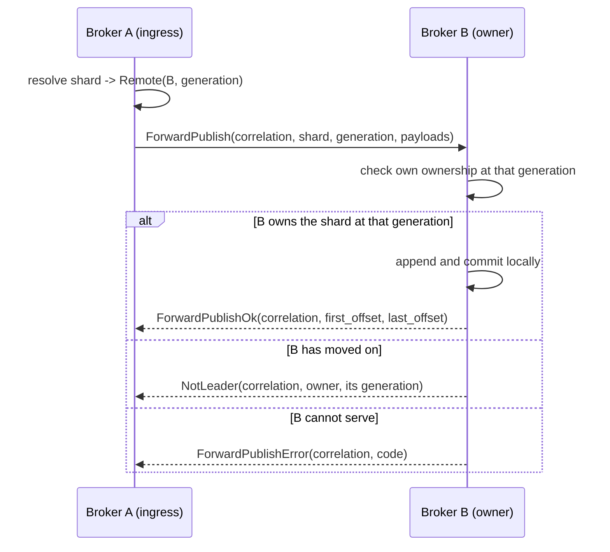
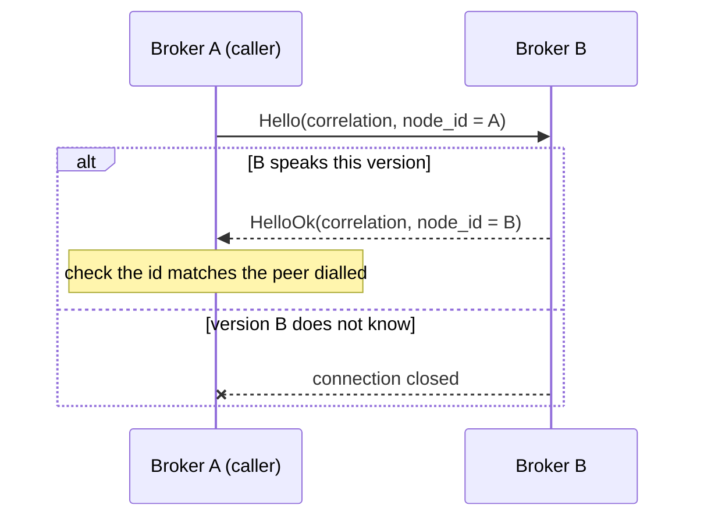

# Broker-internal forwarding protocol

The protocol brokers speak to each other. Separate from the client protocol in
`docs/protocol.md`, and deliberately not a superset of it.

## Why it is a separate protocol

A client frame and an internal frame must never be mistaken for one another. A
client that could send `ForwardPublish` could write to a shard on a broker that
never checked ownership; a broker that accepted client frames on its internal
listener would treat a peer as an authenticated publisher.

Three things keep them apart, and only the first is a wire concern:

1. **A distinct magic.** `FLXI` rather than `FLX1`, so a frame from one side
   fails to decode on the other rather than parsing into something plausible.
2. **A distinct listener.** Internal traffic arrives on the broker-internal QUIC
   role, never the client one. The two bind different ports, and startup refuses
   a configuration where they share one. Both internal endpoints negotiate the
   `felix-internal/1` ALPN and the client-facing role negotiates none, so a
   client pointed at the internal port has no protocol in common with it and TLS
   refuses the handshake — before a frame is read, and before any broker state
   is touched.
3. **A distinct credential.** Peer authentication is mTLS between brokers (M8.1).

The magic alone is not security — it is what makes a misdirected connection fail
loudly instead of quietly.

## Framing

```
+--------+---------+------+--------+---------+
| magic  | version | kind | length | body    |
| u32    | u16     | u16  | u32    | length  |
+--------+---------+------+--------+---------+
```

Big-endian throughout, matching the client protocol.

`kind` is a message discriminant, not a flag set. The client protocol uses flag
*bits* because they modify one payload layout; here each kind **is** a layout, and
an enum makes "unknown kind" a single unambiguous check.

**An unknown kind is rejected, never skipped.** Same reasoning as the client
protocol's unknown flag bits: the kind selects how to read the body, so ignoring
one means confidently misparsing it.

### Handshake

The first message on a connection is `Hello`, answered by `HelloOk`. Both carry
a node id.

It exists for *when* a mismatch is found, not for what is found. Every frame
already carries the version, so a mismatched peer would be rejected on its first
request either way — but that request would be a real forwarded publish, which
then has to be failed and retried. Doing it at connect makes the connection
unusable before anything is riding on it.

The node ids make one further check possible: the caller compares `HelloOk`
against the node id it dialled. An address the catalog has since reassigned
answers with a different id, which is a connection to the wrong broker whether
or not it would have served the request.

### Versioning

`version` is this protocol's own, independent of the client protocol's. A peer
speaking a version this broker does not know gets `ProtocolVersion` and the
connection closes; there is no partial understanding.

Additive evolution happens by adding kinds, not by bumping the version. A new
kind on an old peer is an unknown kind, which is already a typed error rather
than a misparse. The version exists for the case additive change cannot cover —
a change to the header or to an existing body layout.

## Correlation

Every request carries a `correlation_id`, unique per connection and chosen by the
requester. Every response echoes it.

**Every request has exactly one terminal response.** `ForwardPublish` is answered
by exactly one of `ForwardPublishOk`, `ForwardPublishError`, or `NotLeader`. A
requester that never receives one, because the connection dropped, treats the
publish as failed — no forwarded publish is silently abandoned as pending.

Correlation ids are per connection, so two connections may reuse a value.
Responses are matched within the connection they arrive on and nowhere else.

## Flows

### Forwarded publish



The `generation` field is what makes this safe. A forwarding broker names the
assignment generation it resolved against; the owner compares it with its own.

- **Equal** — both agree, and the publish proceeds.
- **Requester behind** — the shard moved. `NotLeader` carries the new owner, so
  the requester can retry against it rather than guess.
- **Requester ahead** — the *owner* is behind, and answers `StaleRoute`. It must
  not accept the write: it would be writing a shard it may no longer hold.

That asymmetry is the point. A generation mismatch in either direction is an
explicit typed answer, and **never a successful ownership claim**.

### Handshake



### Subscribe

A subscription for a shard this broker does not own is **redirected**, not
proxied. See [subscribe routing](subscribe-routing.md) for the decision and the
measurements behind it.

The primitive is `NotLeader`, which carries the owning node's id, its advertised
address, and its generation. It is the answer to a misrouted subscribe, and it
is also what ends a live subscription whose shard has moved.

No relay kinds are defined, because nothing relays. Should proxying ever be
added they are additive: an unknown kind is already a typed error rather than a
misparse, so it needs no version bump.

### Replication

A shard leader ships records it has committed to the followers in the shard's
replica set. `ReplicateRecords` carries the leader's epoch, the offset its first
payload belongs at, a checksum over the batch, and the payloads.

The offsets are the **leader's**. A follower stores a record at the leader's
offset or not at all, which is what makes the two logs comparable by offset —
the acknowledged mark, the catch-up range, and the caught-up test that gates
promotion all rest on it.

The follower cannot tell its log where to put a record; the log appends at its
own tail. So position is *verified* rather than commanded: the batch must begin
exactly at the follower's tail.

| The batch | Answer | What the leader does |
| --- | --- | --- |
| begins at the tail | `ReplicateOk` | send the next batch from `durable_offset` |
| begins past the tail | `LogGap`, with `expected_offset` | resume from `expected_offset` |
| lies entirely below the tail | `ReplicateOk` | nothing; it was already stored |
| straddles the tail | `ReplicateOk` | nothing; the new suffix was stored |
| disagrees on stored bytes | `LogConflict` | **stop** |
| fails its checksum | `Malformed` | resend the same records |
| names an older epoch | `FencedEpoch` | stop; this broker is no longer the leader |
| names a newer epoch than the follower knows | `StaleRoute` | retry shortly |

The middle two rows are what make a resend safe. Replication has to be able to
resend a batch whose acknowledgement was lost, and resending must not duplicate
a record: an overlap is resolved by position, and the overlapping bytes are
compared rather than assumed.

`ReplicateOk.durable_offset` is one past the last record the follower holds **on
disk**. It is both the acknowledgement and the offset to send next. It never
reports buffered data: a follower acknowledging before its own fsync would let
the leader believe a record had survived a failure it would not have survived,
and under `Quorum` that belief is the guarantee.

The batch checksum covers each payload's length as well as its bytes. Without
the length, a batch resplit in transit hashes the same as the original — and a
resplit batch is a different set of records, which is exactly the divergence the
checksum is there to catch. `felix_wire::internal::batch_checksum` is the single
definition, so the two sides cannot compute it differently.

`LogConflict` has no repair. Records are never rewritten, so two logs that
disagree at an offset do not converge by retrying; progress stops and the
condition is surfaced.

## Errors

Typed, because they need different responses:

| Code | Meaning | What the requester does |
| --- | --- | --- |
| `NotLeader` | the shard is owned elsewhere | retry against the named owner |
| version mismatch | the peer speaks a version this broker does not know | the connection closes; there is no frame to answer with, because a reply would carry the version the peer just rejected |
| `StaleRoute` | the *responder* is behind the requester's generation | retry shortly; the owner is catching up |
| `Unavailable` | the owner cannot serve right now, e.g. still opening | retry with backoff |
| `Unauthorized` | the peer is not permitted | do not retry |
| `Overload` | the owner is shedding load | retry with backoff |
| `ProtocolVersion` | version not understood | do not retry; close |
| `Malformed` | the body did not decode | do not retry; close |
| `StorageFailed` | the responder tried and its own disk failed | do not retry; nothing is wrong with the request |
| `LogGap` | a replication batch starts past the follower's tail | resume from `expected_offset` |
| `LogConflict` | a replication batch disagrees with stored bytes | do not retry; the logs have diverged |
| `FencedEpoch` | the sender named an epoch older than the responder's | do not retry; it is no longer the leader |

`NotLeader` is a distinct kind rather than an error code, because it carries a
routing answer rather than only a reason.

## Acknowledging a forwarded publish

**The ingress broker never acknowledges before the owner has.** A forwarded
publish is acknowledged from the owner's answer and from nothing else.

This overrides `ack_on_commit`, the broker setting that otherwise decides
whether a publish is acknowledged on enqueue or after commit. That setting is a
statement about a *local* write — "accepted into this broker's ingress queue is
good enough" — and for a forward the ingress broker has accepted nothing: the
data is not on its disk, and the owner may still refuse it. So a forward always
takes the commit-ack path, whatever the setting says.

The owner's write is durable-then-answer, so `ForwardPublishOk` means the batch
is as safe on the owner as a local publish would have been on the ingress
broker.

## Retrying a forwarded publish

One question decides it: *could the owner already have applied this batch?* If it
could, a retry is a duplicate rather than a repair, and the ingress broker has no
way to tell the two apart.

| Outcome | Applied? | Retried |
| --- | --- | --- |
| Shed, backoff, unreachable | No — nothing was sent | Yes |
| `NotLeader` | No — the refusal is the evidence | Yes, against the owner it names |
| `StaleRoute`, `Unavailable`, `Overload` | No — refused before writing | Yes |
| `Unauthorized`, `Malformed`, `StorageFailed` | Refused, or tried and failed | No |
| Connection dropped, request timed out | **Unknown** | **No** |

The last row is the important one. The batch may be on the owner's disk, and no
answer is coming. The publish is reported as *indeterminate* rather than failed,
because "failed" is a claim the ingress broker cannot make.

**This is stricter than `AtLeastOnce` allows**, deliberately. A duplicate
produced inside the broker is invisible to the client, which holds the
`request_id` and is the only layer that could deduplicate. A client that wants
the retry can reissue and know that it did.

Retries are bounded by an attempt budget, so a shard being reassigned converges
or fails explicitly instead of chasing `NotLeader` around the cluster. A redirect
that does not advance the generation is refused rather than followed: it would
send the batch back where it came from.

## Chains are refused, not relayed

A broker asked for a shard it does not own answers `NotLeader`. It never forwards
onward on the requester's behalf. One publish crossing an unbounded chain of
brokers would have unbounded latency and a failure mode nobody can reason about;
the requester holds the decision instead.

## The transport

Peers reach each other over a QUIC endpoint of their own. What it guarantees,
and what it refuses:

**Connections are pooled and reused.** Repeated requests to one peer share a
connection; several multiplexed streams carry them, because a QUIC stream is
ordered and one large forwarded batch would otherwise hold up every smaller
request behind it.

**Every request terminates.** A connection that drops fails every request
waiting on it at that moment, rather than leaving each to reach its own timeout.
This is what makes the correlation rule above true in practice: a forwarded
publish is never left pending.

**An unhealthy peer cannot consume this broker.** Three bounds, each failing
differently:

| Bound | What crossing it means |
| --- | --- |
| In-flight requests per peer | Requests are shed immediately, not queued. Nothing was sent, so the caller may retry elsewhere at once |
| Reconnect backoff | A peer that refuses connections is redialled on a jittered exponential schedule, and requests arriving inside the window fail without a dial. Jitter matters because every broker notices the same peer restart at the same moment |
| Request timeout | A peer that accepts a request and never answers still releases its waiter |

**A dropped connection and a timeout are not retryable.** The peer may have
applied the write before the answer was lost, so retrying is a duplicate rather
than a repair. Only a shed request — where nothing was sent — is safe to retry
as-is.

Idle connections are closed: rebalancing changes which peers a broker forwards
to, and a connection to one it no longer talks to is a file descriptor and a
keepalive with nothing to do.

## Limits and validation

Every peer-provided field is validated before it is used to allocate:

- Declared payload counts are bounded by what the remaining bytes could hold,
  before any allocation, exactly as the client binary path does.
- String fields are length-prefixed and bounded, and must be valid UTF-8.
- The total body is bounded by the frame length, which is itself bounded.

Peer-provided does not mean trusted. A broker is authenticated, not assumed
correct: a compromised or buggy peer must fail decoding rather than be able to
allocate on demand.
