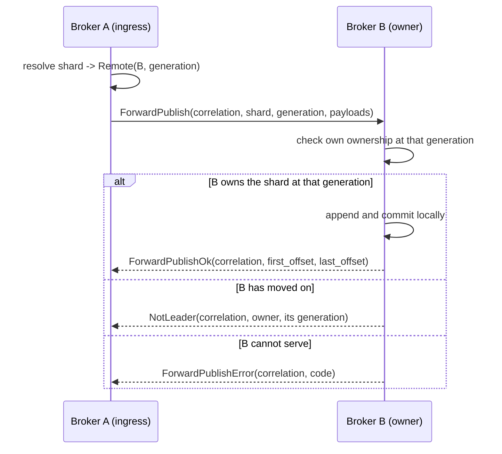

# Broker-internal forwarding protocol

The protocol brokers speak to each other. Separate from the client protocol in
`docs/protocol.md`, and deliberately not a superset of it.

## Why it is a separate protocol

A client frame and an internal frame must never be mistaken for one another. A
client that could send `ForwardPublish` could write to a shard on a broker that
never checked ownership; a broker that accepted client frames on its internal
listener would treat a peer as an authenticated publisher.

Three things keep them apart, and only the first is a wire concern:

1. **A distinct magic.** `FLXI` rather than `FLX1`, so a frame from one side
   fails to decode on the other rather than parsing into something plausible.
2. **A distinct listener.** Internal traffic arrives on the broker-internal QUIC
   role, never the client one (M4.2).
3. **A distinct credential.** Peer authentication is mTLS between brokers (M8.1).

The magic alone is not security — it is what makes a misdirected connection fail
loudly instead of quietly.

## Framing

```
+--------+---------+------+--------+---------+
| magic  | version | kind | length | body    |
| u32    | u16     | u16  | u32    | length  |
+--------+---------+------+--------+---------+
```

Big-endian throughout, matching the client protocol.

`kind` is a message discriminant, not a flag set. The client protocol uses flag
*bits* because they modify one payload layout; here each kind **is** a layout, and
an enum makes "unknown kind" a single unambiguous check.

**An unknown kind is rejected, never skipped.** Same reasoning as the client
protocol's unknown flag bits: the kind selects how to read the body, so ignoring
one means confidently misparsing it.

### Versioning

`version` is this protocol's own, independent of the client protocol's. A peer
speaking a version this broker does not know gets `ProtocolVersion` and the
connection closes; there is no partial understanding.

Additive evolution happens by adding kinds, not by bumping the version. A new
kind on an old peer is an unknown kind, which is already a typed error rather
than a misparse. The version exists for the case additive change cannot cover —
a change to the header or to an existing body layout.

## Correlation

Every request carries a `correlation_id`, unique per connection and chosen by the
requester. Every response echoes it.

**Every request has exactly one terminal response.** `ForwardPublish` is answered
by exactly one of `ForwardPublishOk`, `ForwardPublishError`, or `NotLeader`. A
requester that never receives one, because the connection dropped, treats the
publish as failed — no forwarded publish is silently abandoned as pending.

Correlation ids are per connection, so two connections may reuse a value.
Responses are matched within the connection they arrive on and nowhere else.

## Flows

### Forwarded publish



The `generation` field is what makes this safe. A forwarding broker names the
assignment generation it resolved against; the owner compares it with its own.

- **Equal** — both agree, and the publish proceeds.
- **Requester behind** — the shard moved. `NotLeader` carries the new owner, so
  the requester can retry against it rather than guess.
- **Requester ahead** — the *owner* is behind, and answers `StaleRoute`. It must
  not accept the write: it would be writing a shard it may no longer hold.

That asymmetry is the point. A generation mismatch in either direction is an
explicit typed answer, and **never a successful ownership claim**.

### Subscribe

A subscription for a shard this broker does not own is **redirected**, not
proxied. See [subscribe routing](subscribe-routing.md) for the decision and the
measurements behind it.

The primitive is `NotLeader`, which carries the owning node's id, its advertised
address, and its generation. It is the answer to a misrouted subscribe, and it
is also what ends a live subscription whose shard has moved.

No relay kinds are defined, because nothing relays. Should proxying ever be
added they are additive: an unknown kind is already a typed error rather than a
misparse, so it needs no version bump.

## Errors

Typed, because they need different responses:

| Code | Meaning | What the requester does |
| --- | --- | --- |
| `NotLeader` | the shard is owned elsewhere | retry against the named owner |
| `StaleRoute` | the *responder* is behind the requester's generation | retry shortly; the owner is catching up |
| `Unavailable` | the owner cannot serve right now, e.g. still opening | retry with backoff |
| `Unauthorized` | the peer is not permitted | do not retry |
| `Overload` | the owner is shedding load | retry with backoff |
| `ProtocolVersion` | version not understood | do not retry; close |
| `Malformed` | the body did not decode | do not retry; close |

`NotLeader` is a distinct kind rather than an error code, because it carries a
routing answer rather than only a reason.

## Limits and validation

Every peer-provided field is validated before it is used to allocate:

- Declared payload counts are bounded by what the remaining bytes could hold,
  before any allocation, exactly as the client binary path does.
- String fields are length-prefixed and bounded, and must be valid UTF-8.
- The total body is bounded by the frame length, which is itself bounded.

Peer-provided does not mean trusted. A broker is authenticated, not assumed
correct: a compromised or buggy peer must fail decoding rather than be able to
allocate on demand.
