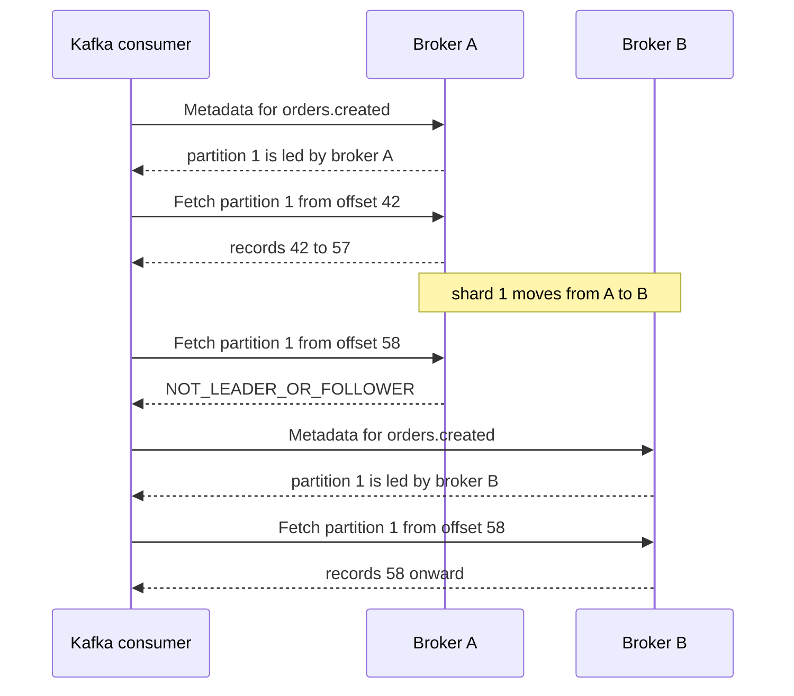

# Kafka wire compatibility (read-only)

A Felix broker can serve Kafka consumers. With `FELIX_KAFKA_LISTEN` set, the
broker opens a second listener that speaks enough of the Kafka protocol for a
consumer to list topics, look up offsets and fetch records from durable streams.
It does not accept writes and it has no consumer groups. A consumer that assigns
its own partitions and keeps its own offsets works; anything built on
`group.id` and `subscribe()` does not.

The user-facing guide, with quick start, use cases and troubleshooting, is
[Reading with Kafka clients](https://gabloe.github.io/felix/features/kafka/).
This page is the reference: what is implemented, how Felix maps onto Kafka's
model, and why it stops where it does.

The protocol code is in `crates/server/felix-kafka`; the broker wires it up in
`services/felix-broker-service/src/serving/kafka.rs`.

## What works

| API | Versions | Notes |
|---|---|---|
| `ApiVersions` | 0-3 | A request for a newer version gets `UNSUPPORTED_VERSION` in the v0 shape, as KIP-511 requires, so the client retries at one this listener speaks. |
| `SaslHandshake` | 0-1 | v1 works. v0 is listed only because librdkafka will not use SASL without it; a v0 handshake is refused, since its exchange travels outside Kafka framing. |
| `SaslAuthenticate` | 0-2 | SASL/PLAIN. |
| `Metadata` | 0-12 | Topics, partitions, and each partition's leader. |
| `ListOffsets` | 1-7 | Earliest, latest, v7's max-timestamp, and offset-for-time. |
| `Fetch` | 4-12 | Long-polls, woken by the append rather than a timer. |
| `Produce` | 3-8 | Offered and always refused. See [Produce](#produce). |
| `FindCoordinator` | 0-4 | Offered and always refused. See [Consumer groups](#consumer-groups-are-refused). |

`Produce` has to be offered even though it is refused: librdkafka only fetches
v2 record batches (Fetch v4 and later) from a broker that lists Produce v3.
Fetch v13 and later address topics by id, and Felix streams have names, not ids,
so those versions are not offered.

Tested with kcat 1.7.1 (librdkafka 1.8.2) in
`services/felix-broker-service/tests/kafka_kcat.rs`: listing, consuming every
partition from the beginning and from an offset, offset queries, a fetch woken
by a publish, SASL_SSL and anonymous access, a bad token, a group consumer and a
producer. A three-broker cluster test in
`crates/testing/felix-cluster/tests/routing/kafka_leaders.rs` consumes every
partition of a topic whose shards are led by different brokers, and follows a
shard move.

> `kcat_consumes_every_partition_from_the_beginning_and_from_an_offset`,
> `kcat_receives_a_record_published_while_its_fetch_waits`,
> `kcat_reads_over_sasl_ssl_and_anonymously_when_allowed`,
> `kcat_joining_a_group_exits_with_a_readable_error`,
> `kcat_producing_is_refused_with_a_reason`.

## What does not work

- Consumer groups: `group.id` with `subscribe()`, committed offsets, and
  everything built on them. That rules out Kafka Connect, Kafka Streams, ksqlDB,
  Debezium and MirrorMaker.
- Producing. Every `Produce` is refused.
- In-memory streams. Only durable streams are listed.
- Fetch sessions (KIP-227). The listener answers with session id 0, which tells
  the client to send full fetches every time.
- Leader epochs. Reported as -1, meaning unknown.
- Keys and headers. A record has a value and a timestamp only.
- OAUTHBEARER and re-authentication. A token is checked once, when the
  connection authenticates.
- Topic ids (Fetch v13 and later).

## The mapping

**Topics.** A topic is `<namespace>.<stream>`, split on the first dot, so
`orders.created` is stream `created` in namespace `orders`. The tenant never
appears in the topic; it comes from the credential. With
`FELIX_KAFKA_DEFAULT_NAMESPACE` set, a topic with no dot is looked up in that
namespace.

A stream is listed only if it is durable. Kafka consumers address records by
offset and expect them to still be there later; an in-memory stream keeps only a
bounded replay window, so offsets would point at records that are gone. A few
durable streams are also left out because their name cannot survive the round
trip: a namespace containing a dot would read back as a different stream, names
with characters outside `[A-Za-z0-9._-]` are not legal Kafka topic names, and
topics longer than 249 characters are refused by clients.

**Partitions.** Partition N is shard N, and a topic has as many partitions as
its stream has shards.

**Offsets.** Kafka offsets are Felix's own log offsets, untranslated. They are
contiguous per shard and start at 0, which is exactly the shape Kafka assumes, so
there is no translation table to keep durable. The high watermark is the shard
log's tail. The log start offset is the oldest retained offset, and retention
raises it. A fetch below the log start or past the tail gets
`OFFSET_OUT_OF_RANGE` and the client applies its `auto.offset.reset`.
Offset-for-time is a binary search over the records' append timestamps.

**Records.** The value is the Felix payload. There is no key and there are no
headers. The timestamp is the broker's append time in milliseconds, reported as
`CreateTime`.

**Brokers and replicas.** The Kafka broker id is a stable FNV-1a hash of the
Felix node id, folded to a non-negative `i32`, so every broker names every other
the same way. A single broker outside a cluster is node `felix`. The cluster id
is `felix-<node id>`. A partition's replicas are the shard's replica set, and
its ISR is the leader alone: Felix does not track follower catch-up in the sense
Kafka's ISR means, and listing followers as in sync would be a claim nothing
checks.

**Advertised addresses.** Each broker registers its Kafka address
(`FELIX_KAFKA_ADVERTISE_ADDR`, or the listen address) with the control plane as
the node's `kafka_addr`. That is what lets any broker answer Metadata with the
address of every partition's leader.

**Authentication.** SASL/PLAIN, with the tenant id as the username and a Felix
token as the password. It is the same token a Felix client sends in its QUIC
`Auth` frame, checked by the same code. An authzid naming a different tenant is
refused. Reading a topic needs `stream.subscribe` on the stream, which is the
check a Felix subscribe makes.

### Errors

| Felix condition | Kafka error | What the client does |
|---|---|---|
| Stream, namespace or tenant does not exist, or the stream is not durable | `UNKNOWN_TOPIC_OR_PARTITION` | Reports the topic as missing |
| Partition number beyond the shard count | `UNKNOWN_TOPIC_OR_PARTITION` | Reports the partition as missing |
| Principal lacks `stream.subscribe`, or the connection is not authenticated | `TOPIC_AUTHORIZATION_FAILED` | Reports it; fatal for that topic |
| Token rejected, or authzid names another tenant | `SASL_AUTHENTICATION_FAILED`, then the connection closes | Reports the message and gives up |
| Shard unassigned, opening or moving, or its leader advertises no Kafka address | `LEADER_NOT_AVAILABLE`, leader -1 (in Metadata) | Retries Metadata |
| This broker does not lead the partition (moved, failed over, unavailable) | `NOT_LEADER_OR_FOLLOWER` | Refreshes Metadata, goes to the new leader |
| Offset below the oldest retained record or past the tail | `OFFSET_OUT_OF_RANGE` | Applies `auto.offset.reset` |
| Storage failure while reading | `KAFKA_STORAGE_ERROR` | Retries |
| Any group API | `GROUP_AUTHORIZATION_FAILED` | Fails the group consumer with the message |
| Any `Produce` | `POLICY_VIOLATION` (no answer at `acks=0`) | Fails the produce with the message |

The authorization check runs before the existence check, so a principal that may
not read a stream cannot learn whether it exists. A topic the principal may not
read is also left out when Metadata lists every topic. An unauthenticated
connection sees no topics, unless `FELIX_KAFKA_ANONYMOUS_TENANT` is set, in which
case it reads every stream of that tenant.

The SASL failure message says what to do: `Felix: token rejected: ... Use the
tenant id as the username and a Felix token as the password.`

## Fetching

A fetch that finds fewer than `min_bytes` waits up to `max_wait_ms`, capped at
30 seconds. It is woken by the shard's append notification the moment a publish
commits, so a waiting consumer sees a record as soon as it is durable rather
than on the next poll tick. A partition error ends the wait at once, and so does
broker shutdown. At least one record is returned even if it is larger than
`max_bytes`, as Kafka does, so an oversized record cannot stall a consumer.

Requests on one connection are answered in order, one at a time, which is also
Kafka's rule. A request frame larger than 8 MiB closes the connection.

## Leadership and moves

Metadata names each partition's leader, which is the shard's leader. A client
sends fetches for a partition to that broker. When the shard moves, or its
leader fails and a replica takes over, the old broker answers the next fetch
with `NOT_LEADER_OR_FOLLOWER`; librdkafka refreshes Metadata and carries on at
the new leader. Offsets are the log's, and the new leader holds the same log, so
the consumer resumes at the offset it asked for. Nothing is skipped or repeated;
the client sees a short pause.



## Consumer groups are refused

`FindCoordinator` is always answered with `GROUP_AUTHORIZATION_FAILED` and the
message `Felix has no Kafka consumer groups; assign partitions instead. See
docs/kafka-compatibility.md`. The other group APIs (`JoinGroup`, `SyncGroup`,
`Heartbeat`, `LeaveGroup`, `OffsetCommit`, `OffsetFetch`) are not advertised,
and get the same answer if a client sends one anyway.

The code was chosen by trying it. The protocol has no way to say "this broker
has no coordinator". Leaving `FindCoordinator` unanswered, as the first
prototype did, makes kcat print `Waiting for group rebalance` and hang there
with no error, which is the worst way to fail: the person holding the client
cannot tell a missing feature from a slow cluster. librdkafka treats
`GROUP_AUTHORIZATION_FAILED` as fatal for the group and hands the message to the
application. kcat 1.7.1 with `-G` prints:

```console
% Waiting for group rebalance
% ERROR: Consumer error: FindCoordinator response error: Felix has no Kafka consumer groups; assign partitions instead. See docs/kafka-compatibility.md
```

and exits non-zero. Other clients may word it differently; the message is the
part that carries through.

### Why there is no coordinator

Kafka's group protocol is `FindCoordinator`, `JoinGroup`, `SyncGroup`,
`Heartbeat`, `LeaveGroup`, `OffsetCommit`, `OffsetFetch`, assignment
strategies, generation ids, and a rebalance protocol whose edge cases are a
decade of bug reports. Felix has the storage half (durable per-shard cursors)
and deliberately none of the coordination half. Building it as a compatibility
layer means building a rebalance protocol Felix does not want, and then owning
its behaviour across Kafka client versions. That obligation would outlive
whoever wrote it.

Other Kafka-compatible systems show where the effort goes:

- **Redpanda** reimplemented the broker natively in C++ and treats the Kafka
  protocol as its only protocol. Compatibility is the product, not a layer.
- **AutoMQ** keeps Kafka's own broker code and replaces the storage beneath it,
  which sidesteps the protocol entirely. The coordinator is Kafka's.
- **WarpStream** reimplemented the protocol including the coordinator, and its
  published engineering writing is mostly about the coordinator.
- **Kafka-on-Pulsar** built the coordinator on top of Pulsar and found the group
  and transaction semantics to be the long tail.

Each either adopted Kafka's coordinator wholesale or spent most of its effort
rebuilding it, and none got the ecosystem without it.

In Felix, sharing work between consumers is a Felix consumer group
([Queues and consumer groups](https://gabloe.github.io/felix/features/queues/)),
used through a Felix client. Reading with a checkpoint is a resumable
subscription: every delivered event carries its offset, and a subscribe can
start from one.

## Produce

Every `Produce` is refused with `POLICY_VIOLATION` and the message `Felix's
Kafka listener is read-only; publish with a Felix client`. A produce sent with
`acks=0` expects no answer and gets none.

Accepting writes is planned as a later change. The protocol work is small: the
record batch decoder is the encoder in reverse, plus the compression codecs
clients choose. The part that needs care is idempotence. Recent producers turn
on `enable.idempotence` by default, which means producer ids, epochs and
per-partition sequence numbers, and accepting those fields without honouring
them would tell the client it has a guarantee it does not. Felix's idempotent
producers (a broker-assigned producer id and a per-shard sequence) are what
would back them.

## Configuration

All of these are read by the broker. The listener is off unless
`FELIX_KAFKA_LISTEN` is set.

| Variable | Default | Meaning |
|---|---|---|
| `FELIX_KAFKA_LISTEN` | unset | `ip:port` to listen on. Unset turns the listener off. |
| `FELIX_KAFKA_ADVERTISE_ADDR` | the listen address | `host:port` clients are told to connect to. A hostname is fine. Registered as the node's `kafka_addr`. |
| `FELIX_KAFKA_TLS` | `true` | TLS with the broker's client-facing certificate, for `SASL_SSL`. `false` serves `SASL_PLAINTEXT`, and tokens cross the network in clear text. |
| `FELIX_KAFKA_ANONYMOUS_TENANT` | unset | Development switch. An unauthenticated connection reads every stream of this tenant. |
| `FELIX_KAFKA_DEFAULT_NAMESPACE` | unset | Namespace for topic names without a dot. |
| `FELIX_KAFKA_MAX_CONNECTIONS` | `1024` | Connections served at once. Extra ones are closed on arrival. |

With TLS on, the listener uses the same self-signed certificate the QUIC
listener does; `FELIX_TLS_CERT_EXPORT` writes it out for clients to trust. Its
name is `localhost`. librdkafka before 2.0 does not verify hostnames by default;
2.0 and later do, and need `ssl.endpoint.identification.algorithm=none` with
this certificate. The broker only generates self-signed certificates today.

The metrics are listed on the
[observability page](https://gabloe.github.io/felix/features/observability/):
`felix_kafka_connections`, `felix_kafka_connections_total`,
`felix_kafka_requests_total{api,error}`, `felix_kafka_refused_total{reason}`,
`felix_kafka_fetch_records_total`, `felix_kafka_fetch_bytes_total`,
`felix_kafka_fetch_waits_total{outcome}` and `felix_kafka_fetch_wait_seconds`.

## Design choices

**A listener in every broker, not a gateway.** Kafka's model is already Felix's:
each partition has one leader, Metadata names it, and clients go to it directly.
Embedding the listener in the broker means Metadata can simply report where each
shard lives, and a fetch is served by the broker holding the log. A gateway would
have to proxy every fetch to the right broker and would be another thing to run.

**Fetch reads the shard log directly.** A Kafka fetch is offset-addressed, and
so is the shard log's `read_from`, the same call replication uses to catch a
follower up. A gateway built on the Felix client would instead hold a
subscription per partition and reopen it on every seek, which is the wrong shape
for a protocol where the client names the offset on every request.

**Durable streams only.** Offsets are only meaningful if the records they name
stay readable, so in-memory streams are not exposed rather than exposed with
offsets that expire under the consumer.

**Refuse loudly.** A group consumer or a producer gets a real error with a
sentence saying why, rather than a hang or a silent drop. The spike that
preceded this work found that a partial implementation that fails deep inside a
rebalance is worse than none, because the failure is unreadable to the person
holding it.
