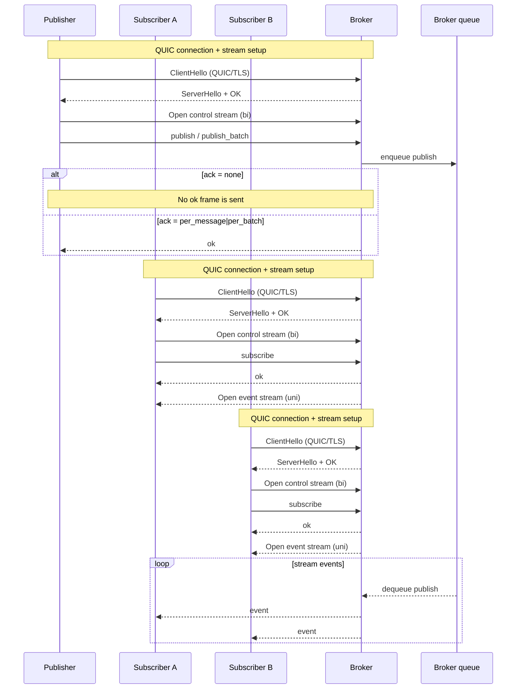
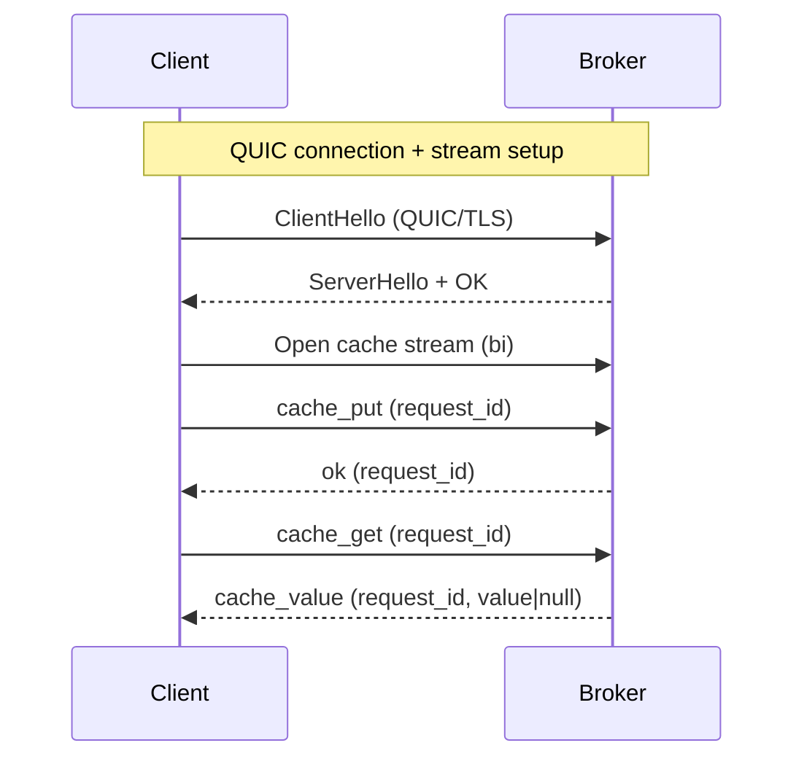

# Felix Wire Protocol (v1)

This document defines the language-neutral wire format for Felix. It is the
source of truth for all client implementations.

## Goals
- Stable, versioned envelope
- Minimal message set for v1
- No Rust-specific semantics
- Simple framing over QUIC (and future TCP+TLS)

## Transport
- QUIC over TLS 1.3 (IETF QUIC)
- Streams are bidirectional:
  - request/response (publish, cache, subscribe setup)
  - subscription streams carry events

## Frame Envelope
All messages are sent in a fixed header + payload frame.

```
0                   1                   2                   3
0 1 2 3 4 5 6 7 8 9 0 1 2 3 4 5 6 7 8 9 0 1 2 3 4 5 6 7 8 9 0 1
┌───────────────────────────────┬───────────────┬───────────────┐
│            magic              │    version    │     flags     │
├───────────────────────────────┴───────────────┴───────────────┤
│                           length                              │
└───────────────────────────────────────────────────────────────┘
```

Field definitions:
- `magic` (u32, big-endian): `0x464C5831` ("FLX1")
- `version` (u16, big-endian): `1`
- `flags` (u16, big-endian): reserved for future use, must be `0` for v1
- `length` (u32, big-endian): payload length in bytes

Payload:
- v1 payload is a UTF-8 JSON document representing a `Message` (see below).
- Encoders MUST NOT exceed `u32::MAX` bytes.

## Message Types (v1)
Message payloads are JSON objects with a `type` discriminator.

### Publish
```
{ "type": "publish", "tenant_id": "<string>", "namespace": "<string>", "stream": "<string>", "payload": "<base64>", "ack": "<none|per_message>" }
```

### PublishBatch
```
{ "type": "publish_batch", "tenant_id": "<string>", "namespace": "<string>", "stream": "<string>", "payloads": ["<base64>", ...], "ack": "<none|per_batch>" }
```

### Subscribe
```
{ "type": "subscribe", "tenant_id": "<string>", "namespace": "<string>", "stream": "<string>" }
```

### Event (server -> client)
```
{ "type": "event", "tenant_id": "<string>", "namespace": "<string>", "stream": "<string>", "payload": "<base64>" }
```

### CachePut
```
{ "type": "cache_put", "key": "<string>", "value": "<base64>", "ttl_ms": <number|null> }
```

### CacheGet
```
{ "type": "cache_get", "key": "<string>" }
```

### CacheValue (server -> client)
```
{ "type": "cache_value", "key": "<string>", "value": "<base64|null>" }
```

### Ok
```
{ "type": "ok" }
```

### Error
```
{ "type": "error", "message": "<string>" }
```

## Semantics (v1)
- Subscribe starts at tail (no historical replay).
- Publish returns `ok` when accepted by the broker unless `ack` is `none`.
- PublishBatch returns `ok` once for the batch unless `ack` is `none`.
- CachePut returns `ok` when stored (TTL is optional).
- CacheGet returns `cache_value` with `null` when missing/expired.
- Backpressure: v1 is best-effort; subscribers may miss events if they fall behind.

## Protocol Flows (v1)

### 1) Publish/Subscribe flow (handshake + control + events)


### 2) Client wants to put/get data to/from cache (handshake + request/response)


## Binary PublishBatch (experimental)
When `flags & 0x0001 != 0`, the frame payload is a binary publish batch:

```
u16 tenant_len
u8[tenant_len] tenant_id
u16 namespace_len
u8[namespace_len] namespace
u16 stream_len
u8[stream_len] stream
u32 count
repeated count times:
  u32 payload_len
  u8[payload_len] payload
```

This is a throughput optimization for the data plane and is not used by control
plane APIs.

## Future Compatibility
- Non-zero `flags` are reserved for compression/encryption negotiation.
- Future message types must be version-gated.

## Test Vectors
Client implementations MUST validate against shared vectors in:
`crates/felix-wire/tests/vectors/`

## Conformance
All clients SHOULD pass the shared conformance suite (felix-conformance).
