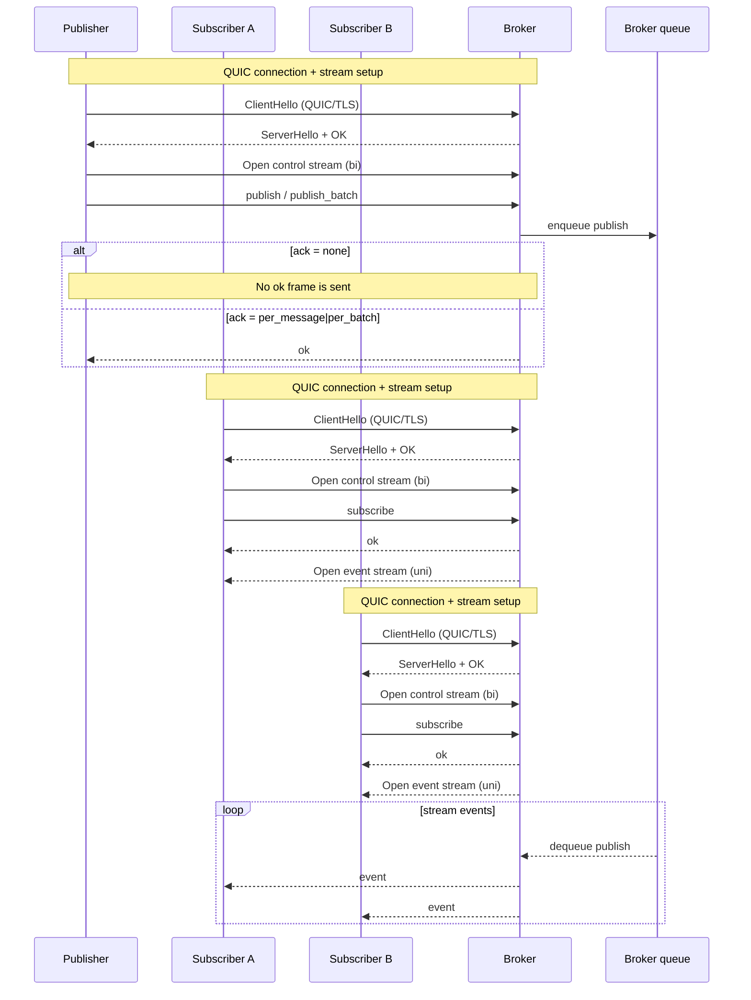
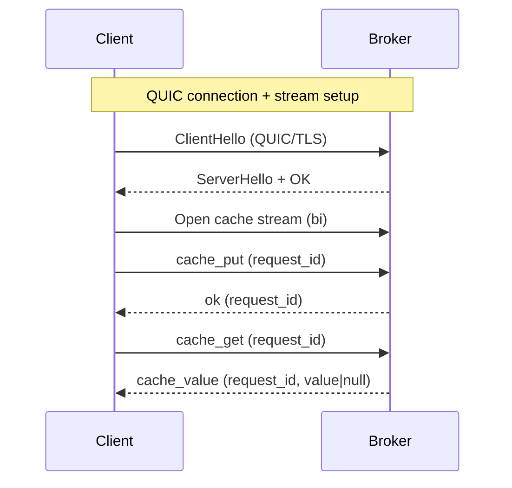
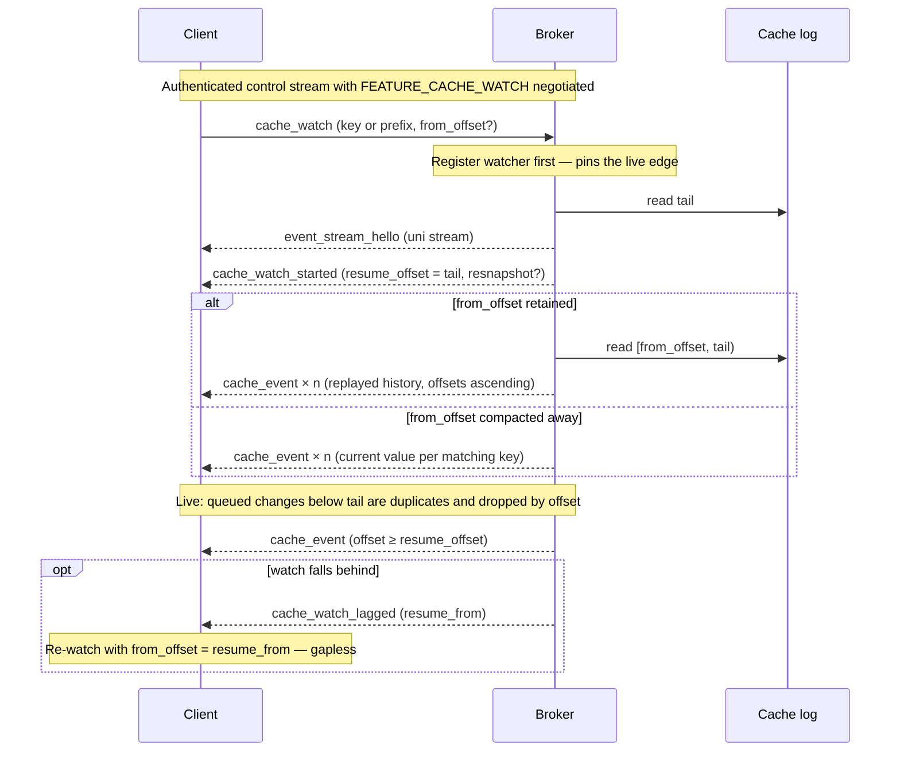

# Felix Wire Protocol (v1)

This document defines the language-neutral wire format for Felix. It is the
source of truth for all client implementations.

> Brokers speak a separate protocol to each other, with its own magic, version
> and message kinds. See [the broker-internal forwarding protocol](internal-protocol.md).

## Goals
- Stable, versioned envelope
- Minimal message set for v1
- No Rust-specific semantics
- Simple framing over QUIC (and future TCP+TLS)

## Transport
- QUIC over TLS 1.3 (IETF QUIC)
- Streams are bidirectional:
  - request/response (publish, cache, subscribe setup)
  - subscription streams carry events

## Frame Envelope
All messages are sent in a fixed header + payload frame.

```
 0                   1                   2                   3
 0 1 2 3 4 5 6 7 8 9 0 1 2 3 4 5 6 7 8 9 0 1 2 3 4 5 6 7 8 9 0 1
+---------------------------------------------------------------+
|                          magic (u32)                          |
+-------------------------------+-------------------------------+
|         version (u16)         |          flags (u16)          |
+-------------------------------+-------------------------------+
|                          length (u32)                         |
+---------------------------------------------------------------+
```

Each row above is 32 bits, so the 12-byte header occupies three rows.

| Offset | Size | Field | Type | Value |
| --- | --- | --- | --- | --- |
| 0 | 4 | `magic` | u32 | `0x464C5831` (`"FLX1"`) |
| 4 | 2 | `version` | u16 | `1` |
| 6 | 2 | `flags` | u16 | Bit field; see below |
| 8 | 4 | `length` | u32 | Payload length in bytes |

Field definitions:
- `magic` (u32, big-endian): `0x464C5831` ("FLX1")
- `version` (u16, big-endian): `1`
- `flags` (u16, big-endian): selects the payload layout. `0` means the payload is
  a JSON-encoded `Message`. Defined bits:

  | Bit | Name | Meaning |
  | --- | --- | --- |
  | `0x0001` | `BINARY_PUBLISH_BATCH` | Payload is a binary publish batch |
  | `0x0002` | `BINARY_EVENT_BATCH` | Payload is a binary event batch (legacy, per-subscriber) |
  | `0x0004` | `BINARY_EVENT_BATCH_SHARED` | Payload is a shared binary event batch |
  | `0x0008` | `BINARY_PUBLISH_ACKED` | Modifier on `0x0001`: the batch carries a `request_id` prefix and is owed an ack |
  | `0x0010` | `BINARY_PUBLISH_ACK` | Payload is a binary publish acknowledgement (broker → client) |
  | `0x0020` | `EVENT_BATCH_OFFSETS` | Modifier on `0x0002` or `0x0004`: the batch carries a `base_offset` |

  Because these bits change how the payload is parsed, a receiver MUST reject a
  frame carrying any bit it does not recognise rather than masking it off — see
  Future Compatibility.
- `length` (u32, big-endian): payload length in bytes

Payload:
- v1 payload is a binary-encoded Felix wire frame representing a `Message` (see below).
- Encoders MUST NOT exceed `u32::MAX` bytes.

## Message Types (v1)
Message schemas below are shown in pseudo-struct notation for readability; on the wire they are binary-encoded.

### Publish
```
{ "type": "publish", "tenant_id": "<string>", "namespace": "<string>", "stream": "<string>", "payload": "<base64>", "ack": "<none|per_message>" }
```

### PublishBatch
```
{ "type": "publish_batch", "tenant_id": "<string>", "namespace": "<string>", "stream": "<string>", "payloads": ["<base64>", ...], "ack": "<none|per_batch>" }
```

### Subscribe
```
{ "type": "subscribe", "tenant_id": "<string>", "namespace": "<string>", "stream": "<string>", "start": <"latest"|"earliest"|{"offset": <number>}> }
```

`start` is optional. Omitting it means `latest`, which is what every client sent
before the field existed — so an old client and a new broker exchange exactly the
frames they always did.

- `latest` — deliver only what is published from now on.
- `earliest` — the oldest record still retained. Deliberately not "offset 0":
  for a stream whose head has been trimmed, offset 0 is gone, and `earliest`
  means "as far back as you can" rather than an error.
- `{"offset": n}` — resume at exactly offset `n`, the first record the client has
  *not* seen. A client that checkpoints the offset it last handled resumes at
  that offset plus one.

Requesting an offset the broker cannot serve returns `subscribe_cursor_error`
rather than a silent restart at the tail:

```
{ "type": "subscribe_cursor_error", "reason": "<too_old|in_future>", "requested": <number>, "available": <number> }
```

`too_old` means retention has discarded the offset and `available` is the oldest
still retained. `in_future` means the offset is past the end of the stream and
`available` is the current tail. The two have opposite remedies, which is why
they are distinguishable in code rather than only in prose.

The `shard` field selects which shard of the stream to read, defaulting to 0. A
subscription reads **one** shard, so consuming a whole multi-shard stream means
one subscription per shard; `stream_shards` says how many there are.

### Subscribed (server -> client)
```
{ "type": "subscribed", "subscription_id": <number> }
```

Confirms a subscription and carries the id the broker assigned it. The same id
opens the event stream that carries its deliveries:

```
{ "type": "event_stream_hello", "subscription_id": <number> }
```

which is the first message on the unidirectional stream the broker opens back,
and is how a client matches an event stream to the subscription that asked for
it.

### Event (server -> client)
```
{ "type": "event", "tenant_id": "<string>", "namespace": "<string>", "stream": "<string>", "payload": "<base64>", "offset": <number|absent> }
```

`offset` is present for durable streams and absent for in-memory ones, which
have no durable position to checkpoint against.

### CachePut
```
{ "type": "cache_put", "key": "<string>", "value": "<base64>", "ttl_ms": <number|null> }
```

### CacheGet
```
{ "type": "cache_get", "key": "<string>" }
```

### GroupPoll
```
{ "type": "group_poll", "tenant_id": "<string>", "namespace": "<string>",
  "stream": "<string>", "shard": <number>, "group": "<string>",
  "max_records": <number>, "wait_ms": <number>, "request_id": <number> }
```

Sent only to a broker that advertised `FEATURE_CONSUMER_GROUP`, and only to the
broker that leads the shard.

`wait_ms` is how long the broker may hold the request open waiting for work.
Omitted or `0` answers immediately — which is what a broker that predates
long-polling does with the field, so an older peer degrades to a plain poll
rather than misreading the request. The broker caps it at
`FELIX_GROUP_MAX_WAIT_MS`, so a client cannot hold a stream open indefinitely.
The wait bounds how long the broker looks, not whether it answers: an empty
`group_records` after the wait still means nothing was available.

### GroupRecords (server -> client)
```
{ "type": "group_records",
  "records": [{ "offset": <number>, "payload": "<base64>", "attempts": <number> }],
  "request_id": <number> }
```

`attempts` counts deliveries including this one, so `1` is a first attempt and
anything higher is a redelivery. Absent means the broker did not report it —
which is not the same as a first attempt, and a consumer should not treat it as
one.

### GroupDeadLetters / GroupDiscard / GroupRedrive
```
{ "type": "group_dead_letters", "tenant_id": "...", "namespace": "...",
  "stream": "...", "shard": <number>, "group": "<string>", "request_id": <number> }
{ "type": "group_discard", ..., "offset": <number>, "request_id": <number> }
{ "type": "group_redrive", ..., "offset": <number>, "request_id": <number> }
```

Sent only to a broker that advertised `FEATURE_GROUP_DEAD_LETTERS`.

### GroupDeadLetterList (server -> client)
```
{ "type": "group_dead_letter_list", "offsets": [<number>], "request_id": <number> }
```

### GroupAck / GroupNack
```
{ "type": "group_ack",  "tenant_id": "...", "namespace": "...", "stream": "...",
  "shard": <number>, "group": "<string>", "offset": <number>, "request_id": <number> }
{ "type": "group_nack", ... }
```

### CacheDelete
```
{ "type": "cache_delete", "tenant_id": "<string>", "namespace": "<string>",
  "cache": "<string>", "key": "<string>", "request_id": <u64|absent> }
```

Sent only to a broker that advertised `FEATURE_CACHE_DELETE`.

Answered with `cache_value` carrying the value that was removed, or a null value
if the key was not there — so a caller can tell a delete that did something from
one that did not.

### CacheWatch
```
{ "type": "cache_watch", "tenant_id": "<string>", "namespace": "<string>",
  "cache": "<string>", "key": "<string>|absent", "prefix": "<string>|absent",
  "shard": <u32|absent>, "from_offset": <u64|absent>,
  "subscription_id": <u64|absent> }
```

Sent only to a broker that advertised `FEATURE_CACHE_WATCH`. Subscribes to
changes for one cache key (`key`) or key prefix (`prefix`) — exactly one of the
two must be present; both or neither is refused rather than guessed at. An
empty `prefix` is every key in the shard.

A watch reads **one** shard, exactly as a stream subscription does. A `key`
watch resolves its own shard by hashing — the same resolution a `cache_get`
uses — and ignores `shard`. A `prefix` watch reads `shard` (absent means 0),
because keys sharing a prefix hash to different shards; a whole multi-shard
cache is one watch per shard.

`from_offset` is where to resume: the first change the client has *not* seen,
so a client checkpoints the offset it last handled plus one. Absent means from
now — live changes only. An offset past the tail is refused with
`subscribe_cursor_error` rather than silently reinterpreted. Watches are served
by the shard's owner and redirected (`not_leader`) elsewhere, like subscribes.

### CacheWatchStarted (server -> client)
```
{ "type": "cache_watch_started", "subscription_id": <u64>,
  "resume_offset": <u64>, "resnapshot": <bool|absent> }
```

Confirms the watch. The same `subscription_id` arrives in the
`event_stream_hello` that opens the unidirectional stream carrying the watch's
changes — the binding is identical to a stream subscription's.

`resume_offset` is the offset live delivery begins at: every change at or past
it is delivered, and everything before it was covered by the replay or the
snapshot. `resnapshot` (absent means false) is true when `from_offset` named
history that compaction has already collapsed; the watch then begins with each
matching key's **current value** instead of the collapsed history — the same
snapshot-plus-changes contract the control plane's assignment watch uses, and
never a silent gap.

### CacheEvent (server -> client)
```
{ "type": "cache_event", "key": "<string>", "value": "<base64|absent>",
  "offset": <u64>, "expires_at_millis": <u64|absent> }
```

One change on the watch's event stream. An absent `value` means the key was
deleted. `offset` is the change's cache-log offset — the resume anchor.
`expires_at_millis` is absolute Unix milliseconds, `0` or absent meaning never.

Offsets on a filtered watch are naturally sparse — other keys' changes consume
them — so a gap between consecutive offsets is **not** a drop signal here, the
way it is for a stream subscription. `cache_watch_lagged` is.

### CacheWatchLagged (server -> client)
```
{ "type": "cache_watch_lagged", "resume_from": <u64> }
```

The watch fell behind and its queue dropped changes; the broker delivers
everything already queued, sends this, and finishes the event stream.
`resume_from` is the offset of the first missed change: re-watching with
`from_offset = resume_from` is gapless. Loss is loud by construction, because
sparse offsets would otherwise hide it.

### StreamShards
```
{ "type": "stream_shards", "tenant_id": "<string>", "namespace": "<string>",
  "stream": "<string>", "request_id": <u64> }
```

Sent only to a broker that advertised `FEATURE_STREAM_SHARDS`.

A subscription reads one shard, so a client consuming a whole stream needs to
know how many there are; nothing else on the wire says. Scoped to the client's
own tenant, and answered from the broker's routing snapshot — so it can be stale
in exactly the way any routing answer can.

### StreamShardsView (server -> client)
```
{ "type": "stream_shards_view", "shards": <u32>, "request_id": <u64> }
```

`0` means this broker knows nothing of that stream, which is **not** the same as
one shard. A client that rounded it up would read shard 0 and call it the
stream.

### CacheValue (server -> client)
```
{ "type": "cache_value", "key": "<string>", "value": "<base64|null>" }
```

### Ok
```
{ "type": "ok" }
```

### Error
```
{ "type": "error", "message": "<string>" }
```

## Semantics (v1)
- Subscribe starts at the tail unless `start` asks otherwise; a durable stream
  can be replayed from any retained offset. History read from disk joins live
  delivery with no gap and no duplicate — see
  [durable storage](durable-storage.md#resuming-a-subscription).
- Publish returns `ok` when accepted by the broker unless `ack` is `none`.
- PublishBatch returns `ok` once for the batch unless `ack` is `none`.
- CachePut returns `ok` when stored (TTL is optional).
- CacheGet returns `cache_value` with `null` when missing/expired.
- CacheDelete returns `cache_value` carrying whatever was removed, and `null`
  when the key was not there. Removing a key that does not exist is an answer,
  not an error.
- CacheWatch delivers each applied write for its key or prefix — a put with its
  value, a delete as a change with none — in the cache shard's write order,
  each carrying its log offset. Resume by offset replays `[from_offset, tail)`
  from the cache's log before live delivery, joined without a gap or a
  duplicate by the same register-before-read discipline a stream resume uses. A
  resume whose history compaction collapsed is answered with `resnapshot: true`
  and current values; a watch that falls behind is ended with
  `cache_watch_lagged` naming the offset to re-watch from. TTL expiry is not a
  change: nothing is appended when an entry lapses, so no event is delivered —
  a watcher that cares about expiry reads `expires_at_millis` off the put.
- GroupPoll returns `group_records`, which may be empty: nothing was available
  is an answer, not an error. Each record is claimed until the broker's
  visibility timeout lapses, after which it is handed to whoever polls next.
- GroupAck and GroupNack return `cache_ok`. An ack finishes a record; a nack
  hands it back for immediate redelivery rather than after the timeout.
- **Only the broker leading a shard serves its groups.** Any other refuses with
  `error` rather than an empty batch, because the claim and the acknowledgement
  have to reach the same in-flight state — two brokers each keeping their own
  would hand out the same records.
- Backpressure: v1 is best-effort; subscribers may miss events if they fall
  behind. With event offsets negotiated a client can *detect* that loss, because
  a gap between consecutive delivered offsets is exactly a drop.

## Protocol Flows (v1)

### 1) Publish/Subscribe flow (handshake + control + events)

```mermaid
sequenceDiagram
    participant Pub as Publisher
    participant SubA as Subscriber A
    participant SubB as Subscriber B
    participant B as Broker
    participant Q as Broker queue
    Note over Pub,B: QUIC connection + stream setup
    Pub->>B: ClientHello (QUIC/TLS)
    B-->>Pub: ServerHello + OK
    Pub->>B: Open control stream (bi)
    Pub->>B: publish / publish_batch
    B->>Q: enqueue publish
    alt ack = none
        Note over Pub,B: No ok frame is sent
    else ack = per_message|per_batch
        B-->>Pub: ok
    end
    Note over SubA,B: QUIC connection + stream setup
    SubA->>B: ClientHello (QUIC/TLS)
    B-->>SubA: ServerHello + OK
    SubA->>B: Open control stream (bi)
    SubA->>B: subscribe
    B-->>SubA: ok
    B-->>SubA: Open event stream (uni)
    Note over SubB,B: QUIC connection + stream setup
    SubB->>B: ClientHello (QUIC/TLS)
    B-->>SubB: ServerHello + OK
    SubB->>B: Open control stream (bi)
    SubB->>B: subscribe
    B-->>SubB: ok
    B-->>SubB: Open event stream (uni)
    loop stream events
        Q-->>B: dequeue publish
        B-->>SubA: event
        B-->>SubB: event
    end
```

### 2) Client wants to put/get data to/from cache (handshake + request/response)

```mermaid
sequenceDiagram
    participant C as Client
    participant B as Broker
    Note over C,B: QUIC connection + stream setup
    C->>B: ClientHello (QUIC/TLS)
    B-->>C: ServerHello + OK
    C->>B: Open cache stream (bi)
    C->>B: cache_put (request_id)
    B-->>C: ok (request_id)
    C->>B: cache_get (request_id)
    B-->>C: cache_value (request_id, value|null)
```

### 3) Client watches a cache key (establish + resume + live)

```mermaid
sequenceDiagram
    participant C as Client
    participant B as Broker
    participant L as Cache log
    Note over C,B: Authenticated control stream with FEATURE_CACHE_WATCH negotiated
    C->>B: cache_watch (key or prefix, from_offset?)
    Note over B: Register watcher first — pins the live edge
    B->>L: read tail
    B-->>C: event_stream_hello (uni stream)
    B-->>C: cache_watch_started (resume_offset = tail, resnapshot?)
    alt from_offset retained
        B->>L: read [from_offset, tail)
        B-->>C: cache_event × n (replayed history, offsets ascending)
    else from_offset compacted away
        B-->>C: cache_event × n (current value per matching key)
    end
    Note over B,C: Live: queued changes below tail are duplicates and dropped by offset
    B-->>C: cache_event (offset ≥ resume_offset)
    opt watch falls behind
        B-->>C: cache_watch_lagged (resume_from)
        Note over C: Re-watch with from_offset = resume_from — gapless
    end
```

## Binary PublishBatch
When `flags & 0x0001 != 0`, the frame payload is a binary publish batch:

```
u16 tenant_len
u8[tenant_len] tenant_id
u16 namespace_len
u8[namespace_len] namespace
u16 stream_len
u8[stream_len] stream
u32 count
repeated count times:
  u32 payload_len
  u8[payload_len] payload
```

This is the default encoding for unacknowledged client publishes. Clients can
explicitly select JSON for compatibility.

## Binary acked PublishBatch
When `flags & 0x0008 != 0` (always together with `0x0001`), the publish batch above
is prefixed with a correlation header:

```
u64 request_id
u8  ack_mode        1 = per_message, 2 = per_batch
... then the Binary PublishBatch body exactly as above
```

The prefix comes first so a receiver can read `request_id` without parsing the rest
of the frame; that is what lets the broker answer a malformed body with an error the
client can still correlate to its pending request.

`ack_mode` has no encoding for "none": an unacknowledged publish uses the plain
`0x0001` frame with no prefix, so each mode has exactly one representation on the
wire.

## Binary PublishAck
When `flags & 0x0010 != 0`, the frame payload is a publish acknowledgement:

```
u8  status          0 = ok, 1 = error
u64 request_id
u16 message_len     0 when status = ok
u8[message_len] message   UTF-8, error text
```

This is the response to a `0x0008` publish. It carries exactly the information the
JSON `publish_ok` / `publish_error` messages do; a client that published with the
JSON encoding still receives those JSON messages instead.

**Compatibility:** `0x0008` and `0x0010` were added after the initial v1 release. A
broker predating them matches on `0x0001`, does not know about the prefix, and would
misparse `request_id` as `tenant_len`. Clients therefore MUST NOT send `0x0008`
unless the broker has advertised it — see Capability negotiation below.

## Capability negotiation

Flag bits change how a payload is parsed, so a peer must never guess which ones the
other side understands. The supported set is exchanged on the `auth` handshake,
which is already the first round trip on every control stream and therefore costs
no extra latency.

A client that implements negotiation includes its own set:

```json
{"type":"auth","tenant_id":"t1","token":"...","client_flags":25}
```

A broker that implements negotiation replies with its own:

```json
{"type":"auth_ok","server_flags":25}
```

The client MUST use the advertised value to decide which encodings it may send, and
MUST NOT assume its own set is supported.

Both directions degrade without a version check, because serde-style decoders ignore
unknown fields:

| Client | Broker | Outcome |
| --- | --- | --- |
| negotiating | negotiating | `auth_ok`; client uses any advertised bit |
| negotiating | legacy | `client_flags` ignored, plain `ok` returned; client assumes `ORIGINAL_V1_FLAGS` and falls back to the JSON encoding for acked publishes |
| legacy | negotiating | no `client_flags` offered, so the broker replies with a plain `ok` and never sends a message the client cannot parse |
| legacy | legacy | unchanged |

`ORIGINAL_V1_FLAGS` is `0x0001 | 0x0002 | 0x0004` — the bits that existed before
negotiation. It is the only safe reading of an absent advertisement, and it is
frozen: adding a bit to it would make clients assume support that older brokers
do not have.

A broker MUST only send `auth_ok` in response to an `auth` that offered
`client_flags`. A client old enough not to know the variant can then never receive
it.

## Feature negotiation

A *feature* bit says a request exists. A *flag* bit says how a payload is laid
out. They are numbered in separate spaces and MUST NOT be mixed: a feature never
appears on a frame, and offering one as a frame flag would have a client claim it
can receive a shape it has no decoder for.

Features are advertised in the same handshake, in an optional field:

```json
{"type":"auth_ok","server_flags":63,"server_features":1}
```

| Bit | Name | Meaning |
| --- | --- | --- |
| `0x0001` | `FEATURE_TOPOLOGY` | The broker answers `topology` |
| `0x0002` | `FEATURE_REDIRECT` | The peer understands `not_leader` |
| `0x0004` | `FEATURE_CACHE_DELETE` | The broker accepts `cache_delete` |
| `0x0008` | `FEATURE_CONSUMER_GROUP` | The broker serves `group_poll`, `group_ack`, `group_nack` |
| `0x0010` | `FEATURE_GROUP_DEAD_LETTERS` | The broker serves `group_dead_letters`, `group_discard`, `group_redrive` |
| `0x0020` | `FEATURE_STREAM_SHARDS` | The broker answers `stream_shards` |
| `0x0040` | `FEATURE_CACHE_WATCH` | The broker accepts `cache_watch` |

Features are advertised in **both** directions. A client offers its own in the
`auth` it already sends:

```json
{"type":"auth","tenant_id":"t1","token":"...","client_flags":63,"client_features":3}
```

The client's set matters for exactly the same reason as the broker's: a broker
must not send a client a message type it cannot decode. `not_leader` travels
broker to client, so the broker sends it only to a client that offered
`FEATURE_REDIRECT`, and answers everyone else with an ordinary `error`.

`FEATURE_CACHE_DELETE` runs the other way, because `cache_delete` is a request:
a client sends it only to a broker that advertised the bit. Getting that
backwards is worse than a refused request — an unrecognised message type ends
the broker's control loop, so probing costs the connection.

Note which features depend on what. `FEATURE_TOPOLOGY` and `FEATURE_REDIRECT`
describe a cluster, so a standalone broker advertises neither.
`FEATURE_CACHE_DELETE` works the same on one node as on twenty, and is
advertised by both, as is `FEATURE_STREAM_SHARDS` — a standalone broker has one
shard per stream and can say so. `FEATURE_CONSUMER_GROUP` and `FEATURE_GROUP_DEAD_LETTERS` depend on durable
storage rather than on clustering: without it a group's position is lost on
every restart, so a broker with none offers neither. `FEATURE_CACHE_WATCH`
depends on the cache being log-backed, for the same shape of reason: a watch's
contract — resume, duplicate detection, the lag signal — is built on log
offsets, and a broker whose cache is the in-memory fallback has none to offer.

They are two bits rather than one because a bit says which requests exist, and
widening what an existing bit promises is the one change that cannot be made
safely — a broker built when `FEATURE_CONSUMER_GROUP` meant only poll, ack and
nack would advertise it and then meet a request it has no arm for.

An absent `server_features` or `client_features` means that peer implements
none. This is not a
formality. An unrecognised message `type` is a **fatal** protocol error to the
broker's control loop — it closes the connection rather than answering — so a
client MUST NOT send a featured request speculatively to find out whether it is
supported. Silence means no.

A broker advertises a feature only when it can actually answer it. A broker with
no cluster behind it has no topology to report, and advertises `0`.

## Not-leader redirects

A subscribe for a shard the broker does not own is answered with `not_leader`,
naming the broker that does:

```json
{"type":"not_leader","node_id":"broker-b","addr":"10.0.0.5:5000","generation":7}
```

`addr` is the owner's **client-facing** listener, and is omitted when the
cluster has not been told one — a client is then given the owner's name alone,
which is still usable if it knows that broker from `topology`. Dialling the
broker-internal listener instead would be refused, so no address is better than
the wrong one.

`generation` is the assignment epoch the answer describes. A client holding a
newer one has already moved on and should ignore the redirect.

A client following a redirect MUST bound its hops. A cluster mid-rebalance can
name an owner that names another, and two brokers that disagree would otherwise
bounce a client between them indefinitely. The Rust client caps this at three
hops and refuses to visit the same broker twice within one attempt.

**Publish is not redirected — it is forwarded.** The two paths made opposite
choices deliberately: `docs/subscribe-routing.md` records the measurements
behind redirecting subscribes, and `docs/internal-protocol.md` the forwarding
of publishes. A client should not expect `not_leader` in answer to a publish.

## Topology

`topology` asks a broker which brokers a client may connect to. It is sent on an
authenticated control stream, and only to a broker that advertised
`FEATURE_TOPOLOGY`.

```json
{"type":"topology"}
```

```json
{"type":"topology_view","brokers":[
  {"node_id":"broker-a","addr":"10.0.0.4:5000"},
  {"node_id":"broker-b","addr":"10.0.0.5:5000"}
]}
```

`addr` is the broker's **client-facing** listener, which is a different listener
from the one brokers forward to each other on. A broker is listed only when the
cluster considers it able to serve and it has advertised where clients reach it;
one that has not is omitted rather than reported at an address that would refuse
the connection.

An empty list is a valid answer, not an error: it means the cluster has named no
client-reachable broker. A client MUST treat the answer as additive and keep the
endpoints it was configured with, so that a wrong or stale answer can never leave
it with fewer ways in than it started with.

The response carries no placement, capacity, or liveness detail. Those are the
cluster's business, and a tenant's client has no standing to read them.

## Shared Binary EventBatch
When `flags & 0x0004 != 0`, the event-stream frame payload is:

```
u32 count
repeated count times:
  u32 payload_len
  u8[payload_len] payload
```

The subscription is identified by the preceding `EventStreamHello`, so event
batches carry no per-subscriber identifier and the broker can share one encoded
frame across subscribers. The legacy `0x0002` format remains decodable.

## Event batch offsets

When `flags & 0x0020 != 0`, a `u64 base_offset` precedes the `u32 count` — after
the `u64 subscription_id` on the `0x0002` form, and at the very start of the
payload on the shared `0x0004` form:

```
u64 base_offset          # offset of the first payload
u32 count
repeated count times:
  u32 payload_len
  u8[payload_len] payload
```

A batch's offsets are contiguous, so one `u64` per *batch* is enough: payload
`i` sits at `base_offset + i`. That is what keeps offsets off the per-event cost
model — 8 bytes per batch, not per event.

Offsets belong to the **stream**, not to the subscriber, so the shared
encode-once frame still serves every subscriber that negotiated the bit. A
subscriber that did not negotiate it receives the frame without the field, so
the broker encodes at most one extra variant per batch regardless of how many
subscribers there are.

Two uses:

- **Checkpointing.** A client records the offset it last handled and resumes at
  that offset plus one after a reconnect.
- **Detecting loss.** Subscriber queues drop under `DropNew`, so consecutive
  delivered batches can have a gap. Without offsets that loss is invisible; with
  them it is a discontinuity the client can see and act on.

## Future Compatibility
- Undefined `flags` bits are reserved. Receivers MUST reject frames carrying an
  unrecognised bit instead of ignoring it: flag bits select the payload layout, so
  masking an unknown bit off means confidently misparsing the body rather than
  failing. `0x0008` is the cautionary case — see Binary acked PublishBatch.
- Future message types must be version-gated.

## Test Vectors
Client implementations MUST validate against shared vectors in:
`crates/felix-wire/tests/vectors/`

## Conformance
All clients SHOULD pass the shared conformance suite (felix-conformance).
