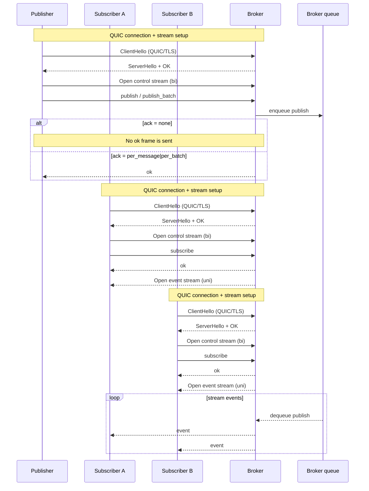
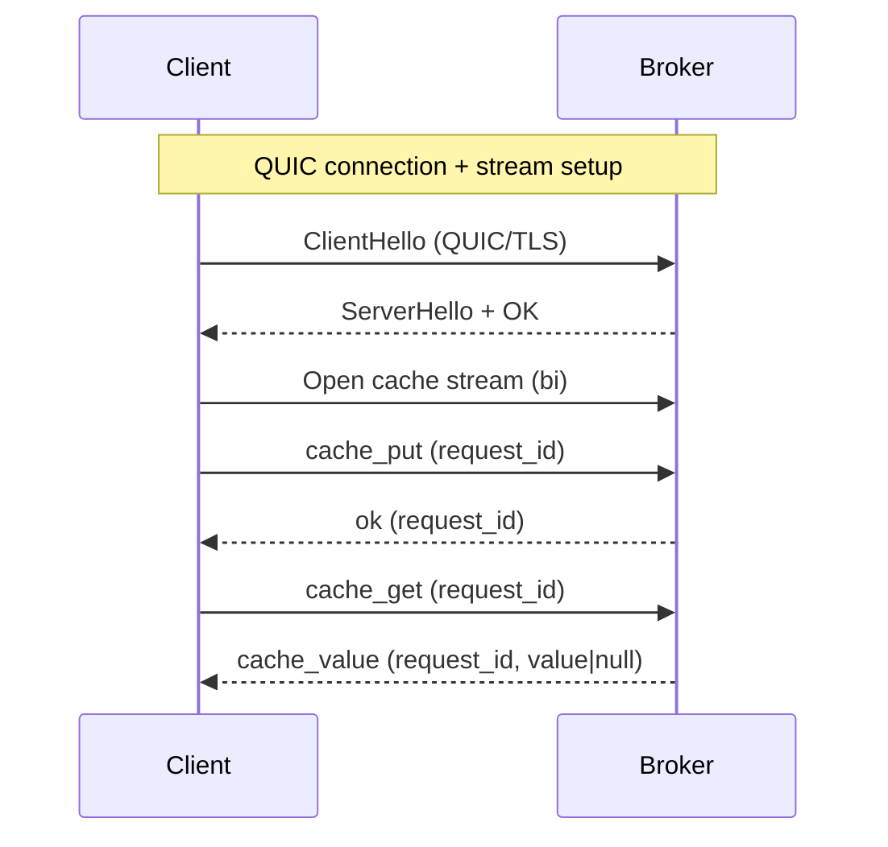

# Felix Wire Protocol (v1)

This document defines the language-neutral wire format for Felix. It is the
source of truth for all client implementations.

## Goals
- Stable, versioned envelope
- Minimal message set for v1
- No Rust-specific semantics
- Simple framing over QUIC (and future TCP+TLS)

## Transport
- QUIC over TLS 1.3 (IETF QUIC)
- Streams are bidirectional:
  - request/response (publish, cache, subscribe setup)
  - subscription streams carry events

## Frame Envelope
All messages are sent in a fixed header + payload frame.

```
 0                   1                   2                   3
 0 1 2 3 4 5 6 7 8 9 0 1 2 3 4 5 6 7 8 9 0 1 2 3 4 5 6 7 8 9 0 1
+---------------------------------------------------------------+
|                          magic (u32)                          |
+-------------------------------+-------------------------------+
|         version (u16)         |          flags (u16)          |
+-------------------------------+-------------------------------+
|                          length (u32)                         |
+---------------------------------------------------------------+
```

Each row above is 32 bits, so the 12-byte header occupies three rows.

| Offset | Size | Field | Type | Value |
| --- | --- | --- | --- | --- |
| 0 | 4 | `magic` | u32 | `0x464C5831` (`"FLX1"`) |
| 4 | 2 | `version` | u16 | `1` |
| 6 | 2 | `flags` | u16 | Bit field; see below |
| 8 | 4 | `length` | u32 | Payload length in bytes |

Field definitions:
- `magic` (u32, big-endian): `0x464C5831` ("FLX1")
- `version` (u16, big-endian): `1`
- `flags` (u16, big-endian): selects the payload layout. `0` means the payload is
  a JSON-encoded `Message`. Defined bits:

  | Bit | Name | Meaning |
  | --- | --- | --- |
  | `0x0001` | `BINARY_PUBLISH_BATCH` | Payload is a binary publish batch |
  | `0x0002` | `BINARY_EVENT_BATCH` | Payload is a binary event batch (legacy, per-subscriber) |
  | `0x0004` | `BINARY_EVENT_BATCH_SHARED` | Payload is a shared binary event batch |
  | `0x0008` | `BINARY_PUBLISH_ACKED` | Modifier on `0x0001`: the batch carries a `request_id` prefix and is owed an ack |
  | `0x0010` | `BINARY_PUBLISH_ACK` | Payload is a binary publish acknowledgement (broker → client) |

  Because these bits change how the payload is parsed, a receiver MUST reject a
  frame carrying any bit it does not recognise rather than masking it off — see
  Future Compatibility.
- `length` (u32, big-endian): payload length in bytes

Payload:
- v1 payload is a binary-encoded Felix wire frame representing a `Message` (see below).
- Encoders MUST NOT exceed `u32::MAX` bytes.

## Message Types (v1)
Message schemas below are shown in pseudo-struct notation for readability; on the wire they are binary-encoded.

### Publish
```
{ "type": "publish", "tenant_id": "<string>", "namespace": "<string>", "stream": "<string>", "payload": "<base64>", "ack": "<none|per_message>" }
```

### PublishBatch
```
{ "type": "publish_batch", "tenant_id": "<string>", "namespace": "<string>", "stream": "<string>", "payloads": ["<base64>", ...], "ack": "<none|per_batch>" }
```

### Subscribe
```
{ "type": "subscribe", "tenant_id": "<string>", "namespace": "<string>", "stream": "<string>" }
```

### Event (server -> client)
```
{ "type": "event", "tenant_id": "<string>", "namespace": "<string>", "stream": "<string>", "payload": "<base64>" }
```

### CachePut
```
{ "type": "cache_put", "key": "<string>", "value": "<base64>", "ttl_ms": <number|null> }
```

### CacheGet
```
{ "type": "cache_get", "key": "<string>" }
```

### CacheValue (server -> client)
```
{ "type": "cache_value", "key": "<string>", "value": "<base64|null>" }
```

### Ok
```
{ "type": "ok" }
```

### Error
```
{ "type": "error", "message": "<string>" }
```

## Semantics (v1)
- Subscribe starts at tail (no historical replay).
- Publish returns `ok` when accepted by the broker unless `ack` is `none`.
- PublishBatch returns `ok` once for the batch unless `ack` is `none`.
- CachePut returns `ok` when stored (TTL is optional).
- CacheGet returns `cache_value` with `null` when missing/expired.
- Backpressure: v1 is best-effort; subscribers may miss events if they fall behind.

## Protocol Flows (v1)

### 1) Publish/Subscribe flow (handshake + control + events)

```mermaid
sequenceDiagram
    participant Pub as Publisher
    participant SubA as Subscriber A
    participant SubB as Subscriber B
    participant B as Broker
    participant Q as Broker queue
    Note over Pub,B: QUIC connection + stream setup
    Pub->>B: ClientHello (QUIC/TLS)
    B-->>Pub: ServerHello + OK
    Pub->>B: Open control stream (bi)
    Pub->>B: publish / publish_batch
    B->>Q: enqueue publish
    alt ack = none
        Note over Pub,B: No ok frame is sent
    else ack = per_message|per_batch
        B-->>Pub: ok
    end
    Note over SubA,B: QUIC connection + stream setup
    SubA->>B: ClientHello (QUIC/TLS)
    B-->>SubA: ServerHello + OK
    SubA->>B: Open control stream (bi)
    SubA->>B: subscribe
    B-->>SubA: ok
    B-->>SubA: Open event stream (uni)
    Note over SubB,B: QUIC connection + stream setup
    SubB->>B: ClientHello (QUIC/TLS)
    B-->>SubB: ServerHello + OK
    SubB->>B: Open control stream (bi)
    SubB->>B: subscribe
    B-->>SubB: ok
    B-->>SubB: Open event stream (uni)
    loop stream events
        Q-->>B: dequeue publish
        B-->>SubA: event
        B-->>SubB: event
    end
```

### 2) Client wants to put/get data to/from cache (handshake + request/response)

```mermaid
sequenceDiagram
    participant C as Client
    participant B as Broker
    Note over C,B: QUIC connection + stream setup
    C->>B: ClientHello (QUIC/TLS)
    B-->>C: ServerHello + OK
    C->>B: Open cache stream (bi)
    C->>B: cache_put (request_id)
    B-->>C: ok (request_id)
    C->>B: cache_get (request_id)
    B-->>C: cache_value (request_id, value|null)
```

## Binary PublishBatch
When `flags & 0x0001 != 0`, the frame payload is a binary publish batch:

```
u16 tenant_len
u8[tenant_len] tenant_id
u16 namespace_len
u8[namespace_len] namespace
u16 stream_len
u8[stream_len] stream
u32 count
repeated count times:
  u32 payload_len
  u8[payload_len] payload
```

This is the default encoding for unacknowledged client publishes. Clients can
explicitly select JSON for compatibility.

## Binary acked PublishBatch
When `flags & 0x0008 != 0` (always together with `0x0001`), the publish batch above
is prefixed with a correlation header:

```
u64 request_id
u8  ack_mode        1 = per_message, 2 = per_batch
... then the Binary PublishBatch body exactly as above
```

The prefix comes first so a receiver can read `request_id` without parsing the rest
of the frame; that is what lets the broker answer a malformed body with an error the
client can still correlate to its pending request.

`ack_mode` has no encoding for "none": an unacknowledged publish uses the plain
`0x0001` frame with no prefix, so each mode has exactly one representation on the
wire.

## Binary PublishAck
When `flags & 0x0010 != 0`, the frame payload is a publish acknowledgement:

```
u8  status          0 = ok, 1 = error
u64 request_id
u16 message_len     0 when status = ok
u8[message_len] message   UTF-8, error text
```

This is the response to a `0x0008` publish. It carries exactly the information the
JSON `publish_ok` / `publish_error` messages do; a client that published with the
JSON encoding still receives those JSON messages instead.

**Compatibility:** `0x0008` and `0x0010` were added after the initial v1 release. A
broker predating them matches on `0x0001`, does not know about the prefix, and would
misparse `request_id` as `tenant_len`. Clients therefore MUST NOT send `0x0008`
unless the broker has advertised it — see Capability negotiation below.

## Capability negotiation

Flag bits change how a payload is parsed, so a peer must never guess which ones the
other side understands. The supported set is exchanged on the `auth` handshake,
which is already the first round trip on every control stream and therefore costs
no extra latency.

A client that implements negotiation includes its own set:

```json
{"type":"auth","tenant_id":"t1","token":"...","client_flags":25}
```

A broker that implements negotiation replies with its own:

```json
{"type":"auth_ok","server_flags":25}
```

The client MUST use the advertised value to decide which encodings it may send, and
MUST NOT assume its own set is supported.

Both directions degrade without a version check, because serde-style decoders ignore
unknown fields:

| Client | Broker | Outcome |
| --- | --- | --- |
| negotiating | negotiating | `auth_ok`; client uses any advertised bit |
| negotiating | legacy | `client_flags` ignored, plain `ok` returned; client assumes `ORIGINAL_V1_FLAGS` and falls back to the JSON encoding for acked publishes |
| legacy | negotiating | no `client_flags` offered, so the broker replies with a plain `ok` and never sends a message the client cannot parse |
| legacy | legacy | unchanged |

`ORIGINAL_V1_FLAGS` is `0x0001 | 0x0002 | 0x0004` — the bits that existed before
negotiation. It is the only safe reading of an absent advertisement, and it is
frozen: adding a bit to it would make clients assume support that older brokers
do not have.

A broker MUST only send `auth_ok` in response to an `auth` that offered
`client_flags`. A client old enough not to know the variant can then never receive
it.

## Shared Binary EventBatch
When `flags & 0x0004 != 0`, the event-stream frame payload is:

```
u32 count
repeated count times:
  u32 payload_len
  u8[payload_len] payload
```

The subscription is identified by the preceding `EventStreamHello`, so event
batches carry no per-subscriber identifier and the broker can share one encoded
frame across subscribers. The legacy `0x0002` format remains decodable.

## Future Compatibility
- Undefined `flags` bits are reserved. Receivers MUST reject frames carrying an
  unrecognised bit instead of ignoring it: flag bits select the payload layout, so
  masking an unknown bit off means confidently misparsing the body rather than
  failing. `0x0008` is the cautionary case — see Binary acked PublishBatch.
- Future message types must be version-gated.

## Test Vectors
Client implementations MUST validate against shared vectors in:
`crates/felix-wire/tests/vectors/`

## Conformance
All clients SHOULD pass the shared conformance suite (felix-conformance).
