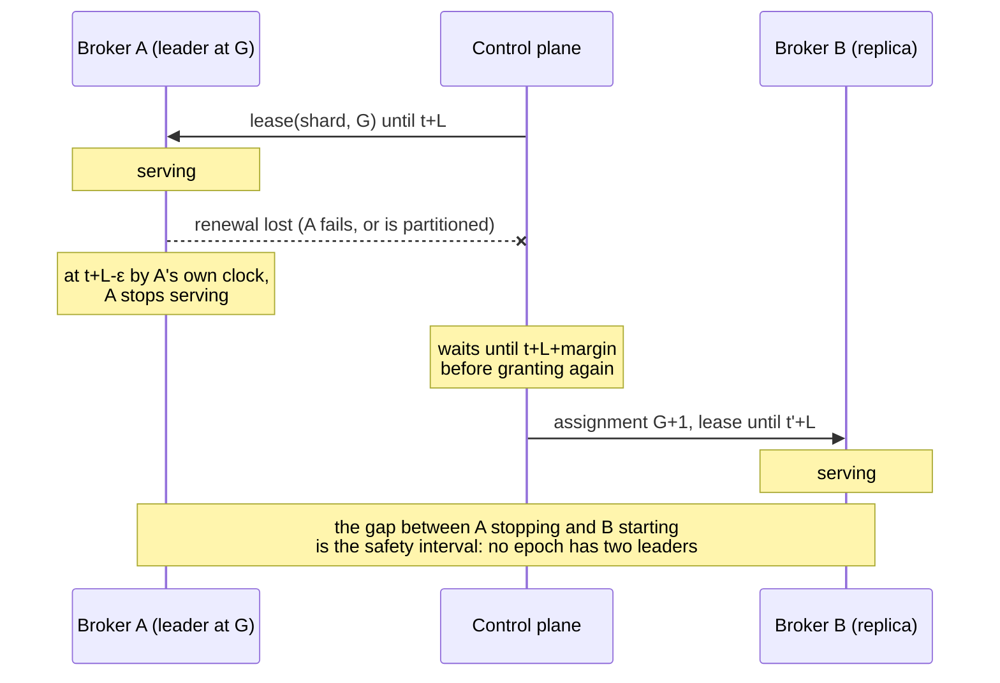

# Shard replication and leader failover

**Decision: leadership is a time-bounded lease issued by the control plane, and
replication is log shipping from the leader to its followers. Per-shard Raft is
rejected.**

Recorded for M5.1 (#110). The rejected alternative and what would overturn the
decision are both below.

## What has to be true

Constraints first, because the comparison is only meaningful against them.

**Safety.** At most one broker may commit writes for a shard at a given epoch,
under any combination of partition, pause, and clock error the failure model
admits. A record acknowledged under `Quorum` must survive any failure the
configured majority tolerates.

**Availability.** A shard survives its leader failing. It also survives the
control plane being briefly unreachable — a broker must not stop serving because
a metadata service restarted.

**Write latency.** A publish already crosses ingress, offset assignment,
durability, and fanout in a fixed order. Replication adds one network round trip
for `Quorum` and none for `Leader`. It must not add a *consensus* round trip to
the common path.

**Operational.** A broker holds many shards. Whatever runs per shard runs
hundreds or thousands of times per broker.

**Dependency.** The storage layer is fixed. Its invariants are load-bearing and
documented, and a replication design that violates them is not a replication
design, it is a storage rewrite.

## The constraint that decides it

`docs/storage-format.md` and `docs/durable-storage.md` state it plainly:

> **Records are never rewritten**, which is what lets recovery keep trusting
> "valid bytes end at EOF".

That single property is why torn-tail repair is sound, why a missing index can
be rebuilt, and why preallocation reserves blocks without changing `st_size`.

**The invariant is narrower than "never rewritten", and it has to be.**

An earlier version of this document argued that Felix avoids truncation
entirely, because a leader only ships records it has committed. That is false
under `Quorum`, where shipping is what *produces* the commit: a follower stores
a record before any majority holds it, so a leader that dies mid-flight leaves
that record on some followers and not others. The next leader may legitimately
reuse the offset. Every leader-change scheme has to reconcile that, and Felix is
not an exception — `Divergence::Conflict` exists precisely because it happens.

The invariant that actually holds, and that recovery depends on, is:

> **No record at or below the high-water mark is ever rewritten.**

Below the mark a record is on a majority and can never be un-committed. Above it
a record is a proposal, and discarding a proposal the cluster did not adopt is
not the same act as rewriting history. Torn-tail repair and interior-corruption
detection rest on the *committed* prefix being immutable, which this gives them.

So the case against per-shard Raft is not about truncation, because truncation
is required either way. It is:

1. **Election and clock trade-offs.** Raft elects by term and majority vote,
   which needs no clock assumption but adds a round of voting to every failover
   and a second failure detector beside the one the control plane already runs.
   Leases reuse the heartbeat the broker already sends, and pay for it with the
   safety interval described below.
2. **Two logs, or one.** Raft over the stream log means either the segment log
   *is* the Raft log — with Raft's index and term bookkeeping in the record
   format — or every record is written twice and the two can disagree after a
   crash. The second is a durability path the storage design deliberately does
   not have.

Neither is a tuning problem. Both are a different storage layer.

The storage layer was in fact built anticipating the other answer:
`docs/durable-storage.md` says "Replication (M5) is what `seal`'s checksum and
`read_range`'s bounded paging exist to serve." Sealed-segment checksums and
bounded range reads are the primitives of *shipping*, not of consensus.

## Why the control plane being Raft-backed does not settle this

M7 makes control-plane metadata highly available, and Raft is the right tool
there. It does not follow that payload replication should use Raft, and the
issue asks for this to be said explicitly.

The two have opposite cost profiles:

| | Control-plane metadata | Stream payload |
| --- | --- | --- |
| Volume | Assignments, tenants, streams — kilobytes, changing rarely | The entire data plane |
| Groups | One, for the cluster | One per shard: hundreds or thousands per broker |
| What consistency buys | Linearizable reads of small state everyone must agree on | Durability of records already ordered by a single writer |
| Cost of a round trip | Paid once per metadata change | Paid on every publish |

A stream's records are already totally ordered by their leader. Consensus is not
being asked to *establish* an order — the log has one. It is being asked to
replicate an existing order durably. That is a weaker requirement than Raft
solves, and paying Raft's price for it is paying for agreement that has already
happened.

## The selected design

### Leases

The control plane grants a **lease** on `(shard, generation)` to one broker for a
bounded duration `L`. The lease is the authority to serve; the assignment alone
is not.

A lease is bound to the generation. A new generation is a new lease, never a
renewal of the old one — which is what makes generation the epoch that fences
writes.

The leader renews through the heartbeat it already sends. A renewal that does not
arrive before expiry means the lease lapses; nothing revokes it explicitly,
because a revocation cannot be delivered to a partitioned broker, which is
precisely the case that matters.

### The exact condition under which a broker may accept a write

A broker may accept a write for shard `S` if and only if **all** of:

1. It holds a lease for `S` at generation `G`.
2. Its own monotonic clock reads earlier than `expiry(G) − ε`, where `ε` covers
   clock drift and the time between this check and the record reaching disk.
3. Its local shard state for `S` is open at exactly generation `G` — the check
   `IngressRouter::dispatch` already performs.
4. For a `Quorum` stream, a majority of the replica set for `G` **including the
   leader** has durably stored the record. For a `Leader` stream, the leader's
   own configured durable commit point has been reached.

Conditions 1–3 are checked **twice**: once when the request is admitted, and
again immediately before the record is committed to the log. The second check is
not redundant. Everything between them can take arbitrarily long — a full ingress
queue, a slow fsync, a VM pause — and a lease that was valid on admission may
have expired by the time the bytes reach the disk. Fencing only at the routing
boundary leaves exactly the window this design exists to close.

### Failover

1. The lease lapses (no renewal within `L`).
2. The control plane selects an eligible replica: one whose durable high-water
   mark is within the configured catch-up bound of the last known committed
   offset.
3. It publishes assignment generation `G+1` naming that replica as leader, and
   grants it a lease.

The control plane must not publish `G+1` before it is certain no broker can still
believe it holds `G`. With lease duration `L` granted at control-plane time `t`,
`G+1` may be granted no earlier than `t + L + margin`, where `margin` covers
clock drift between the two parties and the network delay of the grant itself.
The leader stops at `t + L − ε` by its own clock. The gap between those two
instants is the safety interval, and it is why leases are safe without
synchronized clocks.

The broker cannot observe `t`, so it anchors at the instant it **sent** the
heartbeat — always at or before `t`, so the round trip comes out of its own
lease rather than out of the margin. Anchoring at the instant the *response* was
handled runs the other way: a buffered read or a VM pause in between would push
the lease past `t + L`, which is the safety interval being spent by the same
kind of stall the twice-checked conditions above exist to survive.

The safety interval is the whole mechanism, so it is worth seeing:

  

Nothing in that sequence requires A and CP to agree on the time. It requires only
that neither clock runs more than `ρ` faster or slower than real time, so the two
instants cannot cross.

### The clock assumption, stated precisely

Safety requires a bound on clock **drift rate**, not synchronized clocks. For any
two nodes, over a real interval `T`, each monotonic clock advances by between
`T(1−ρ)` and `T(1+ρ)` for a known `ρ`.

This is a real assumption and it can be violated. The realistic violation is not
NTP error — it is **process suspension**: a VM migration, a stop-the-world pause,
a throttled container. A broker suspended past its expiry wakes believing it
still holds a lease.

That is exactly why condition 2 is re-checked at the durable-append boundary
rather than only at admission. A suspended broker's next check is after it wakes,
and it sees an expired lease before its bytes reach disk. A suspension *between*
that check and the write completing is bounded by `ε`, which is the parameter to
tune, and the residual risk to state honestly rather than claim away.

### Replication

The leader ships records to followers over the internal transport that already
exists (#105). Under `Quorum` it ships them *before* they are committed — that
is what makes the majority — so a follower can hold a record no majority ever
acknowledged, from a leader that then died.

A follower therefore truncates, but only **above** the high-water mark. Below it
a record is on a majority and is never discarded: it was ordered by a leader
holding an unexpired lease, and the safety interval means no other leader existed
at that generation. Above it, a record is a proposal that the cluster may not
have adopted, and a new leader reusing the offset is ordinary rather than
alarming.

Reconciling that needs the two sides to agree on where their histories diverge,
which is what the generation of each record establishes — see
[Divergence and truncation](#divergence-and-truncation) (#406).

Catch-up for a new or lagging follower is a bounded `read_range` from the leader,
with sealed-segment checksums to verify wholesale rather than record by record —
the primitives the storage layer already exposes for this purpose.

**This works only while the leader still holds what the follower is missing.**
Once retention has trimmed past a follower's position, shipping cannot reach it:
the records are not on the leader to send, and starting the follower at the
surviving base offset would leave its log with a hole nothing downstream could
detect. Such a follower is offered a log that *begins* at the leader's oldest surviving
offset (`ReplicateBootstrap`). A replica holding nothing takes it and replication
resumes; one holding records of its own refuses, because a log placed over them
would have a hole nothing downstream could detect, and it is halted. The leader
then rebuilds it under the policy below, or leaves it to an operator when the
policy says so.

### The `Leader` loss window, precisely

For `ConsistencyLevel::Leader`, a record is acknowledged once it is durable on
the leader alone. If the leader's storage is permanently lost, records
acknowledged but not yet shipped are lost.

The window is bounded by the leader's **replication lag**: the byte range between
its durable high-water mark and the lowest follower's acknowledged mark. It must
be exported as a metric, because a bound nobody can observe is not a bound. An
operator choosing `Leader` is choosing this window, and must be able to see how
large it currently is.

`Quorum` has no such window: a majority including the leader holds every
acknowledged record, so any failure within the configured majority preserves it.

### Divergence and truncation

Two brokers can hold different records at the same offset. It takes a leader
dying mid-flight under `Quorum`: the record reached some followers, no majority
acknowledged it, and the next leader reuses the offset for its own. Nothing is
wrong with either broker.

Finding it is the easy half and is done: a batch's overlap with what a follower
already holds is compared byte for byte, and a mismatch is
`Divergence::Conflict`. A follower answers with the end of the batch it was sent
rather than its own tail, so the leader cannot resume past records neither side
has compared (#406).

Repairing it needs the two to agree on where their histories part, and offsets
alone do not say — both logs have an offset 100, and being told "they differ at
100" does not say how far back the agreement goes. The generation does say,
because a generation belongs to exactly one leader: the highest generation both
brokers hold is the last one they cannot disagree within, and its end offset on
the leader is the furthest point the follower can keep.

So a follower records where each generation began in its log, as a small map
beside the segments. It then repairs itself, with no exchange at all: a
conflict is droppable when the batch that found it comes from a **newer**
generation than the one this follower last accepted, and the divergence sits at
or after where that older generation began. Both conditions matter — a leader
disagreeing with *itself* is an inconsistency rather than a predecessor's
leftovers, and repairing that would let a leader rewrite its own history.

Anything else halts, as before. That is the same shape Kafka arrived at without
Raft (KIP-101, KIP-279), reached without adding a message: the generation is
already on every batch, and the follower's own history supplies the rest.

Not exchanging it is deliberate, and the reason has since narrowed. It used to
be that a new kind could not be sent to a peer that might not understand it: an
unknown kind ended the stream, and those streams are long-lived lanes carrying
every in-flight request, so a probe cost far more than it learned. A peer now
steps over a kind it does not know and refuses that one frame, so the cost is no
longer prohibitive — but it is still a round trip, and repairing from what a
follower already knows needs none, along with no negotiation and no
rolling-upgrade order. An older peer predating that change still drops the
stream, so a probe would also have to wait out a deployment.

What it gives up is the case where the follower's history is absent or does not
reach back far enough. Those halt, which is exactly today's behaviour.

The same map answers a second question, on the leader's side: **where a fresh
cursor starts.**

A cursor is a belief about a follower's position under one leadership, so a
generation change discards it. What replaced it was offset zero, which meant
every follower of every shard the failed broker led byte-compared the whole log
before anything new could move — the leader reading its own log off disk and
pushing records the follower already had. On a log of any size that turns a
failover into an outage, and it happened for every shard at once.

The leader records where *its own* generation begins, which until then only
followers did — leaving a broker's history with a hole over exactly the stretch
it led. It is recorded when the shard is taken, while it is still `Opening`:
that is the one moment the tail *is* the generation's start, because the phase
exists precisely to hold writes back until recovery finishes.

Below that offset, this broker's records were taken from earlier leaders while
it was a follower, and so were the follower's — two prefixes of the same log
agree. At or above it is where they can differ: what this leadership wrote, and
what a predecessor left on the follower alone. So comparison starts one record
below the boundary, so the first batch overlaps something the follower already
holds and the boundary is checked rather than assumed — the same check Raft
makes at `prevLogIndex`. A follower further behind than that still says so with
a `LogGap`, and the leader rewinds in that one exchange.

Without a history entry for the generation it falls back to zero, which is slow
rather than wrong. A shard's consumer-group cursors, dead letters and counters
still start there: those logs are written only when group state changes, so the
comparison is over almost nothing, and the leader does not open them at takeover
to record against.

Three things this deliberately does not do:

- **It does not go in the record format.** A generation per record would mean a
  segment format bump, and `SegmentHeader::decode` rejects an unknown version
  outright rather than guess — by design, since a moved field produces a
  plausible mis-parse. The map is derived state that can be rebuilt or absent.
- **It does not truncate below the high-water mark.** Everything there is on a
  majority. A truncation point computed below it is a bug, not a repair, and
  should refuse rather than proceed.
- **It does not make a halted follower repair itself.** Truncating a divergent
  suffix is a decision with a policy attached — how many followers may rebuild
  at once, and at what bandwidth — so the repair is the leader's, under that
  policy, and described in "Rebuilding a halted follower" below.

### Who may be promoted

A leader reports, on every replication pass, which of its followers hold every
record it does. The leader is the only party that can say: it knows both its own
tail and how far each follower has acknowledged, where a follower knows only
where it is.

The bound is **zero** — a follower is caught up when it is missing nothing. A
bound above zero is a bound on how much a promotion may silently lose, and there
is no honest value for it that is not a policy decision; zero needs no such
decision, and a follower reaches it constantly on a healthy shard.

Reports expire, after the node expiry timeout plus one heartbeat. A report says
a follower *was* caught up; the leader kept writing afterwards, and promoting on
a stale report loses whatever was written since. The window is derived from the
liveness settings rather than configured separately, because it has to outlive
exactly one thing: the time it takes to notice the leader is gone.

A halted follower is never reported, however close its last position was. It has
stopped rather than fallen behind.

**The report cannot be allowed to trail the acknowledgement.** On its own this
rule is not enough, and a model check shows why: if the report travels after the
acknowledgements it describes, a leader that reports two followers level, then
acknowledges a `Quorum` write held by only one of them, then dies, leaves the
control plane a fresh report naming the other — and promoting it loses the
acknowledged record. Report expiry does not close it; the report is recent, it
is just older than the acknowledgement.

What closes it is ordering. The leader reports who holds the record and waits
for that report to land *before* moving the quorum mark, and the mark is what
releases the acknowledgement — so the control plane cannot be behind a client.
A report that does not land leaves the mark where it was, and the publish waits
rather than being acknowledged on a report nobody received.

Both halves are checked. `docs/formal/FelixShard.tla` explores 2.0M distinct
states of the implemented design without violating `AckedSurvive`, and
`FelixShardNoReportOrder.cfg` — the same design with the ordering removed —
loses an acknowledged record in a second (`task tla:check`). Promotion then
prefers the replica furthest ahead among those reported, with score only
breaking ties. See [`docs/formal/README.md`](formal/README.md).

**If no replica qualifies, the shard is left unplaced.** The alternative is what
the code used to do: fall back to ordinary scoring and hand the shard to
whichever node scores highest, which may never have seen it. That broker then
serves an empty log at a newer generation while the records sit on replicas that
were not chosen — a failover that *is* the data loss, and one nothing downstream
reports as one. Unavailable is visible and recoverable; silently empty is
neither.

A stream that never asked for replication is unaffected. It has no replicas, so
there was never a copy to prefer, and a fresh placement stays the only thing
available.

Positions are held in the control plane's memory. They change constantly, are
advisory, and expire in about a second, so persisting them would cost a write
per report for data that is worthless by the time it could be read back. The
consequence is that a second control-plane instance starts knowing nothing and
cannot promote until leaders have reported to it — which matters for M7's
multi-instance work and not before.

## Failure model

| Situation | Behaviour |
| --- | --- |
| Leader fails | Lease lapses; a caught-up replica is promoted at `G+1` after the safety interval. Unavailable for at most `L + margin + promotion`. |
| Leader partitioned from the control plane | Keeps serving until its lease expires, then stops. A brief control-plane outage costs nothing; a long one costs availability, not safety. |
| Leader partitioned from followers | `Quorum` writes fail — correctly, the majority is unreachable. `Leader` writes succeed and accumulate loss-window exposure, which the lag metric shows. |
| Control plane unavailable | No new leases are granted. Existing leases run to expiry, then shards go unavailable. Deliberate: granting without a functioning authority is how split-brain happens. |
| Broker suspended past expiry | Refused at the durable-append check on waking. |
| Stale broker after reassignment | Its lease has expired, so it refuses. This is what closes #239 by construction rather than by racing a watch. |

## What is implemented so far

`#111` builds the leadership half:

- **Leases**, renewed by the heartbeat, with the duration taken from the control
  plane's expiry window. Checked at admission (cheap, cached) and again at commit
  (authoritative, reads the clock).
- **Replica sets**, chosen by the same score as leadership so the whole set is a
  deterministic function of the shard and the cluster. `replication_factor`
  defaults to 1, so a stream that never asked for replication is unchanged.
- **Promotion**, gated on a caught-up follower.

The gate matters more than the promotion. A replica that holds no log can be
promoted perfectly well and will then serve an empty shard — the failover *is*
the data loss. So promotion requires a follower within the catch-up bound.

Leaders now report which followers hold everything they do, so the gate has real
input and promotion fires: a lost leader is replaced by a replica that holds the
log, in around a second on a local three-node cluster.

Failover works: a lost leader is replaced by a replica that holds the log, and a
quorum-acknowledged record is readable from the replacement.

Getting there needed five separate fixes, and the common thread is worth
recording. A `Quorum` acknowledgement is a promise about *which brokers hold a
record*, and every one of these was a way for the cluster's own account of that
to drift from the truth:

- the commit order was not rebased when records arrived by replication, so the
  first write a promoted broker accepted never completed
- a stream raised to `Quorum` kept acknowledging on the leader alone until the
  broker restarted, because the live stream state was never updated
- the leader's tail was read before shipping and used after, so a follower level
  with the *old* tail was reported caught up for a record it did not have
- the acknowledgement was released before the control plane was told who held
  the record, so a leader could die having promised a client something the
  cluster could not act on
- promotion chose by placement score rather than by how much a replica held

Both halves of this are implemented (#112). The follower's side is the exchange,
the append rule, and the fence at the storing end. The leader's side keeps one
cursor per follower, ships bounded batches from its own log, and moves the
cursor only on the follower's answer — so a follower that has fallen behind or
been rebuilt is caught up by its own `LogGap`, with no separate negotiation and
nothing kept on disk.

Replication to a follower stops on `LogConflict` or `FencedEpoch`. Neither
converges by retrying: the first means the two logs disagree about bytes both
sides hold, the second that this broker is no longer the leader.

`Stream.consistency` is now wired into the acknowledgement path (#113). A
`Leader` publish is acknowledged once the leader's own durability policy is
satisfied, exactly as before. A `Quorum` publish is held until a majority of the
replica set *of the generation it was written at* holds its records durably.

The majority always counts the leader, so `replication_factor: 1` — the default
— makes `Quorum` behave exactly like `Leader` rather than never acknowledging.
A halted follower counts for nothing: it has stopped rather than fallen behind,
and letting its last position count would make an acknowledgement mean less than
it says.

The mark that releases such a publish advances **at the majority, not at the
last follower**. A pass ships to every follower at once and moves the mark as
soon as enough of them have answered to make one — with three replicas, the
moment the first follower has the records. Waiting for all of them put one dead
or slow replica's whole timeout in front of every acknowledgement on the shard,
every pass, which is the failure `Quorum` exists to tolerate rather than be
stalled by (#411). The rest of the set is still shipped to and still finishes
the pass; what changed is when the acknowledgement is released, not who gets the
records.

The replica report goes to the control plane **before** the mark is published,
and is awaited. Releasing the publish first leaves a window in which a leader
has told a client its record is on a majority and has told the control plane
nothing about which replica holds it — and a leader that dies in that window is
replaced by whichever replica scores highest, which may be the one that does not
have it. A report that did not land leaves the mark where it was, for the same
reason: the argument rests on the control plane knowing who holds the record, so
releasing on a failed report reaches the same window by another route.

The report is written to the control plane's **store**, not kept by the
instance that received it. That is the other half of the same argument: with
several instances over one database, the instance a report reaches and the
instance that later promotes need not be the same process, and a report held
only in memory was a position no other promoter could use — an
acknowledgement resting on it could not be made good at failover. See
[control-plane.md](control-plane.md#replica-reports).

That costs a control-plane round trip on the path of a quorum publish, which is
the price of the acknowledgement meaning what it says. One report per shard per
pass in the healthy case: the majority report already describes every follower,
because they finish together. A follower that answers late enough to move after
that report sends a second one, so a replica that is level does not look behind
— and so out of promotion — until the next pass.

**Reports are not one round trip each.** A flush takes every report queued at
that moment and sends them as one request, which the endpoint has always
accepted; reports arriving while that request is in flight go together in the
next one. So a pass shipping sixteen shards concurrently costs round trips
proportional to how long the control plane takes to answer, not to how many
shards this broker leads.

Group commit rather than a window, and for the reason `disk_log/sync.rs` makes
the same choice: a timer would add its own wait to a pass with a single shard to
report, which is the deployment least able to spare it on a `Quorum` publish.
Batches grow under load, which is when they are worth having, and an idle broker
waits for nothing. `felix_broker_replica_reports_per_request` says how well it
is working — one, on a broker leading hundreds of shards, means it is not.

A wait that runs out is reported as a failure, and the distinction matters: the
records *are* durable on the leader and may yet reach a majority. The broker is
not saying the write failed, it is saying it cannot vouch for it at the level the
stream asked for. `FELIX_PUBLISH_QUORUM_TIMEOUT_MS` sets the budget. Leadership
moving mid-wait ends it the same way, immediately, rather than running the clock
out on an answer that can no longer come.

A control plane that sends a consistency level this broker does not recognise is
refused rather than defaulted. Falling back to `Leader` would serve a stream the
operator asked to be quorum-replicated at the weaker guarantee, silently.

The `Leader` loss window is exported as `felix_broker_replication_lag_records`:
how far the slowest follower is behind, across every shard this broker leads. A
halted follower is excluded from it — it has stopped rather than fallen behind,
and `felix_broker_replication_halted` is where that shows.

That gauge is a bare **count**, and has to stay one: a label per shard is a
label per stream per tenant, which is unbounded by design in a multi-tenant
broker. So it answers "is replication healthy here" and nothing more, and the
only way to learn *which* replica had stopped was to grep for the warning
logged at the halt.

A halt does not resolve on its own — the follower is out of every quorum until
someone acts — so the broker also serves a listing beside the metrics, at
`GET /replication/halted` on `FELIX_BROKER_METRICS_BIND`. It names the shard,
the node, the generation, how far the follower had got, why it stopped, and
what to do about it, because the reason alone does not say whether the
follower's data is wrong or merely incomplete. It is a listing rather than a
metric, which is what lets it carry an identity: it is read on demand and its
size is the number of halted replicas, normally zero. A healthy broker answers
`[]` rather than 404 — "nothing is halted" and "this broker does not answer
that question" are different things to a dashboard.

Read-only, deliberately. That listener has no authentication of its own, so it
carries what is worth knowing and nothing worth doing. The rebuild is the
leader's, below, and an entry here clears once it has begun.

The rule and its refusals are in `docs/internal-protocol.md`.

### Rebuilding a halted follower

A halted follower is out of every quorum, and stays out until its copy of the
shard is discarded and rebuilt from the leader's. The leader does that itself,
because it is the only party that can: it knows the follower is halted, holds
the copy the majority agrees on, and already has the shipping path to send it.

The rebuild is one message. `ReplicateRebuild` names the shard, which of its
logs, and the leader's oldest surviving offset; a follower of that shard at
that generation discards the log — records, index, and generation history —
and answers that its new copy begins at the offset it was given. From there it
is an ordinary follower that far behind: shipping resumes at the base, and the
follower is counted as caught up when it reaches the tail, like any other. The
same fence applies as to storing records: a superseded leader cannot make a
follower discard anything, which is the most damage a stale leader could do and
the one thing the check most has to stop.

It happens under a policy, because a rebuild is a full transfer of the shard,
and every halted follower at once — across every shard a failed broker led — is
how a recovery becomes an outage:

| Variable | Default | Meaning |
| --- | --- | --- |
| `FELIX_REPLICATION_REBUILD_MAX_CONCURRENT` | `1` | Rebuilds in flight at once, across every shard this broker leads. `0` rebuilds nothing: every halt is an operator's, as before. |
| `FELIX_REPLICATION_REBUILD_BYTES_PER_SEC` | `0` | Bytes per second a rebuilding follower is shipped at, per follower. `0` is unlimited. |

The cap is counted per leader rather than per cluster: a broker leading a shard
can only see its own followers. A slot is held from the follower's acceptance
until the leader finds it level, and given back if the follower refuses or the
shard changes generation under it. The rate paces only followers being rebuilt;
a follower merely behind is shipped at full speed, as before.

Only a `diverged` or `needs_bootstrap` halt is rebuilt. A `fenced` halt says
this broker is no longer the leader, and nothing it ships is authoritative. A
follower that predates the message answers with an error, and stays halted
until it is upgraded or an operator acts.

`felix_broker_replication_rebuilds_total{outcome}` counts rebuilds `started`,
`completed`, and `refused`; `felix_broker_replication_rebuilding` is how many
this broker has in flight. The halted listing drops an entry when its rebuild
begins, since the follower is shipping again.

### Planned handoff

Everything above is about a leader that is *gone*. A leader that is alive and
must give a shard up — its node is draining, or it holds more than its share —
needs a different fence. The lease cannot be it: the lease is per node, the
node keeps heartbeating, and a revocation that has to reach the old leader is
the thing the lease design exists to avoid depending on.

The fence is the assignment itself. The control plane writes the shard
`draining` at a new generation, and the broker's rule for a draining
assignment is that it never serves it: a shard already active at that
generation is released in place, one that arrives draining is opened only so
the log is recovered, and either way it lands `closed` and stays there however
often the assignment is re-delivered. The next assignment, the one that names
the successor, is not written until the old leader has said it stopped.

Saying so rides the replica report. The leader keeps leading for replication
while draining — the followers are caught up from it, and the successor is
one of them — and reports `drained` once no write can land any more. That
needs more than closing admission. Admission checks ownership, and a write it
lets in can then wait in a publish queue for as long as the queue is deep;
a tail that has not moved for a while says nothing about a write still
queued. So every write — a publish, a forwarded publish, a cache put or
delete, a counter add, a consumer group's poll, ack, nack or dead-letter
change — enters a per-shard write fence at the moment it claims its place in
the log, and stays counted until it is durable and fanned out. The shard
lifecycle closes the fence as soon as it sees the move, whether the move
arrives as a draining copy of the served generation or as a new, draining
generation, and before the new servable set is published. A write that
reaches its claim after that is refused, the same way a publish to a shard
this broker does not serve is refused. The leader reports `drained` when the
fence is closed with nothing inside it, and reads the tail it reports only
after seeing that, so the tail is final. The fence lives in
`shards/lifecycle/fence.rs`.

The control plane cuts over on that report and no earlier one: a report from
before the fence, at the previous generation, describes a leader that was
still writing.

So the ordering is the same shape as report-before-mark. The successor is
staged as a replica and caught up *before* the fence; the leader stops
*before* it reports; the control plane names the successor *after* the
report; and every step is an assignment the next pass reads back, so a
control-plane restart resumes the move where it was. What a client sees is a
window between the fence and the successor opening in which the shard's
publishes are refused. That window is the cost of the fence, the same way
the safety interval is the cost of the lease, and it is a refusal rather than
an acknowledgement nobody can honour.

A destination that dies before it leads is passed over: another caught-up
replica, or the old leader itself, takes the shard at a new generation. A
leader that dies mid-move is a failover, and the successor is a candidate
there like any other replica. Neither path can name a broker holding less
than the report said, because the report is the only input either reads.

> `a_drained_broker_hands_its_shard_over_with_every_record` — an unreplicated
> durable shard moves off a draining broker and every record acknowledged
> before the drain is readable from the new owner.
>
> `records_acknowledged_during_a_move_survive_it` — publishes arriving through
> the staging, fence and cut-over are either acknowledged and on the new owner,
> or refused.
>
> `a_destination_that_dies_mid_transfer_does_not_take_the_shard` — the
> staged successor is killed before the cut-over; the shard lands on a broker
> that holds the log.
>
> `a_draining_shard_reports_drained_once_its_fence_is_quiet` — the broker
> side of the fence: no drained report while a write is inside it, however
> still the tail looks, and the report that follows includes that write.
>
> `a_durable_publish_claimed_after_the_fence_is_refused` — a publish admitted
> before the fence and claimed after it is refused and never written; the
> same holds for cache, counter, consumer-group and forwarded writes
> (`cache_writes_after_the_fence_are_refused`,
> `a_counter_add_after_the_fence_is_refused`,
> `an_ack_after_the_fence_is_refused`,
> `a_forwarded_publish_after_the_fence_is_refused`).

Both halves are model-checked. `docs/formal/FelixShardHandoff.cfg` explores
the move as implemented without a violation;
`FelixShardHandoffNoWait.cfg` — the same move cutting over as soon as the
fence is written — finds two brokers serving the shard at once in seven
steps, because the old leader has not seen the fence yet. The lease does not
close that: it has not lapsed, and the leader is alive and meant to keep it.
Only the leader's own word that it stopped does. And
`FelixShardHandoffNoClaimFence.cfg` — the fence checked at admission only —
finds a write admitted before the fence, claimed after the drained report,
and acknowledged by the old leader after the successor took over, which the
successor does not hold.

The steps, their triggers and the policy that bounds them are in
[control-plane.md](control-plane.md#moving-a-shard).

## What this does to the other M5 issues

- **#111 (fenced leadership)** — this is now specific: the epoch is the
  assignment generation, the fence is the lease, and it is enforced at both the
  routing and durable-append boundaries. **#239 is subsumed**: a stale ex-owner is
  a broker without a valid lease, and the same check refuses it.
- **#112 (replicate records)** — append-only shipping, not a consensus log. The
  catch-up path is `read_range` plus sealed-segment checksums. **Done**, both
  halves. Catch-up currently re-reads from the offset the follower names rather
  than verifying whole sealed segments by checksum; that is an optimisation for
  #114, not a change to the rule.
- **#113 (Leader and Quorum)** — the majority is over the replica set *of the
  current generation*, and an acknowledgement from a replica at an older
  generation does not count toward it.
- **#114 (bootstrap followers)** — bounded range reads from the leader; no
  snapshot-install protocol is needed, because the log is the snapshot.
- **#115 (failure injection)** — needs lease expiry, clock skew, and suspension
  as injectable faults, not just process kills. The harness can stop and move a
  broker today (#108); it cannot yet pause one or skew its clock.
- **#116 (semantics)** — must document the `Leader` loss window in terms of the
  lag metric, and state that `Quorum` is majority-including-leader.

## What would overturn this

Stated because a decision without one is an opinion.

**Raft's real advantage is that it needs no clock assumption for safety.** Leases
trade that for a simpler data path. If Felix ever needs to run where drift rate
cannot be bounded — or where process suspension is common enough that `ε` cannot
be chosen — that trade stops being worth it.

The other trigger is the storage layer changing. The argument above rests on
"no committed record is ever rewritten." If that invariant is ever relaxed for another
reason, Raft's cost drops sharply and this should be revisited rather than
inherited.

What is *not* a reason to revisit: throughput. Leases were not chosen because
they are faster in the common case. `Quorum` pays one round trip either way, and
the difference between designs is at failover and in the storage layer, not in
steady-state publish latency.
